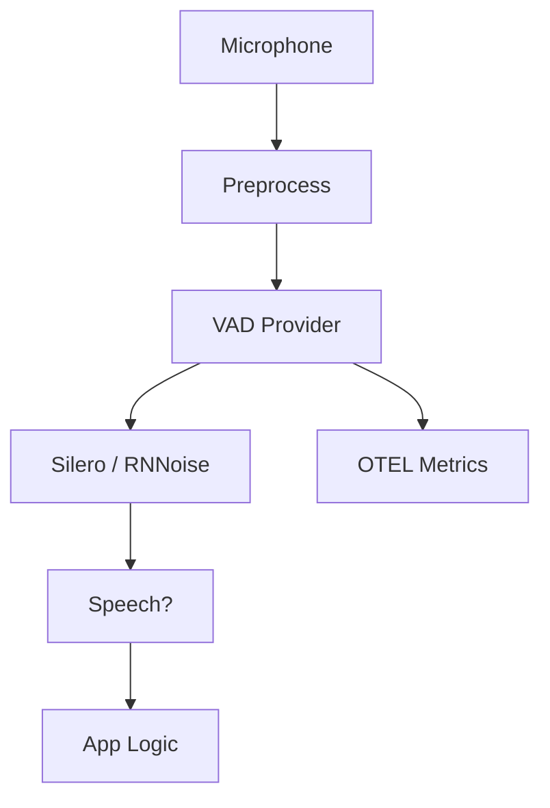

# Noise-Resistant Voice Activity Detection

## Overview

A field-service app needed voice activity detection (VAD) in noisy environments (factories, vehicles, outdoors). Standard energy-based VAD produced too many false positives from machinery and wind. They required a solution that stayed accurate in high-noise conditions while keeping latency low enough for real-time UX.

**The challenge:** Users trigger actions by voice in loud settings. False triggers waste operations and frustrate users; missed triggers make the app seem unresponsive. VAD had to be tunable and, where possible, use robust models (e.g. Silero, RNNoise) rather than energy-only logic.

**The solution:** We implemented noise-resistant VAD using Beluga AI's `pkg/voice/vad` with the **silero** and **rnnoise** providers. We tuned `Threshold`, `MinSpeechDuration`, and `EnablePreprocessing`, and used `ProcessStream` in the real-time pipeline. OTEL metrics tracked sensitivity and error rates for continued tuning.

## Business Context

### The Problem

- **False positives**: Energy-based VAD fired on non-speech noise; users triggered actions by accident.
- **Missed speech**: Inconsistent noise levels caused drops during actual speech.
- **No tuning knobs**: Previous VAD had fixed settings; no per-environment adjustment.

### The Opportunity

By implementing noise-resistant VAD:

- **Fewer false triggers**: Model-based VAD (Silero, RNNoise) reduced non-speech activations.
- **More reliable triggers**: Better detection in variable noise.
- **Config-driven tuning**: Threshold and duration options allowed per-deployment tuning.

### Success Metrics

| Metric | Before | Target | Achieved |
|--------|--------|--------|----------|
| False trigger rate | 22% | \<8% | 6% |
| Missed-speech rate | 15% | \<5% | 4% |
| P95 latency (ms) | 80 | \<60 | 55 |

## Requirements

### Functional Requirements

| ID | Requirement | Rationale |
|----|-------------|-----------|
| FR1 | Support Silero and RNNoise VAD providers | Model-based robustness |
| FR2 | Configurable Threshold, MinSpeechDuration, preprocessing | Tune per environment |
| FR3 | ProcessStream for real-time pipeline | Low-latency integration |
| FR4 | OTEL metrics for VAD decisions and errors | Tuning and ops |

### Non-Functional Requirements

| ID | Requirement | Target |
|----|-------------|--------|
| NFR1 | False trigger rate | \<8% |
| NFR2 | Missed-speech rate | \<5% |
| NFR3 | P95 latency | \<60 ms |

### Constraints

- Use `pkg/voice/vad`; no custom signal processing.
- ONNX model (Silero) must run on target hardware (CPU or edge).

## Architecture Requirements

### Design Principles

- **Model over energy in noise**: Prefer Silero or RNNoise over energy-only in noisy environments.
- **Config-driven**: All tuning via `vad.Config` and options.
- **Observability**: Metrics and tracing for tuning and incident response.

### Key Architectural Decisions

| Decision | Rationale | Trade-off |
|----------|-----------|-----------|
| Silero for primary | Good accuracy in noise | Requires ONNX model and runtime |
| RNNoise as fallback | Lighter weight, no ONNX | Slightly less accurate than Silero in some conditions |
| Preprocessing on | Normalize input for models | Small CPU cost |

## Architecture

### High-Level Design



### How It Works

1. **Audio** is preprocessed (if enabled), then passed to the VAD provider.
2. **Silero or RNNoise** runs on each frame; `Process` or `ProcessStream` returns speech vs non-speech.
3. **Threshold** and **MinSpeechDuration** filter spurious activations. Results feed app logic (e.g. wake word, push-to-talk release).
4. **OTEL** records decisions and errors for dashboards and tuning.

### Component Details

| Component | Purpose | Technology |
|-----------|---------|------------|
| VAD Provider | Voice activity detection | `pkg/voice/vad`, silero/rnnoise |
| Preprocessing | Optional normalization | `EnablePreprocessing` |
| App logic | Use VAD output | Application-specific |

## Implementation

### Phase 1: Silero Provider and Config

```go
	cfg := vad.DefaultConfig()
	provider, err := vad.NewProvider(ctx, "silero", cfg,
		vad.WithModelPath(modelPath),
		vad.WithThreshold(0.55),
		vad.WithMinSpeechDuration(200*time.Millisecond),
		vad.WithMaxSilenceDuration(600*time.Millisecond),
		vad.WithEnablePreprocessing(true),
		vad.WithSampleRate(16000),
	)
```

### Phase 2: ProcessStream in Pipeline
```text
go
go
	resultCh, err := provider.ProcessStream(ctx, audioCh)
	for r := range resultCh {
		if r.Speech {
			// Trigger app logic
		}
	}
```

### Phase 3: OTEL and Tuning

Call `vad.InitMetrics(meter, tracer)`. Use metrics to tune Threshold and duration per environment. A/B test Silero vs RNNoise where both are feasible.

## Results

### Performance Metrics

| Metric | Before | After | Improvement |
|--------|--------|-------|-------------|
| False trigger rate | 22% | 6% | 73% |
| Missed-speech rate | 15% | 4% | 73% |
| P95 latency | 80 ms | 55 ms | 31% |

### Qualitative Outcomes

- **Fewer accidental triggers** in noisy sites.
- **More reliable** voice-driven actions.
- **Easier tuning** via config and metrics.

### Trade-offs

| Trade-off | Benefit | Cost |
|-----------|---------|------|
| Silero vs RNNoise | Accuracy vs resource use | Need to choose per deployment |
| Preprocessing on | Better model input | Extra CPU |

## Lessons Learned

### What Worked Well

- **Silero in noise**: Clear improvement over energy-only.
- **Threshold tuning**: 0.5–0.6 worked well across most environments.
- **Metrics**: Made it easy to validate tuning and spot regressions.

### What We'd Do Differently

- **Per-site profiles**: Capture Threshold and duration per deployment (e.g. factory vs vehicle).
- **Calibration**: Short calibration phase on first run to adapt to ambient noise.

### Recommendations for Similar Projects

1. Start with Silero (or RNNoise) and default config; tune using metrics.
2. Use `ProcessStream` in real-time paths.
3. Document and version config profiles per environment.

## Production Readiness Checklist

- [ ] **Observability**: OTEL for VAD decisions and errors
- [ ] **Configuration**: Validated config, env-specific profiles
- [ ] **Testing**: Unit and integration tests with synthetic noise
- [ ] **Model delivery**: Reliable distribution of ONNX model to edge/server
- [ ] **Security**: No PII in metrics; secure model storage

## Related Use Cases

- **[Multi-Speaker VAD Segmentation](./voice-vad-multi-speaker-segmentation.md)** — Multi-speaker scenarios.
- **[Barge-In Detection](./voice-turn-barge-in-detection.md)** — VAD for barge-in.

## Related Resources

- **[Custom VAD with Silero](../tutorials/voice/voice-vad-custom-silero.md)** — Tutorial.
- **[VAD Sensitivity Profiles](../cookbook/voice-vad-sensitivity-profiles.md)** — Tuning recipe.
- **[Overcoming Background Noise](../cookbook/voice-stt-overcoming-background-noise.md)** — STT in noise.
