This document describes the extensibility architecture: how every package follows the same patterns, how providers work, how tools work, and step-by-step guides for adding new providers and tools. The goal is that after reading this document, you can add a new provider to any of the 19 registries by following the same steps — the patterns are intentionally uniform so that expertise in one area transfers directly to every other area.

## Foundational Patterns

Every extensible package in Beluga follows four interlocking patterns. Learn these once — they apply everywhere.

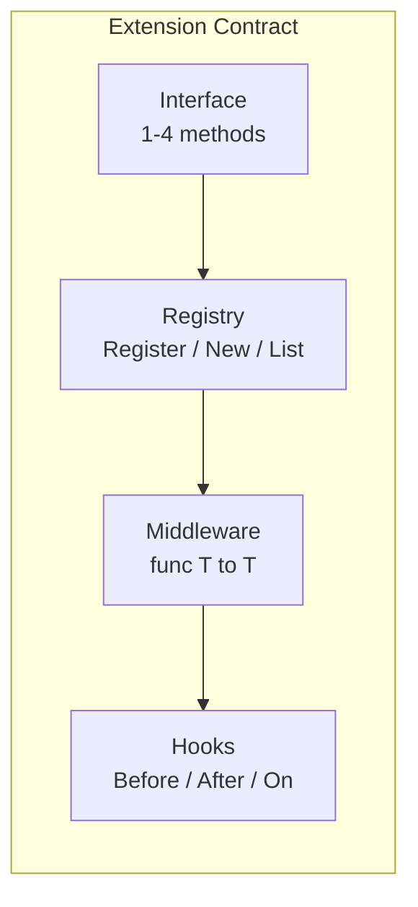

### Pattern 1: Interface (the contract)

Every extensible component is a Go interface with 1-4 methods. Small interfaces are testable, composable, and easy to implement. The "1-4 methods" constraint is enforced deliberately: a small interface is easier to mock in tests, requires less boilerplate for new providers, and makes it clear what the contract actually requires. When a component needs optional capabilities (like batch processing or cancellation), those are checked at runtime via type assertions rather than expanding the base interface.

```go
// llm/llm.go — 4 methods
type ChatModel interface {
    Generate(ctx context.Context, msgs []schema.Message, opts ...GenerateOption) (*schema.AIMessage, error)
    Stream(ctx context.Context, msgs []schema.Message, opts ...GenerateOption) iter.Seq2[schema.StreamChunk, error]
    BindTools(tools []schema.ToolDefinition) ChatModel
    ModelID() string
}

// tool/tool.go — 4 methods
type Tool interface {
    Name() string
    Description() string
    InputSchema() map[string]any
    Execute(ctx context.Context, input map[string]any) (*Result, error)
}

// memory/memory.go — 4 methods
type Memory interface {
    Save(ctx context.Context, input, output schema.Message) error
    Load(ctx context.Context, query string) ([]schema.Message, error)
    Search(ctx context.Context, query string, k int) ([]schema.Document, error)
    Clear(ctx context.Context) error
}

// rag/embedding/embedder.go — 2 methods
type Embedder interface {
    Embed(ctx context.Context, text string) ([]float32, error)
    EmbedBatch(ctx context.Context, texts []string) ([][]float32, error)
}
```

**Rules**:
- Accept interfaces, return structs.
- If an interface grows beyond 4 methods, split it.
- Optional capabilities use type assertions: `if br, ok := r.(BatchRetriever); ok { ... }`
- Compile-time check: `var _ ChatModel = (*OpenAIModel)(nil)`

### Pattern 2: Registry (discovery and construction)

Every extensible package has a global registry. Providers self-register in `init()`. Users construct instances with `New()`. This pattern decouples application code from provider implementations: your code calls `llm.New("openai", cfg)` without importing the OpenAI package directly, making it trivial to swap providers in tests or across environments. The `List()` function enables runtime discovery, which is useful for admin UIs and health checks that need to report which providers are available.

```go
// This exact pattern exists in 19 packages across the framework.

// Factory creates an instance from config.
type Factory func(cfg config.ProviderConfig) (ChatModel, error)

var (
    registryMu sync.RWMutex
    registry   = make(map[string]Factory)
)

// Register adds a provider factory. Called from init().
func Register(name string, f Factory) {
    registryMu.Lock()
    defer registryMu.Unlock()
    registry[name] = f
}

// New constructs an instance by name.
func New(name string, cfg config.ProviderConfig) (ChatModel, error) {
    registryMu.RLock()
    f, ok := registry[name]
    registryMu.RUnlock()
    if !ok {
        return nil, fmt.Errorf("llm: unknown provider %q (registered: %v)", name, List())
    }
    return f(cfg)
}

// List returns all registered provider names, sorted.
func List() []string {
    registryMu.RLock()
    defer registryMu.RUnlock()
    names := make([]string, 0, len(registry))
    for name := range registry { names = append(names, name) }
    sort.Strings(names)
    return names
}
```

**Provider self-registration**:

```go
// llm/providers/openai/openai.go
package openai

func init() {
    llm.Register("openai", func(cfg config.ProviderConfig) (llm.ChatModel, error) {
        return New(cfg)
    })
}
```

**User imports provider with blank identifier**:

```go
import (
    "github.com/lookatitude/beluga-ai/llm"
    _ "github.com/lookatitude/beluga-ai/llm/providers/openai"
)

model, err := llm.New("openai", config.ProviderConfig{
    APIKey: os.Getenv("OPENAI_API_KEY"),
    Model:  "gpt-4o",
})
```

**All 19 registries in the framework**:

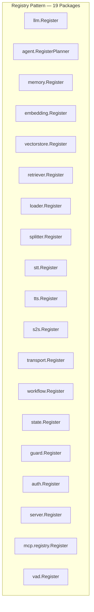

### Pattern 3: Middleware (wrapping)

Middleware wraps an interface to add cross-cutting behavior. The signature is always `func(T) T`. This is the decorator pattern expressed in Go's type system: because middleware returns the same interface it receives, middleware composes naturally. A retry middleware wrapping a cache middleware wrapping a rate limiter wrapping a provider all satisfy `ChatModel` — the caller sees a single interface regardless of how many layers of behavior are stacked around it.

The application order is outside-in: the last middleware in the `ApplyMiddleware` call becomes the outermost wrapper. This matches how you'd think about it: "retry, then cache, then rate-limit" means retry wraps everything, caching sits in the middle, and rate limiting is closest to the provider.

```go
// Definition
type Middleware func(ChatModel) ChatModel

// Application — outside-in (last middleware wraps first)
func ApplyMiddleware(model ChatModel, mws ...Middleware) ChatModel {
    for i := len(mws) - 1; i >= 0; i-- {
        model = mws[i](model)
    }
    return model
}

// Usage
model = llm.ApplyMiddleware(model,
    resilience.WithRetry(3, time.Second),    // outermost: retries wrap everything
    cache.WithLLMCache(myCache),             // middle: cache before rate-limit
    resilience.WithRateLimit(100, 10000),    // innermost: rate-limit at the boundary
)
```

**Execution order**:

```mermaid
graph LR
    call["Generate()"] --> retry["Retry MW"]
    retry --> cacheM["Cache MW"]
    cacheM --> rateLimit["RateLimit MW"]
    rateLimit --> provider["OpenAI Provider"]
    provider --> rateLimit
    rateLimit --> cacheM
    cacheM --> retry
    retry --> call
```

Middleware exists in: `llm`, `tool`, `agent`, `memory`, `orchestration`, `workflow`, `auth`.

### Pattern 4: Hooks (lifecycle interception)

Hooks are a struct with optional callback function fields. `nil` hooks are skipped. Multiple hooks compose via `ComposeHooks()`.

The struct-with-optional-fields design was chosen over an interface because hook consumers typically only care about one or two lifecycle points. With an interface, every implementation would need stub methods for all the hook points it doesn't use. With a struct, you set only the fields you care about and leave the rest as `nil`. The `ComposeHooks()` function chains multiple hook sets together, running each non-nil callback in order — this lets you layer concerns like "audit logging" and "cost tracking" independently.

```go
// Definition — all fields optional
type Hooks struct {
    OnStart        func(ctx context.Context, input string) error
    OnEnd          func(ctx context.Context, result string, err error)
    OnError        func(ctx context.Context, err error) error
    BeforePlan     func(ctx context.Context, state PlannerState) error
    AfterPlan      func(ctx context.Context, actions []Action) error
    BeforeAct      func(ctx context.Context, action Action) error
    AfterAct       func(ctx context.Context, action Action, obs Observation) error
    OnToolCall     func(ctx context.Context, call ToolCallInfo) error
    OnToolResult   func(ctx context.Context, call ToolCallInfo, result *tool.Result) error
    OnIteration    func(ctx context.Context, iteration int) error
    OnHandoff      func(ctx context.Context, from, to string) error
    BeforeGenerate func(ctx context.Context) error
    AfterGenerate  func(ctx context.Context) error
}

// Composition — each receives output of previous
func ComposeHooks(hooks ...Hooks) Hooks { /* chains all non-nil callbacks */ }
```

**Hook naming convention**:

| Pattern | When | Signature |
|---------|------|-----------|
| `Before<Action>` | Before executing | `func(ctx, input) error` — can abort |
| `After<Action>` | After executing | `func(ctx, output, err) error` — can modify |
| `On<Event>` | When event occurs | `func(ctx, data) error` — observe or modify |

**Middleware vs Hooks**:

| Aspect | Middleware | Hooks |
|--------|-----------|-------|
| Scope | Wraps entire interface | Fires at specific points |
| Use case | Retry, cache, rate-limit, tracing | Audit, cost tracking, validation |
| Execution | Outermost first | Within the execution |
| Composition | `ApplyMiddleware(model, mw1, mw2)` | `ComposeHooks(h1, h2)` |

Hooks exist in: `agent`, `tool`, `memory`, `embedding`, `vectorstore`, `stt`, `tts`, `s2s`, `orchestration`, `workflow`, `auth`.

## Streaming Architecture

### The Primitive: `iter.Seq2[T, error]`

All public streaming APIs use Go 1.23+ range-over-func iterators. This was chosen over channels for three reasons: no goroutine per stream (zero scheduling overhead), natural backpressure (the `yield` return value stops the producer immediately), and composability (stream transformers like `MapStream` and `FilterStream` compose without allocations). Channels are reserved for internal goroutine communication in voice frame processors and background workers — they never appear in public API return types.

```go
// core/stream.go
type Stream[T any] = iter.Seq2[Event[T], error]
```

**Producing a stream**:

```go
func (m *Model) Stream(ctx context.Context, msgs []schema.Message) iter.Seq2[schema.StreamChunk, error] {
    return func(yield func(schema.StreamChunk, error) bool) {
        stream, err := m.client.ChatCompletionStream(ctx, m.buildRequest(msgs))
        if err != nil {
            yield(schema.StreamChunk{}, m.mapError(err))
            return
        }
        defer stream.Close()

        for {
            select {
            case <-ctx.Done():
                yield(schema.StreamChunk{}, ctx.Err())
                return
            default:
            }

            chunk, err := stream.Recv()
            if err == io.EOF {
                return
            }
            if err != nil {
                yield(schema.StreamChunk{}, m.mapError(err))
                return
            }
            if !yield(m.convertChunk(chunk), nil) {
                return // consumer stopped — respect backpressure
            }
        }
    }
}
```

**Consuming a stream**:

```go
for chunk, err := range model.Stream(ctx, msgs) {
    if err != nil {
        log.Error("stream error", "err", err)
        break
    }
    fmt.Print(chunk.Text)
}
```

**Stream composition utilities** (all in `core/`):

| Function | Purpose |
|----------|---------|
| `CollectStream[T]` | Drain stream to `[]Event[T]` |
| `MapStream[T, U]` | Transform each event |
| `FilterStream[T]` | Keep events matching predicate |
| `MergeStreams[T]` | Combine multiple streams |
| `FanOut[T]` | Send to N consumers |
| `BufferedStream[T]` | Buffer with backpressure |

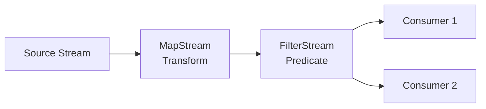

**When to use channels**: Internal goroutine communication (voice frame processors, background workers). Never in public API return types.

## Error Architecture

Errors in agentic systems cross multiple boundaries: provider SDKs, HTTP transports, LLM APIs, tool execution, and guard validation. Without a unified error model, each boundary introduces its own error types, making it impossible to write generic retry logic or error handling. Beluga's error architecture solves this by mapping all errors to a common type at provider boundaries.

### Typed Errors

```go
// core/errors.go
type Error struct {
    Op      string    // "llm.Generate", "tool.Execute", "rag.Retrieve"
    Code    ErrorCode // rate_limit, timeout, auth_error, etc.
    Message string    // Human-readable description
    Err     error     // Wrapped cause (supports errors.Is/As)
}
```

### Error Codes

| Code | Retryable | When |
|------|-----------|------|
| `rate_limit` | Yes | Provider throttled the request |
| `timeout` | Yes | Operation exceeded deadline |
| `provider_unavailable` | Yes | Provider is unreachable |
| `auth_error` | No | Authentication or authorization failed |
| `invalid_input` | No | Malformed or missing input |
| `tool_failed` | No | Tool execution returned an error |
| `guard_blocked` | No | Guard rejected the request |
| `budget_exhausted` | No | Token or cost budget exceeded |

### Error Flow

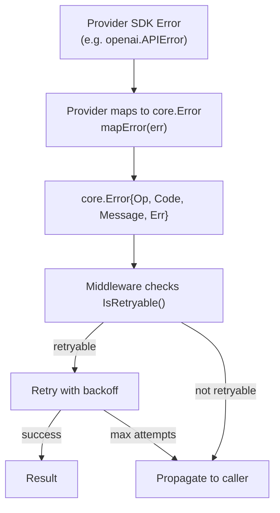

## Agent Architecture

### Executor Loop

The executor is planner-agnostic. It receives actions from the planner, executes them, collects observations, and asks the planner to replan. This separation is the key architectural insight: the *what to do next* decision (planning) is independent of the *how to do it* mechanics (execution). The executor handles tool calls, handoffs, streaming events, and hook invocations uniformly, regardless of which reasoning strategy produced the actions.

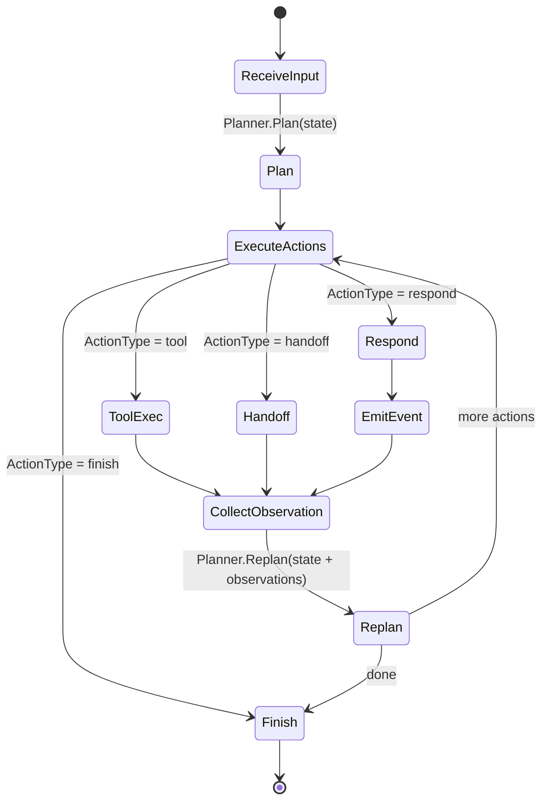

### Planner Interface

```go
type Planner interface {
    Plan(ctx context.Context, state PlannerState) ([]Action, error)
    Replan(ctx context.Context, state PlannerState) ([]Action, error)
}
```

**Built-in planners**:

| Planner | Strategy | When to use |
|---------|----------|-------------|
| ReAct | Think → Act → Observe | General purpose (default) |
| Reflexion | Actor + Evaluator + Self-Reflection | Tasks requiring quality improvement |
| Plan-and-Execute | Full plan then step-by-step | Multi-step tasks with known structure |
| Structured | JSON output with schema validation | Structured data extraction |
| Conversational | Optimized multi-turn | Chat applications |

All planners register via `agent.RegisterPlanner("react", factory)`.

### Handoffs as Tools

Handoffs are converted to `transfer_to_{id}` tools that the LLM sees in its tool list. This design, validated by both the OpenAI Agents SDK and Google ADK, removes the need for explicit routing logic: the LLM uses the same mechanism for calling a tool and for transferring to another agent. The executor handles both uniformly.

```go
// Auto-generates transfer_to_support tool
handoff := agent.HandoffTo(supportAgent, "Transfer to support for billing issues")
tools := agent.HandoffsToTools([]agent.Handoff{handoff})
// tools[0].Name() == "transfer_to_support"
```

The LLM decides when to hand off. The executor handles the tool call by invoking the target agent. `InputFilter` controls what context passes. `IsEnabled` can disable handoffs dynamically.

### Workflow Agents

Not every orchestration pattern needs LLM reasoning. When the execution flow is deterministic — run these agents in sequence, fan out in parallel, or loop until a condition is met — workflow agents provide predictable pipelines without LLM overhead. They implement the same `Agent` interface, so they compose with LLM-backed agents seamlessly.

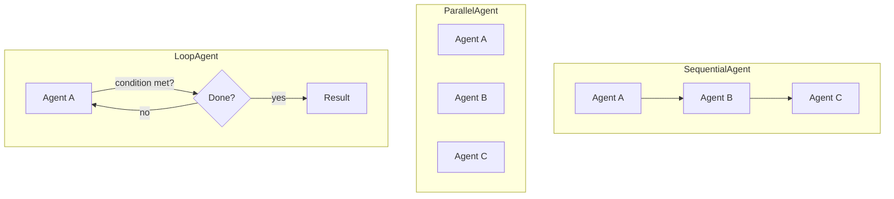

## The Provider System

### How Providers Work

Every provider follows the same lifecycle:

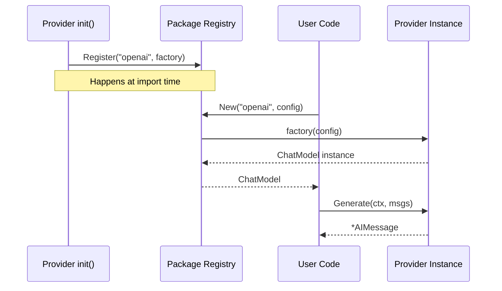

### Provider Package Structure

```
llm/providers/openai/
├── openai.go          # Model struct, New(), init(), Generate(), Stream(), BindTools(), ModelID()
├── stream.go          # Streaming implementation (iter.Seq2 producer)
├── errors.go          # mapError() — maps OpenAI errors to core.Error
├── options.go         # Provider-specific options (if any)
├── openai_test.go     # Unit tests with httptest
└── testdata/          # Recorded HTTP responses
    ├── chat_completion.json
    └── stream_completion.jsonl
```

### Error Mapping

Every provider maps SDK-specific errors to `core.Error`:

```go
func (m *Model) mapError(op string, err error) error {
    var apiErr *openai.APIError
    if !errors.As(err, &apiErr) {
        return core.NewError(op, core.ErrProviderDown, "unknown error", err)
    }
    switch apiErr.StatusCode {
    case 401:
        return core.NewError(op, core.ErrAuth, apiErr.Message, err)
    case 429:
        return core.NewError(op, core.ErrRateLimit, apiErr.Message, err)
    case 408, 504:
        return core.NewError(op, core.ErrTimeout, apiErr.Message, err)
    case 400:
        return core.NewError(op, core.ErrInvalidInput, apiErr.Message, err)
    default:
        return core.NewError(op, core.ErrProviderDown, apiErr.Message, err)
    }
}
```

## The Tool System

### How Tools Work

Tools are instances (not factories). They live in a `tool.Registry` which is instance-based (Add/Get/List/Remove), unlike the global factory registries. This distinction matters: LLM providers and embedding models are created from configuration at startup, but tools often carry state (database connections, API clients) and are added or removed dynamically during agent execution. An instance-based registry supports this pattern naturally.

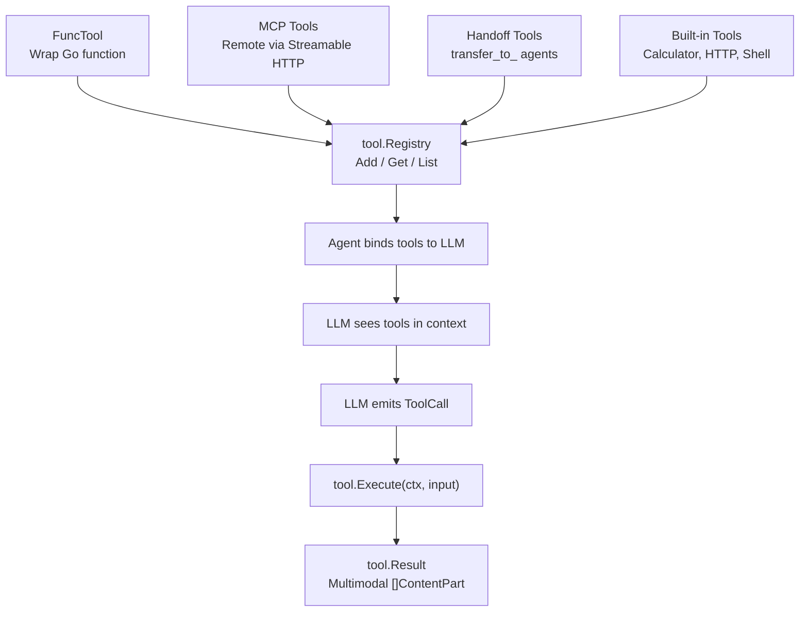

### FuncTool — Wrapping Go Functions

The most common way to create tools is `FuncTool`, which wraps a Go function and auto-generates the JSON Schema that the LLM needs to understand the tool's parameters. Struct tags on the input type provide field names, descriptions, constraints, and defaults — this keeps the schema definition co-located with the handler code instead of requiring a separate schema file:

```go
type WeatherInput struct {
    City  string `json:"city" description:"City name" required:"true"`
    Units string `json:"units" description:"celsius or fahrenheit" default:"celsius"`
}

weatherTool := tool.NewFuncTool("get_weather", "Get current weather",
    func(ctx context.Context, input WeatherInput) (*tool.Result, error) {
        weather := fetchWeather(input.City, input.Units)
        return tool.TextResult(weather), nil
    },
)
```

Supported struct tags: `json` (field name), `description`, `required`, `default`, `enum`, `minimum`, `maximum`.

### MCP Integration

Tools from remote MCP servers are wrapped as native `tool.Tool` instances:

```go
tools, err := tool.FromMCP(ctx, "https://mcp-server.example.com", tool.MCPOptions{
    Transport: "streamable-http",
    SessionID: "my-session",
})
// tools are now []tool.Tool — use like any other tool
```

### Tool Middleware and Hooks

```go
// Middleware wraps tools
tool = tool.ApplyMiddleware(myTool,
    tool.WithTimeout(10 * time.Second),
    tool.WithRetry(3),
)

// Hooks observe execution
hooks := tool.Hooks{
    BeforeExecute: func(ctx context.Context, name string, input map[string]any) error {
        slog.Info("tool call", "name", name, "input", input)
        return nil
    },
    AfterExecute: func(ctx context.Context, name string, result *tool.Result, err error) {
        slog.Info("tool result", "name", name, "error", err)
    },
}
```

## How To: Add a New LLM Provider

Adding a new LLM provider follows the universal extension contract: implement the interface, register via `init()`, map errors, and write tests. The steps below walk through an LLM provider specifically, but the same structure applies to any of the 19 registries.

### Step 1: Create the provider package

```
llm/providers/myprovider/
├── myprovider.go
├── myprovider_test.go
└── testdata/
```

### Step 2: Implement ChatModel

```go
package myprovider

import (
    "context"
    "iter"

    "github.com/lookatitude/beluga-ai/config"
    "github.com/lookatitude/beluga-ai/core"
    "github.com/lookatitude/beluga-ai/llm"
    "github.com/lookatitude/beluga-ai/schema"
)

// Compile-time interface check
var _ llm.ChatModel = (*Model)(nil)

type Model struct {
    client *Client
    model  string
    tools  []schema.ToolDefinition
}

func New(cfg config.ProviderConfig) (*Model, error) {
    if cfg.APIKey == "" {
        return nil, core.NewError("myprovider.new", core.ErrAuth, "API key required", nil)
    }
    return &Model{
        client: newClient(cfg.APIKey, cfg.BaseURL),
        model:  cfg.Model,
    }, nil
}

func (m *Model) Generate(ctx context.Context, msgs []schema.Message, opts ...llm.GenerateOption) (*schema.AIMessage, error) {
    req := m.buildRequest(msgs, opts...)
    resp, err := m.client.Complete(ctx, req)
    if err != nil {
        return nil, m.mapError("llm.generate", err)
    }
    return m.convertResponse(resp), nil
}

func (m *Model) Stream(ctx context.Context, msgs []schema.Message, opts ...llm.GenerateOption) iter.Seq2[schema.StreamChunk, error] {
    return func(yield func(schema.StreamChunk, error) bool) {
        req := m.buildRequest(msgs, opts...)
        stream, err := m.client.StreamComplete(ctx, req)
        if err != nil {
            yield(schema.StreamChunk{}, m.mapError("llm.stream", err))
            return
        }
        defer stream.Close()

        for {
            select {
            case <-ctx.Done():
                yield(schema.StreamChunk{}, ctx.Err())
                return
            default:
            }
            chunk, err := stream.Next()
            if err == io.EOF { return }
            if err != nil {
                yield(schema.StreamChunk{}, m.mapError("llm.stream", err))
                return
            }
            if !yield(m.convertChunk(chunk), nil) { return }
        }
    }
}

func (m *Model) BindTools(tools []schema.ToolDefinition) llm.ChatModel {
    return &Model{client: m.client, model: m.model, tools: tools}
}

func (m *Model) ModelID() string { return "myprovider/" + m.model }
```

### Step 3: Register in init()

```go
func init() {
    llm.Register("myprovider", func(cfg config.ProviderConfig) (llm.ChatModel, error) {
        return New(cfg)
    })
}
```

### Step 4: Map errors

```go
func (m *Model) mapError(op string, err error) error {
    // Map provider-specific errors to core.Error with correct ErrorCode
    // See the Error Architecture section above
}
```

### Step 5: Write tests

```go
func TestGenerate(t *testing.T) {
    server := httptest.NewServer(http.HandlerFunc(func(w http.ResponseWriter, r *http.Request) {
        data, _ := os.ReadFile("testdata/chat_completion.json")
        w.Header().Set("Content-Type", "application/json")
        w.Write(data)
    }))
    defer server.Close()

    model, err := New(config.ProviderConfig{
        APIKey:  "test-key",
        Model:   "my-model",
        BaseURL: server.URL,
    })
    require.NoError(t, err)

    resp, err := model.Generate(context.Background(), []schema.Message{
        schema.NewHumanMessage("hello"),
    })
    require.NoError(t, err)
    assert.NotEmpty(t, resp.Text())
}
```

### Step 6: Users import it

```go
import _ "github.com/lookatitude/beluga-ai/llm/providers/myprovider"

model, err := llm.New("myprovider", config.ProviderConfig{...})
```

### Provider Checklist

- [ ] Implements the full interface (all methods)
- [ ] Registers via `init()` with parent package's `Register()`
- [ ] Maps all provider errors to `core.Error` with correct ErrorCode
- [ ] Supports context cancellation (checks `ctx.Done()` in streams)
- [ ] Includes token/usage metrics in responses
- [ ] Compile-time check: `var _ Interface = (*Impl)(nil)`
- [ ] Unit tests with httptest and recorded responses
- [ ] Handles tool calling in both Generate and Stream paths

## How To: Add a New Tool

### Option A: FuncTool (wrap a Go function)

```go
type SearchInput struct {
    Query string `json:"query" description:"Search query" required:"true"`
    Limit int    `json:"limit" description:"Max results" default:"10"`
}

searchTool := tool.NewFuncTool("web_search", "Search the web",
    func(ctx context.Context, input SearchInput) (*tool.Result, error) {
        results, err := mySearchAPI.Search(ctx, input.Query, input.Limit)
        if err != nil {
            return nil, err
        }
        return tool.TextResult(formatResults(results)), nil
    },
)
```

### Option B: Implement the Tool interface

```go
type DatabaseTool struct {
    db *sql.DB
}

var _ tool.Tool = (*DatabaseTool)(nil)

func (t *DatabaseTool) Name() string        { return "query_database" }
func (t *DatabaseTool) Description() string  { return "Execute a read-only SQL query" }
func (t *DatabaseTool) InputSchema() map[string]any {
    return map[string]any{
        "type": "object",
        "properties": map[string]any{
            "sql": map[string]any{
                "type":        "string",
                "description": "SQL SELECT query to execute",
            },
        },
        "required": []string{"sql"},
    }
}

func (t *DatabaseTool) Execute(ctx context.Context, input map[string]any) (*tool.Result, error) {
    query, ok := input["sql"].(string)
    if !ok {
        return tool.ErrorResult(fmt.Errorf("sql field required")), nil
    }
    rows, err := t.db.QueryContext(ctx, query)
    if err != nil {
        return nil, err
    }
    defer rows.Close()
    // ... format results
    return tool.TextResult(formatted), nil
}
```

### Option C: Tools from MCP server

```go
tools, err := tool.FromMCP(ctx, "https://my-mcp-server.com", tool.MCPOptions{})
```

### Register tools with an agent

```go
registry := tool.NewRegistry()
registry.Add(searchTool)
registry.Add(&DatabaseTool{db: myDB})

myAgent := agent.NewBaseAgent(
    agent.WithID("assistant"),
    agent.WithTools(registry.List()...),
    agent.WithLLM(model),
)
```

## How To: Add a New Provider for Any Package

The same pattern applies to all 19 registries. Here is the generic procedure:

### 1. Identify the interface

| Package | Interface | Key method |
|---------|-----------|------------|
| `llm` | `ChatModel` | Generate, Stream |
| `rag/embedding` | `Embedder` | Embed, EmbedBatch |
| `rag/vectorstore` | `VectorStore` | Add, Search, Delete |
| `rag/retriever` | `Retriever` | Retrieve |
| `rag/loader` | `DocumentLoader` | Load |
| `rag/splitter` | `TextSplitter` | Split |
| `voice/stt` | `STT` | Transcribe |
| `voice/tts` | `TTS` | Synthesize |
| `voice/s2s` | `S2S` | NewSession |
| `voice/transport` | `AudioTransport` | Connect, Send, Receive |
| `memory` | `Memory` | Save, Load, Search, Clear |
| `workflow` | `DurableExecutor` | Execute, Signal, Query, Cancel |
| `guard` | `Guard` | Validate |
| `auth` | `Policy` | Authorize |
| `state` | `Store` | Get, Set, Delete, Watch |
| `cache` | `Cache` | Get, Set, GetSemantic |
| `server` | `ServerAdapter` | Mount, Start, Stop |

### 2. Create the package

```
<parent>/providers/<name>/
├── <name>.go          # Implementation + New() + init()
├── <name>_test.go     # Tests
└── testdata/          # Test fixtures (optional)
```

### 3. Implement, register, test

```go
package myprovider

var _ parentpkg.Interface = (*MyImpl)(nil) // compile-time check

func init() {
    parentpkg.Register("myprovider", func(cfg config.ProviderConfig) (parentpkg.Interface, error) {
        return New(cfg)
    })
}

func New(cfg config.ProviderConfig) (*MyImpl, error) { /* validate config, create instance */ }
// ... implement all interface methods
// ... map errors to core.Error
// ... respect context cancellation
```

## Observability Architecture

### OpenTelemetry Integration

Beluga uses `gen_ai.*` semantic conventions for all AI operations. These conventions were standardized by the OpenTelemetry community specifically for generative AI workloads, ensuring that Beluga's traces and metrics are compatible with any OTel-compliant backend. Every LLM call, tool execution, and agent event automatically creates spans with attributes that identify the provider, model, token counts, and operation type.

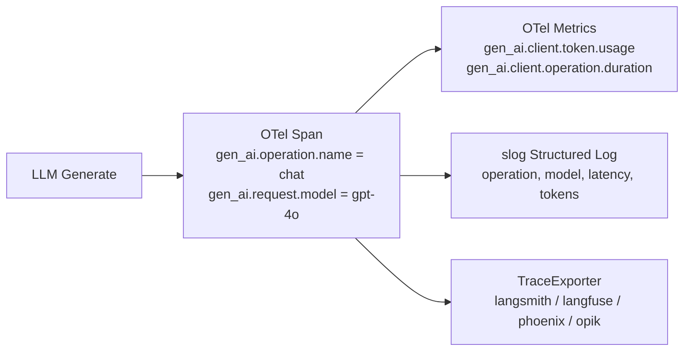

**Span attributes** (per GenAI semantic conventions):

| Attribute | Example |
|-----------|---------|
| `gen_ai.operation.name` | `chat`, `embeddings` |
| `gen_ai.provider.name` | `openai`, `anthropic` |
| `gen_ai.request.model` | `gpt-4o` |
| `gen_ai.response.model` | `gpt-4o-2024-08-06` |
| `gen_ai.usage.input_tokens` | `150` |
| `gen_ai.usage.output_tokens` | `50` |
| `gen_ai.request.temperature` | `0.7` |

### Health Checks

Every `Lifecycle` component exposes `Health() HealthStatus`. The `App` aggregates all component health into a single endpoint.

States: `healthy`, `degraded`, `unhealthy`.

## Configuration Architecture

### ProviderConfig

All providers accept `config.ProviderConfig`:

```go
type ProviderConfig struct {
    APIKey   string
    Model    string
    BaseURL  string
    Options  map[string]any // provider-specific options
}
```

### Loading

```go
cfg, err := config.Load[MyConfig]("config.yaml")  // file
cfg, err := config.LoadFromEnv[MyConfig]()         // environment
config.MergeEnv(cfg)                                // overlay env on file config
config.Validate(cfg)                                // validate
```

### Hot Reload

```go
watcher := config.NewFileWatcher("config.yaml")
watcher.OnChange(func(cfg MyConfig) { /* apply new config */ })
watcher.Start(ctx)
```

## Resilience Architecture

LLM providers are external services with variable reliability: they throttle requests, experience outages, and exhibit tail latency. Resilience patterns address each of these failure modes independently and compose together via middleware.

### Composable Patterns

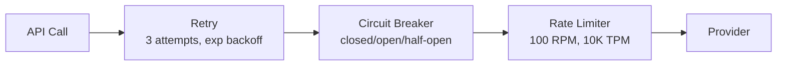

Each pattern is a middleware: `func(ChatModel) ChatModel`.

| Pattern | Purpose | Config |
|---------|---------|--------|
| **Retry** | Handle transient errors | Max attempts, backoff, jitter |
| **Circuit Breaker** | Prevent cascading failures | Threshold, timeout, half-open probes |
| **Hedge** | Reduce tail latency | Parallel to N providers, use first result |
| **Rate Limit** | Prevent overload | RPM, TPM, MaxConcurrent |

### Composition

```go
model = llm.ApplyMiddleware(model,
    resilience.WithRetry(3, resilience.ExponentialBackoff(time.Second)),
    resilience.WithCircuitBreaker(resilience.CBConfig{Threshold: 5, Timeout: 30*time.Second}),
    resilience.WithRateLimit(resilience.RateLimitConfig{RPM: 100, TPM: 10000}),
)
```

## Guard Pipeline

Safety threats target different points in the processing chain, so guards must run at multiple stages. Input guards catch prompt injection and PII before the LLM processes them. Output guards validate LLM responses for toxicity and compliance after generation. Tool guards enforce authorization and validate inputs before executing side effects. Each stage operates independently, allowing different safety providers at each point.

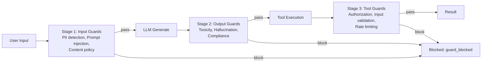

Guard providers: guardrailsai, lakera, llmguard, azuresafety, nemo.

## Memory Architecture

LLMs have finite context windows, but agents need access to information spanning different time horizons and access patterns. The three-tier memory architecture, inspired by MemGPT, addresses this by organizing information by how quickly it needs to be accessible and how much storage it requires:

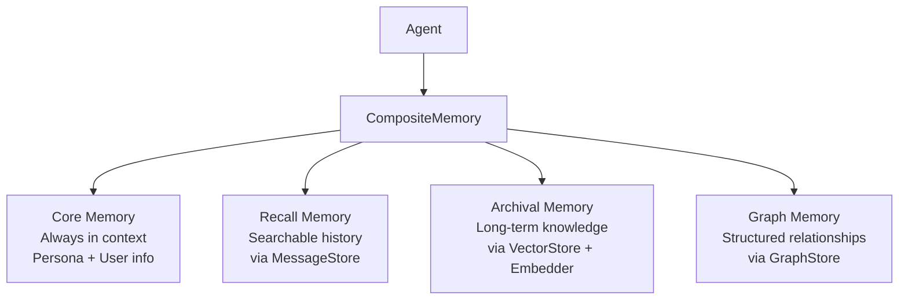

| Tier | Latency | Capacity | Use case |
|------|---------|----------|----------|
| Core | 0ms (in prompt) | Small (system prompt) | Persona, user preferences |
| Recall | ~1ms | Medium (conversation) | Recent conversation history |
| Archival | ~10ms | Large (knowledge base) | Documents, past conversations |
| Graph | ~10ms | Large (relationships) | Entity relationships, knowledge graph |

## Protocol Architecture

### MCP (Model Context Protocol)

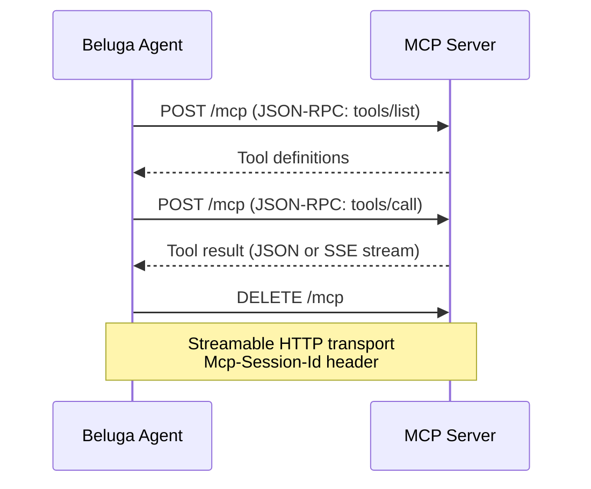

### A2A (Agent-to-Agent)

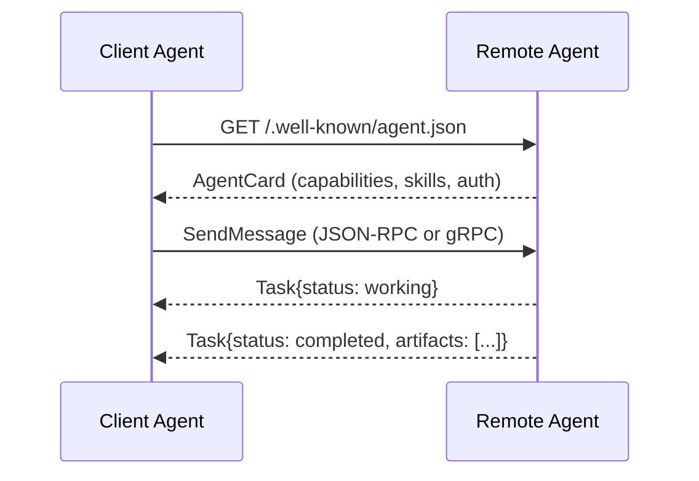

Task lifecycle: `submitted` → `working` → `input-required` → `completed` / `failed` / `canceled`.

## Design Guarantees

These guarantees are enforced by the CI pipeline and code review process. They ensure that the framework remains predictable as it grows:

1. **No circular imports** — dependency flows strictly downward: foundation → capability → infrastructure → protocol.
2. **Zero external deps in foundation** — `core/` and `schema/` depend only on stdlib + OTel.
3. **Every public function takes `context.Context` first** — no exceptions.
4. **Every interface has a compile-time check** — `var _ Interface = (*Impl)(nil)`.
5. **Every provider maps errors** — no raw SDK errors leak through.
6. **Every stream respects cancellation** — checks `ctx.Done()` and `yield` return value.
7. **Every extensible package uses the same registry** — `Register()` + `New()` + `List()` in every extensible package.
8. **Every hook is optional** — `nil` hooks are skipped, never panic.
9. **Every middleware composes** — `ApplyMiddleware(base, mw1, mw2, ...)` works uniformly.
10. **Invoke is always derived from Stream** — `Stream → Collect → return last`.
