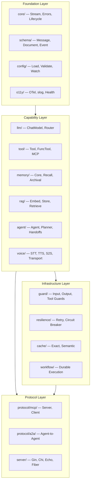

Beluga AI v2 is built on a layered architecture that separates concerns into four tiers: **Foundation**, **Capability**, **Infrastructure**, and **Protocol**. Each layer has clear boundaries and strict dependency rules — upper layers import downward, never sideways or upward. This design ensures that the framework is modular, testable, and easy to extend without modifying core internals.

## Architecture at a Glance

The foundation layer (`core/`, `schema/`) has **zero external dependencies** beyond the Go standard library and OpenTelemetry. Provider packages bring in their own SDK dependencies, but nothing leaks upward into the abstractions.

## Core Design Principles

Beluga is opinionated about six things that affect every line of code in the framework:

- **Streaming-first** — Every public API returns `iter.Seq2[T, error]` (Go 1.23+ iterators). No channels in public interfaces. Synchronous `Invoke()` is a convenience wrapper that collects the stream. This gives you low time-to-first-token, natural backpressure, and composable stream transformations.

- **Pluggable everything** — Every extensible package uses the same Registry + Middleware + Hooks pattern. There are 19 registries across the framework, all following an identical contract: `Register()` in `init()`, `New()` for construction, `List()` for discovery. Swap providers without changing application code.

- **Small interfaces** — Every extensible component is defined by a Go interface with 1-4 methods. Small interfaces are testable, composable, and easy to implement. If an interface grows beyond 4 methods, it gets split.

- **Context propagation** — `context.Context` is the first parameter of every public function, no exceptions. Cancellation, timeouts, tracing spans, and tenant isolation all flow through context from HTTP handler to LLM call to tool execution.

- **Typed errors with retry semantics** — All errors are `core.Error` with an operation name, error code, and wrapped cause. Error codes like `rate_limit` and `timeout` carry retry semantics via `IsRetryable()`. Every provider maps SDK-specific errors to framework error codes at the boundary.

- **Composition over inheritance** — Go has no inheritance, and Beluga embraces that. `BaseAgent` provides embeddable defaults. Middleware (`func(T) T`) wraps interfaces for cross-cutting concerns like retry and caching. Hooks provide lifecycle interception without wrapping.

## The Extension Contract

Every extensible package follows four interlocking patterns. Learn these once — they apply to all 19 registries uniformly:

| Pattern | What it does | Example |
|---------|-------------|---------|
| **Interface** | Defines the contract (1-4 methods) | `llm.ChatModel`, `tool.Tool`, `memory.Memory` |
| **Registry** | Discovery + construction via `Register()` / `New()` / `List()` | `llm.Register("openai", factory)` |
| **Middleware** | Wraps the interface: `func(T) T` | `resilience.WithRetry(3, time.Second)` |
| **Hooks** | Lifecycle callbacks (all optional, nil = skip) | `agent.Hooks{OnToolCall: fn, OnHandoff: fn}` |

This means adding a new LLM provider, a new vector store, or a new voice transport all follow the same steps: implement the interface, register in `init()`, map errors, write tests.

## Provider Ecosystem

Beluga ships with **100+ providers** across 16 categories, covering every major AI service and infrastructure component. Providers are imported with Go blank identifiers and self-register at import time — no configuration plumbing needed.

| Category | Count | Examples |
|----------|-------|---------|
| **LLM** | 23 | OpenAI, Anthropic, Google, Ollama, Bedrock, Groq, Mistral, DeepSeek |
| **Embedding** | 9 | OpenAI, Cohere, Jina, Voyage, Ollama |
| **Vector Store** | 13 | pgvector, Pinecone, Qdrant, Weaviate, Milvus, Elasticsearch |
| **Voice (STT/TTS/S2S)** | 16 | Deepgram, ElevenLabs, Cartesia, OpenAI Realtime, Gemini Live |
| **Memory** | 8 | Redis, PostgreSQL, MongoDB, Neo4j, SQLite |
| **Document Loaders** | 12 | Firecrawl, GitHub, Confluence, Notion, Google Drive |
| **Guardrails** | 5 | GuardrailsAI, Lakera, LLMGuard, Azure Safety, NeMo |
| **Workflow** | 6 | In-memory, Temporal, Kafka, NATS, Dapr, Inngest |
| **HTTP Adapters** | 7 | Gin, Chi, Echo, Fiber, Huma, gRPC, Connect |
| **Observability** | 4 | LangSmith, Langfuse, Phoenix, Opik |

See the [Provider Integration Guide](./providers/) for the full catalog, discovery methods, and step-by-step instructions for adding your own.

## Key Architectural Decisions

Beluga makes deliberate choices that differentiate it from other agentic frameworks:

- **Handoffs are tools** — Agent-to-agent transfers are auto-generated `transfer_to_{id}` tools that the LLM sees in its tool list. The LLM decides when to hand off; the executor handles it uniformly. No special routing logic needed.

- **Pluggable planner interface** — The executor loop is planner-agnostic. Different reasoning strategies (ReAct, Reflexion, Plan-and-Execute) plug in via the same `Planner` interface and registry pattern.

- **Three-tier memory (MemGPT model)** — Core memory (always in prompt), Recall memory (searchable history), and Archival memory (vector + graph). `CompositeMemory` combines them transparently.

- **Three-stage guard pipeline** — Input guards (before LLM), output guards (after LLM), and tool guards (before execution). Each stage runs independently with its own set of safety providers.

- **Own durable execution engine** — Beluga includes a built-in workflow engine for development and simple production use. Temporal, NATS, and Kafka are provider options, not requirements.

- **Frame-based voice pipeline** — Individual `FrameProcessor` stages (VAD, STT, LLM, TTS) compose into cascading, S2S, or hybrid pipelines. Transports (LiveKit, Daily) are pluggable.

## Documents

Dive deeper into the architecture through these focused documents:

| Document | What it covers |
|----------|---------------|
| [Design Concepts](./concepts/) | The "why" — architectural vision, 10 design principles, key decisions with rationale, data flow examples, and framework comparison |
| [Package Layout](./packages/) | The "what" — every package, its interfaces, dependency graph, how packages collaborate, and framework statistics |
| [Full Architecture](./architecture/) | The "how" — extensibility patterns in detail, streaming architecture, error handling, step-by-step guides for adding providers and tools |
| [Provider Integration Guide](./providers/) | The "who" — complete provider catalog by category, discovery methods, and the universal provider implementation checklist |
