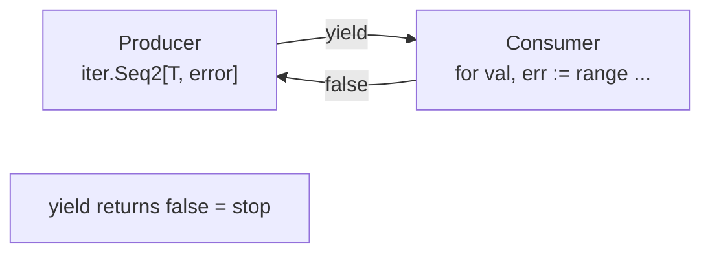
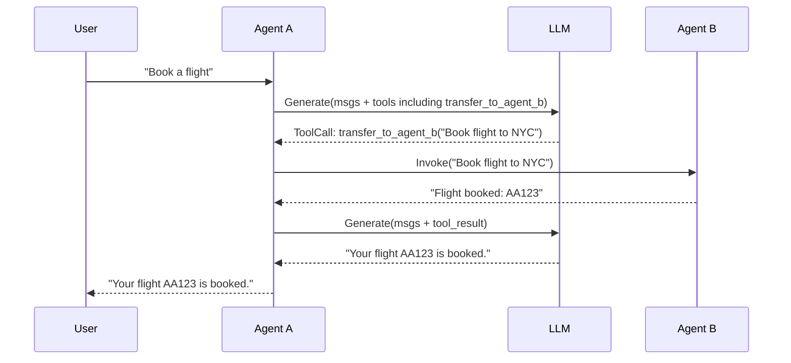
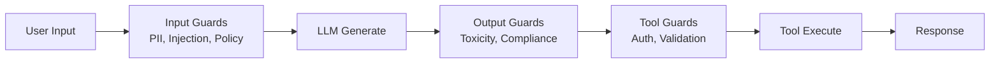
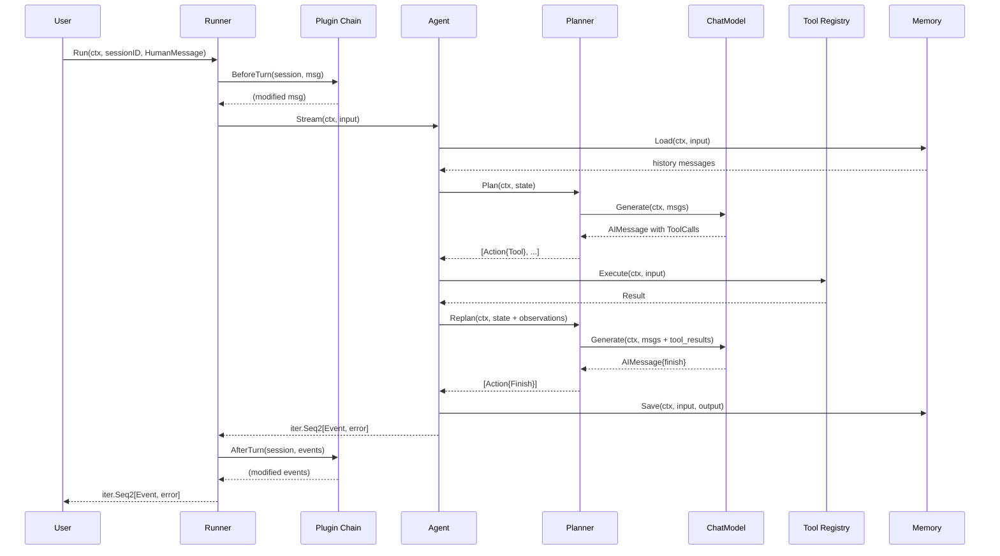
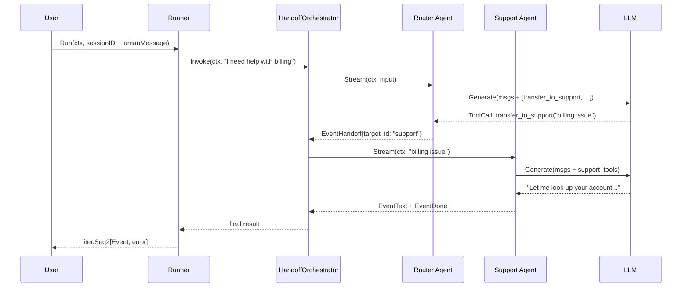
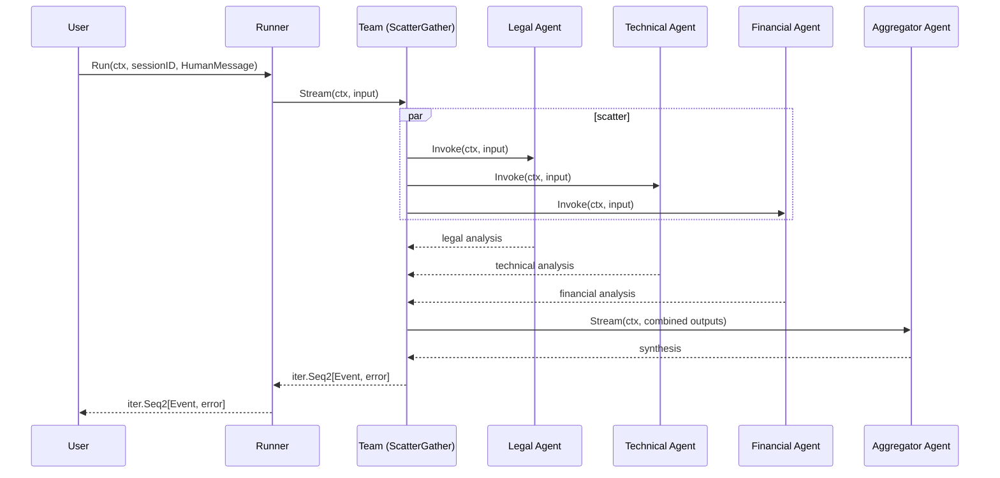
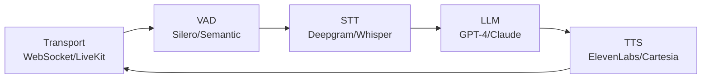

Beluga AI v2 is a Go-native framework for building production agentic AI systems. It targets teams building enterprise applications that require extensibility, observability, type safety, and performance — without sacrificing developer ergonomics.

The framework draws from production patterns in Google ADK, OpenAI Agents SDK, LangGraph, ByteDance Eino, and LiveKit, unifying them into a single coherent Go library with streaming-first design, protocol interoperability (MCP + A2A), and pluggable everything. Each of these frameworks solves a subset of the agentic AI problem well; Beluga's contribution is combining their best ideas into a single system where the patterns are consistent and the boundaries are clean.

## Design Principles

These principles are not aspirational guidelines — they are enforced constraints that shape every API in the framework. Each one addresses a specific failure mode observed in production agentic systems.

### 1. Streaming First

Every component produces results as `iter.Seq2[T, error]` — Go 1.23+ push-based iterators. Synchronous `Invoke()` is a convenience wrapper that collects the stream. This ensures low time-to-first-token for LLM responses, real-time event propagation through agent pipelines, and natural backpressure without goroutine overhead. The key insight is that request/response is a degenerate case of streaming (collect all events and return the last one), while the reverse is not true — retrofitting streaming onto a request/response API requires fundamental architectural changes.

### 2. Interface-Driven, Small Contracts

Every extensible component is defined by a Go interface with 1-4 methods. Implementations are concrete structs returned by factory functions. This enables compile-time verification, easy mocking for tests, and ad-hoc polymorphism through type assertions for optional capabilities. The 1-4 method constraint is the key discipline: it forces interface designers to identify the minimal contract that captures the abstraction, rather than the maximal set of operations a component might support. When an interface needs growth, the answer is type assertions for optional capabilities, not expanding the core contract that every provider must implement.

### 3. Registry + Init Registration

Every extensible package (LLM, embedding, vectorstore, STT, TTS, etc.) uses the same pattern: a global registry with `Register()`, `New()`, and `List()`. Providers self-register in `init()`. Users import providers with blank identifiers. This is the standard Go pattern used by `database/sql`, `image`, and Terraform. The consistency across all 19 registries means that understanding one teaches you the pattern for all of them — the same three functions, the same import mechanism, the same discovery API.

### 4. Composition Over Inheritance

Go has no inheritance. Beluga uses struct embedding for code reuse (`BaseAgent` provides defaults) and interface composition for capability extension. Middleware (`func(T) T`) wraps interfaces for cross-cutting concerns. Hooks provide lifecycle interception without wrapping.

### 5. Context Propagation Everywhere

Every public function takes `context.Context` as its first parameter. Cancellation propagates through the entire call chain — from HTTP handler to LLM streaming to tool execution. Timeouts, tracing, and tenant isolation all flow through context.

### 6. Typed Errors with Retry Semantics

All errors are `*core.Error` with an operation name, error code, human-readable message, and wrapped cause. Error codes (`rate_limit`, `timeout`, `provider_unavailable`) carry retry semantics via `core.IsRetryable()`. Provider-specific errors are mapped to framework error codes at the boundary.

### 7. Zero External Dependencies in Foundation

`core/` and `schema/` depend only on the Go standard library and OpenTelemetry. This guarantees stability, fast compilation, and no transitive dependency conflicts for users who only need the core types. This constraint is especially important in a framework with 100+ providers: if the foundation types pulled in any provider SDK, every user would inherit those dependencies. By keeping the foundation clean, provider dependencies stay isolated in their own packages.

### 8. Pluggable Everything via Providers

LLMs, embedders, vector stores, memory stores, voice providers, workflow engines, document loaders, guardrails, observability exporters — all are swappable providers behind interfaces. Adding a new provider means implementing an interface and calling `Register()` in `init()`.

### 9. Enterprise Observability

OpenTelemetry is integrated at the framework level using `gen_ai.*` semantic conventions. Tracing, metrics, and structured logging (via `slog`) are built in, not bolted on. Every LLM call, tool execution, and agent event emits spans and metrics automatically.

### 10. Protocol Interoperability

Agents can expose and consume capabilities via MCP (Model Context Protocol) and A2A (Agent-to-Agent protocol). MCP uses Streamable HTTP transport. A2A uses protobuf-generated types with JSON-RPC and gRPC bindings. Agents are not locked into a single communication pattern.

## High-Level Architecture

The architecture is organized into four layers with strict dependency rules. The layering ensures that foundation types are stable and dependency-free, capability packages add AI primitives on top, infrastructure provides cross-cutting concerns, and protocol packages handle external communication. Dependencies flow strictly downward — no package ever imports from a layer above it.


```mermaid
graph TB
    subgraph foundation [Foundation Layer]
        core["core/<br/>Stream, Runnable, Lifecycle, Errors"]
        schemaP["schema/<br/>Message, ContentPart, Event, Document"]
        configP["config/<br/>Load, Validate, Watch"]
        o11yP["o11y/<br/>Tracer, Meter, Logger, Health"]
    end

    subgraph capability [Capability Layer]
        llmP["llm/<br/>ChatModel, Router, StructuredOutput"]
        toolP["tool/<br/>Tool, FuncTool, MCP Client"]
        memoryP["memory/<br/>Core, Recall, Archival, Graph"]
        ragP["rag/<br/>Embedding, VectorStore, Retriever"]
        agentP["agent/<br/>Agent, Planner, Executor, Handoffs"]
        voiceP["voice/<br/>STT, TTS, S2S, VAD, Transport"]
    end

    subgraph infra [Infrastructure Layer]
        guardP["guard/<br/>Input, Output, Tool Guards"]
        resilienceP["resilience/<br/>Retry, CircuitBreaker, Hedge"]
        cacheP["cache/<br/>Exact, Semantic"]
        authP["auth/<br/>RBAC, ABAC, Capabilities"]
        hitlP["hitl/<br/>Approval, Feedback"]
        workflowP["workflow/<br/>DurableExecutor, Activities"]
        evalP["eval/<br/>Metrics, Runner, Datasets"]
        stateP["state/<br/>Shared State, Watch"]
        promptP["prompt/<br/>Templates, Builder, Versioning"]
        runtimeP["runtime/<br/>Runner, Team, Plugin, Session"]
    end

    subgraph protocol [Protocol Layer]
        mcpP["protocol/mcp/<br/>Server, Client"]
        a2aP["protocol/a2a/<br/>Server, Client, AgentCard"]
        restP["protocol/rest/<br/>REST, SSE"]
        serverP["server/<br/>Gin, Chi, Echo, Fiber, gRPC"]
    end

    foundation --> capability
    capability --> infra
    capability --> protocol
    infra --> protocol
```

**Dependency flow is strictly downward**: Foundation has zero knowledge of upper layers. Capability packages import foundation. Infrastructure and protocol packages import both.

## Key Design Decisions

Each decision below was made after evaluating alternatives and studying how other frameworks handle the same problem. The "Rationale" sections explain not just what was chosen, but why the alternatives were rejected.

### Decision 1: `iter.Seq2[T, error]` for Streaming

**Choice**: Go 1.23+ range-over-func iterators, not channels.

**Rationale**:
- No goroutine per stream — zero scheduling overhead
- Natural backpressure — `yield` returning `false` stops the producer immediately
- Composable — `MapStream`, `FilterStream`, `MergeStreams`, `FanOut` compose without allocations
- Standard Go — uses `range` for consumption, not custom `.Next()/.Err()` patterns
- `iter.Pull2()` available when pull semantics are needed (rare)

**Where channels are OK**: Internal goroutine communication (e.g., voice frame processors between pipeline stages). Public API boundaries always use `iter.Seq2`.


```mermaid
graph LR
    producer["Producer<br/>iter.Seq2[T, error]"] -->|yield| consumer["Consumer<br/>for val, err := range ..."]
    consumer -->|false| producer
    note["yield returns false = stop"]
```

### Decision 2: Handoffs Are Tools

**Choice**: Agent-to-agent transfers are auto-generated `transfer_to_{id}` tools.

**Rationale**:
- The LLM decides when to hand off — it sees handoffs in its tool list
- No special routing logic needed — the executor handles tool calls uniformly
- Dynamic availability — `IsEnabled` can disable handoffs at runtime
- Input filtering — `InputFilter` controls what context passes to the target agent
- Validated by OpenAI Agents SDK and Google ADK patterns


```mermaid
sequenceDiagram
    participant User
    participant AgentA as Agent A
    participant LLM
    participant AgentB as Agent B

    User->>AgentA: "Book a flight"
    AgentA->>LLM: Generate(msgs + tools including transfer_to_agent_b)
    LLM-->>AgentA: ToolCall: transfer_to_agent_b("Book flight to NYC")
    AgentA->>AgentB: Invoke("Book flight to NYC")
    AgentB-->>AgentA: "Flight booked: AA123"
    AgentA->>LLM: Generate(msgs + tool_result)
    LLM-->>AgentA: "Your flight AA123 is booked."
    AgentA-->>User: "Your flight AA123 is booked."
```

### Decision 3: Pluggable Planner Interface

**Choice**: Separate `Planner` interface from `Executor`. The executor loop is planner-agnostic.

**Rationale**:
- Different reasoning strategies (ReAct, Reflexion, Plan-and-Execute, GoT) have different strengths
- The executor loop (receive actions, execute, observe, replan) is universal
- Planners register via `RegisterPlanner()` — same registry pattern as providers
- Custom planners can be added without modifying the executor

**Built-in planners**: ReAct (default), Reflexion, Plan-and-Execute, Structured, Conversational.

### Decision 4: Three-Tier Memory (MemGPT Model)

**Choice**: Separate memory into Core (always in context), Recall (searchable history), and Archival (vector + graph).

**Rationale**:
- Core memory provides persistent persona and user context without retrieval latency
- Recall memory enables efficient search over conversation history
- Archival memory supports large-scale knowledge bases via vector similarity and graph traversal
- CompositeMemory combines all tiers transparently

### Decision 5: Three-Stage Guard Pipeline

**Choice**: Guards run at three stages: input, output, and tool execution.

**Rationale**:
- Input guards catch prompt injection, PII, and policy violations before LLM processing
- Output guards validate LLM responses for toxicity, hallucination, and compliance
- Tool guards enforce authorization and validation before side effects
- Validated by OpenAI Agents SDK guardrail architecture


```mermaid
graph LR
    input["User Input"] --> inputGuards["Input Guards<br/>PII, Injection, Policy"]
    inputGuards --> llm["LLM Generate"]
    llm --> outputGuards["Output Guards<br/>Toxicity, Compliance"]
    outputGuards --> toolGuards["Tool Guards<br/>Auth, Validation"]
    toolGuards --> toolExec["Tool Execute"]
    toolExec --> response["Response"]
```

### Decision 6: Own Durable Execution Engine

**Choice**: Beluga provides its own workflow engine. Temporal is a provider option, not the default.

**Rationale**:
- Not all deployments need Temporal's infrastructure overhead
- The default in-process engine works for development and simple production use
- Teams using Temporal, NATS, Kafka, or Dapr can plug in their preferred engine
- All workflow engines implement the same `DurableExecutor` interface

### Decision 7: Frame-Based Voice Pipeline

**Choice**: `FrameProcessor` interface with goroutine-connected stages, not a monolithic pipeline.

**Rationale**:
- Each processor (VAD, STT, LLM, TTS) is an independent unit
- Cascading (STT→LLM→TTS), S2S (native audio), and Hybrid modes compose from the same processors
- LiveKit/Daily/WebSocket are transports, not framework dependencies
- Target: <800ms end-to-end latency

### Decision 8: Hybrid Search as Default Retrieval

**Choice**: Vector + BM25 + RRF (Reciprocal Rank Fusion) as the default retriever.

**Rationale**:
- Pure vector search misses keyword-specific queries
- Pure BM25 misses semantic similarity
- RRF fusion combines rankings without needing score normalization
- Default pipeline: BM25 ~200 → Dense retrieval ~100 → RRF fusion (k=60) → Cross-encoder reranker → Top 10

### Decision 9: Registry Pattern Everywhere

**Choice**: Every extensible package uses `Register()` + `New()` + `List()` with the same implementation.

**Rationale**:
- Consistency — learn the pattern once, apply everywhere
- Discovery — `List()` shows what's available at runtime
- Testing — register mock providers in tests
- 19 registries across the framework, all following the same contract

### Decision 10: Middleware + Hooks Dual System

**Choice**: Both middleware (`func(T) T`) and hooks (struct with optional callbacks) in every extensible package.

**Rationale**:
- **Middleware** wraps the entire interface — good for retry, rate-limit, cache, logging, tracing
- **Hooks** fire at specific lifecycle points — good for audit, cost tracking, modification, validation
- Middleware applies outermost (first in chain), hooks fire within execution
- Both are composable: `ApplyMiddleware()` and `ComposeHooks()`
- 6 packages implement middleware, 11 packages implement hooks

## Core Abstractions

These are the fundamental types every Beluga application interacts with. Understanding how they relate to each other is the prerequisite for all other framework knowledge.

### Agent

An `Agent` is the atomic unit of reasoning. It encapsulates a language model, a set of tools, memory, and a planner strategy. The `agent.Agent` interface is small by design:

```go
type Agent interface {
    ID() string
    Persona() Persona
    Tools() []tool.Tool
    Children() []Agent
    Invoke(ctx context.Context, input string, opts ...Option) (string, error)
    Stream(ctx context.Context, input string, opts ...Option) iter.Seq2[Event, error]
}
```

`Invoke` collects the full response before returning. `Stream` yields typed `Event` values as they arrive. Both methods respect `context.Context` cancellation.

Every event has a `Type` field: `EventText` for content chunks, `EventToolCall` and `EventToolResult` for tool interactions, `EventHandoff` for agent-to-agent transfers, `EventDone` for completion signals, and `EventError` for recoverable errors.

`Children()` returns nested agents for orchestration — a `Team` returns its member agents here.

**See**: `agent/` package.

### Team

A `Team` is a group of agents coordinated by an `OrchestrationPattern`. Teams implement `agent.Agent`, so a Team can be hosted by a `Runner` or nested inside another Team. This recursive composition is the mechanism for building multi-agent hierarchies.

```go
import (
    "github.com/lookatitude/beluga-ai/runtime"
)

team := runtime.NewTeam(
    runtime.WithTeamID("research-team"),
    runtime.WithAgents(analyst, summarizer, factChecker),
    runtime.WithPattern(runtime.ScatterGatherPattern(aggregatorAgent)),
)

// A Team is an Agent — use a Runner to host it.
runner := runtime.NewRunner(team, runtime.WithWorkerPoolSize(5))
```

Three orchestration patterns are built in:

**PipelinePattern**: Agents execute sequentially. The text output of each agent becomes the input for the next. Use this when each stage refines or extends the previous stage's work.

```go
pipeline := runtime.NewTeam(
    runtime.WithAgents(drafterAgent, editorAgent, reviewerAgent),
    runtime.WithPattern(runtime.PipelinePattern()),
)
```

**SupervisorPattern**: A coordinator agent receives the original input along with a description of available agents. The coordinator decides how to respond. Use this for dynamic task delegation where the routing logic is itself language-model-driven.

```go
supervised := runtime.NewTeam(
    runtime.WithAgents(codeAgent, docsAgent, testAgent),
    runtime.WithPattern(runtime.SupervisorPattern(coordinatorAgent)),
)
```

**ScatterGatherPattern**: All agents run in parallel on the same input. Their outputs are concatenated and passed to an aggregator agent. Use this for tasks where multiple independent analyses should be synthesized.

```go
parallel := runtime.NewTeam(
    runtime.WithAgents(legalAgent, technicalAgent, financialAgent),
    runtime.WithPattern(runtime.ScatterGatherPattern(synthesizerAgent)),
)
```

Custom patterns implement the `OrchestrationPattern` interface:

```go
type OrchestrationPattern interface {
    Execute(ctx context.Context, agents []agent.Agent, input string) iter.Seq2[agent.Event, error]
}
```

**See**: `runtime/` package.

### Runner

A `Runner` is the lifecycle manager for a single agent or team. It handles session management, plugin execution, concurrency bounding via a worker pool, and graceful shutdown. The Runner contains no business logic — the agent does the reasoning, the Runner handles everything around it.

```go
import (
    "context"
    "fmt"
    "time"

    "github.com/lookatitude/beluga-ai/runtime"
    "github.com/lookatitude/beluga-ai/runtime/plugins"
    "github.com/lookatitude/beluga-ai/schema"
)

runner := runtime.NewRunner(myAgent,
    runtime.WithWorkerPoolSize(10),
    runtime.WithPlugins(
        plugins.NewRateLimit(60),
        plugins.NewAuditPlugin(auditStore),
    ),
)
defer func() {
    shutdownCtx, cancel := context.WithTimeout(context.Background(), 30*time.Second)
    defer cancel()
    if err := runner.Shutdown(shutdownCtx); err != nil {
        fmt.Println("shutdown error:", err)
    }
}()

for evt, err := range runner.Run(ctx, "session-1", schema.NewHumanMessage("summarize this")) {
    if err != nil {
        return err
    }
    fmt.Print(evt.Text)
}
```

The Runner's execution flow for each turn is:

1. Load or create the session identified by `sessionID`. An empty `sessionID` creates a new session.
2. Run the `Plugin` chain's `BeforeTurn` hooks — each plugin may modify the input message.
3. Submit the agent invocation to the `WorkerPool`.
4. Stream agent events and collect them.
5. Run the `Plugin` chain's `AfterTurn` hooks — each plugin may modify the event slice.
6. Persist the updated session.
7. Yield the events to the caller.

`Runner.Shutdown` sets a shutdown flag (new calls to `Run` return an error immediately) and drains the worker pool, waiting for all in-flight turns to finish.

**See**: `runtime/` package, `runtime/plugins/`.

### Plugin

A `Plugin` intercepts agent execution at the Runner level. Every turn calls three methods: `BeforeTurn`, `AfterTurn`, and — if an error occurs — `OnError`.

```go
type Plugin interface {
    Name() string
    BeforeTurn(ctx context.Context, session *Session, input schema.Message) (schema.Message, error)
    AfterTurn(ctx context.Context, session *Session, events []agent.Event) ([]agent.Event, error)
    OnError(ctx context.Context, err error) error
}
```

Plugins are stateful, composable, and ordered. The `PluginChain` executes them in registration order for `BeforeTurn` and `AfterTurn`, passing the (potentially modified) message or event slice from one plugin to the next. `OnError` also chains — a plugin may return `nil` to suppress the error.

Built-in plugins cover the most common cross-cutting concerns:

- `plugins.NewRateLimit(rpm)` — rejects turns that exceed a requests-per-minute threshold.
- `plugins.NewAuditPlugin(store)` — writes structured log entries to an `audit.Store` at turn start, turn end, and on error.
- `plugins.NewCostTracking(tracker, budget)` — records a `cost.Usage` entry after every successful turn.

To implement a custom plugin:

```go
import (
    "context"
    "log/slog"

    "github.com/lookatitude/beluga-ai/agent"
    "github.com/lookatitude/beluga-ai/runtime"
    "github.com/lookatitude/beluga-ai/schema"
)

type loggingPlugin struct{}

func (p *loggingPlugin) Name() string { return "logging" }

func (p *loggingPlugin) BeforeTurn(ctx context.Context, session *runtime.Session, input schema.Message) (schema.Message, error) {
    slog.InfoContext(ctx, "turn start", "session", session.ID)
    return input, nil
}

func (p *loggingPlugin) AfterTurn(ctx context.Context, session *runtime.Session, events []agent.Event) ([]agent.Event, error) {
    slog.InfoContext(ctx, "turn end", "session", session.ID, "events", len(events))
    return events, nil
}

func (p *loggingPlugin) OnError(ctx context.Context, err error) error {
    slog.ErrorContext(ctx, "turn error", "error", err)
    return err // return nil to suppress the error
}
```

**See**: `runtime/plugins/`, `audit/`, `cost/`.

### Session

A `Session` holds the full conversation state for one agent interaction: ordered turn history, arbitrary key-value state, and lifecycle timestamps.

```go
type Session struct {
    ID        string
    AgentID   string
    TenantID  string
    State     map[string]any
    Turns     []schema.Turn
    CreatedAt time.Time
    UpdatedAt time.Time
    ExpiresAt time.Time
}
```

Sessions are created and managed by a `SessionService`. The Runner automatically creates a new session when `sessionID` is empty, or loads an existing one when a known ID is provided. Sessions are updated after every turn.

The built-in `InMemorySessionService` is suitable for development and single-instance deployments. Configure it with functional options:

```go
svc := runtime.NewInMemorySessionService(
    runtime.WithSessionTTL(24 * time.Hour),
    runtime.WithSessionTenantID("tenant-abc"),
    runtime.WithMaxSessions(1000),
)
runner := runtime.NewRunner(myAgent, runtime.WithSessionService(svc))
```

Implement `SessionService` for distributed or persistent session storage:

```go
type SessionService interface {
    Create(ctx context.Context, agentID string) (*Session, error)
    Get(ctx context.Context, sessionID string) (*Session, error)
    Update(ctx context.Context, session *Session) error
    Delete(ctx context.Context, sessionID string) error
}
```

### ChatModel

`ChatModel` is the primary interface for interacting with language models. All LLM providers implement it:

```go
type ChatModel interface {
    Generate(ctx context.Context, msgs []schema.Message, opts ...GenerateOption) (*schema.AIMessage, error)
    Stream(ctx context.Context, msgs []schema.Message, opts ...GenerateOption) iter.Seq2[schema.StreamChunk, error]
    BindTools(tools []schema.ToolDefinition) ChatModel
    ModelID() string
}
```

`BindTools` returns a new `ChatModel` with the given tool definitions included in every subsequent request. The original model is not modified. This design allows the same base model to be specialized for different tool sets without duplication.

**See**: `llm/` package, `docs/providers.md`.

### Tool

A `Tool` is a typed, executable capability exposed to agents and LLMs:

```go
type Tool interface {
    Name() string
    Description() string
    InputSchema() map[string]any
    Execute(ctx context.Context, input map[string]any) (*Result, error)
}
```

`FuncTool` wraps a typed Go function as a `Tool`, automatically generating the JSON Schema from the input struct:

```go
import "github.com/lookatitude/beluga-ai/tool"

type SearchInput struct {
    Query string `json:"query" description:"Search query" required:"true"`
    Limit int    `json:"limit" description:"Max results" default:"10"`
}

search := tool.NewFuncTool("search", "Search the web",
    func(ctx context.Context, input SearchInput) (*tool.Result, error) {
        // perform search
        return tool.TextResult("results for: " + input.Query), nil
    },
)
```

`tool.Registry` is a thread-safe collection of tools with `Add`, `Get`, `List`, `All`, `Remove`, and `Definitions` methods:

```go
reg := tool.NewRegistry()
if err := reg.Add(search); err != nil {
    return err
}
```

**See**: `tool/` package.

### Orchestration

The `orchestration/` package provides `core.Runnable`-based orchestrators for composing agents outside of the `runtime.Team` abstraction. Use these when you need fine-grained control over handoff routing or pipeline construction.

`HandoffOrchestrator` manages peer-to-peer agent transfers driven by `transfer_to_{id}` tool calls:

```go
import "github.com/lookatitude/beluga-ai/orchestration"

h := orchestration.NewHandoffOrchestrator(routerAgent, salesAgent, supportAgent).
    WithMaxHops(5).
    WithEntry("router")

result, err := h.Invoke(ctx, "I need help with billing", nil)
if err != nil {
    return err
}
```

`Pipeline` executes agents sequentially, streaming the final stage:

```go
p := orchestration.NewPipeline(drafterAgent, editorAgent, reviewerAgent)

for val, err := range p.Stream(ctx, "Write a blog post about Go generics", nil) {
    if err != nil {
        return err
    }
    // val is agent.Event from the final stage
}
```

Both `HandoffOrchestrator` and `Pipeline` implement `core.Runnable` and can be composed with `core.Pipe` and `core.Parallel`.

**See**: `orchestration/` package, `core/` package.

### Streaming

All streaming APIs in the framework use `iter.Seq2[T, error]` from the Go standard library. The convention is:

```go
for value, err := range stream {
    if err != nil {
        // handle error and stop
        break
    }
    // use value
}
```

Producers respect `context.Context` cancellation: if the context is done, the stream yields the context error and stops. Consumers should not call `break` unless they intend to stop consuming — doing so signals the producer to stop as well via the `yield` bool return.

Channels are never used in public streaming APIs.

**See**: `core/` for stream type definitions.

### Registry Pattern

Every extensible package uses the same registry pattern. This enables provider plug-ins without modifying core code.

```go
// 1. Register a factory in init():
func init() {
    cost.Register("postgres", func(cfg cost.Config) (cost.Tracker, error) {
        return newPostgresTracker(cfg)
    })
}

// 2. Import for side-effects:
import _ "myorg/beluga-plugins/cost/postgres"

// 3. Construct by name:
tracker, err := cost.New("postgres", cost.Config{})
if err != nil {
    return err
}
```

`List()` returns all registered names, sorted, for discovery and debugging.

### Errors

Errors in the framework are typed `*core.Error` values with an `ErrorCode` field:

```go
type Error struct {
    Op      string    // operation that failed, e.g. "runtime.runner.run"
    Code    ErrorCode // machine-readable code, e.g. ErrNotFound
    Message string    // human-readable description
    Err     error     // underlying cause, if any
}
```

Use `errors.As` to inspect error codes:

```go
import (
    "errors"

    "github.com/lookatitude/beluga-ai/core"
)

var coreErr *core.Error
if errors.As(err, &coreErr) && coreErr.Code == core.ErrNotFound {
    // handle not found
}
```

Use `core.IsRetryable(err)` before retrying:

```go
if core.IsRetryable(err) {
    // safe to retry with backoff
}
```

Retryable codes are `rate_limit`, `timeout`, and `provider_unavailable`. Never expose `*core.Error.Err` (the underlying cause) in responses to external callers — it may contain internal details.

## Data Flow Examples

These diagrams show how packages collaborate at runtime. Each example traces a request from user input through the framework layers and back.

### Text Chat


```mermaid
sequenceDiagram
    participant User
    participant Runner
    participant Plugin as Plugin Chain
    participant Agent
    participant Planner
    participant LLM as ChatModel
    participant Tools as Tool Registry
    participant Memory

    User->>Runner: Run(ctx, sessionID, HumanMessage)
    Runner->>Plugin: BeforeTurn(session, msg)
    Plugin-->>Runner: (modified msg)
    Runner->>Agent: Stream(ctx, input)
    Agent->>Memory: Load(ctx, input)
    Memory-->>Agent: history messages
    Agent->>Planner: Plan(ctx, state)
    Planner->>LLM: Generate(ctx, msgs)
    LLM-->>Planner: AIMessage with ToolCalls
    Planner-->>Agent: [Action{Tool}, ...]
    Agent->>Tools: Execute(ctx, input)
    Tools-->>Agent: Result
    Agent->>Planner: Replan(ctx, state + observations)
    Planner->>LLM: Generate(ctx, msgs + tool_results)
    LLM-->>Planner: AIMessage{finish}
    Planner-->>Agent: [Action{Finish}]
    Agent->>Memory: Save(ctx, input, output)
    Agent-->>Runner: iter.Seq2[Event, error]
    Runner->>Plugin: AfterTurn(session, events)
    Plugin-->>Runner: (modified events)
    Runner-->>User: iter.Seq2[Event, error]
```

### Multi-Agent with Handoffs


```mermaid
sequenceDiagram
    participant User
    participant Runner
    participant Orchestrator as HandoffOrchestrator
    participant Router as Router Agent
    participant Support as Support Agent
    participant LLM

    User->>Runner: Run(ctx, sessionID, HumanMessage)
    Runner->>Orchestrator: Invoke(ctx, "I need help with billing")
    Orchestrator->>Router: Stream(ctx, input)
    Router->>LLM: Generate(msgs + [transfer_to_support, ...])
    LLM-->>Router: ToolCall: transfer_to_support("billing issue")
    Router-->>Orchestrator: EventHandoff{target_id: "support"}
    Orchestrator->>Support: Stream(ctx, "billing issue")
    Support->>LLM: Generate(msgs + support_tools)
    LLM-->>Support: "Let me look up your account..."
    Support-->>Orchestrator: EventText + EventDone
    Orchestrator-->>Runner: final result
    Runner-->>User: iter.Seq2[Event, error]
```

### Team with ScatterGather


```mermaid
sequenceDiagram
    participant User
    participant Runner
    participant Team as Team (ScatterGather)
    participant Legal as Legal Agent
    participant Technical as Technical Agent
    participant Financial as Financial Agent
    participant Aggregator as Aggregator Agent

    User->>Runner: Run(ctx, sessionID, HumanMessage)
    Runner->>Team: Stream(ctx, input)
    par scatter
        Team->>Legal: Invoke(ctx, input)
        Team->>Technical: Invoke(ctx, input)
        Team->>Financial: Invoke(ctx, input)
    end
    Legal-->>Team: legal analysis
    Technical-->>Team: technical analysis
    Financial-->>Team: financial analysis
    Team->>Aggregator: Stream(ctx, combined outputs)
    Aggregator-->>Team: synthesis
    Team-->>Runner: iter.Seq2[Event, error]
    Runner-->>User: iter.Seq2[Event, error]
```

### Voice Pipeline


```mermaid
graph LR
    transport["Transport<br/>WebSocket/LiveKit"] --> vad["VAD<br/>Silero/Semantic"]
    vad --> stt["STT<br/>Deepgram/Whisper"]
    stt --> llm["LLM<br/>GPT-4/Claude"]
    llm --> tts["TTS<br/>ElevenLabs/Cartesia"]
    tts --> transport
```

## Framework Comparison

This comparison highlights where Beluga differs from other agentic frameworks. The key differentiators are Go-native streaming with `iter.Seq2`, the pluggable planner architecture, built-in voice pipeline support, and dual protocol support (MCP + A2A).

| Feature | Beluga AI v2 | Google ADK | OpenAI SDK | LangGraph | Eino |
|---------|-------------|------------|------------|-----------|------|
| Language | Go | Python/Go/Java | Python | Python | Go |
| Streaming | iter.Seq2 | Events/yield | run_streamed | StateGraph | StreamReader |
| Agent transfer | Handoffs as tools | AgentTool | Handoffs | Graph edges | Graph edges |
| Reasoning | Pluggable Planner | Built-in | Built-in | Custom nodes | Built-in |
| Voice | Frame-based pipeline | No | No | No | No |
| Protocols | MCP + A2A | MCP | MCP | No | No |
| Orchestration | Team/HandoffOrchestrator/Pipeline | Sequential/Parallel/Loop | Sequential | StateGraph | Chain/Graph/Workflow |
| Guardrails | 3-stage pipeline | Built-in | 3-stage | Custom | Aspects |
| Memory | 3-tier (MemGPT) | Session/State | No | Checkpoints | No |
| Durability | Own engine + providers | No | No | Checkpoints | No |

## Deployment Modes

The same agent code runs in four deployment modes. The framework code does not change — only the hosting wrapper changes.

### Library

Import Beluga into a Go program. Construct agents and runners in code. Invoke directly or expose via an HTTP server.

```go
import (
    "github.com/lookatitude/beluga-ai/runtime"
    _ "github.com/lookatitude/beluga-ai/llm/providers/openai"
)

func main() {
    runner := runtime.NewRunner(myAgent)
    // use runner directly or attach to http.ServeMux
}
```

Best for: scripts, CLI tools, single-agent services, development.

### Docker

Generate a multi-stage Dockerfile with `deploy.GenerateDockerfile()`. Each agent runs as a separate container. Wire them with `deploy.GenerateCompose()`.

```go
import "github.com/lookatitude/beluga-ai/deploy"

dockerfile, err := deploy.GenerateDockerfile(deploy.DockerfileConfig{
    AgentConfig: "config/agent.yaml",
    Port:        8080,
})
if err != nil {
    return err
}
```

Best for: teams of agents with independent scaling, local orchestration, CI/CD pipelines.

### Kubernetes

Define agents and teams as CRDs (`beluga.ai/v1 Agent` and `beluga.ai/v1 Team`). The operator in `k8s/operator/` reconciles CRDs into Deployments, Services, and HPAs. Validation and mutation webhooks (`k8s/webhooks/`) run before resources are persisted.

```yaml
apiVersion: beluga.ai/v1
kind: Agent
metadata:
  name: planner
  namespace: agents
spec:
  persona:
    role: Planner
  planner: react
  maxIterations: 10
  modelRef: gpt4o-secret
  replicas: 2
  scaling:
    enabled: true
    minReplicas: 1
    maxReplicas: 10
    targetCPUUtilization: 70
```

Best for: production multi-agent systems, autoscaling, GitOps workflows.

### Temporal

Wrap agent execution in a durable workflow via the `workflow/` package. Handles retries, checkpointing, and resumption across process restarts. Temporal is the cloud provider option; the framework includes a built-in durable engine as well.

Best for: long-running tasks, multi-step pipelines that must survive failures, tasks requiring human-in-the-loop approvals.

## Multi-Tenancy

All public functions accept `context.Context` as the first parameter. Tenant identity travels through the context:

```go
import "github.com/lookatitude/beluga-ai/core"

ctx = core.WithTenant(ctx, "tenant-abc")
```

Every data type that stores user data (`Session`, `cost.Usage`, `audit.Entry`) has a `TenantID` field. Implementations that query or store data must scope by tenant. The `guard/` pipeline validates tenant identity before any agent execution.

## Observability

The framework emits OpenTelemetry spans and metrics using the `gen_ai.*` semantic conventions. The `o11y/` package provides adapters that translate framework events into OTel signals.

No observability code is in `core/` or `schema/` — those packages have zero external dependencies.

Structured logging uses `slog` from the Go standard library. Log entries are contextual: they include span IDs, tenant IDs, agent IDs, and session IDs where available.
