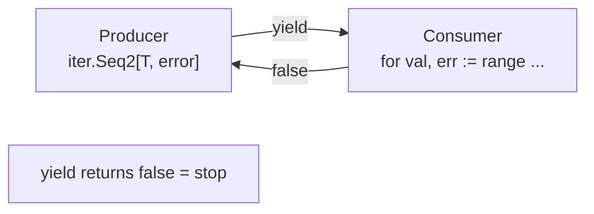
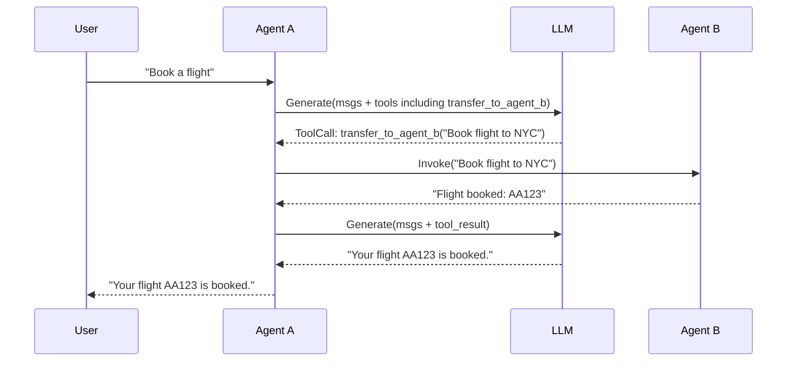
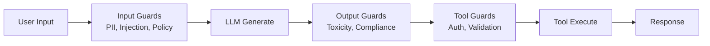
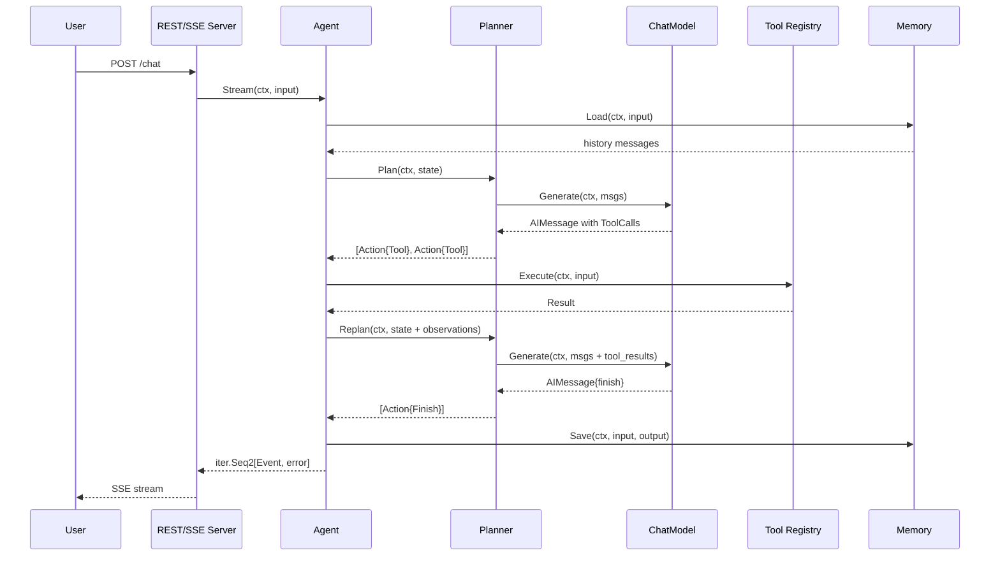
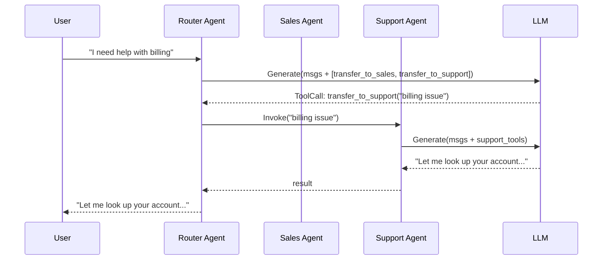
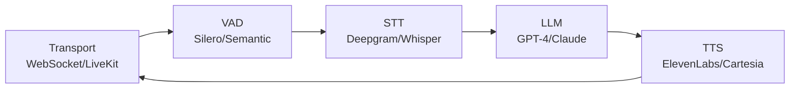

Beluga AI v2 is a Go-native framework for building production agentic AI systems. It targets teams building enterprise applications that require extensibility, observability, type safety, and performance — without sacrificing developer ergonomics.

The framework draws from production patterns in Google ADK, OpenAI Agents SDK, LangGraph, ByteDance Eino, and LiveKit, unifying them into a single coherent Go library with streaming-first design, protocol interoperability (MCP + A2A), and pluggable everything. Each of these frameworks solves a subset of the agentic AI problem well; Beluga's contribution is combining their best ideas into a single system where the patterns are consistent and the boundaries are clean.

## Design Principles

These principles are not aspirational guidelines — they are enforced constraints that shape every API in the framework. Each one addresses a specific failure mode observed in production agentic systems.

### 1. Streaming First

Every component produces results as `iter.Seq2[T, error]` — Go 1.23+ push-based iterators. Synchronous `Invoke()` is a convenience wrapper that collects the stream. This ensures low time-to-first-token for LLM responses, real-time event propagation through agent pipelines, and natural backpressure without goroutine overhead. The key insight is that request/response is a degenerate case of streaming (collect all events and return the last one), while the reverse is not true — retrofitting streaming onto a request/response API requires fundamental architectural changes.

### 2. Interface-Driven, Small Contracts

Every extensible component is defined by a Go interface with 1-4 methods. Implementations are concrete structs returned by factory functions. This enables compile-time verification, easy mocking for tests, and ad-hoc polymorphism through type assertions for optional capabilities. The 1-4 method constraint is the key discipline: it forces interface designers to identify the minimal contract that captures the abstraction, rather than the maximal set of operations a component might support. When an interface needs growth, the answer is type assertions for optional capabilities, not expanding the core contract that every provider must implement.

### 3. Registry + Init Registration

Every extensible package (LLM, embedding, vectorstore, STT, TTS, etc.) uses the same pattern: a global registry with `Register()`, `New()`, and `List()`. Providers self-register in `init()`. Users import providers with blank identifiers. This is the standard Go pattern used by `database/sql`, `image`, and Terraform. The consistency across all 19 registries means that understanding one teaches you the pattern for all of them — the same three functions, the same import mechanism, the same discovery API.

### 4. Composition Over Inheritance

Go has no inheritance. Beluga uses struct embedding for code reuse (`BaseAgent` provides defaults) and interface composition for capability extension. Middleware (`func(T) T`) wraps interfaces for cross-cutting concerns. Hooks provide lifecycle interception without wrapping.

### 5. Context Propagation Everywhere

Every public function takes `context.Context` as its first parameter. Cancellation propagates through the entire call chain — from HTTP handler to LLM streaming to tool execution. Timeouts, tracing, and tenant isolation all flow through context.

### 6. Typed Errors with Retry Semantics

All errors are `core.Error` with an operation name, error code, human-readable message, and wrapped cause. Error codes (`rate_limit`, `timeout`, `provider_unavailable`) carry retry semantics via `IsRetryable()`. Provider-specific errors are mapped to framework error codes at the boundary.

### 7. Zero External Dependencies in Foundation

`core/` and `schema/` depend only on the Go standard library and OpenTelemetry. This guarantees stability, fast compilation, and no transitive dependency conflicts for users who only need the core types. This constraint is especially important in a framework with 100+ providers: if the foundation types pulled in any provider SDK, every user would inherit those dependencies. By keeping the foundation clean, provider dependencies stay isolated in their own packages.

### 8. Pluggable Everything via Providers

LLMs, embedders, vector stores, memory stores, voice providers, workflow engines, document loaders, guardrails, observability exporters — all are swappable providers behind interfaces. Adding a new provider means implementing an interface and calling `Register()` in `init()`.

### 9. Enterprise Observability

OpenTelemetry is integrated at the framework level using `gen_ai.*` semantic conventions. Tracing, metrics, and structured logging (via `slog`) are built in, not bolted on. Every LLM call, tool execution, and agent event emits spans and metrics automatically.

### 10. Protocol Interoperability

Agents can expose and consume capabilities via MCP (Model Context Protocol) and A2A (Agent-to-Agent protocol). MCP uses Streamable HTTP transport. A2A uses protobuf-generated types with JSON-RPC and gRPC bindings. Agents are not locked into a single communication pattern.

## High-Level Architecture

The architecture is organized into four layers with strict dependency rules. The layering ensures that foundation types are stable and dependency-free, capability packages add AI primitives on top, infrastructure provides cross-cutting concerns, and protocol packages handle external communication. Dependencies flow strictly downward — no package ever imports from a layer above it.

```mermaid
graph TB
    subgraph foundation [Foundation Layer]
        core["core/<br/>Stream, Runnable, Lifecycle, Errors"]
        schemaP["schema/<br/>Message, ContentPart, Event, Document"]
        configP["config/<br/>Load, Validate, Watch"]
        o11yP["o11y/<br/>Tracer, Meter, Logger, Health"]
    end

    subgraph capability [Capability Layer]
        llmP["llm/<br/>ChatModel, Router, StructuredOutput"]
        toolP["tool/<br/>Tool, FuncTool, MCP Client"]
        memoryP["memory/<br/>Core, Recall, Archival, Graph"]
        ragP["rag/<br/>Embedding, VectorStore, Retriever"]
        agentP["agent/<br/>Agent, Planner, Executor, Handoffs"]
        voiceP["voice/<br/>STT, TTS, S2S, VAD, Transport"]
    end

    subgraph infra [Infrastructure Layer]
        guardP["guard/<br/>Input, Output, Tool Guards"]
        resilienceP["resilience/<br/>Retry, CircuitBreaker, Hedge"]
        cacheP["cache/<br/>Exact, Semantic"]
        authP["auth/<br/>RBAC, ABAC, Capabilities"]
        hitlP["hitl/<br/>Approval, Feedback"]
        workflowP["workflow/<br/>DurableExecutor, Activities"]
        evalP["eval/<br/>Metrics, Runner, Datasets"]
        stateP["state/<br/>Shared State, Watch"]
        promptP["prompt/<br/>Templates, Builder, Versioning"]
    end

    subgraph protocol [Protocol Layer]
        mcpP["protocol/mcp/<br/>Server, Client"]
        a2aP["protocol/a2a/<br/>Server, Client, AgentCard"]
        restP["protocol/rest/<br/>REST, SSE"]
        serverP["server/<br/>Gin, Chi, Echo, Fiber, gRPC"]
    end

    foundation --> capability
    capability --> infra
    capability --> protocol
    infra --> protocol
```

**Dependency flow is strictly downward**: Foundation has zero knowledge of upper layers. Capability packages import foundation. Infrastructure and protocol packages import both.

## Key Design Decisions

Each decision below was made after evaluating alternatives and studying how other frameworks handle the same problem. The "Rationale" sections explain not just what was chosen, but why the alternatives were rejected.

### Decision 1: `iter.Seq2[T, error]` for Streaming

**Choice**: Go 1.23+ range-over-func iterators, not channels.

**Rationale**:
- No goroutine per stream — zero scheduling overhead
- Natural backpressure — `yield` returning `false` stops the producer immediately
- Composable — `MapStream`, `FilterStream`, `MergeStreams`, `FanOut` compose without allocations
- Standard Go — uses `range` for consumption, not custom `.Next()/.Err()` patterns
- `iter.Pull2()` available when pull semantics are needed (rare)

**Where channels are OK**: Internal goroutine communication (e.g., voice frame processors between pipeline stages). Public API boundaries always use `iter.Seq2`.

### Decision 2: Handoffs Are Tools

**Choice**: Agent-to-agent transfers are auto-generated `transfer_to_{id}` tools.

**Rationale**:
- The LLM decides when to hand off — it sees handoffs in its tool list
- No special routing logic needed — the executor handles tool calls uniformly
- Dynamic availability — `IsEnabled` can disable handoffs at runtime
- Input filtering — `InputFilter` controls what context passes to the target agent
- Validated by OpenAI Agents SDK and Google ADK patterns

### Decision 3: Pluggable Planner Interface

**Choice**: Separate `Planner` interface from `Executor`. The executor loop is planner-agnostic.

**Rationale**:
- Different reasoning strategies (ReAct, Reflexion, Plan-and-Execute, GoT) have different strengths
- The executor loop (receive actions, execute, observe, replan) is universal
- Planners register via `RegisterPlanner()` — same registry pattern as providers
- Custom planners can be added without modifying the executor

**Built-in planners**: ReAct (default), Reflexion, Plan-and-Execute, Structured, Conversational.

### Decision 4: Three-Tier Memory (MemGPT Model)

**Choice**: Separate memory into Core (always in context), Recall (searchable history), and Archival (vector + graph).

**Rationale**:
- Core memory provides persistent persona and user context without retrieval latency
- Recall memory enables efficient search over conversation history
- Archival memory supports large-scale knowledge bases via vector similarity and graph traversal
- CompositeMemory combines all tiers transparently

### Decision 5: Three-Stage Guard Pipeline

**Choice**: Guards run at three stages: input, output, and tool execution.

**Rationale**:
- Input guards catch prompt injection, PII, and policy violations before LLM processing
- Output guards validate LLM responses for toxicity, hallucination, and compliance
- Tool guards enforce authorization and validation before side effects
- Validated by OpenAI Agents SDK guardrail architecture

### Decision 6: Own Durable Execution Engine

**Choice**: Beluga provides its own workflow engine. Temporal is a provider option, not the default.

**Rationale**:
- Not all deployments need Temporal's infrastructure overhead
- The default in-process engine works for development and simple production use
- Teams using Temporal, NATS, Kafka, or Dapr can plug in their preferred engine
- All workflow engines implement the same `DurableExecutor` interface

### Decision 7: Frame-Based Voice Pipeline

**Choice**: `FrameProcessor` interface with goroutine-connected stages, not a monolithic pipeline.

**Rationale**:
- Each processor (VAD, STT, LLM, TTS) is an independent unit
- Cascading (STT→LLM→TTS), S2S (native audio), and Hybrid modes compose from the same processors
- LiveKit/Daily/WebSocket are transports, not framework dependencies
- Target: <800ms end-to-end latency

### Decision 8: Hybrid Search as Default Retrieval

**Choice**: Vector + BM25 + RRF (Reciprocal Rank Fusion) as the default retriever.

**Rationale**:
- Pure vector search misses keyword-specific queries
- Pure BM25 misses semantic similarity
- RRF fusion combines rankings without needing score normalization
- Default pipeline: BM25 ~200 → Dense retrieval ~100 → RRF fusion (k=60) → Cross-encoder reranker → Top 10

### Decision 9: Registry Pattern Everywhere

**Choice**: Every extensible package uses `Register()` + `New()` + `List()` with the same implementation.

**Rationale**:
- Consistency — learn the pattern once, apply everywhere
- Discovery — `List()` shows what's available at runtime
- Testing — register mock providers in tests
- 19 registries across the framework, all following the same contract

### Decision 10: Middleware + Hooks Dual System

**Choice**: Both middleware (`func(T) T`) and hooks (struct with optional callbacks) in every extensible package.

**Rationale**:
- **Middleware** wraps the entire interface — good for retry, rate-limit, cache, logging, tracing
- **Hooks** fire at specific lifecycle points — good for audit, cost tracking, modification, validation
- Middleware applies outermost (first in chain), hooks fire within execution
- Both are composable: `ApplyMiddleware()` and `ComposeHooks()`
- 6 packages implement middleware, 11 packages implement hooks

## Data Flow Examples

These diagrams show how packages collaborate at runtime. Each example traces a request from user input through the framework layers and back, illustrating how the abstract interfaces connect in practice.

### Text Chat

### Multi-Agent with Handoffs

### Voice Pipeline

## Framework Comparison

This comparison highlights where Beluga differs from other agentic frameworks. The key differentiators are Go-native streaming with `iter.Seq2`, the pluggable planner architecture, built-in voice pipeline support, and dual protocol support (MCP + A2A).

| Feature | Beluga AI v2 | Google ADK | OpenAI SDK | LangGraph | Eino |
|---------|-------------|------------|------------|-----------|------|
| Language | Go | Python/Go/Java | Python | Python | Go |
| Streaming | iter.Seq2 | Events/yield | run_streamed | StateGraph | StreamReader |
| Agent transfer | Handoffs as tools | AgentTool | Handoffs | Graph edges | Graph edges |
| Reasoning | Pluggable Planner | Built-in | Built-in | Custom nodes | Built-in |
| Voice | Frame-based pipeline | No | No | No | No |
| Protocols | MCP + A2A | MCP | MCP | No | No |
| Orchestration | Chain/Graph/Workflow | Sequential/Parallel/Loop | Sequential | StateGraph | Chain/Graph/Workflow |
| Guardrails | 3-stage pipeline | Built-in | 3-stage | Custom | Aspects |
| Memory | 3-tier (MemGPT) | Session/State | No | Checkpoints | No |
| Durability | Own engine + providers | No | No | Checkpoints | No |
