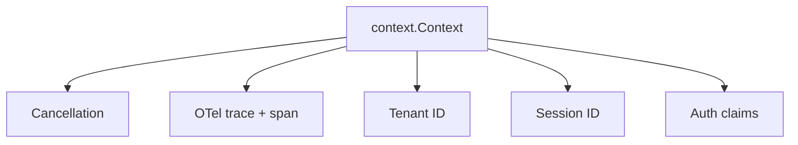

`context.Context` is the first parameter of every public function in Beluga.
No exceptions. The CLAUDE.md rule is explicit: *"Never stored in a struct
field."* This page explains what the context carries, why the conventions
exist, and what breaks when they are ignored.

## What the context carries

In a Beluga application, a single `context.Context` propagates five distinct
concerns through the call stack:



Each concern uses a separate, unexported context key type so packages cannot
accidentally collide.

## Cancellation

Every blocking operation in Beluga accepts a `ctx context.Context` and
terminates when `ctx.Done()` fires. LLM requests, vector store queries, tool
HTTP calls, stream producers — all select on `ctx.Done()`.

```go
import (
    "context"
    "fmt"
    "time"

    "github.com/lookatitude/beluga-ai/config"
    "github.com/lookatitude/beluga-ai/llm"
    "github.com/lookatitude/beluga-ai/schema"
    _ "github.com/lookatitude/beluga-ai/llm/providers/openai"
)

func callWithDeadline(msgs []schema.Message) error {
    ctx, cancel := context.WithTimeout(context.Background(), 30*time.Second)
    defer cancel() // always call cancel; prevents context leak

    model, err := llm.New("openai", config.ProviderConfig{Model: "gpt-4o"})
    if err != nil {
        return fmt.Errorf("llm.New: %w", err)
    }

    result, err := model.Generate(ctx, msgs)
    if err != nil {
        return fmt.Errorf("generate: %w", err)
    }
    _ = result
    return nil
}
```

`defer cancel()` is mandatory. Even if `Generate` completes before the
deadline, not calling `cancel` leaks the context's internal timer goroutine
until the parent context is cancelled.

## OTel trace and span

OpenTelemetry uses `context.Context` as the span carrier. When Beluga code
calls `o11y.StartSpan(ctx, "llm.generate", ...)`, it extracts the current
span from `ctx`, creates a child span, and returns a new context with the
child span attached. Downstream calls that receive this context see the child
span as their parent automatically — no manual threading required.

```go
import (
    "context"
    "fmt"

    "github.com/lookatitude/beluga-ai/o11y"
)

func tracedOperation(ctx context.Context) error {
    ctx, span := o11y.StartSpan(ctx, "my.operation", o11y.Attrs{
        o11y.AttrOperationName: "my.operation",
    })
    defer span.End()

    if err := doWork(ctx); err != nil {
        span.RecordError(err)
        span.SetStatus(o11y.StatusError, err.Error())
        return fmt.Errorf("doWork: %w", err)
    }
    span.SetStatus(o11y.StatusOK, "")
    return nil
}
```

Every `WithTracing()` middleware in Beluga follows this pattern. See
[DOC-14 — Observability](/docs/reference/architecture/overview/observability) for the
full template.

## Tenant isolation

Source: [`core/tenant.go:13-22`](https://github.com/lookatitude/beluga-ai/blob/main/core/tenant.go#L13-L22)

```go
// core/tenant.go:13-22
func WithTenant(ctx context.Context, id TenantID) context.Context {
    return context.WithValue(ctx, tenantKey{}, id)
}

func GetTenant(ctx context.Context) TenantID {
    id, _ := ctx.Value(tenantKey{}).(TenantID)
    return id
}
```

In a multi-tenant deployment, every request context carries a `TenantID`.
Downstream packages — memory stores, vector stores, audit logging, cost
tracking — read it via `core.GetTenant(ctx)` to scope operations. No
package needs to accept a separate `tenantID string` parameter; the context
carries it.

```go
import (
    "context"
    "fmt"

    "github.com/lookatitude/beluga-ai/config"
    "github.com/lookatitude/beluga-ai/core"
    "github.com/lookatitude/beluga-ai/llm"
    "github.com/lookatitude/beluga-ai/schema"
    _ "github.com/lookatitude/beluga-ai/llm/providers/anthropic"
)

func handleRequest(tenantID string, msgs []schema.Message) error {
    ctx := context.Background()
    ctx = core.WithTenant(ctx, core.TenantID(tenantID))
    ctx = core.WithSessionID(ctx, "sess-abc123")

    model, err := llm.New("anthropic", config.ProviderConfig{Model: "claude-opus-4-5"})
    if err != nil {
        return fmt.Errorf("llm.New: %w", err)
    }

    result, err := model.Generate(ctx, msgs)
    if err != nil {
        // core.GetTenant(ctx) is available in any error handler downstream
        return fmt.Errorf("tenant %s: generate: %w", tenantID, err)
    }
    _ = result
    return nil
}
```

## Session and request IDs

Source: [`core/context.go:15-36`](https://github.com/lookatitude/beluga-ai/blob/main/core/context.go#L15-L36)

`core.WithSessionID` and `core.WithRequestID` attach per-session and
per-request identifiers. Structured logging in Beluga automatically reads
`core.GetSessionID(ctx)` and includes it in every log line so you can
filter all operations for a given conversation turn.

`contextKey` is defined as an unexported `int` type (`core/context.go:7`),
and `tenantKey` as an unexported struct type (`core/tenant.go:6`). These
distinct types prevent any collision between packages that both store values
in the context.

## Never store context in a struct

```go
// DO NOT do this:
type MyService struct {
    ctx context.Context // wrong
}

// Do this:
type MyService struct {
    // no ctx field
}

func (s *MyService) DoWork(ctx context.Context) error {
    // pass ctx per call
    return doSomething(ctx)
}
```

A context represents a request-scoped lifetime. Stashing it in a struct
means:
- **Cancellation breaks.** The stored context may be cancelled while the
  struct lives on and new requests arrive.
- **Tenant isolation breaks.** A struct initialized for tenant A may
  handle a request for tenant B using tenant A's stored context.
- **Tracing breaks.** The OTel span in the stored context is the span from
  the original call, not the current one.

The Go team's own guidance ("Do not store Contexts inside a struct type")
applies with extra force in Beluga because the context carries security-
and billing-critical tenant identities.

## Context and resilience

The `resilience` package's circuit breakers and retry middleware propagate
the caller's context unchanged. When a circuit is open, the call returns
immediately with a `*core.Error{Code: core.ErrProviderDown}` without
blocking. The caller's timeout still fires if the context expires while
waiting for the circuit to close. See
[DOC-15 — Resilience](/docs/reference/architecture/overview/resilience).

## Common mistakes

- **Storing `ctx` in a struct.** The struct outlives the request; the stored context carries the wrong tenant, span, and cancellation signal.
- **Using `context.Background()` inside a method that received a `ctx` parameter.** Any method that accepts a `ctx` must propagate it. Spawning a `context.Background()` child disconnects cancellation and tracing.
- **Not calling `defer cancel()`.** Every `context.WithTimeout`, `context.WithCancel`, and `context.WithDeadline` returns a `cancel` function. Not calling it leaks the timer goroutine.
- **Passing `nil` as a context.** Pass `context.Background()` or `context.TODO()` at the origin; never `nil`. `nil` causes a panic in any code that calls `ctx.Done()` or `ctx.Value()`.
- **Custom context keys as primitive types.** String and int keys collide across packages. Use an unexported struct type — the pattern `core/tenant.go:6` uses (`type tenantKey struct{}`) is the canonical Go idiom.

## Related reading

- [DOC-02 — Core Primitives](/docs/reference/architecture/overview/core-primitives) — context helpers in the full primitive set.
- [DOC-14 — Observability](/docs/reference/architecture/overview/observability) — how OTel spans propagate through context.
- [DOC-15 — Resilience](/docs/reference/architecture/overview/resilience) — how circuit breakers and retry interact with context timeouts.
- [`core/context.go`](https://github.com/lookatitude/beluga-ai/blob/main/core/context.go) — session and request ID helpers.
- [`core/tenant.go`](https://github.com/lookatitude/beluga-ai/blob/main/core/tenant.go) — tenant isolation helpers.
