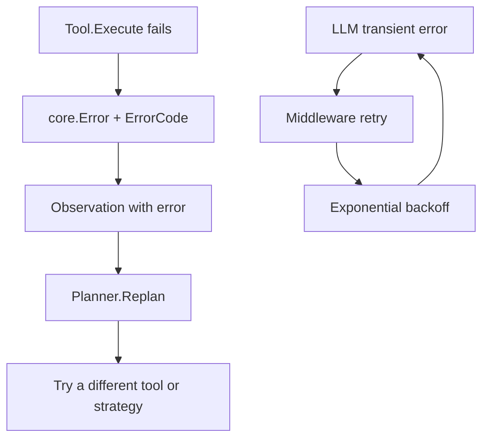

Beluga uses structured, typed errors throughout. Every public function that
can fail returns a `*core.Error` or wraps one in its chain. Raw
`errors.New` and `fmt.Errorf` strings exist in internal paths — not in any
function that crosses a package boundary.

The reason is operational: when an LLM provider returns a 429, the retry
middleware needs to know whether to retry, not just that something failed. A
string error cannot carry that signal reliably across package boundaries.
A typed `ErrorCode` can.

Two error paths coexist at runtime: application errors (tool failures, bad schemas) become `Observation`s that the planner can recover from; infrastructure errors (network blips, rate limits) are intercepted by middleware and retried transparently.



## `ErrorCode` — the classification

Source: [`core/errors.go:12-39`](https://github.com/lookatitude/beluga-ai/blob/main/core/errors.go#L12-L39)

```go
type ErrorCode string

const (
    ErrRateLimit       ErrorCode = "rate_limit"
    ErrAuth            ErrorCode = "auth_error"
    ErrTimeout         ErrorCode = "timeout"
    ErrInvalidInput    ErrorCode = "invalid_input"
    ErrToolFailed      ErrorCode = "tool_failed"
    ErrProviderDown    ErrorCode = "provider_unavailable"
    ErrGuardBlocked    ErrorCode = "guard_blocked"
    ErrBudgetExhausted ErrorCode = "budget_exhausted"
    ErrNotFound        ErrorCode = "not_found"
)
```

These codes are the vocabulary for programmatic error handling. Every package
in the capability layer maps its provider-specific failures to one of these
codes. A networking timeout from the OpenAI SDK becomes `ErrTimeout`; a 429
becomes `ErrRateLimit`.

## `core.Error` — the structure

Source: [`core/errors.go:50-62`](https://github.com/lookatitude/beluga-ai/blob/main/core/errors.go#L50-L62)

```go
type Error struct {
    Op      string    // operation that failed: "llm.generate", "tool.execute"
    Code    ErrorCode // classification
    Message string    // human-readable description
    Err     error     // wrapped cause (participates in errors.Is / errors.As)
}
```

`Op` is the dotted operation name: `llm.generate`, `tool.execute`,
`memory.load`. It survives stack unwinding and appears verbatim in
observability backends as the failing operation.

`Err` implements `Unwrap()` so `errors.Is` and `errors.As` traverse the
full chain (`core/errors.go:103-105`).

## Creating errors

Two constructors:

**`core.NewError`** — explicit fields:

Source: [`core/errors.go:66-73`](https://github.com/lookatitude/beluga-ai/blob/main/core/errors.go#L66-L73)

```go
return core.NewError("tool.execute", core.ErrToolFailed, "fetch returned 404", err)
```

**`core.Errorf`** — formatted message, `%w` wrapping:

Source: [`core/errors.go:82-90`](https://github.com/lookatitude/beluga-ai/blob/main/core/errors.go#L82-L90)

```go
return core.Errorf(core.ErrTimeout, "llm.generate: deadline exceeded after %d tokens: %w", n, err)
```

`core.Errorf` delegates to `fmt.Errorf` so `%w` works as expected. The wrapped
error is preserved in `Error.Err` and participates in `errors.Is` /
`errors.As` traversal.

## `IsRetryable` — the retry decision

Source: [`core/errors.go:120-126`](https://github.com/lookatitude/beluga-ai/blob/main/core/errors.go#L120-L126)

```go
func IsRetryable(err error) bool {
    var e *Error
    if errors.As(err, &e) {
        return retryableCodes[e.Code]
    }
    return false
}
```

Three codes are retryable (`core/errors.go:42-46`): `ErrRateLimit`,
`ErrTimeout`, `ErrProviderDown`. All others are not. `IsRetryable` uses
`errors.As` so it traverses wrapped errors correctly — a `*core.Error`
nested inside a `fmt.Errorf("%w", ...)` still matches.

## Full example — wrapping a provider error

```go
import (
    "context"
    "errors"
    "fmt"
    "time"

    "github.com/lookatitude/beluga-ai/core"
)

// callWithRetry calls fn up to maxAttempts times, retrying on retryable errors.
func callWithRetry(ctx context.Context, maxAttempts int, fn func(context.Context) error) error {
    var lastErr error
    for attempt := range maxAttempts {
        lastErr = fn(ctx)
        if lastErr == nil {
            return nil
        }
        if !core.IsRetryable(lastErr) {
            // auth failures, invalid input, guard blocks — don't retry
            return lastErr
        }
        // back off proportional to attempt number
        select {
        case <-ctx.Done():
            return fmt.Errorf("retry loop cancelled: %w", ctx.Err())
        case <-time.After(time.Duration(attempt+1) * 200 * time.Millisecond):
        }
    }
    return fmt.Errorf("all %d attempts failed: %w", maxAttempts, lastErr)
}

// wrapProviderError maps a raw SDK error to a core.Error.
func wrapProviderError(op string, sdkErr error) error {
    if sdkErr == nil {
        return nil
    }
    // In practice, inspect sdkErr for status codes, message text, etc.
    var code core.ErrorCode
    switch {
    case errors.Is(sdkErr, context.DeadlineExceeded):
        code = core.ErrTimeout
    default:
        code = core.ErrProviderDown
    }
    return core.NewError(op, code, sdkErr.Error(), sdkErr)
}
```

## Error string format

`Error.Error()` returns: `"<op> [<code>]: <message>: <cause>"` when a cause
is present, or `"<op> [<code>]: <message>"` without one.

Source: [`core/errors.go:94-99`](https://github.com/lookatitude/beluga-ai/blob/main/core/errors.go#L94-L99)

```
llm.generate [rate_limit]: provider returned 429: http: status 429
```

This format is readable in logs and `slog` structured output. The `op` field
scopes the error to its origin without requiring a stack trace.

## Error matching with `errors.Is`

`core.Error.Is` compares by `Code` only — two errors with the same code
match, regardless of message or cause (`core/errors.go:109-115`). This lets
you write:

```go
import (
    "errors"

    "github.com/lookatitude/beluga-ai/core"
)

func handleErr(err error) {
    sentinel := &core.Error{Code: core.ErrGuardBlocked}
    if errors.Is(err, sentinel) {
        // guard rejected the request — do not retry, surface to user
    }
}
```

## Common mistakes

- **Returning raw `fmt.Errorf` from a public function.** `IsRetryable` returns `false` for all unclassified errors. Middleware cannot retry what it cannot classify. C-003 in `.wiki/corrections.md` documents 190 occurrences of this pattern found across 50+ files during the v2 migration.
- **Using error message strings for branching.** String-matching errors breaks as soon as provider SDK messages change. Use `ErrorCode` or `errors.As`.
- **Swallowing errors silently.** Every error must either be returned, logged, or explicitly discarded with a comment explaining why. The rule is in `.claude/rules/go-packages.md`.
- **Panicking for recoverable errors.** `panic` is for programmer errors (nil pointer, out-of-bounds). Provider failures, tool timeouts, and guard blocks are recoverable — return a `*core.Error`.
- **Leaking internal details in errors returned to callers.** `Error.Message` is for operators; strip SQL query text, file paths, and internal IDs before the error crosses a trust boundary.

## Related reading

- [Resilience](/docs/reference/architecture/overview/resilience) — circuit breakers and retry middleware that consume `IsRetryable`.
- [Extensibility](/docs/concepts/extensibility) — where `core.Error` fits in the middleware chain.
- [`core/errors.go`](https://github.com/lookatitude/beluga-ai/blob/main/core/errors.go) — canonical source for all error types and codes.
- [`.wiki/patterns/error-handling.md`](https://github.com/lookatitude/beluga-ai/blob/main/.wiki/patterns/error-handling.md) — patterns and anti-patterns with file:line references.
