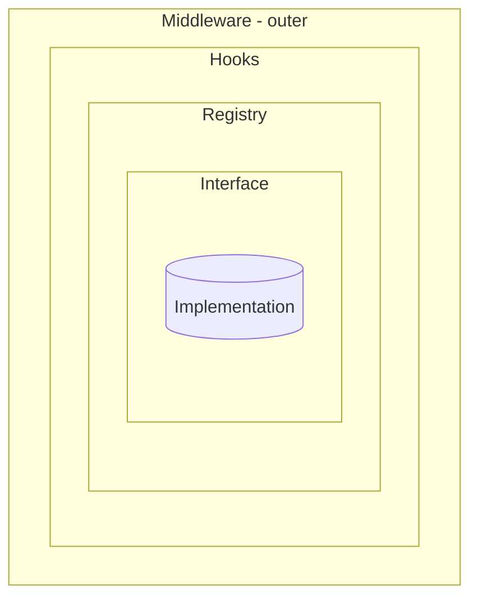
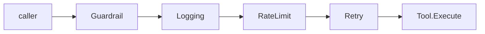

Thirteen pluggable packages in Beluga — `llm`, `tool`, `memory`, `rag/embedding`,
`rag/vectorstore`, `rag/retriever`, `voice/*`, `guard`, `workflow`, `server`,
`cache`, `auth`, `state` — use the same four extension mechanisms. Learn the
pattern once. It applies everywhere.

## The four concentric rings



- **Interface** — the compile-time contract. ≤4 methods.
- **Registry** — maps names to instances at runtime. `Register` / `New` / `List`.
- **Hooks** — fire at specific lifecycle points. Optional, nil-safe, composable.
- **Middleware** — wraps the whole call. `func(T) T`, applied outside-in.

## Ring 1 — Interface

Every pluggable package exposes a small interface. The `tool` package's
primary interface ([`tool/tool.go`](https://github.com/lookatitude/beluga-ai/blob/main/tool/tool.go)):

```go
type Tool interface {
    Name() string
    Description() string
    InputSchema() map[string]any
    Execute(ctx context.Context, input map[string]any) (*Result, error)
}
```

Four methods. The invariant is hard: interfaces with more than four methods
are split via embedding (C-001 in `.wiki/corrections.md` documents a real
violation and its fix). Smaller interfaces are easier to implement, easier to
mock in tests, and encourage third-party providers.

Every implementation includes a compile-time assertion:

```go
var _ tool.Tool = (*MyTool)(nil)
```

## Ring 2 — Registry

Providers register themselves in `init()` using a typed factory. Callers
use `llm.New("openai", cfg)` — not `&openai.Provider{...}`. The registry
applies middleware, hooks, and metrics before returning the instance.

Canonical shape (adapted from `llm/registry.go:20-44`):

```go
import (
    "fmt"
    "sync"
)

var (
    mu       sync.RWMutex
    registry = make(map[string]Factory)
)

func Register(name string, f Factory) error {
    mu.Lock()
    defer mu.Unlock()
    if _, exists := registry[name]; exists {
        return fmt.Errorf("provider %q already registered", name)
    }
    registry[name] = f
    return nil
}

func New(name string, cfg Config) (Provider, error) {
    mu.RLock()
    defer mu.RUnlock()
    f, ok := registry[name]
    if !ok {
        return nil, fmt.Errorf("provider %q not found", name)
    }
    return f(cfg)
}
```

Provider packages register themselves as a side-effect of import:

```go
// llm/providers/anthropic/anthropic.go:19-21
func init() {
    if err := llm.Register("anthropic", newFactory()); err != nil {
        panic(err)
    }
}
```

Callers import the provider for its `init()`:

```go
import (
    "context"
    "fmt"

    "github.com/lookatitude/beluga-ai/config"
    "github.com/lookatitude/beluga-ai/llm"
    _ "github.com/lookatitude/beluga-ai/llm/providers/anthropic"
)

func buildModel(ctx context.Context) (llm.ChatModel, error) {
    model, err := llm.New("anthropic", config.ProviderConfig{Model: "claude-opus-4-5"})
    if err != nil {
        return nil, fmt.Errorf("build model: %w", err)
    }
    return model, nil
}
```

Registration is append-only at startup. Dynamic post-`main()` registration
is a race condition; the registry uses `sync.RWMutex` to prevent it.

## Ring 3 — Hooks

Hooks are optional function fields on a struct. `nil` means skip. They fire
at specific lifecycle points inside the implementation, not around it.

Canonical shape (adapted from `tool/hooks.go`):

```go
type Hooks struct {
    BeforeExecute func(ctx context.Context, name string, input map[string]any) error
    AfterExecute  func(ctx context.Context, name string, result *Result, err error)
    OnError       func(ctx context.Context, name string, err error) error
}
```

`ComposeHooks(h1, h2, h3)` chains multiple hook sets: each `Before*` runs in
order and stops on first error; each `After*` runs unconditionally.

**When to use hooks vs middleware:**

| Question | Answer |
|---|---|
| Cross-cutting — retry, rate-limit, logging, tracing? | **Middleware.** |
| Lifecycle-specific — before planning, after tool call? | **Hooks.** |
| Discovery / construction? | **Registry.** |
| The contract itself? | **Interface.** |

## Ring 4 — Middleware

Middleware is `func(T) T`. It wraps an implementation and returns a new one
with the same interface. The canonical application function (from
`tool/middleware.go:13-22`):

```go
func ApplyMiddleware(tool Tool, mws ...Middleware) Tool {
    result := tool
    for i := len(mws) - 1; i >= 0; i-- {
        result = mws[i](result)
    }
    return result
}
```

Application is outside-in: the first argument in the slice is the outermost
wrapper. `ApplyMiddleware(tool, guardrail, logging, retry)` means every call
passes through guardrail before logging before retry before the actual
implementation.



### `WithTracing()` — required for every new package

Every extensible package ships a `WithTracing()` Ring 4 middleware that wraps
its interface with OTel GenAI spans. Adding `WithTracing()` when you introduce
a new pluggable package is mandatory, not optional. Seventeen packages currently
ship it; the canonical template is `memory/tracing.go`. See
[DOC-14 — Observability](/docs/reference/architecture/overview/observability).

## Wiring it together

```go
import (
    "context"
    "fmt"

    "github.com/lookatitude/beluga-ai/config"
    "github.com/lookatitude/beluga-ai/llm"
    _ "github.com/lookatitude/beluga-ai/llm/providers/openai"
)

// auditHooks and costHooks are defined elsewhere in your application.
var auditHooks = llm.Hooks{}
var costHooks = llm.Hooks{}

func buildLLM(ctx context.Context) (llm.ChatModel, error) {
    // Ring 2: registry lookup
    base, err := llm.New("openai", config.ProviderConfig{Model: "gpt-4o"})
    if err != nil {
        return nil, fmt.Errorf("llm.New: %w", err)
    }

    // Ring 4: middleware (outside-in); hooks are a middleware too
    wrapped := llm.ApplyMiddleware(base,
        llm.WithTracing(),
        llm.WithHooks(llm.ComposeHooks(auditHooks, costHooks)),
    )

    return wrapped, nil
}
```

## Common mistakes

- **Using middleware for lifecycle interception.** Middleware wraps the whole call. If you need to act at "when the planner chose a tool," use a hook.
- **Using hooks for cross-cutting concerns.** Retry, rate-limiting, and tracing apply uniformly and belong in middleware.
- **Registering outside `init()`.** Post-startup registration races with concurrent reads. Registries are designed for startup-only writes.
- **Non-nil-safe hooks.** Always check `if h.BeforeExecute != nil` before calling. `ComposeHooks` does this for you; hand-rolled code often forgets.
- **Bypassing the registry.** Constructing `&openai.Provider{...}` directly skips middleware, hooks, and metrics. Use `llm.New("openai", cfg)`.
- **Forgetting the compile-time check.** `var _ Interface = (*Impl)(nil)` catches interface drift at compile time, not at runtime.

## Related reading

- [DOC-03 — Extensibility Patterns](/docs/reference/architecture/overview/extensibility-patterns) — the full architecture doc with implementation detail.
- [Registry + Factory pattern](/docs/patterns/registry-factory) — registration model in depth.
- [Middleware Chain pattern](/docs/patterns/middleware-chain) — composition, ordering, edge cases.
- [Custom Provider guide](/docs/guides/custom-provider) — building a new provider end-to-end.
