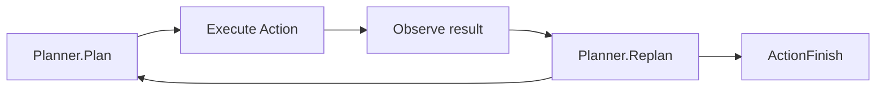

Beluga AI v2 is organized around a small number of ideas that apply uniformly
across the entire framework. You do not need to memorize these before writing
code — but you will hit them quickly, and understanding them cuts the "why does
this work that way?" questions down to near zero.

The five pages in this section cover the concepts that underpin every package.
They are reference-level explanations, not tutorials. If you want to build
something first, start with [Build Your First Agent](/docs/guides/capabilities/agents/first-agent)
and come back here when you hit a concept that needs grounding.

## In this section

| Page | What it explains |
|---|---|
| [Core Primitives](/docs/concepts/core-primitives) | `Stream[T]`, `Event[T]`, and `Runnable` — the three types every Beluga component is built from |
| [Extensibility](/docs/concepts/extensibility) | The four mechanisms (interface, registry, hooks, middleware) every pluggable package uses identically |
| [Streaming](/docs/concepts/streaming) | Why `iter.Seq2[T, error]`, not channels — and how to produce, consume, and compose streams |
| [Errors](/docs/concepts/errors) | `core.Error`, `ErrorCode`, `IsRetryable()`, and the wrapping contract every layer follows |
| [Context](/docs/concepts/context) | `context.Context` conventions: first parameter everywhere, cancellation, tenant isolation, tracing |

Start with **Core Primitives** if you are new to the framework. The other four
pages can be read in any order.

## The agent runtime loop

Every agent execution follows the same Plan → Act → Observe → Replan cycle until the planner signals completion.

