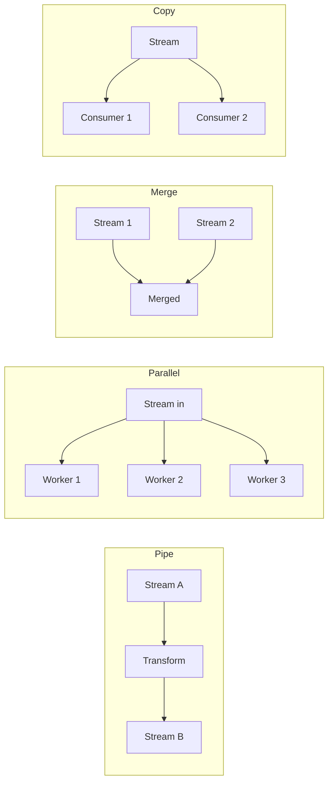
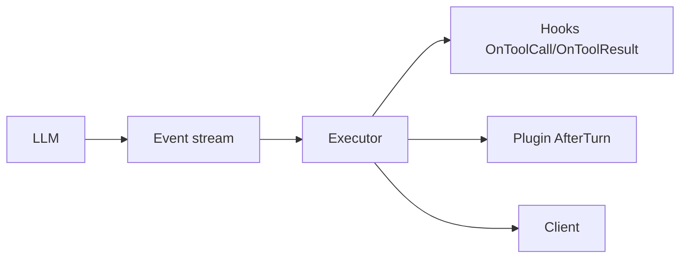

Beluga requires Go 1.23+ specifically because it uses `iter.Seq2[T, error]`
for all streaming public APIs. This is not a stylistic preference. Channels
in streaming APIs produce goroutine leaks, impose coordination overhead at
every composition boundary, and have no generic form before Go 1.21. `iter.Seq2`
solves all three problems.

## The definition

`Stream[T]` in Beluga is a type alias, not a struct:

Source: [`core/stream.go:56`](https://github.com/lookatitude/beluga-ai/blob/main/core/stream.go#L56)

```go
type Stream[T any] = iter.Seq2[Event[T], error]
```

`iter.Seq2[A, B]` is a function type: `func(yield func(A, B) bool)`. The
producer calls `yield` for each item. The consumer drives iteration via
`for … range`. When the consumer returns from the loop — normally or via
`break` — the Go runtime stops calling yield. The producer sees this on its
next iteration.

## Why not channels

Channels are a good synchronization primitive. They are a poor streaming API.

| Property | Channel | `iter.Seq2` |
|---|---|---|
| Consumer returns early | Producer goroutine leaks | `yield → false` propagates immediately |
| Composition (N stages) | N−1 intermediate channels + goroutines | One function call per stage |
| Generics | Requires `chan T` — no constraint until Go 1.18 workarounds | First-class generic since Go 1.23 |
| Multi-stream merge | `select` + bookkeeping | `MergeStreams` is a closure |
| Backpressure | Depends on channel buffer size | `yield` return value is the signal |

Channels still appear *inside* implementations — `MergeStreams` uses a
channel internally for the multi-goroutine fan-in case
(`core/stream.go:113-130`). They do not cross public API boundaries.
C-004, C-005 in `.wiki/corrections.md` document two real violations that were
refactored — the `workflow.WorkflowContext.ReceiveSignal` interface and the
entire `voice` frame processor pipeline.

## Consumer pattern

```go
import (
    "context"
    "fmt"

    "github.com/lookatitude/beluga-ai/config"
    "github.com/lookatitude/beluga-ai/llm"
    "github.com/lookatitude/beluga-ai/schema"
    _ "github.com/lookatitude/beluga-ai/llm/providers/openai"
)

func streamResponse(ctx context.Context, msgs []schema.Message) error {
    model, err := llm.New("openai", config.ProviderConfig{Model: "gpt-4o"})
    if err != nil {
        return fmt.Errorf("llm.New: %w", err)
    }

    // llm.ChatModel.Stream returns iter.Seq2[schema.StreamChunk, error] directly.
    // StreamChunk.Delta carries the incremental text; FinishReason is set on the
    // last chunk.
    for chunk, err := range model.Stream(ctx, msgs) {
        if err != nil {
            return fmt.Errorf("stream: %w", err)
        }
        if chunk.FinishReason != "" {
            break
        }
        // process chunk.Delta
        _ = chunk.Delta
    }
    return nil
}
```

`range` over `model.Stream(ctx, msgs)` is idiomatic Go 1.23 iteration. The
`err` value is the second element of `iter.Seq2`. Check it on every iteration.

## Collecting a stream

When you need the full result and do not need per-chunk processing:

```go
import (
    "context"
    "fmt"

    "github.com/lookatitude/beluga-ai/config"
    "github.com/lookatitude/beluga-ai/llm"
    "github.com/lookatitude/beluga-ai/schema"
    _ "github.com/lookatitude/beluga-ai/llm/providers/anthropic"
)

func generateAndCollect(ctx context.Context, msgs []schema.Message) (*schema.AIMessage, error) {
    model, err := llm.New("anthropic", config.ProviderConfig{Model: "claude-opus-4-5"})
    if err != nil {
        return nil, fmt.Errorf("llm.New: %w", err)
    }

    // Generate is the non-streaming path — collects all chunks and returns the
    // final AIMessage. Stream is the primary contract; Generate delegates to it.
    result, err := model.Generate(ctx, msgs)
    if err != nil {
        return nil, fmt.Errorf("generate: %w", err)
    }
    return result, nil
}
```

`Generate` is the non-streaming convenience form — it drives `Stream` internally
and returns the assembled response. Middleware and hooks attach to `Stream`;
`Generate` delegates to that path.

## Stream composition



Four combinators in `core/stream.go` compose streams without extra goroutines:

### MapStream — transform each event

Source: [`core/stream.go:73-90`](https://github.com/lookatitude/beluga-ai/blob/main/core/stream.go#L73-L90)

```go
import (
    "context"
    "strings"

    "github.com/lookatitude/beluga-ai/core"
    "github.com/lookatitude/beluga-ai/schema"
)

func upperCaseDeltas(ctx context.Context, src core.Stream[schema.StreamChunk]) core.Stream[schema.StreamChunk] {
    return core.MapStream(src, func(ev core.Event[schema.StreamChunk]) (core.Event[schema.StreamChunk], error) {
        // StreamChunk.Delta carries the incremental text content.
        ev.Payload.Delta = strings.ToUpper(ev.Payload.Delta)
        return ev, nil
    })
}
```

### MergeStreams — interleave N streams

Source: [`core/stream.go:113-130`](https://github.com/lookatitude/beluga-ai/blob/main/core/stream.go#L113-L130)

`MergeStreams` fans N streams into one in arrival order. It uses internal
goroutines — one per input stream — and a shared channel. The merged stream
completes when all input streams are exhausted.

```go
import (
    "context"
    "fmt"

    "github.com/lookatitude/beluga-ai/core"
    "github.com/lookatitude/beluga-ai/schema"
)

func mergeExample(ctx context.Context, s1, s2 core.Stream[schema.StreamChunk]) error {
    merged := core.MergeStreams(ctx, s1, s2)
    for event, err := range merged {
        if err != nil {
            return fmt.Errorf("merged stream: %w", err)
        }
        _ = event
    }
    return nil
}
```

### FanOut — broadcast to N consumers

Source: [`core/stream.go:167-180`](https://github.com/lookatitude/beluga-ai/blob/main/core/stream.go#L167-L180)

`FanOut` copies a single stream to N independent consumers. Each consumer
sees every event. The internal goroutine closes all consumer channels when the
source is exhausted.

### FilterStream — drop non-matching events

Source: [`core/stream.go:94-108`](https://github.com/lookatitude/beluga-ai/blob/main/core/stream.go#L94-L108)

Pure closure — no goroutines, no buffering.

## Event propagation

Events flow from the LLM outward through the executor to hooks, plugins, and the client.



Five `EventType`s propagate: `EventData` (text chunk), `EventToolCall`, `EventToolResult`, `EventDone`, and `EventError`. Hooks see tool events; plugins see the full turn; the client receives data and terminal events. See [DOC-04 — Data Flow](../../../../architecture/04-data-flow.md#event-propagation) for the complete description.

## Backpressure

Backpressure in `iter.Seq2` is structural: when the consumer does not call
the next iteration (e.g., returns from `range`), the producer's `yield` call
returns `false`, and the producer stops. This is not something you configure
— it is how the type works.

For producers faster than consumers, `NewBufferedStream`
(`core/stream.go:230-255`) absorbs bursts with a bounded internal channel:

```go
import (
    "context"
    "fmt"

    "github.com/lookatitude/beluga-ai/core"
    "github.com/lookatitude/beluga-ai/schema"
)

func bufferedConsumer(ctx context.Context, src core.Stream[schema.StreamChunk]) error {
    bs := core.NewBufferedStream(ctx, src, 32) // 32-event buffer
    for event, err := range bs.Iter() {
        if err != nil {
            return fmt.Errorf("buffered: %w", err)
        }
        _ = event
    }
    return nil
}
```

`FlowController` (`core/stream.go:285-295`) provides semaphore-style
acquire/release for producers that need explicit pause/resume rather than
buffering.

## Context cancellation

Every stream producer in Beluga checks `ctx.Done()`. When the context is
cancelled, the stream terminates on the next iteration with the context's
error. In `MergeStreams`, each goroutine selects on `ctx.Done()` before
sending to the shared channel (`core/stream.go:136-143`). Your consumer
loop sees the error on the next `for` iteration:

```go
import (
    "context"
    "fmt"
    "time"

    "github.com/lookatitude/beluga-ai/config"
    "github.com/lookatitude/beluga-ai/llm"
    "github.com/lookatitude/beluga-ai/schema"
    _ "github.com/lookatitude/beluga-ai/llm/providers/openai"
)

func streamWithTimeout(msgs []schema.Message) error {
    ctx, cancel := context.WithTimeout(context.Background(), 30*time.Second)
    defer cancel()

    model, err := llm.New("openai", config.ProviderConfig{Model: "gpt-4o"})
    if err != nil {
        return fmt.Errorf("llm.New: %w", err)
    }

    for chunk, err := range model.Stream(ctx, msgs) {
        if err != nil {
            // Could be context.DeadlineExceeded if the 30s timeout fires.
            return fmt.Errorf("stream: %w", err)
        }
        _ = chunk
    }
    return nil
}
```

## Writing a producer

Implement `Stream[T]` by returning a closure that calls `yield`:

```go
import (
    "context"
    "fmt"
    "iter"

    "github.com/lookatitude/beluga-ai/core"
)

// counterStream emits n integer events then stops.
func counterStream(ctx context.Context, n int) core.Stream[int] {
    return func(yield func(core.Event[int], error) bool) {
        for i := range n {
            select {
            case <-ctx.Done():
                yield(core.Event[int]{}, fmt.Errorf("cancelled: %w", ctx.Err()))
                return
            default:
            }
            ev := core.Event[int]{Type: core.EventData, Payload: i}
            if !yield(ev, nil) {
                return // consumer exited early
            }
        }
        yield(core.Event[int]{Type: core.EventDone}, nil)
    }
}

// Compile-time check that the signature matches.
var _ func(context.Context, int) core.Stream[int] = counterStream
```

Two rules for producers:
1. Check `ctx.Done()` before yielding. Use `select` with `default` for a
   non-blocking check, or `select` without `default` if the producer can
   block.
2. Check the return value of `yield`. If it returns `false`, return
   immediately. Continuing after `yield → false` is wasted work and can
   block forever if the consumer has abandoned the loop.

## Common mistakes

- **Returning a channel from a public method.** Use `Stream[T]`. C-004 (`workflow.WorkflowContext.ReceiveSignal`) and C-005 (voice pipeline) in `.wiki/corrections.md` show the cost of getting this wrong.
- **Ignoring `yield → false`.** A producer that continues after `yield` returns false wastes CPU and can block on a channel send forever.
- **Not checking `ctx.Done()`.** The context is the only cancellation signal a producer receives. Producers that ignore it hold resources — goroutines, connections, allocations — open after the caller has given up.
- **Implementing `Invoke` without `Stream`.** `Invoke` must delegate to `Stream`. Middleware and hooks attach to the `Stream` path; an `Invoke`-only implementation bypasses them.

## Related reading

- [Core Primitives](/docs/concepts/core-primitives) — `Event[T]`, `Stream[T]`, `Runnable` definitions.
- [DOC-02 — Core Primitives](/docs/reference/architecture/overview/core-primitives) — extended rationale including the channel comparison table.
- [`core/stream.go`](https://github.com/lookatitude/beluga-ai/blob/main/core/stream.go) — all stream types and combinators.
- [`core/runnable.go`](https://github.com/lookatitude/beluga-ai/blob/main/core/runnable.go) — `Pipe` and `Parallel` over `Runnable`.
