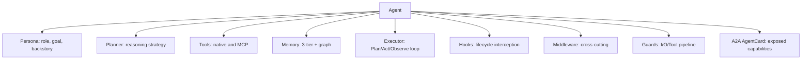
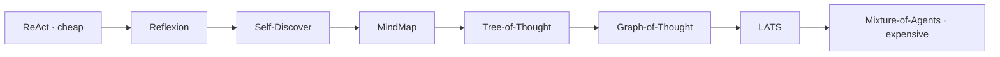
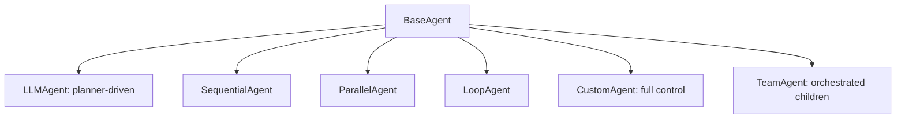
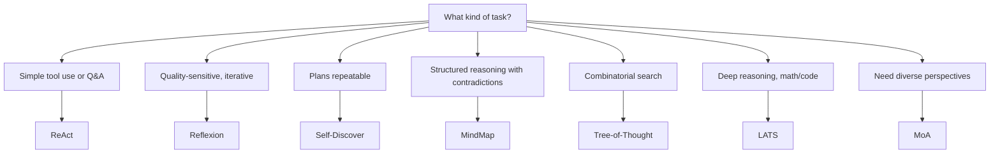

An agent is the atomic unit of behaviour in Beluga. It combines a persona, tools, a planner, memory, hooks, and middleware behind the `Agent` interface. Because teams implement the same interface, multi-agent systems are just recursive agent composition.

## Agent composition

Each agent is assembled from optional components wired around a common executor.

## Reasoning strategies

Beluga ships eight planners ordered from cheapest to most expensive. Every planner implements the same `Planner` interface, so switching is a one-line change.

| Strategy | LLM calls/turn | Best for |
|---|---|---|
| ReAct | 1 | Simple tool use, general tasks |
| Reflexion | 2–3 | Quality-sensitive, iterative improvement |
| Self-Discover | 2 | Cost-sensitive planning, reusable plans |
| MindMap | 2–4 | Structured reasoning with contradiction detection |
| Tree-of-Thought | 5–20 | Combinatorial search, puzzles |
| Graph-of-Thought | 5–20 | Reasoning with cycles and merging |
| LATS | 20–100 | Deep reasoning, math proofs, code synthesis |
| Mixture-of-Agents | 10–50 | Diverse perspectives, final ensemble |

## Composing agents

`BaseAgent` is an embeddable struct — every agent type derives from it. The type hierarchy shows the available subtypes:

`LLMAgent` drives the Plan/Act/Observe loop via a planner. `SequentialAgent`, `ParallelAgent`, and `LoopAgent` are deterministic workflow agents with no LLM reasoning. `CustomAgent` gives you full `Stream` control. `TeamAgent` delegates to an `OrchestrationPattern` to coordinate children.

## Picking a strategy

Use this decision tree to select the least expensive strategy that meets your quality bar.

Start with ReAct. Upgrade only when you have a measurable quality gap and a budget for more tokens. Never pick LATS for a use case that ReAct handles — the cost difference is 20–100×.

## Related

- [Reasoning Strategies (DOC-06)](../../../../../../architecture/06-reasoning-strategies.md)
- [Agent Anatomy (DOC-05)](../../../../../../architecture/05-agent-anatomy.md)
- [Orchestration](../orchestration/)
- [Memory System](../memory/memory-system)

TODO: expand this guide with full agent construction example, hooks reference, and handoff patterns.
