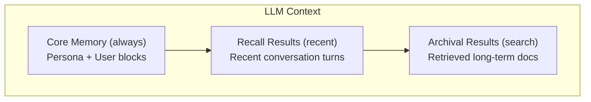

LLMs are stateless by default — every request starts with a blank slate. Without memory, an agent forgets everything the moment a conversation ends. Users must repeat their preferences, context gets lost across sessions, and the agent cannot build a long-term understanding of the people and topics it works with.

The `memory` package solves this with a **MemGPT-inspired 3-tier memory system**. [MemGPT](https://memgpt.ai/) (now Letta) is a research system that gives LLMs self-managed memory modeled after an operating system's memory hierarchy. Just as a CPU has registers (small, always available), RAM (larger, fast access), and disk (vast, searchable), an agent needs different memory tiers optimized for different access patterns and data volumes.

## Three-Tier Architecture

The memory system is organized into tiers that mirror a computer's memory hierarchy. Each tier serves a distinct purpose, and the system routes data to the appropriate tier based on access patterns and retention needs.

| Tier | Purpose | Analogy | Size |
|------|---------|---------|------|
| **Core** | Always in context — agent persona and user info | CPU registers (small, always available) | Small (< 2KB) |
| **Recall** | Searchable conversation history | RAM (recent, fast access) | Medium |
| **Archival** | Vector-based long-term storage | Disk (vast, searchable) | Unlimited |
| **Graph** | Entity-relationship knowledge | Relational index (structured connections) | Unlimited |



## The Memory Interface

All memory tiers implement the same `Memory` interface, which provides a uniform API for saving, loading, and searching across any backend. This consistency means you can swap memory implementations (in-memory for tests, Redis for production) without changing application code — the same registry pattern used throughout Beluga AI.

```go
type Memory interface {
	Save(ctx context.Context, input, output schema.Message) error
	Load(ctx context.Context, query string) ([]schema.Message, error)
	Search(ctx context.Context, query string, k int) ([]schema.Document, error)
	Clear(ctx context.Context) error
}
```

| Method | Purpose |
|--------|---------|
| `Save` | Persist an input/output message pair |
| `Load` | Retrieve relevant messages for a query |
| `Search` | Find documents in long-term storage |
| `Clear` | Reset all stored data |

## Core Memory

Core memory solves the problem of persistent identity: who is this agent, and who is it talking to? Like CPU registers that hold the most frequently accessed values, core memory blocks are always included in every LLM request. This makes them ideal for small, high-value data — the agent's persona and key facts about the current user — that should influence every response.

Because core memory is included in every context window, it must remain small (typically under 2KB). Storing large amounts of data here would waste token budget that should be used for conversation history and retrieved context.

```go
import "github.com/lookatitude/beluga-ai/memory"

core := memory.NewCore(memory.CoreConfig{
	PersonaLimit: 2000,  // Max chars for persona block
	HumanLimit:   2000,  // Max chars for human block
	SelfEditable: true,  // Agent can modify its own memory
})

// Set the persona block
err := core.SetPersona("I am a financial advisor specializing in retirement planning.")
if err != nil {
	log.Fatal(err)
}

// Set the human block (information about the user)
err = core.SetHuman("Name: Alice. Age: 35. Risk tolerance: moderate. Goal: retire at 60.")
if err != nil {
	log.Fatal(err)
}

// Core memory converts to system messages for the LLM
msgs := core.ToMessages()
// Returns:
//   [Persona] I am a financial advisor...
//   [Human] Name: Alice. Age: 35...
```

When `SelfEditable` is true, the agent can modify its persona and user blocks through tool calls, allowing it to update its own knowledge as conversations progress.

## Recall Memory

Recall memory addresses the problem of conversation continuity. Users expect agents to remember what was discussed in previous turns and sessions, but LLM context windows are finite. Recall memory stores the full conversation history in a searchable backend and retrieves the most relevant past messages for each new query. This is analogous to RAM — not everything fits in the context window at once, but recent and relevant data can be loaded quickly.

```go
recall := memory.NewRecall(memory.RecallConfig{
	Store:    store,     // A RecallStore backend
	MaxItems: 1000,      // Maximum messages to retain
})

// Save a conversation turn
err := recall.Save(ctx,
	schema.NewHumanMessage("What's my portfolio value?"),
	schema.NewAIMessage("Your portfolio is currently valued at $125,000."),
)

// Load recent messages relevant to a query
msgs, err := recall.Load(ctx, "portfolio")
```

## Archival Memory

Archival memory handles long-term knowledge that goes beyond conversation history. When a user mentions important facts — deadlines, preferences, project details — the agent needs to store these in a way that can be retrieved semantically months later. Archival memory uses vector embeddings for storage, enabling similarity search over arbitrary text. This is the "disk" tier: virtually unlimited capacity with content-addressable retrieval.

```go
archival := memory.NewArchival(memory.ArchivalConfig{
	Store:    archivalStore,  // An ArchivalStore backend
	Embedder: embedder,       // Embedding model for vector search
})

// Save information for long-term storage
err := archival.Save(ctx,
	schema.NewHumanMessage("Remember that my daughter Sarah starts college in 2028."),
	schema.NewAIMessage("I'll remember that."),
)

// Search long-term memory
docs, err := archival.Search(ctx, "when does Sarah start college", 5)
for _, doc := range docs {
	fmt.Println(doc.Content)
}
```

## Graph Memory

Vector similarity search excels at finding topically related content, but it cannot capture structured relationships between entities. If a user mentions "Bob manages the AI team at TechCorp," a vector search for "who works at TechCorp" might return that passage, but it cannot traverse the relationship graph to answer "who reports to Bob?" or "what teams exist at TechCorp?"

Graph memory solves this by extracting entities and relationships from conversations and storing them as nodes and edges in a graph database. This enables relationship traversal, multi-hop reasoning, and structured queries that pure vector search cannot support.

```go
graphMem := memory.NewGraph(memory.GraphConfig{
	Store: graphStore, // Neo4j or Memgraph backend
})

// Entities and relationships are extracted from conversations
// and stored as nodes and edges in the graph
err := graphMem.Save(ctx,
	schema.NewHumanMessage("My colleague Bob manages the AI team at TechCorp."),
	schema.NewAIMessage("Got it. Bob manages the AI team at TechCorp."),
)
```

## Composite Memory

In practice, agents need all memory tiers working together. Composite memory combines Core, Recall, Archival, and Graph into a single `Memory` implementation that dispatches operations to the appropriate tier. When you save a conversation turn, it is persisted to Recall for history, analyzed for archival-worthy facts, and scanned for entity relationships. When you load context for a query, composite memory aggregates results from all tiers into a unified context.

```go
composite := memory.NewComposite(memory.CompositeConfig{
	Core:     core,
	Recall:   recall,
	Archival: archival,
	Graph:    graphMem,
})

// Save dispatches to all tiers
err := composite.Save(ctx, input, output)

// Load aggregates from all tiers
msgs, err := composite.Load(ctx, "portfolio performance")

// Search focuses on archival tier
docs, err := composite.Search(ctx, "Sarah college", 5)
```

## Memory Store Providers

The memory system follows Beluga AI's registry pattern: storage backends are pluggable providers that register via `init()`. Import the provider you need with a blank identifier, and the `memory.New()` factory function handles instantiation. This lets you use in-memory stores during development and switch to Redis or PostgreSQL in production without changing application logic.

| Provider | Import Path | Tiers | Best For |
|----------|-------------|-------|----------|
| In-Memory | `memory/stores/inmemory` | Recall, Archival | Development, testing |
| Redis | `memory/stores/redis` | Recall, Archival | Fast, distributed |
| PostgreSQL | `memory/stores/postgres` | Recall, Archival | Relational, durable |
| SQLite | `memory/stores/sqlite` | Recall, Archival | Embedded, single-node |
| MongoDB | `memory/stores/mongodb` | Recall, Archival | Document-oriented |
| Neo4j | `memory/stores/neo4j` | Graph | Enterprise graph DB |
| Memgraph | `memory/stores/memgraph` | Graph | Lightweight graph DB |
| Dragonfly | `memory/stores/dragonfly` | Recall, Archival | Redis-compatible |

## Using Memory with Agents

The most common use case is wiring memory into an agent so that conversations are automatically persisted and recalled. The `WithMemory` option connects any `Memory` implementation to an agent. The agent then automatically saves each conversation turn after processing and loads relevant context before generating a response. From the user's perspective, the agent simply "remembers" across sessions.

```go
import (
	"github.com/lookatitude/beluga-ai/agent"
	"github.com/lookatitude/beluga-ai/memory"
	_ "github.com/lookatitude/beluga-ai/memory/stores/redis"
)

// Create Redis-backed memory
mem, err := memory.New("redis", memory.ProviderConfig{
	Options: map[string]any{
		"addr": "localhost:6379",
	},
})
if err != nil {
	log.Fatal(err)
}

// Create agent with persistent memory
a := agent.New("assistant",
	agent.WithLLM(model),
	agent.WithMemory(mem),
	agent.WithPersona(agent.Persona{
		Role: "personal assistant",
		Goal: "remember user preferences and provide personalized help",
	}),
)

// Conversations are automatically persisted
result, err := a.Invoke(ctx, "My name is Alice and I prefer dark mode.")
// Next conversation...
result, err = a.Invoke(ctx, "What are my preferences?")
// Agent recalls: "You prefer dark mode."
```

## Production Configuration

Production deployments require durable storage, connection pooling, and data lifecycle management. The following examples show common production configurations with TTL-based expiry (to comply with data retention policies) and connection pooling (to handle concurrent agent sessions).

### Redis with TTL

```go
mem, err := memory.New("redis", memory.ProviderConfig{
	Options: map[string]any{
		"addr":     "redis-cluster:6379",
		"password": os.Getenv("REDIS_PASSWORD"),
		"db":       0,
		"ttl":      "720h", // 30 days
	},
})
```

### PostgreSQL with Connection Pool

```go
mem, err := memory.New("postgres", memory.ProviderConfig{
	Options: map[string]any{
		"connection_string": os.Getenv("DATABASE_URL"),
		"max_connections":   20,
		"table_prefix":      "agent_memory_",
	},
})
```

## Memory Middleware

Memory middleware follows the same `func(T) T` pattern used throughout Beluga AI for composable behavior wrapping. Middleware can add logging, metrics, encryption, or access control around any memory implementation without modifying the underlying store. Middleware is applied outside-in: the last middleware in the list becomes the outermost wrapper.

```go
// Wrap memory with logging
mem = memory.ApplyMiddleware(mem,
	memory.WithLoggingMiddleware(logger),
)
```

## Memory Hooks

Hooks provide lifecycle observation without wrapping the memory implementation. Unlike middleware, which intercepts and potentially modifies behavior, hooks are for observation and auditing. Each hook field is optional — nil hooks are skipped with zero overhead.

```go
hooks := memory.Hooks{
	BeforeSave: func(ctx context.Context, input, output schema.Message) error {
		log.Println("Saving conversation turn")
		return nil
	},
	AfterLoad: func(ctx context.Context, msgs []schema.Message, err error) {
		log.Printf("Loaded %d messages from memory", len(msgs))
	},
}
```

## Next Steps

- [Building Your First Agent](/docs/guides/first-agent/) — Wire memory into an agent
- [RAG Pipeline](/docs/guides/rag-pipeline/) — Vector search for document retrieval
- [Safety & Guards](/docs/guides/safety-and-guards/) — Guard memory content
- [Deploying to Production](/docs/guides/deployment/) — Production memory backends
