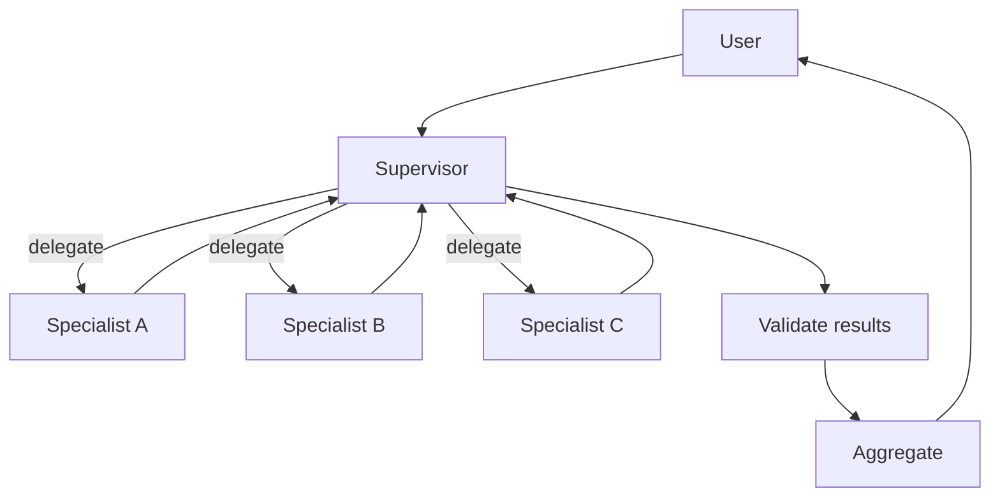
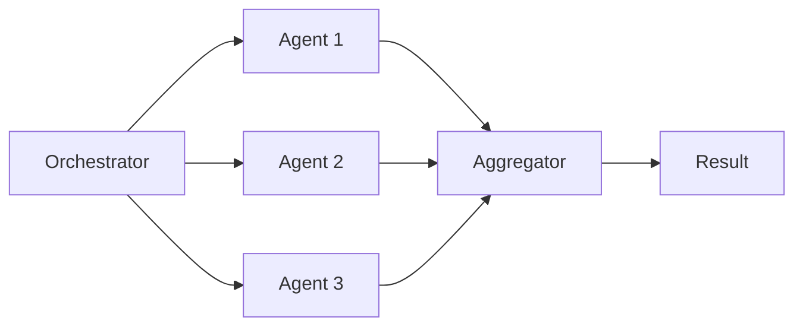
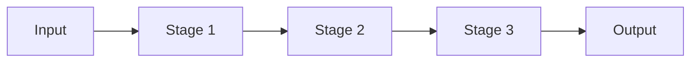
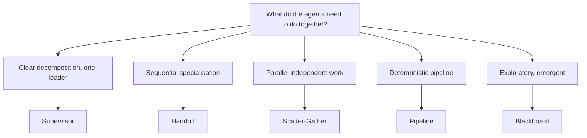

Beluga ships five orchestration patterns as implementations of the `OrchestrationPattern` interface. Because teams are themselves agents, patterns compose recursively — a team can be a member of a larger team with no special wiring.

## Supervisor

A central coordinator decomposes the task, delegates to specialists, validates results, and aggregates. Use when one agent has planning capability and the others have narrow expertise.

## Scatter-Gather

Fan the same input out to N agents in parallel, collect results, then aggregate. The aggregator is itself an agent that can vote, average, or synthesise a combined answer.

## Pipeline

Linear sequence where each stage's output becomes the next stage's input. Stages can be mixed (LLM agent, retrieval-only agent, tool-only agent).

## Picking a pattern

Start with Supervisor or Handoff. Use Scatter-Gather only when the agents genuinely work independently. Use Pipeline when stages are truly linear. Blackboard is powerful but hard to debug — use it last.

## Related

- [Orchestration Patterns (DOC-07)](../../../../../../architecture/07-orchestration-patterns.md)
- [Agent Anatomy (DOC-05)](../../../../../../architecture/05-agent-anatomy.md)
- [Multi-Agent Team guide](../agents/)

TODO: expand this guide with code examples for each pattern and the EventBus reference.
