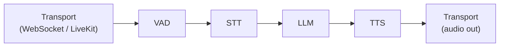

Voice AI transforms how users interact with agents — from typing and reading to speaking and listening. Building real-time voice applications requires careful architecture: audio data must flow through speech recognition, language model processing, and speech synthesis with minimal latency, while handling interruptions, silence detection, and transport-layer concerns like WebSocket connections and WebRTC media.

The `voice` package provides a **frame-based processing pipeline** for building these applications. The frame-based design, inspired by production systems like LiveKit Agents and Pipecat, treats audio as a stream of discrete frames flowing through linked processors. Each processor is a goroutine connected by buffered channels, enabling concurrent processing where STT, LLM, and TTS stages operate simultaneously on different parts of the audio stream. The target is sub-800ms end-to-end latency from user speech to agent response.

## Architecture



Three pipeline modes offer different trade-offs between latency and capability:

| Mode | Flow | Latency | Use Case |
|------|------|---------|----------|
| **Cascading** | STT → LLM → TTS | ~800ms | Full control, tool use, any LLM |
| **S2S** | Audio → Model → Audio | ~300ms | Ultra-low latency, native multimodal models only |
| **Hybrid** | S2S default, cascade fallback | ~300-800ms | Low latency by default, falls back to cascade when tools are needed |

**Cascading** converts speech to text, processes with any LLM, and synthesizes audio — the most flexible mode that works with all providers and supports tool use. **S2S** (Speech-to-Speech) uses models with native audio input/output (like GPT-4o Realtime) for the lowest possible latency, but limits you to S2S-capable models and does not support tool calls. **Hybrid** gets the best of both: S2S speed for conversational turns, with automatic cascade fallback when the agent needs to invoke tools.

## Core Concepts

### Frames

Frames are the atomic data unit flowing through the pipeline. Rather than passing entire audio files or complete transcripts, the pipeline operates on small, typed frames that represent discrete chunks of data. This frame-based approach enables low-latency streaming: TTS can begin synthesizing audio before the LLM has finished generating its full response, because each text frame is processed independently as it arrives.

```go
// Frame types
voice.FrameAudio   // Raw audio data (PCM, opus)
voice.FrameText    // Text (transcript, LLM output)
voice.FrameControl // Control signals (start, stop, interrupt)
voice.FrameImage   // Image/video for multimodal

// Create frames
audioFrame := voice.NewAudioFrame(pcmData, 16000) // 16kHz audio
textFrame := voice.NewTextFrame("Hello, world!")
controlFrame := voice.NewControlFrame(voice.SignalInterrupt)
```

### Frame Processors

Every pipeline stage implements the `FrameProcessor` interface — a single method that reads frames from an input channel, processes them, and writes results to an output channel. This uniform interface means all processors — VAD, STT, LLM, TTS, custom logic — are interchangeable and composable. A processor can filter frames, transform them, or generate new frames.

```go
type FrameProcessor interface {
	Process(ctx context.Context, in <-chan Frame, out chan<- Frame) error
}
```

Processors run as goroutines connected by buffered channels, enabling concurrent processing across pipeline stages.

### Chaining Processors

The `Chain` function links processors into a pipeline where the output channel of one stage becomes the input channel of the next. This declarative composition makes it easy to reconfigure the pipeline — add a new processing stage, remove one, or swap implementations — without modifying other stages.

```go
pipeline := voice.Chain(
	vadProcessor,
	sttProcessor,
	llmProcessor,
	ttsProcessor,
)

// Run the pipeline
err := pipeline.Process(ctx, audioIn, audioOut)
```

## Speech-to-Text (STT)

STT converts audio input into text that an LLM can process. Beluga AI supports both batch transcription (for pre-recorded audio) and streaming transcription (for real-time applications where interim results are displayed as the user speaks). Every STT provider follows the registry pattern: import with a blank identifier, create with `stt.New()`, and use as a standalone engine or as a `FrameProcessor` in a pipeline.

```go
import (
	"github.com/lookatitude/beluga-ai/voice/stt"
	_ "github.com/lookatitude/beluga-ai/voice/stt/providers/deepgram"
)

engine, err := stt.New("deepgram", stt.ProviderConfig{
	APIKey: os.Getenv("DEEPGRAM_API_KEY"),
	Model:  "nova-2",
})
if err != nil {
	log.Fatal(err)
}

// Batch transcription
text, err := engine.Transcribe(ctx, audioBytes,
	stt.WithLanguage("en-US"),
	stt.WithPunctuation(true),
)

// Streaming transcription
for event, err := range engine.TranscribeStream(ctx, audioStream) {
	if err != nil {
		log.Printf("STT error: %v", err)
		break
	}
	if event.IsFinal {
		fmt.Printf("Final: %s\n", event.Text)
	} else {
		fmt.Printf("Interim: %s\n", event.Text)
	}
}

// Use as FrameProcessor in a pipeline
sttProcessor := stt.AsFrameProcessor(engine, stt.WithLanguage("en-US"))
```

### STT Providers

| Provider | Import Path | Features |
|----------|-------------|----------|
| Deepgram | `voice/stt/providers/deepgram` | Real-time, diarization |
| Whisper | `voice/stt/providers/whisper` | OpenAI, offline-capable |
| AssemblyAI | `voice/stt/providers/assemblyai` | Universal model |
| Gladia | `voice/stt/providers/gladia` | Multi-language |
| ElevenLabs | `voice/stt/providers/elevenlabs` | Scribe model |
| Groq | `voice/stt/providers/groq` | Fast Whisper |

## Text-to-Speech (TTS)

TTS converts the LLM's text response into audio that the user hears. For real-time applications, streaming synthesis is essential: it begins generating audio as soon as the first text tokens arrive from the LLM, rather than waiting for the complete response. This pipelining is what makes sub-second response times possible — TTS starts synthesizing while the LLM is still generating.

```go
import (
	"github.com/lookatitude/beluga-ai/voice/tts"
	_ "github.com/lookatitude/beluga-ai/voice/tts/providers/elevenlabs"
)

engine, err := tts.New("elevenlabs", tts.ProviderConfig{
	APIKey: os.Getenv("ELEVENLABS_API_KEY"),
	Model:  "eleven_turbo_v2_5",
})
if err != nil {
	log.Fatal(err)
}

// Batch synthesis
audio, err := engine.Synthesize(ctx, "Hello, how can I help you today?",
	tts.WithVoice("rachel"),
)

// Streaming synthesis (low latency)
for chunk, err := range engine.SynthesizeStream(ctx, textStream) {
	if err != nil {
		break
	}
	// Play audio chunk immediately
	player.Write(chunk.Data)
}

// Use as FrameProcessor
ttsProcessor := tts.AsFrameProcessor(engine, tts.WithVoice("rachel"))
```

### TTS Providers

| Provider | Import Path | Features |
|----------|-------------|----------|
| ElevenLabs | `voice/tts/providers/elevenlabs` | Voice cloning, low latency |
| Cartesia | `voice/tts/providers/cartesia` | Sonic model, fast |
| PlayHT | `voice/tts/providers/playht` | Voice cloning |
| LMNT | `voice/tts/providers/lmnt` | Real-time streaming |
| Fish | `voice/tts/providers/fish` | Open-source |
| Smallest | `voice/tts/providers/smallest` | Lightweight |
| Groq | `voice/tts/providers/groq` | Fast synthesis |

## Speech-to-Speech (S2S)

Speech-to-Speech models process audio natively — they take audio input and produce audio output without an intermediate text stage. This eliminates the latency of separate STT and TTS steps, achieving response times as low as 300ms. The trade-off is that S2S models are currently available from fewer providers and do not support text-based tool calls. Use S2S when latency is the primary concern and tool use is not required.

```go
import (
	"github.com/lookatitude/beluga-ai/voice/s2s"
	_ "github.com/lookatitude/beluga-ai/voice/s2s/providers/openai"
)

engine, err := s2s.New("openai", s2s.ProviderConfig{
	APIKey: os.Getenv("OPENAI_API_KEY"),
	Model:  "gpt-4o-realtime",
})
if err != nil {
	log.Fatal(err)
}

// Process audio directly
for outFrame, err := range engine.Process(ctx, audioInStream) {
	if err != nil {
		break
	}
	transport.Send(outFrame)
}
```

### S2S Providers

| Provider | Import Path | Model |
|----------|-------------|-------|
| OpenAI | `voice/s2s/providers/openai` | GPT-4o Realtime |
| Amazon Nova | `voice/s2s/providers/nova` | Nova S2S |
| Google Gemini | `voice/s2s/providers/gemini` | Gemini Live |

## Voice Activity Detection (VAD)

VAD determines when the user is speaking and when they have stopped. This is critical for turn-taking: the pipeline should only process audio that contains speech, and it should detect end-of-utterance to trigger LLM processing. VAD also enables interruption handling — if the user starts speaking while the agent is responding, VAD detects the new speech and can signal the pipeline to stop the current output.

```go
import "github.com/lookatitude/beluga-ai/voice"

vad := voice.NewVAD(voice.VADConfig{
	Threshold:      0.5,  // Speech probability threshold
	MinSpeechDuration: 250 * time.Millisecond,
	MinSilenceDuration: 300 * time.Millisecond,
	Provider:       "silero", // or "webrtc"
})
```

### VAD Providers

| Provider | Type | Accuracy |
|----------|------|----------|
| Silero | Neural network | High |
| WebRTC | Energy-based | Fast, lower accuracy |

## Transport Layer

The transport layer handles the connection between the voice pipeline and the end user. It manages audio encoding/decoding, network protocols, and session lifecycle. Transports are pluggable providers, so the same pipeline logic works whether the user connects via a WebSocket from a browser, a WebRTC session through LiveKit, or a telephony integration through Daily.

```go
import (
	"github.com/lookatitude/beluga-ai/voice/transport"
	_ "github.com/lookatitude/beluga-ai/voice/transport/providers/livekit"
)

// WebSocket transport (built-in)
ws := transport.NewWebSocket(transport.WebSocketConfig{
	Addr: ":8080",
	Path: "/ws/voice",
})

// LiveKit transport
lk, err := transport.New("livekit", transport.ProviderConfig{
	Options: map[string]any{
		"url":    os.Getenv("LIVEKIT_URL"),
		"api_key": os.Getenv("LIVEKIT_API_KEY"),
		"secret":  os.Getenv("LIVEKIT_SECRET"),
	},
})
```

### Transport Providers

| Provider | Import Path | Type |
|----------|-------------|------|
| WebSocket | Built-in | Direct browser connection |
| LiveKit | `voice/transport/providers/livekit` | WebRTC SFU |
| Daily | `voice/transport/providers/daily` | WebRTC platform |
| Pipecat | `voice/transport/providers/pipecat` | Pipeline framework |

## Hybrid Pipeline

The hybrid pipeline provides the best balance of latency and capability. It uses S2S for normal conversational turns (achieving ~300ms latency) and automatically falls back to the cascading pipeline when the agent needs to invoke tools. This switching is transparent to the user — they experience fast responses for conversation and slightly longer responses when the agent is performing actions.

```go
hybrid := voice.NewHybridPipeline(voice.HybridConfig{
	S2SEngine:    s2sEngine,
	STT:          sttEngine,
	TTS:          ttsEngine,
	LLM:          model,
	FallbackOnToolUse: true, // Switch to cascade when tools needed
})
```

## Complete Voice Agent Example

The following example assembles a complete voice agent: Deepgram for STT, ElevenLabs for TTS, OpenAI for the LLM, Silero for VAD, and a WebSocket transport for browser connectivity. The pipeline processes audio in real-time: the user speaks into a browser, audio frames flow through VAD to STT to LLM to TTS, and synthesized audio is streamed back to the browser.

```go
package main

import (
	"context"
	"log"
	"os"

	"github.com/lookatitude/beluga-ai/llm"
	"github.com/lookatitude/beluga-ai/voice"
	"github.com/lookatitude/beluga-ai/voice/stt"
	"github.com/lookatitude/beluga-ai/voice/tts"
	"github.com/lookatitude/beluga-ai/voice/transport"

	_ "github.com/lookatitude/beluga-ai/llm/providers/openai"
	_ "github.com/lookatitude/beluga-ai/voice/stt/providers/deepgram"
	_ "github.com/lookatitude/beluga-ai/voice/tts/providers/elevenlabs"
)

func main() {
	ctx := context.Background()

	// Set up STT
	sttEngine, err := stt.New("deepgram", stt.ProviderConfig{
		APIKey: os.Getenv("DEEPGRAM_API_KEY"),
	})
	if err != nil {
		log.Fatal(err)
	}

	// Set up TTS
	ttsEngine, err := tts.New("elevenlabs", tts.ProviderConfig{
		APIKey: os.Getenv("ELEVENLABS_API_KEY"),
	})
	if err != nil {
		log.Fatal(err)
	}

	// Set up LLM
	model, err := llm.New("openai", llm.ProviderConfig{
		APIKey: os.Getenv("OPENAI_API_KEY"),
		Model:  "gpt-4o",
	})
	if err != nil {
		log.Fatal(err)
	}

	// Build pipeline
	pipe := voice.NewPipeline(
		voice.WithVAD(voice.NewVAD(voice.VADConfig{Provider: "silero"})),
		voice.WithSTT(stt.AsFrameProcessor(sttEngine)),
		voice.WithTTS(tts.AsFrameProcessor(ttsEngine)),
	)

	// Set up WebSocket transport
	ws := transport.NewWebSocket(transport.WebSocketConfig{
		Addr: ":8080",
		Path: "/ws/voice",
	})

	// Create voice session
	session := voice.NewSession(voice.SessionConfig{
		Pipeline:  pipe,
		Transport: ws,
		LLM:       model,
	})

	log.Println("Voice agent listening on :8080")
	if err := session.Run(ctx); err != nil {
		log.Fatal(err)
	}
}
```

## Latency Budget

Real-time voice applications have strict latency requirements — users perceive delays beyond ~1 second as unnatural. The following budget allocates time across pipeline stages. When optimizing, focus on the stages with the largest budgets (STT, LLM TTFT, TTS TTFB) as they offer the most room for improvement. Choosing providers with low-latency modes and deploying in regions close to your users are the highest-impact optimizations.

| Stage | Target | Description |
|-------|--------|-------------|
| Transport | < 50ms | WebSocket/WebRTC hop |
| VAD | < 1ms | Speech detection |
| STT | < 200ms | Transcription |
| LLM TTFT | < 300ms | First token latency |
| TTS TTFB | < 200ms | First audio byte |
| Return | < 50ms | Transport return |
| **Total** | **< 800ms** | End-to-end |

## Next Steps

- [Building Your First Agent](/docs/guides/first-agent/) — Combine voice with agent logic
- [Tools & MCP](/docs/guides/tools-and-mcp/) — Give voice agents tool access
- [Monitoring & Observability](/docs/guides/observability/) — Track voice pipeline latency
- [Deploying to Production](/docs/guides/deployment/) — Deploy voice agents at scale
