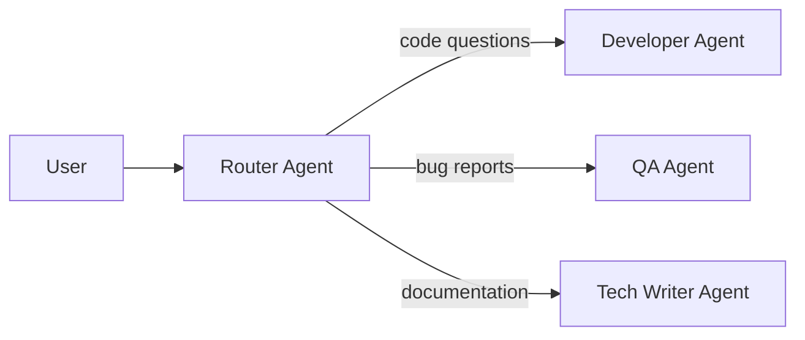
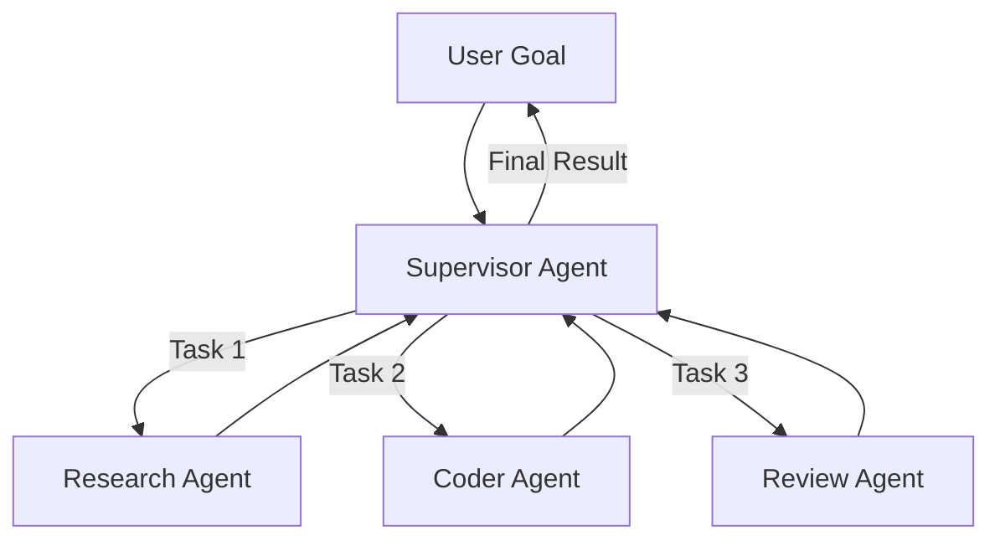
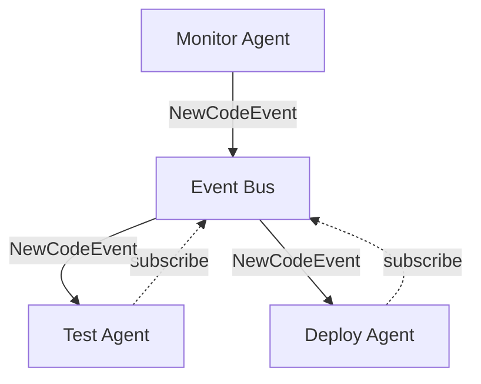

Single agents work well for focused, self-contained problems. But real-world tasks often require different types of expertise working together: a researcher gathers information, a writer drafts content, a reviewer checks quality. Multi-agent systems model this natural division of labor, letting each agent specialize while the system coordinates their collaboration.

Beluga AI provides three coordination patterns that address different tradeoffs between control, flexibility, and coupling. Choosing the right pattern depends on whether you need deterministic routing, dynamic goal decomposition, or fully decoupled event-driven communication.

## What You'll Learn

This guide covers:
- Understanding agent coordination patterns (Handoffs, Supervisor, Event Bus)
- Implementing agent-to-agent handoffs
- Building supervisor agents that delegate tasks
- Sharing state and memory between agents
- Handling errors and conflicts in multi-agent systems
- Monitoring and debugging agent interactions

## When to Use Multi-Agent Systems

A single agent with tools can handle many tasks, but multi-agent architectures become necessary when the problem naturally decomposes into distinct areas of expertise. Rather than overloading one agent with a massive system prompt and dozens of tools, you can give each agent a focused role with its own prompt and toolset, which improves both reliability and maintainability.

Multi-agent architectures excel at:
- **Complex workflows** requiring different specialized skills (research + writing + review)
- **Parallel execution** where agents can work simultaneously on independent subtasks
- **Domain separation** where each agent has distinct expertise and a focused tool set
- **Scalability** when workload can be distributed across agents with different resource profiles
- **Human-like teams** that mirror organizational structures (PM, Dev, QA) for intuitive decomposition

## Prerequisites

Before starting this guide:
- Complete [Building Your First Agent](/guides/first-agent)
- Understand agent state and memory
- Familiarity with Go concurrency patterns

## Agent Coordination Patterns

Beluga AI supports three primary multi-agent patterns, each suited to different coordination needs:

### Pattern 1: Handoffs (Router)

The handoff pattern uses a routing agent that classifies incoming requests and transfers control to the appropriate specialist. This is the simplest multi-agent pattern and works well when request types map cleanly to specific agents.

Handoffs are implemented as tools because the LLM already understands how to call tools. By representing agent transfers as `transfer_to_{name}` tool calls, the model can decide when and where to route a conversation using the same mechanism it uses for any other tool. This means no new concepts or special-purpose routing logic is needed.



**Use when:** You have distinct request types that map to specific agents, and classification is straightforward.

### Pattern 2: Supervisor (Manager)

The supervisor pattern models how a project manager works: it receives a complex goal, breaks it into concrete tasks, delegates each task to a specialist worker, and synthesizes the results into a coherent response. This pattern is essential when a single request requires multiple steps with dependencies between them.

The supervisor uses LLM reasoning to create the task plan, which means it can adapt to novel goals without hardcoded routing rules. The tradeoff is higher latency and token usage, since the planning step itself requires an LLM call.



**Use when:** Complex goals require decomposition into subtasks with dependencies, and execution order matters.

### Pattern 3: Event Bus (Autonomous)

The event bus pattern decouples agents entirely. Instead of one agent calling another directly, agents publish events and subscribe to event types they care about. This enables fully asynchronous, reactive workflows where agents operate independently.

The tradeoff is coordination complexity: since no central agent orchestrates the workflow, you need careful event schema design to avoid missed events, circular triggers, or race conditions. Event-driven systems work best for monitoring, CI/CD pipelines, and other scenarios where agents react to state changes rather than following a predetermined plan.



**Use when:** Agents need loose coupling, asynchronous communication, and independent operation without central coordination.

## Implementing Agent Handoffs

Handoffs transfer control from one agent to another. The receiving agent gets the conversation context from the sender, allowing it to continue the interaction seamlessly. The following example demonstrates a manual router that classifies requests and dispatches to specialist agents.

In Beluga v2, agents are created with `agent.New()` and configured through functional options. The LLM is initialized through the registry pattern with `llm.New()`, which looks up the registered provider by name.

```go
package main

import (
    "context"
    "fmt"
    "log"
    "os"
    "strings"

    "github.com/lookatitude/beluga-ai/agent"
    "github.com/lookatitude/beluga-ai/llm"
    "github.com/lookatitude/beluga-ai/schema"
    _ "github.com/lookatitude/beluga-ai/llm/providers/openai"
)

// Create specialized agents with distinct roles and tool sets.
// Each agent has a focused system prompt that defines its expertise,
// preventing the confusion that arises from overloading a single agent.
func CreateAgents(ctx context.Context, model llm.ChatModel) map[string]agent.Agent {
    // Developer Agent
    devAgent := agent.New(
        "developer",
        agent.WithLLM(model),
        agent.WithSystemPrompt("You are an expert Go developer. Write clean, idiomatic code with proper error handling."),
        agent.WithTools([]schema.Tool{
            createCodeSearchTool(),
            createRunTestsTool(),
        }),
    )

    // QA Agent
    qaAgent := agent.New(
        "qa",
        agent.WithLLM(model),
        agent.WithSystemPrompt("You are a QA engineer. Review code for bugs, security issues, and best practices."),
        agent.WithTools([]schema.Tool{
            createStaticAnalysisTool(),
            createSecurityScanTool(),
        }),
    )

    // Tech Writer Agent
    writerAgent := agent.New(
        "tech_writer",
        agent.WithLLM(model),
        agent.WithSystemPrompt("You are a technical writer. Create clear, concise documentation."),
    )

    return map[string]agent.Agent{
        "dev":    devAgent,
        "qa":     qaAgent,
        "writer": writerAgent,
    }
}

// RouterAgent classifies incoming requests using the LLM and dispatches
// to the appropriate specialist. This pattern keeps routing logic simple
// while allowing the LLM to handle ambiguous or overlapping categories.
type RouterAgent struct {
    classifier llm.ChatModel
    agents     map[string]agent.Agent
}

func NewRouterAgent(model llm.ChatModel, agents map[string]agent.Agent) *RouterAgent {
    return &RouterAgent{
        classifier: model,
        agents:     agents,
    }
}

func (r *RouterAgent) Route(ctx context.Context, request string) (string, error) {
    // Classify the request
    category, err := r.classifyRequest(ctx, request)
    if err != nil {
        return "", fmt.Errorf("classification failed: %w", err)
    }

    // Hand off to appropriate agent
    a, ok := r.agents[category]
    if !ok {
        return "", fmt.Errorf("no agent for category: %s", category)
    }

    resp, err := a.Invoke(ctx, request)
    if err != nil {
        return "", fmt.Errorf("agent execution failed: %w", err)
    }

    return resp.Text(), nil
}

func (r *RouterAgent) classifyRequest(ctx context.Context, request string) (string, error) {
    messages := []schema.Message{
        schema.NewSystemMessage(`Classify user requests into categories:
- "dev": Code questions, implementation requests, debugging
- "qa": Bug reports, test requests, code review
- "writer": Documentation requests, explanations

Respond with only the category name.`),
        schema.NewHumanMessage(request),
    }

    resp, err := r.classifier.Generate(ctx, messages,
        llm.WithTemperature(0.0),
        llm.WithMaxTokens(10),
    )
    if err != nil {
        return "", err
    }

    return strings.TrimSpace(resp.Text()), nil
}

func main() {
    ctx := context.Background()

    // Initialize the LLM through the registry pattern. The openai provider
    // was registered via its init() function in the blank import above.
    model, err := llm.New("openai", llm.ProviderConfig{
        APIKey: os.Getenv("OPENAI_API_KEY"),
        Model:  "gpt-4o",
    })
    if err != nil {
        log.Fatal(err)
    }

    // Create specialist agents
    specialists := CreateAgents(ctx, model)

    // Create router
    router := NewRouterAgent(model, specialists)

    // Route requests
    requests := []string{
        "Write a function to parse JSON",
        "Review this code for security issues",
        "Explain how HTTP middleware works",
    }

    for _, req := range requests {
        fmt.Printf("\nRequest: %s\n", req)
        response, err := router.Route(ctx, req)
        if err != nil {
            log.Printf("Error: %v", err)
            continue
        }
        fmt.Printf("Response: %s\n", response)
    }
}
```

## Building a Supervisor Agent

The supervisor pattern is the most powerful multi-agent coordination model. It mirrors how effective project managers work: decompose a complex goal into concrete tasks, identify dependencies between them, delegate each task to the right specialist, and synthesize individual results into a coherent final output.

This pattern uses LLM reasoning for planning, which means the supervisor can handle novel goals without predefined routing rules. The tradeoff is additional latency from the planning step, but for complex tasks this is typically a worthwhile investment since it produces better-coordinated results than ad-hoc routing.

```go
type SupervisorAgent struct {
    planner llm.ChatModel
    workers map[string]agent.Agent
}

type Task struct {
    ID          string
    Type        string // "research", "code", "review"
    Description string
    Dependencies []string // Task IDs that must complete first
    Status      string   // "pending", "running", "complete", "failed"
    Result      string
}

func NewSupervisorAgent(model llm.ChatModel, workers map[string]agent.Agent) *SupervisorAgent {
    return &SupervisorAgent{
        planner: model,
        workers: workers,
    }
}

func (s *SupervisorAgent) Execute(ctx context.Context, goal string) (string, error) {
    // Step 1: Create plan
    tasks, err := s.createPlan(ctx, goal)
    if err != nil {
        return "", fmt.Errorf("planning failed: %w", err)
    }

    fmt.Printf("Created plan with %d tasks\n", len(tasks))

    // Step 2: Execute tasks respecting dependencies
    results, err := s.executeTasks(ctx, tasks)
    if err != nil {
        return "", fmt.Errorf("execution failed: %w", err)
    }

    // Step 3: Synthesize final result
    finalResult, err := s.synthesizeResults(ctx, goal, results)
    if err != nil {
        return "", fmt.Errorf("synthesis failed: %w", err)
    }

    return finalResult, nil
}

func (s *SupervisorAgent) createPlan(ctx context.Context, goal string) ([]Task, error) {
    messages := []schema.Message{
        schema.NewSystemMessage(`You are a planning expert. Break down goals into concrete tasks.
Available agents: research, coder, reviewer
Output format: JSON array of tasks with id, type, description, dependencies`),
        schema.NewHumanMessage(fmt.Sprintf("Goal: %s\n\nCreate a task plan:", goal)),
    }

    resp, err := s.planner.Generate(ctx, messages,
        llm.WithTemperature(0.3),
    )
    if err != nil {
        return nil, err
    }

    // Parse task plan from JSON
    var tasks []Task
    if err := json.Unmarshal([]byte(resp.Text()), &tasks); err != nil {
        return nil, fmt.Errorf("parse plan: %w", err)
    }

    // Initialize task status
    for i := range tasks {
        tasks[i].Status = "pending"
    }

    return tasks, nil
}

func (s *SupervisorAgent) executeTasks(ctx context.Context, tasks []Task) (map[string]string, error) {
    results := make(map[string]string)
    completed := make(map[string]bool)

    // Execute tasks in dependency order
    for len(completed) < len(tasks) {
        progress := false

        for i := range tasks {
            task := &tasks[i]

            // Skip if already completed
            if completed[task.ID] {
                continue
            }

            // Check if dependencies are met
            if !s.dependenciesMet(task, completed) {
                continue
            }

            // Execute task
            fmt.Printf("Executing task: %s (%s)\n", task.ID, task.Type)
            task.Status = "running"

            worker, ok := s.workers[task.Type]
            if !ok {
                task.Status = "failed"
                return nil, fmt.Errorf("no worker for task type: %s", task.Type)
            }

            // Build context from previous results
            taskCtx := s.buildTaskContext(task, results)

            resp, err := worker.Invoke(ctx, taskCtx)
            if err != nil {
                task.Status = "failed"
                return nil, fmt.Errorf("task %s failed: %w", task.ID, err)
            }

            task.Result = resp.Text()
            task.Status = "complete"
            results[task.ID] = resp.Text()
            completed[task.ID] = true
            progress = true

            fmt.Printf("Task %s completed\n", task.ID)
        }

        // Detect deadlock
        if !progress {
            return nil, fmt.Errorf("execution deadlock: unresolved dependencies")
        }
    }

    return results, nil
}

func (s *SupervisorAgent) dependenciesMet(task *Task, completed map[string]bool) bool {
    for _, depID := range task.Dependencies {
        if !completed[depID] {
            return false
        }
    }
    return true
}

func (s *SupervisorAgent) buildTaskContext(task *Task, results map[string]string) string {
    var context strings.Builder
    context.WriteString(task.Description)
    context.WriteString("\n\nContext from previous tasks:\n")

    for _, depID := range task.Dependencies {
        if result, ok := results[depID]; ok {
            context.WriteString(fmt.Sprintf("\n[%s]: %s\n", depID, result))
        }
    }

    return context.String()
}

func (s *SupervisorAgent) synthesizeResults(ctx context.Context, goal string, results map[string]string) (string, error) {
    var allResults strings.Builder
    for taskID, result := range results {
        allResults.WriteString(fmt.Sprintf("\n[%s]:\n%s\n", taskID, result))
    }

    messages := []schema.Message{
        schema.NewSystemMessage("Synthesize task results into a coherent final response."),
        schema.NewHumanMessage(fmt.Sprintf(
            "Original goal: %s\n\nTask results:%s\n\nFinal synthesis:",
            goal,
            allResults.String(),
        )),
    }

    resp, err := s.planner.Generate(ctx, messages)
    if err != nil {
        return "", err
    }

    return resp.Text(), nil
}
```

## Shared State and Memory

When agents collaborate on a task, they need shared context to avoid duplicating work and to build on each other's findings. Beluga's memory system supports this by allowing multiple agents to read from and write to the same memory store. Changes made by one agent become immediately visible to all other agents sharing that store.

This is particularly important in supervisor workflows where a research agent's findings inform a coding agent's implementation, or in long-running conversations where context from early interactions needs to persist across agent handoffs.

```go
import (
    "github.com/lookatitude/beluga-ai/memory"
    "github.com/lookatitude/beluga-ai/memory/stores"
)

// Create shared memory store backed by Redis for persistence
// across restarts and horizontal scaling.
func CreateSharedMemory() (*memory.CoreMemory, error) {
    store := stores.NewRedisStore(&stores.RedisConfig{
        Addr: "localhost:6379",
    })

    return memory.NewCoreMemory(
        memory.WithStore(store),
        memory.WithMaxContextTokens(4000),
    ), nil
}

// Both agents receive the same memory instance, so conversation
// history and context are shared. The dev agent can see what the
// QA agent discussed, and vice versa.
func SetupAgentsWithSharedMemory(ctx context.Context, model llm.ChatModel) {
    sharedMem, _ := CreateSharedMemory()

    devAgent := agent.New("dev",
        agent.WithLLM(model),
        agent.WithMemory(sharedMem),
    )

    qaAgent := agent.New("qa",
        agent.WithLLM(model),
        agent.WithMemory(sharedMem), // Same memory instance
    )

    // Both agents can see each other's conversation history
}
```

## Event-Driven Communication

The event bus pattern provides the loosest coupling between agents. Instead of direct calls, agents publish events to named topics and subscribe to the topics they care about. This enables reactive architectures where agents respond to state changes autonomously.

The key tradeoff with event-driven communication is between flexibility and predictability. You gain the ability to add new agents without modifying existing ones (just subscribe to the relevant topics), but you lose the explicit control flow that handoffs and supervisors provide. Event ordering, duplicate delivery, and backpressure all become concerns that must be handled in your event bus implementation.

The buffered channel in the `Subscribe` method below provides basic backpressure: if a subscriber falls behind, new events are dropped rather than blocking the publisher. For production systems, consider a persistent message broker like NATS or Redis Streams.

```go
type EventBus struct {
    subscribers map[string][]chan Event
    mu          sync.RWMutex
}

type Event struct {
    Type      string
    AgentID   string
    Payload   interface{}
    Timestamp time.Time
}

func NewEventBus() *EventBus {
    return &EventBus{
        subscribers: make(map[string][]chan Event),
    }
}

func (eb *EventBus) Subscribe(eventType string) <-chan Event {
    eb.mu.Lock()
    defer eb.mu.Unlock()

    ch := make(chan Event, 10)
    eb.subscribers[eventType] = append(eb.subscribers[eventType], ch)
    return ch
}

func (eb *EventBus) Publish(event Event) {
    eb.mu.RLock()
    defer eb.mu.RUnlock()

    for _, ch := range eb.subscribers[event.Type] {
        select {
        case ch <- event:
        default:
            // Skip if subscriber is slow
        }
    }
}

// Agent that publishes events
type EventPublishingAgent struct {
    *agent.BaseAgent
    bus *EventBus
}

func (a *EventPublishingAgent) Run(ctx context.Context, input string) (string, error) {
    // Do work
    resp, err := a.BaseAgent.Invoke(ctx, input)
    if err != nil {
        return "", err
    }

    // Publish completion event
    a.bus.Publish(Event{
        Type:      "task.completed",
        AgentID:   a.Name(),
        Payload:   resp.Text(),
        Timestamp: time.Now(),
    })

    return resp.Text(), nil
}

// Agent that reacts to events. This goroutine listens for task completion
// events and triggers follow-up processing. The context controls the
// listener's lifetime.
func StartReactiveAgent(ctx context.Context, a agent.Agent, bus *EventBus) {
    events := bus.Subscribe("task.completed")

    go func() {
        for {
            select {
            case <-ctx.Done():
                return
            case event := <-events:
                // React to event
                fmt.Printf("Agent reacting to event from %s\n", event.AgentID)

                resp, _ := a.Invoke(ctx, fmt.Sprintf("Process: %v", event.Payload))
                fmt.Printf("Reaction result: %s\n", resp.Text())
            }
        }
    }()
}
```

## Error Handling and Conflict Resolution

Multi-agent systems amplify the error-handling challenges of single agents. When one agent in a pipeline fails, the system must decide whether to retry, skip, or abort the entire workflow. When multiple agents produce conflicting outputs, the system needs a strategy to resolve the disagreement.

Beluga uses typed errors with `IsRetryable()` checks to distinguish transient failures (network timeouts, rate limits) from permanent ones (invalid input, missing permissions). This distinction is critical for multi-agent systems because retrying a permanently failing task wastes tokens and time, while giving up on a transiently failing task loses work unnecessarily.

```go
type AgentError struct {
    AgentID string
    Err     error
    Retry   bool
}

func (s *SupervisorAgent) ExecuteWithErrorHandling(ctx context.Context, goal string) (string, error) {
    maxRetries := 3

    for attempt := 1; attempt <= maxRetries; attempt++ {
        result, err := s.Execute(ctx, goal)

        if err == nil {
            return result, nil
        }

        // Check if error is retryable
        var agentErr *AgentError
        if errors.As(err, &agentErr) {
            if !agentErr.Retry {
                return "", fmt.Errorf("non-retryable error: %w", err)
            }

            fmt.Printf("Attempt %d failed, retrying...\n", attempt)

            // Exponential backoff
            time.Sleep(time.Duration(math.Pow(2, float64(attempt-1))) * time.Second)
            continue
        }

        return "", err
    }

    return "", fmt.Errorf("execution failed after %d attempts", maxRetries)
}

// Conflict resolution when agents disagree. An arbiter LLM evaluates
// multiple responses and either selects the best one or synthesizes
// a better answer from the combined inputs.
func ResolveConflict(ctx context.Context, arbiter llm.ChatModel, responses []string) (string, error) {
    var responseList strings.Builder
    for i, resp := range responses {
        responseList.WriteString(fmt.Sprintf("\nAgent %d: %s\n", i+1, resp))
    }

    messages := []schema.Message{
        schema.NewSystemMessage("You are an arbiter. Multiple agents provided different answers. Choose the best one or synthesize a better answer."),
        schema.NewHumanMessage(fmt.Sprintf("Responses:%s\n\nBest answer:", responseList.String())),
    }

    resolution, err := arbiter.Generate(ctx, messages)
    if err != nil {
        return "", err
    }

    return resolution.Text(), nil
}
```

## Monitoring and Debugging

Observability is critical in multi-agent systems because failures can cascade across agent boundaries in ways that are difficult to diagnose from logs alone. Distributed tracing connects the full execution path: from the initial user request, through the supervisor's planning step, into each worker agent's execution, and back through result synthesis.

By annotating each agent's work as a child span of the supervisor's span, you can see the entire workflow in a single trace view. This makes it straightforward to identify which agent failed, how long each step took, and whether dependency ordering caused unnecessary serialization.

```go
import (
    "github.com/lookatitude/beluga-ai/o11y"
    "go.opentelemetry.io/otel/trace"
)

func (s *SupervisorAgent) ExecuteWithTracing(ctx context.Context, goal string) (string, error) {
    tracer := otel.Tracer("beluga.agents.supervisor")

    ctx, span := tracer.Start(ctx, "supervisor.execute",
        trace.WithAttributes(
            attribute.String("goal", goal),
        ),
    )
    defer span.End()

    // Create plan
    ctx, planSpan := tracer.Start(ctx, "supervisor.plan")
    tasks, err := s.createPlan(ctx, goal)
    planSpan.SetAttributes(attribute.Int("task_count", len(tasks)))
    planSpan.End()

    if err != nil {
        span.RecordError(err)
        return "", err
    }

    // Execute each task in a traced span
    for i, task := range tasks {
        ctx, taskSpan := tracer.Start(ctx, "supervisor.execute_task",
            trace.WithAttributes(
                attribute.String("task.id", task.ID),
                attribute.String("task.type", task.Type),
                attribute.Int("task.index", i),
            ),
        )

        // Execute...

        taskSpan.SetAttributes(attribute.String("task.status", task.Status))
        taskSpan.End()
    }

    // Synthesize
    result, err := s.synthesizeResults(ctx, goal, results)
    if err != nil {
        span.RecordError(err)
        return "", err
    }

    span.SetAttributes(attribute.Int("result_length", len(result)))
    return result, nil
}
```

## Production Best Practices

When deploying multi-agent systems, the complexity of coordination means that problems which are minor in single-agent setups can become critical failures:

1. **Define clear responsibilities** for each agent to avoid overlap. Ambiguous boundaries lead to duplicated work or dropped tasks.
2. **Implement timeouts** on every agent invocation to prevent hung agents from blocking the entire pipeline.
3. **Use circuit breakers** to isolate failing agents. If one specialist consistently fails, the system should degrade gracefully rather than retrying indefinitely.
4. **Monitor agent performance** individually. Track latency, token usage, and error rates per agent to identify bottlenecks.
5. **Version agent prompts** so you can correlate behavior changes with prompt updates.
6. **Test handoff scenarios** thoroughly, including edge cases where classification is ambiguous or the target agent is unavailable.
7. **Implement graceful degradation** so the system can provide partial results when some agents fail rather than returning nothing.
8. **Log all agent interactions** with trace correlation so you can reconstruct the full workflow during debugging.

## Next Steps

Now that you understand multi-agent systems:
- Learn about [Orchestration & Workflows](/guides/production/orchestration/) for deterministic and durable workflow patterns
- Explore [Memory System](/guides/memory-system/) for advanced shared state across agents
- Read [Observability](/guides/production/observability/) for monitoring agent teams with distributed tracing
- Check [Safety & Guards](/guides/production/safety-and-guards/) for protecting multi-agent pipelines
