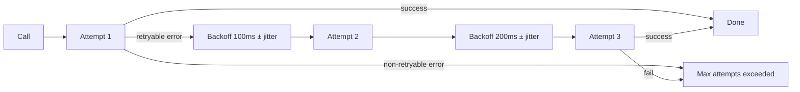
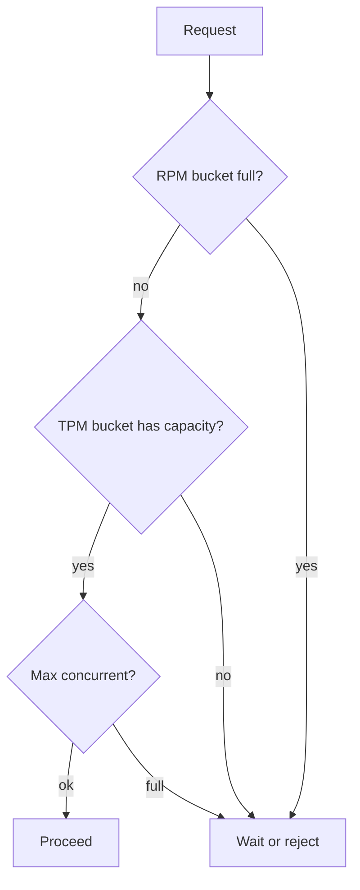
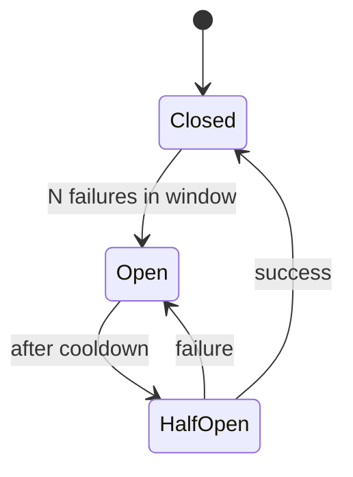

# Resilience

Resilience in Beluga is implemented as middleware on the same `func(T) T` signature that wraps every extensible interface. Circuit breakers, retry, rate limiting, and timeouts compose by function application — there is no special infrastructure to deploy.

## The pattern

Every Layer 3 capability package (`llm`, `tool`, `memory`, `rag/*`, `voice/*`, `guard`, `workflow`, `server`, `cache`, `auth`, `state`) ships an `ApplyMiddleware()` helper that wraps a base instance:

```go
import (
    _ "github.com/lookatitude/beluga-ai/llm/providers/anthropic"

    "github.com/lookatitude/beluga-ai/core"
    "github.com/lookatitude/beluga-ai/llm"
)

base, err := llm.New("anthropic", llm.Config{Model: "claude-sonnet-4-6"})
if err != nil {
    panic(err)
}

resilient := llm.ApplyMiddleware(base,
    llm.WithRateLimit(60, 150_000), // 60 req/min, 150k tok/min
    llm.WithRetry(3),               // honors core.IsRetryable()
    llm.WithCircuitBreaker(llm.CircuitBreakerConfig{
        FailureThreshold: 5,
        ResetTimeout:     30 * time.Second,
    }),
    llm.WithTimeout(20*time.Second),
)
```

## How retry decides what to retry



Beluga errors carry a typed `ErrorCode`. The retry middleware calls `core.IsRetryable(err)` before re-running a call. Retryable codes include:

- `core.ErrCodeRateLimit` — provider rate-limited the request
- `core.ErrCodeUnavailable` — transient upstream failure
- `core.ErrCodeTimeout` — the call exceeded its deadline
- `core.ErrCodeNetwork` — network-layer failure

Non-retryable errors (`ErrCodeInvalid`, `ErrCodePermissionDenied`, `ErrCodeNotFound`) propagate immediately. See [Errors](/docs/concepts/errors/) for the full model.

## Rate limiting



Three buckets per provider: **RPM** (requests per minute), **TPM** (tokens per minute), **MaxConcurrent** (simultaneous in-flight calls). Different providers gate on different things — the limiter takes the tightest constraint. Beluga's rate limiter is token-aware where the upstream API exposes token budgets.

## Circuit breakers



Three states: **Closed** (normal, calls pass through), **Open** (fail fast without calling the underlying service), **Half-Open** (cooldown elapsed; one probe call decides whether to close or re-open). The breaker tracks consecutive failures across a window and prevents a degraded provider from cascading slow failures upstream.

Circuit breakers operate per-instance, not per-process. Wrapping the same base provider in two different middleware chains gives two independent breakers — useful when one chain has lower latency budget than another.

## Composing with other middleware

Resilience composes with observability, guardrails, and cost tracking. Read outside-in:

```go
model := llm.ApplyMiddleware(base,
    llm.WithGuardrails(guardPipeline),
    llm.WithTracing(),               // gen_ai.* OTel spans
    llm.WithCostTracking(costCenter),
    llm.WithRateLimit(60, 150_000),
    llm.WithRetry(3),
)
```

The first middleware in the slice wraps the outside. Calls flow inward through guardrails → tracing → cost → rate limit → retry → base.

## Related

- [Observability](/docs/guides/production/observability/) — wire OTel exporters
- [Errors](/docs/concepts/errors/) — the typed error model
- [Extensibility](/docs/concepts/extensibility/) — the four-ring composition model
