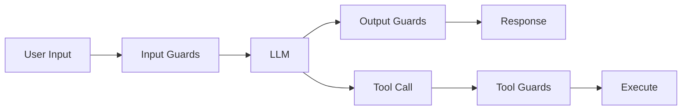

AI applications face safety challenges at every stage of the request lifecycle. Malicious users may attempt prompt injection to override system instructions. Models may produce responses containing personally identifiable information (PII) or harmful content. Tool calls may target sensitive operations that require human oversight. The `guard` and `hitl` packages provide a comprehensive safety layer that addresses each of these concerns at the appropriate pipeline stage.

## Three-Stage Guard Pipeline

The guard system uses a defense-in-depth strategy with three validation stages, each positioned at a critical boundary in the agent lifecycle. This three-stage approach ensures that unsafe content is caught as early as possible while still providing defense at later stages for content that passes through.

- **Input guards** run before the LLM call, catching prompt injection attempts and invalid input before they consume tokens or influence model behavior.
- **Output guards** run after the LLM responds, validating and sanitizing the response before it reaches the user. This is where PII redaction and content filtering happen.
- **Tool guards** run before tool execution, validating arguments and confirming that the requested operation is safe to perform.



| Stage | Validates | Purpose |
|-------|-----------|---------|
| **Input** | User messages | Block prompt injection, validate format, enforce length limits |
| **Output** | Model responses | Redact PII, filter harmful content, enforce compliance rules |
| **Tool** | Tool arguments | Validate parameters, check permissions, confirm destructive operations |

## The Guard Interface

Every guard implements the same interface, which makes guards composable and interchangeable. You can combine built-in guards with custom domain-specific guards in the same pipeline, and they all participate in the same validation flow.

```go
type Guard interface {
	Name() string
	Validate(ctx context.Context, input GuardInput) (GuardResult, error)
}
```

`GuardResult` indicates whether content is allowed, optionally provides a modified version (for redaction), and explains blocking reasons for auditability:

```go
type GuardResult struct {
	Allowed   bool   // True if content passes validation
	Reason    string // Why it was blocked or modified
	Modified  string // Optional sanitized version
	GuardName string // Which guard produced this result
}
```

## Building a Guard Pipeline

The pipeline constructor accepts guards grouped by stage. Guards within each stage execute in order, and the first guard that blocks content short-circuits the remaining guards in that stage. This ordering matters: place the cheapest, most common checks first to avoid unnecessary work.

```go
import "github.com/lookatitude/beluga-ai/guard"

pipeline := guard.NewPipeline(
	guard.Input(
		guard.NewPromptInjectionDetector(),
		guard.NewContentFilter(),
	),
	guard.Output(
		guard.NewPIIRedactor(guard.DefaultPIIPatterns...),
	),
	guard.Tool(
		guard.NewToolValidator(),
	),
)

// Validate user input
result, err := pipeline.ValidateInput(ctx, "Tell me about security")
if err != nil {
	log.Fatal(err)
}
if !result.Allowed {
	fmt.Printf("Blocked: %s (by %s)\n", result.Reason, result.GuardName)
	return
}

// Validate model output before sending to user
result, err = pipeline.ValidateOutput(ctx, modelResponse)
if result.Modified != "" {
	modelResponse = result.Modified // Use sanitized version
}
```

## Built-in Guards

### Prompt Injection Detection

Prompt injection is the most common attack vector against LLM applications. Attackers embed instructions in user input that attempt to override the system prompt, causing the model to ignore its original instructions. The injection detector analyzes input for known patterns and returns a confidence score. Content above the threshold is blocked.

```go
injectionGuard := guard.NewPromptInjectionDetector(
	guard.WithInjectionThreshold(0.7),
)

result, err := injectionGuard.Validate(ctx, guard.GuardInput{
	Content: userMessage,
	Role:    "input",
})
if !result.Allowed {
	// Prompt injection detected
}
```

### PII Redaction

Models may inadvertently include PII in their responses, either by echoing user-provided data or generating plausible-looking personal information. The PII redactor scans output for patterns matching common PII types and replaces them with redaction markers.

Pattern ordering matters in PII detection. Credit card patterns are evaluated before phone number patterns because a 16-digit credit card number could partially match a phone number regex, leading to incomplete redaction. By checking credit cards first, the more specific pattern matches before the broader one has a chance to produce a false partial match.

```go
piiGuard := guard.NewPIIRedactor(
	guard.PIIPatternEmail,
	guard.PIIPatternPhone,
	guard.PIIPatternCreditCard,
	guard.PIIPatternSSN,
)

result, err := piiGuard.Validate(ctx, guard.GuardInput{
	Content: "Contact john@example.com at 555-123-4567",
	Role:    "output",
})

fmt.Println(result.Modified)
// Output: "Contact [EMAIL REDACTED] at [PHONE REDACTED]"
```

### Content Moderation

The content filter checks for harmful or inappropriate content across configurable categories. It uses a scoring model to evaluate content and blocks responses that exceed the threshold for any category.

```go
contentGuard := guard.NewContentFilter(
	guard.WithCategories("hate", "violence", "self-harm"),
	guard.WithThreshold(0.8),
)
```

### Spotlighting

Indirect prompt injection occurs when untrusted external content (retrieved documents, tool outputs, user-provided files) contains embedded instructions. Spotlighting wraps untrusted content in explicit delimiters so the model can distinguish between system instructions and external data, reducing the effectiveness of injection attempts embedded in retrieved content.

```go
spotlight := guard.NewSpotlighter(guard.SpotlightConfig{
	Delimiter: "<<<UNTRUSTED>>>",
})
```

## Custom Guards

Guards follow the same interface as every other extensible component in Beluga: implement the interface, and the pipeline accepts it alongside built-in guards. This makes it straightforward to add domain-specific validation rules, compliance checks, or business logic without modifying the framework.

```go
type ComplianceGuard struct {
	bannedTopics []string
}

func (g *ComplianceGuard) Name() string { return "compliance" }

func (g *ComplianceGuard) Validate(ctx context.Context, input guard.GuardInput) (guard.GuardResult, error) {
	for _, topic := range g.bannedTopics {
		if strings.Contains(strings.ToLower(input.Content), topic) {
			return guard.GuardResult{
				Allowed:   false,
				Reason:    fmt.Sprintf("Content discusses banned topic: %s", topic),
				GuardName: g.Name(),
			}, nil
		}
	}
	return guard.GuardResult{Allowed: true, GuardName: g.Name()}, nil
}

// Use in pipeline
pipeline := guard.NewPipeline(
	guard.Output(&ComplianceGuard{
		bannedTopics: []string{"competitor pricing", "internal roadmap"},
	}),
)
```

## Human-in-the-Loop (HITL)

Not every safety decision can be automated. The `hitl` package manages approval workflows for actions where human judgment is required, such as deleting production data, sending external communications, or executing financial transactions. The system evaluates each action against configurable policies to determine whether it can be auto-approved or requires explicit human confirmation.

### Setting Up a Manager

The HITL manager coordinates approval requests, manages timeouts for pending decisions, and notifies reviewers through configurable channels.

```go
import "github.com/lookatitude/beluga-ai/hitl"

mgr := hitl.NewManager(
	hitl.WithTimeout(30 * time.Second),
	hitl.WithNotifier(hitl.NewLogNotifier(slog.Default())),
)
```

### Defining Approval Policies

Policies determine which actions need human approval based on the tool being called, the model's confidence score, and the risk level of the operation. Policies are evaluated in order, and the first matching policy wins. This means you should order policies from most specific to most general, placing your auto-approve rules for safe operations before the catch-all rules for dangerous ones.

```go
// Auto-approve read-only operations with high confidence
mgr.AddPolicy(hitl.ApprovalPolicy{
	Name:          "read-only-auto",
	ToolPattern:   "get_*",
	MinConfidence: 0.5,
	MaxRiskLevel:  hitl.RiskReadOnly,
})

// Auto-approve data modifications with very high confidence
mgr.AddPolicy(hitl.ApprovalPolicy{
	Name:          "write-auto",
	ToolPattern:   "update_*",
	MinConfidence: 0.9,
	MaxRiskLevel:  hitl.RiskDataModification,
})

// Always require approval for destructive operations
mgr.AddPolicy(hitl.ApprovalPolicy{
	Name:            "delete-manual",
	ToolPattern:     "delete_*",
	RequireExplicit: true,
})
```

Policies are evaluated in order — the first matching policy wins.

### Risk Levels

Risk levels form a hierarchy that maps to increasingly cautious approval thresholds. Lower-risk operations can be auto-approved with lower confidence, while higher-risk operations demand either very high confidence or explicit human approval.

| Level | Value | Description |
|-------|-------|-------------|
| `RiskReadOnly` | `"read_only"` | Read-only operations, minimal risk |
| `RiskDataModification` | `"data_modification"` | Modifies data, moderate risk |
| `RiskIrreversible` | `"irreversible"` | Cannot be undone, highest risk |

### Checking Auto-Approval

Before requesting human review, the manager checks whether an action matches any auto-approve policy. This avoids unnecessary human interruptions for safe, high-confidence operations.

```go
autoApproved, err := mgr.ShouldApprove(ctx,
	"get_user_profile", // Tool name
	0.95,               // Model confidence
	hitl.RiskReadOnly,  // Risk level
)

if autoApproved {
	// Execute directly
} else {
	// Request human approval
}
```

### Requesting Human Interaction

When auto-approval is not granted, the manager creates an interaction request that is delivered to a human reviewer. The reviewer can approve, reject, or modify the proposed action. A timeout ensures that pending requests do not block the system indefinitely.

```go
resp, err := mgr.RequestInteraction(ctx, hitl.InteractionRequest{
	Type:        hitl.TypeApproval,
	ToolName:    "delete_account",
	Description: "Delete user account #12345",
	Input:       map[string]any{"user_id": "12345"},
	RiskLevel:   hitl.RiskIrreversible,
	Confidence:  0.85,
	Timeout:     60 * time.Second,
})

if err != nil {
	log.Fatal(err)
}

switch resp.Decision {
case hitl.DecisionApprove:
	// Proceed with deletion
case hitl.DecisionReject:
	// Cancel the operation
	fmt.Printf("Rejected: %s\n", resp.Feedback)
case hitl.DecisionModify:
	// Use modified inputs
	fmt.Printf("Modified: %v\n", resp.Modified)
}
```

### Interaction Types

The HITL system supports multiple interaction types beyond simple approval gates, enabling workflows where the human reviewer provides feedback, additional information, or data annotations.

| Type | Purpose |
|------|---------|
| `TypeApproval` | Yes/no/modify decision on an action |
| `TypeFeedback` | Request feedback on a result |
| `TypeInput` | Request additional information |
| `TypeAnnotation` | Request data annotation |

## Integrating Guards with Agents

Guards integrate with agents through the hooks system. By attaching guard validation to the `OnStart` hook, every user message is validated before it reaches the LLM. This approach follows the middleware composition pattern used throughout Beluga: guards are applied as wrappers around existing behavior, not as modifications to the agent itself.

```go
// Create a guarded agent pipeline
pipeline := guard.NewPipeline(
	guard.Input(guard.NewPromptInjectionDetector()),
	guard.Output(guard.NewPIIRedactor(guard.DefaultPIIPatterns...)),
)

a := agent.New("safe-assistant",
	agent.WithLLM(model),
	agent.WithHooks(agent.Hooks{
		OnStart: func(ctx context.Context, input any) error {
			result, err := pipeline.ValidateInput(ctx, input.(string))
			if err != nil {
				return err
			}
			if !result.Allowed {
				return fmt.Errorf("input blocked: %s", result.Reason)
			}
			return nil
		},
	}),
)
```

## Integrating HITL with Tool Execution

The HITL system integrates naturally with the tool system through wrapper tools. The `ApprovedTool` pattern wraps any existing tool with an approval check, transparently adding human oversight without modifying the original tool implementation. This keeps safety concerns separated from business logic.

```go
type ApprovedTool struct {
	inner   tool.Tool
	manager hitl.Manager
}

func (t *ApprovedTool) Execute(ctx context.Context, input map[string]any) (*tool.Result, error) {
	autoApproved, err := t.manager.ShouldApprove(ctx, t.inner.Name(), 0.8, hitl.RiskDataModification)
	if err != nil {
		return nil, err
	}

	if !autoApproved {
		resp, err := t.manager.RequestInteraction(ctx, hitl.InteractionRequest{
			Type:        hitl.TypeApproval,
			ToolName:    t.inner.Name(),
			Description: fmt.Sprintf("Execute %s", t.inner.Name()),
			Input:       input,
			RiskLevel:   hitl.RiskDataModification,
		})
		if err != nil {
			return nil, err
		}
		if resp.Decision != hitl.DecisionApprove {
			return tool.ErrorResult(fmt.Errorf("action rejected: %s", resp.Feedback)), nil
		}
	}

	return t.inner.Execute(ctx, input)
}
```

## Next Steps

- [Building Your First Agent](/guides/first-agent/) — Agent fundamentals
- [Tools & MCP](/guides/tools-and-mcp/) — Tool system and execution
- [Monitoring & Observability](/guides/production/observability/) — Audit guard decisions with distributed tracing
- [Deploying to Production](/guides/production/deployment/) — Production safety configuration and resilience
