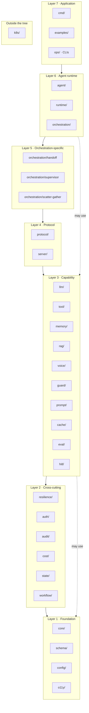
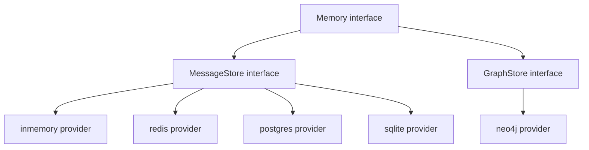
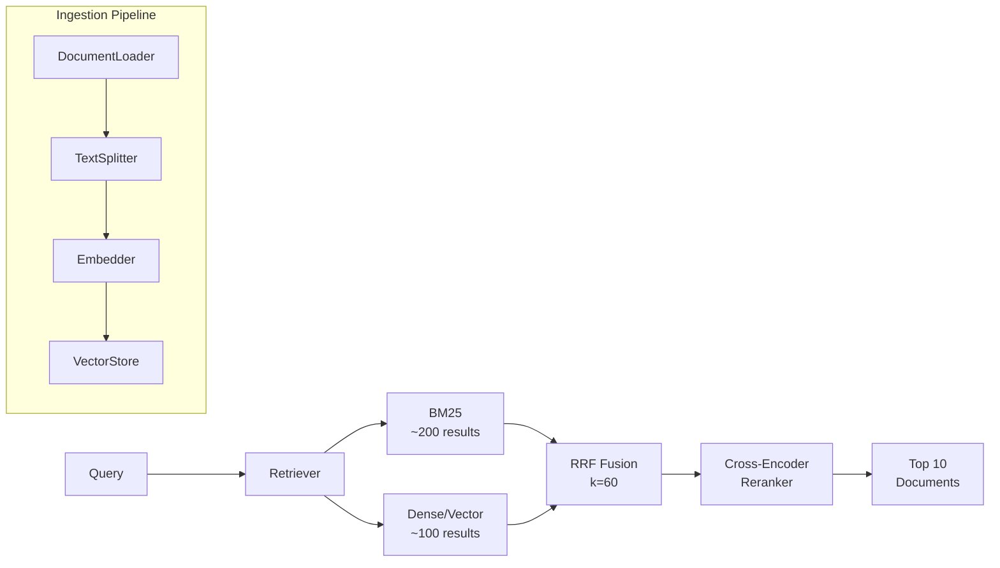
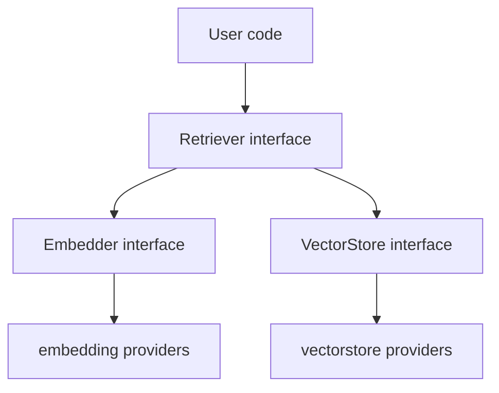
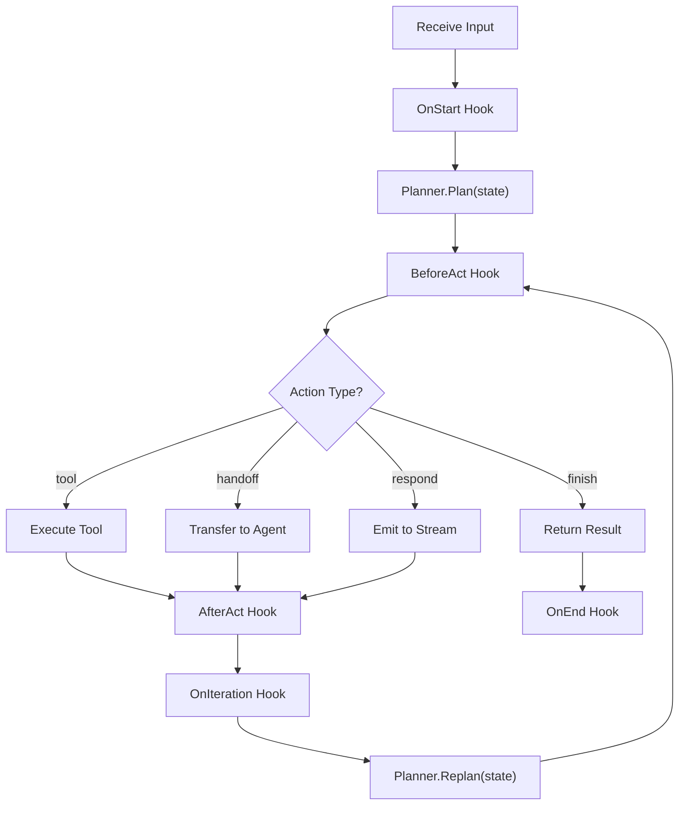
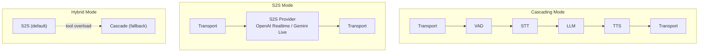
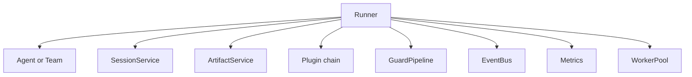
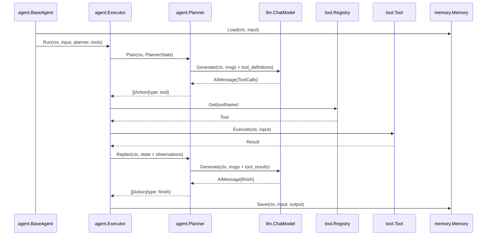
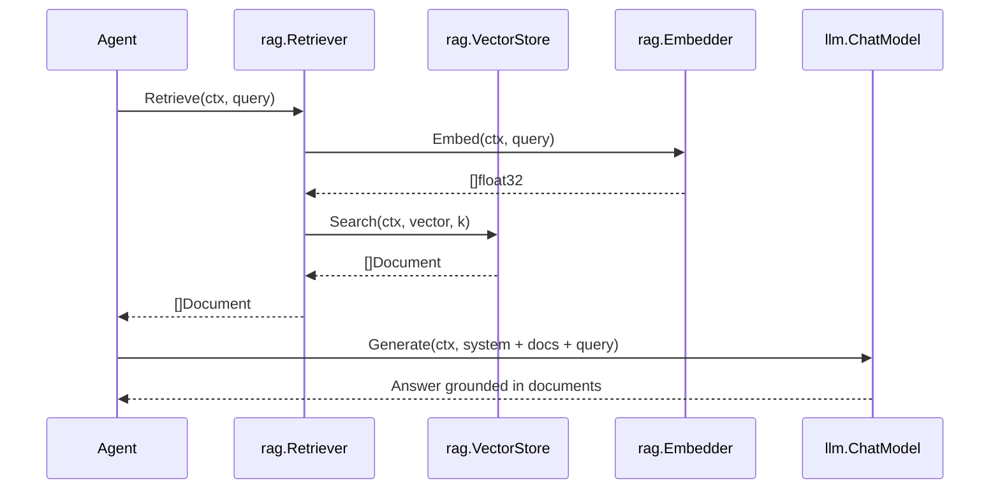
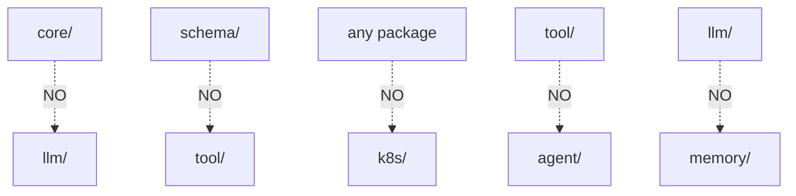

Beluga AI v2 is organized into layered packages with strict dependency rules. This document describes every package, its interfaces, how packages depend on each other, and how they work together to build agentic AI systems. The package layout follows a flat structure with no `pkg/` prefix — packages live at the repository root, which keeps import paths short and aligns with Go conventions for library modules.

## Module

```
Module:  github.com/lookatitude/beluga-ai
Go:      1.23+ (uses iter.Seq2 for streaming)
```

## Package Map

Imports flow downward only — a package in Layer N may import from Layers 1…N−1 but never upward.



## Directory Structure

```
beluga-ai/
├── core/                  # Stream, Runnable, Lifecycle, Errors, Tenant, Option
├── schema/                # Message, ContentPart, ToolCall, Document, Event, Session
├── config/                # Load[T], Validate, Watcher, ProviderConfig
├── o11y/                  # Tracer, Meter, Logger, Health, Exporters
│   └── providers/         # langsmith, langfuse, phoenix, opik
├── llm/                   # ChatModel, Router, StructuredOutput, ContextManager
│   └── providers/         # openai, anthropic, google, ollama, bedrock, + 18 more
├── tool/                  # Tool, FuncTool, Registry, MCP Client, Middleware, Hooks
├── memory/                # Memory, Core, Recall, Archival, Graph, Composite
│   └── stores/            # inmemory, redis, postgres, mongodb, sqlite, neo4j, memgraph, dragonfly
├── rag/
│   ├── embedding/         # Embedder + providers (openai, cohere, jina, ollama, + 5 more)
│   ├── vectorstore/       # VectorStore + providers (pgvector, pinecone, qdrant, + 10 more)
│   ├── retriever/         # Retriever + strategies (hybrid, CRAG, HyDE, ensemble, adaptive, rerank)
│   ├── loader/            # DocumentLoader + providers (text, pdf, html, web, csv, + 7 more)
│   └── splitter/          # TextSplitter (recursive, markdown, token)
├── agent/                 # Agent, BaseAgent, Planner, Executor, Handoffs, Bus
│   └── workflow/          # SequentialAgent, ParallelAgent, LoopAgent
├── runtime/               # Runner, Team, OrchestrationPattern, Plugin, Session, WorkerPool
│   └── plugins/           # RateLimit, AuditPlugin, CostTracking, RetryAndReflect
├── voice/
│   ├── stt/providers/     # whisper, deepgram, assemblyai, gladia, groq, elevenlabs
│   ├── tts/providers/     # elevenlabs, cartesia, openai, playht, lmnt, fish, smallest
│   ├── s2s/providers/     # openai_realtime, gemini_live, nova
│   ├── transport/providers/ # livekit, daily, pipecat
│   └── vad/providers/     # webrtc, silero
├── orchestration/         # Chain, Graph, Router, Scatter, Supervisor, Blackboard
├── workflow/              # DurableExecutor, Activities, State
│   └── providers/         # inmemory, temporal, kafka, nats, dapr, inngest
├── guard/                 # Guard interface + providers (guardrailsai, lakera, llmguard, + 2)
├── resilience/            # Retry, CircuitBreaker, Hedge, RateLimit
├── cache/                 # Cache interface + providers (inmemory)
├── hitl/                  # Manager, Notifier, Approval, Feedback
├── auth/                  # Policy, RBAC, ABAC, Composite, Middleware
├── eval/                  # Metric, Runner, Dataset + providers (braintrust, deepeval, ragas)
├── state/                 # Store interface + providers (inmemory)
├── prompt/                # Template, Manager, Builder + providers (file)
├── cost/                  # Tracker, BudgetChecker, Usage + providers (inmemory)
├── audit/                 # Logger, Store, Entry + providers (inmemory)
├── deploy/                # Dockerfile gen, Compose gen, health endpoints
├── k8s/
│   └── operator/          # CRD types (AgentResource, TeamResource), Reconciler
├── protocol/
│   ├── mcp/               # MCP Server, Client, Registry
│   ├── a2a/               # A2A Server, Client, AgentCard
│   ├── openai_agents/     # OpenAI Agents SDK compatibility
│   └── rest/              # REST/SSE API
├── server/                # ServerAdapter + adapters (gin, chi, echo, fiber, huma, grpc, connect)
└── internal/              # testutil (mocks), httpclient, jsonutil, syncutil, openaicompat
```

## Foundation Layer

The foundation layer provides the types and utilities that every other package depends on. It has zero external dependencies beyond the Go standard library and OpenTelemetry, which ensures that these shared types never introduce transitive dependency conflicts.

### core/

The foundation of the framework. Zero external dependencies beyond stdlib + OTel. This package defines the primitive abstractions — streams, runnables, lifecycle management, and error types — that all other packages build upon.

**Key types**:

| Type | Purpose |
|------|---------|
| `Event[T]` | Generic event with Type, Payload, Err, Meta |
| `Stream[T]` | Type alias for `iter.Seq2[Event[T], error]` |
| `Runnable` | Universal execution interface (Invoke + Stream) |
| `Lifecycle` | Component lifecycle (Start, Stop, Health) |
| `App` | Manages lifecycle components with ordered start/shutdown |
| `Error` | Typed error with Op, Code, Message, Err |
| `ErrorCode` | Categorizes errors: rate_limit, timeout, auth_error, etc. |
| `Option` | Functional option interface |

**Core interfaces**:

```go
// Runnable — universal execution contract
type Runnable interface {
    Invoke(ctx context.Context, input any, opts ...Option) (any, error)
    Stream(ctx context.Context, input any, opts ...Option) iter.Seq2[any, error]
}

// Lifecycle — component management
type Lifecycle interface {
    Start(ctx context.Context) error
    Stop(ctx context.Context) error
    Health() HealthStatus
}
```

**Stream utilities**: `CollectStream`, `MapStream`, `FilterStream`, `MergeStreams`, `FanOut`, `BufferedStream` with backpressure via `FlowController`.

**Composition**: `Pipe(a, b)` chains runnables sequentially. `Parallel(a, b, c)` fans out concurrently.

### schema/

Shared types used by all packages. Zero external dependencies. These types form the common vocabulary of the framework — when an LLM produces a message, a tool returns a result, or an agent emits an event, they all use types from this package. Keeping schema dependency-free ensures these types can be imported by any package without pulling in unwanted transitive dependencies.

| Type | Purpose |
|------|---------|
| `Message` | Interface for conversation messages (System, Human, AI, Tool) |
| `ContentPart` | Interface for multimodal content (Text, Image, Audio, Video) |
| `ToolDefinition` | Tool name + description + JSON Schema for LLM binding |
| `ToolCall` | LLM's request to invoke a tool |
| `ToolResult` | Result from tool execution |
| `Document` | Document with content and metadata for RAG |
| `StreamChunk` | Chunk of streaming LLM response |
| `Event` | Generic event type |
| `Session` | Conversation session state |

### config/

Configuration loading and validation.

| Type | Purpose |
|------|---------|
| `ProviderConfig` | Base configuration for all providers (APIKey, Model, BaseURL, Options) |
| `Load` | Generic config loader (env, file, struct tags) |
| `Validate` | Config validation |
| `Watcher` | Interface for hot-reload watching |
| `FileWatcher` | File-based config watcher |

### o11y/

Observability using OpenTelemetry `gen_ai.*` semantic conventions.

| Type | Purpose |
|------|---------|
| `Span` | OTel span interface |
| `TraceExporter` | Interface for trace exporters |
| `HealthChecker` | Interface for health checks |
| `HealthRegistry` | Aggregates health checks |
| `Logger` | Structured logging via slog |

Providers: `langsmith`, `langfuse`, `phoenix`, `opik`.

## Capability Layer

The capability layer provides the core AI primitives: LLM inference, tool execution, memory, retrieval, agents, and voice. Each package defines a small interface, provides a registry for provider discovery, and supports middleware and hooks for extensibility. These packages import from the foundation layer but never from each other in a circular way.

### llm/

The LLM abstraction layer. 23 providers. This is the most heavily used package in the framework — nearly every other capability depends on it.

**ChatModel interface** (the most important interface in the framework):

```go
type ChatModel interface {
    Generate(ctx context.Context, msgs []schema.Message, opts ...GenerateOption) (*schema.AIMessage, error)
    Stream(ctx context.Context, msgs []schema.Message, opts ...GenerateOption) iter.Seq2[schema.StreamChunk, error]
    BindTools(tools []schema.ToolDefinition) ChatModel
    ModelID() string
}
```

**Supporting types**:

| Type | Purpose |
|------|---------|
| `Factory` | `func(cfg config.ProviderConfig) (ChatModel, error)` |
| `ModelSelector` | Interface for routing across models (RoundRobin, Failover, CostOptimized) |
| `ContextManager` | Interface for fitting messages within token budgets (Truncate, Sliding, Summarize) |
| `Tokenizer` | Interface for token counting |
| `Middleware` | `func(ChatModel) ChatModel` |
| `Hooks` | BeforeGenerate, AfterGenerate, OnStream, OnError |

**Registry**: `Register("openai", factory)`, `New("openai", cfg)`, `List()`.

**Providers**: openai, anthropic, google, azure, bedrock, ollama, groq, mistral, cohere, deepseek, fireworks, huggingface, litellm, llama, openrouter, perplexity, qwen, sambanova, together, xai, cerebras, bifrost.

### tool/

The tool system. Tools are instances, not factories. This distinction from the provider registries reflects how tools are used: providers are created from configuration at startup, while tools often carry runtime state (database connections, API clients) and may be added or removed dynamically during agent execution.

**Tool interface**:

```go
type Tool interface {
    Name() string
    Description() string
    InputSchema() map[string]any
    Execute(ctx context.Context, input map[string]any) (*Result, error)
}
```

**Key types**:

| Type | Purpose |
|------|---------|
| `Result` | Multimodal result: `[]schema.ContentPart` + `IsError` |
| `FuncTool` | Wraps Go functions as tools with auto JSON Schema from struct tags |
| `Registry` | Instance-based: Add, Get, List, Remove (not global factory) |
| `Middleware` | `func(Tool) Tool` — WithTimeout, WithRetry |
| `Hooks` | BeforeExecute, AfterExecute, OnError |
| `MCPRegistry` | Interface for MCP server discovery |

**MCP integration**: `FromMCP()` connects to an MCP server via Streamable HTTP and wraps remote tools as native `Tool` instances.

### memory/

Three-tier memory system inspired by MemGPT. The tiered design reflects the reality that different types of information have different access patterns: persona context must always be in the prompt (core), recent conversation history benefits from fast keyword search (recall), and long-term knowledge requires vector similarity (archival) or structured graph traversal (graph).

**Memory interface**:

```go
type Memory interface {
    Save(ctx context.Context, input, output schema.Message) error
    Load(ctx context.Context, query string) ([]schema.Message, error)
    Search(ctx context.Context, query string, k int) ([]schema.Document, error)
    Clear(ctx context.Context) error
}
```

**Tiers**:

| Tier | Type | Purpose |
|------|------|---------|
| Core | `Core` | Always in context — persona text, user preferences |
| Recall | `Recall` | Searchable conversation history via `MessageStore` |
| Archival | `Archival` | Long-term knowledge via vectorstore + embedder |
| Graph | `GraphStore` | Structured knowledge relationships |
| Composite | `CompositeMemory` | Combines all tiers transparently |

**Registry**: `Register("inmemory", factory)`, `New("inmemory", cfg)`, `List()`.

**Stores**: inmemory, redis, postgres, mongodb, sqlite, neo4j, memgraph, dragonfly.

The `Memory` interface delegates to two sub-interfaces — `MessageStore` for conversation history and `GraphStore` for entity relationships — each with independent provider registries.



### rag/

The RAG pipeline. 5 subpackages with independent registries. The pipeline is decomposed into discrete stages — loading, splitting, embedding, storing, and retrieving — each with its own interface and provider ecosystem. This decomposition means you can swap any stage independently: use a different embedding provider without changing your vector store, or add a new retrieval strategy without modifying how documents are loaded.



**Subpackages**:

| Package | Interface | Methods | Providers |
|---------|-----------|---------|-----------|
| `embedding/` | `Embedder` | Embed, EmbedBatch | openai, cohere, mistral, jina, ollama, google, voyage, sentence_transformers, inmemory |
| `vectorstore/` | `VectorStore` | Add, Search, Delete | pgvector, pinecone, qdrant, weaviate, chroma, milvus, elasticsearch, redis, mongodb, vespa, turbopuffer, sqlitevec, inmemory |
| `retriever/` | `Retriever` | Retrieve | vector, hybrid, multiquery, rerank, ensemble, HyDE, CRAG, adaptive |
| `loader/` | `DocumentLoader` | Load | text, json, csv, markdown, firecrawl, github, confluence, notion, gdrive, unstructured, cloudstorage, docling |
| `splitter/` | `TextSplitter` | Split | recursive, markdown, token |

Each subpackage has its own `Register()`, `New()`, `List()`.

`Retriever` is the consumer-facing interface. `Embedder` and `VectorStore` are implementation details of a retriever — your agent code calls `retriever.Retrieve(ctx, query)` and does not depend on which embedding model or vector index sits beneath it.



### agent/

The agent runtime. Planner-agnostic executor with pluggable reasoning strategies. The separation of planner (decides what to do) from executor (does it) is the key architectural decision: it allows different reasoning approaches to be swapped without changing how tools are called, events are streamed, or handoffs are managed.

**Agent interface**:

```go
type Agent interface {
    ID() string
    Persona() Persona
    Tools() []tool.Tool
    Children() []Agent
    Invoke(ctx context.Context, input string, opts ...Option) (string, error)
    Stream(ctx context.Context, input string, opts ...Option) iter.Seq2[Event, error]
}
```

**Key types**:

| Type | Purpose |
|------|---------|
| `BaseAgent` | Embeddable struct with default implementations |
| `Persona` | Role, Goal, Backstory (RGB framework), Traits |
| `Planner` | Interface: Plan(state) and Replan(state) |
| `PlannerState` | Input, Messages, Tools, Observations, Iteration, Metadata |
| `Action` | What the planner wants: tool, respond, finish, handoff |
| `Observation` | Result of an executed action |
| `Handoff` | Agent transfer with InputFilter, OnHandoff, IsEnabled |
| `EventBus` | Interface for agent-to-agent async messaging |
| `Hooks` | 14 hook points covering the entire execution lifecycle |
| `Middleware` | `func(Agent) Agent` |

**Executor loop**:



**Planners** (registered via `RegisterPlanner()`): ReAct, Reflexion, Plan-and-Execute, Structured, Conversational.

**Workflow agents** (deterministic, no LLM): `SequentialAgent`, `ParallelAgent`, `LoopAgent`.

### voice/

Frame-based voice pipeline with cascading, S2S, and hybrid modes.

| Interface | Methods | Providers |
|-----------|---------|-----------|
| `FrameProcessor` | Process(ctx, in chan, out chan) | All voice components |
| `VAD` | Detect(ctx, frame) ActivityResult | webrtc, silero |
| `STT` | Transcribe(ctx, audio) TranscriptEvent | whisper, deepgram, assemblyai, gladia, groq, elevenlabs |
| `TTS` | Synthesize(ctx, text) audio | elevenlabs, cartesia, openai, playht, lmnt, fish, smallest |
| `S2S` | NewSession(ctx) Session | openai_realtime, gemini_live, nova |
| `AudioTransport` | Connect, Send, Receive | livekit, daily, pipecat |

**Pipeline modes**:



## Runtime Layer

The runtime layer provides the lifecycle management layer that sits between agent definitions and the protocol/infrastructure layers. It coordinates execution, enforces cross-cutting concerns through a plugin system, and manages bounded concurrency. All production agent deployments should use `runtime.Runner` or `runtime.Team` rather than calling agent methods directly.

### runtime/

Agent lifecycle management: Runner, Team composition, Plugin system, Session management, and WorkerPool. The Runner is the deployment boundary — one agent (or team) plus all cross-cutting infrastructure.



**Key types**:

| Type | Purpose |
|------|---------|
| `Runner` | Lifecycle manager for a single agent; handles sessions, plugins, and graceful shutdown |
| `Team` | Groups agents and coordinates them via an `OrchestrationPattern`; implements `agent.Agent` for recursive composition |
| `OrchestrationPattern` | Interface with a single `Execute(ctx, agents, input)` method; the extension point for coordination strategies |
| `Plugin` | Cross-cutting concern interface: `Name`, `BeforeTurn`, `AfterTurn`, `OnError` |
| `PluginChain` | Executes plugins in registration order; output of each plugin feeds the next |
| `Session` | Conversation state: ID, AgentID, TenantID, State, Turns, timestamps |
| `SessionService` | Manages session lifecycle; default is `InMemorySessionService` |
| `RunnerConfig` | Configuration struct: SessionTTL, WorkerPoolSize, GracefulShutdownTimeout, StreamingMode |
| `WorkerPool` | Bounded concurrency; limits concurrent agent tasks to prevent resource exhaustion |

**Runner functional options**:

| Option | Purpose |
|--------|---------|
| `WithPlugins(plugins ...Plugin)` | Add plugins to the execution chain |
| `WithSessionService(s SessionService)` | Override the default in-memory session service |
| `WithRunnerConfig(cfg RunnerConfig)` | Set all configuration fields at once |
| `WithWorkerPoolSize(size int)` | Set concurrent worker limit (default: 10) |

**Runner constructor and methods**:

```go
// NewRunner creates a Runner hosting the given agent.
func NewRunner(a agent.Agent, opts ...RunnerOption) *Runner

// Run executes the agent for a session, returning an event stream.
func (r *Runner) Run(ctx context.Context, sessionID string, input schema.Message) iter.Seq2[agent.Event, error]

// Shutdown drains in-flight sessions and prevents new submissions.
func (r *Runner) Shutdown(ctx context.Context) error
```

**Team functional options**:

| Option | Purpose |
|--------|---------|
| `WithAgents(agents ...agent.Agent)` | Set member agents |
| `WithPattern(p OrchestrationPattern)` | Set coordination strategy (default: PipelinePattern) |
| `WithTeamID(id string)` | Set team identifier (default: "team") |
| `WithTeamPersona(p agent.Persona)` | Set team persona |
| `WithTeamTools(tools ...tool.Tool)` | Add tools to the team |

**Built-in orchestration patterns** (passed to `WithPattern`):

| Constructor | Behavior |
|-------------|----------|
| `PipelinePattern()` | Sequential — text output of each agent feeds the next |
| `SupervisorPattern(coordinator agent.Agent)` | Coordinator agent receives the input plus agent descriptions and delegates |
| `ScatterGatherPattern(aggregator agent.Agent)` | All agents run in parallel; outputs concatenated and passed to aggregator |

The `OrchestrationPattern` interface is defined in `runtime/pattern.go`:

```go
type OrchestrationPattern interface {
    Execute(ctx context.Context, agents []agent.Agent, input string) iter.Seq2[agent.Event, error]
}
```

**Session types**:

```go
type Session struct {
    ID        string
    AgentID   string
    TenantID  string
    State     map[string]any
    Turns     []schema.Turn
    CreatedAt time.Time
    UpdatedAt time.Time
    ExpiresAt time.Time
}

type SessionService interface {
    Create(ctx context.Context, agentID string) (*Session, error)
    Get(ctx context.Context, sessionID string) (*Session, error)
    Update(ctx context.Context, session *Session) error
    Delete(ctx context.Context, sessionID string) error
}
```

Session options for `NewInMemorySessionService`:

| Option | Purpose |
|--------|---------|
| `WithSessionTTL(d time.Duration)` | Expire sessions after d; zero = no expiry |
| `WithSessionTenantID(tenantID string)` | Default tenant ID for new sessions |
| `WithMaxSessions(n int)` | Maximum concurrent sessions; 0 = unlimited |

**WorkerPool methods**:

```go
func NewWorkerPool(size int) *WorkerPool
func (p *WorkerPool) Submit(ctx context.Context, fn func(context.Context)) error
func (p *WorkerPool) Wait()
func (p *WorkerPool) Drain(ctx context.Context) error
```

**Plugin interface**:

```go
type Plugin interface {
    Name() string
    BeforeTurn(ctx context.Context, session *Session, input schema.Message) (schema.Message, error)
    AfterTurn(ctx context.Context, session *Session, events []agent.Event) ([]agent.Event, error)
    OnError(ctx context.Context, err error) error
}
```

**Built-in plugins** (`runtime/plugins/`):

| Constructor | Purpose |
|-------------|---------|
| `plugins.NewRateLimit(requestsPerMinute int)` | Token-bucket rate limiting; returns `core.ErrRateLimit` when exhausted |
| `plugins.NewAuditPlugin(store audit.Store)` | Logs turn start, turn end, and error entries to an `audit.Store` |
| `plugins.NewCostTracking(tracker cost.Tracker, budget cost.Budget)` | Records a `cost.Usage` entry after every completed turn |
| `plugins.NewRetryAndReflect(maxRetries int)` | Suppresses retryable errors up to maxRetries, allowing the runner to retry the turn |

**Dependencies**: `agent`, `cost`, `audit`, `orchestration`.

**Complete Runner example**:

```go
import (
    "context"
    "fmt"
    "time"

    "github.com/lookatitude/beluga-ai/audit"
    "github.com/lookatitude/beluga-ai/cost"
    "github.com/lookatitude/beluga-ai/runtime"
    "github.com/lookatitude/beluga-ai/runtime/plugins"
    "github.com/lookatitude/beluga-ai/schema"
)

auditStore, err := audit.New("inmemory", audit.Config{})
if err != nil {
    return err
}
tracker, err := cost.New("inmemory", cost.Config{})
if err != nil {
    return err
}

runner := runtime.NewRunner(myAgent,
    runtime.WithWorkerPoolSize(20),
    runtime.WithPlugins(
        plugins.NewRateLimit(60),
        plugins.NewAuditPlugin(auditStore),
        plugins.NewCostTracking(tracker, cost.Budget{}),
    ),
)
defer func() {
    shutdownCtx, cancel := context.WithTimeout(context.Background(), 30*time.Second)
    defer cancel()
    if err := runner.Shutdown(shutdownCtx); err != nil {
        fmt.Println("shutdown error:", err)
    }
}()

for evt, err := range runner.Run(ctx, "session-1", schema.NewHumanMessage("hello")) {
    if err != nil {
        break
    }
    fmt.Print(evt.Text)
}
```

**Team example with all three patterns**:

```go
import (
    "github.com/lookatitude/beluga-ai/runtime"
)

// Pipeline: drafter → editor → reviewer
pipeline := runtime.NewTeam(
    runtime.WithTeamID("writing-pipeline"),
    runtime.WithAgents(drafterAgent, editorAgent, reviewerAgent),
    runtime.WithPattern(runtime.PipelinePattern()),
)

// Supervisor: coordinator delegates to specialists
supervised := runtime.NewTeam(
    runtime.WithTeamID("specialist-team"),
    runtime.WithAgents(codeAgent, docsAgent, testAgent),
    runtime.WithPattern(runtime.SupervisorPattern(coordinatorAgent)),
)

// ScatterGather: parallel analysis with synthesis
parallel := runtime.NewTeam(
    runtime.WithTeamID("analysis-team"),
    runtime.WithAgents(legalAgent, technicalAgent, financialAgent),
    runtime.WithPattern(runtime.ScatterGatherPattern(synthesizerAgent)),
)

// Teams implement agent.Agent — host with Runner or nest inside another Team.
runner := runtime.NewRunner(pipeline, runtime.WithWorkerPoolSize(5))
```

### orchestration/

The `orchestration/` package provides composable building blocks for multi-runnable workflows. All types satisfy `core.Runnable` (or the `OrchestrationPattern` interface which embeds it), so any orchestration primitive can be composed with any other or used inside a middleware chain.

**OrchestrationPattern interface**:

```go
type OrchestrationPattern interface {
    core.Runnable  // Invoke + Stream
    Name() string
}
```

**Types**:

| Type | Constructor | Purpose |
|------|-------------|---------|
| `Chain` | `Chain(steps ...core.Runnable) core.Runnable` | Sequential composition of any `core.Runnable`; last step is streamed |
| `Pipeline` | `NewPipeline(stages ...agent.Agent) *Pipeline` | Sequential agent pipeline; leading stages invoked, last stage streamed |
| `HandoffOrchestrator` | `NewHandoffOrchestrator(agents ...agent.Agent) *HandoffOrchestrator` | Peer-to-peer agent transfers following `EventHandoff` events |
| `Graph` | `NewGraph() *Graph` | Directed graph traversal with conditional edges |
| `Router` | `NewRouter(classifier ClassifierFunc) *Router` | Dispatch input to a named route via a classifier function |
| `ScatterGather` | `NewScatterGather(aggregator AggregatorFunc, workers ...core.Runnable) *ScatterGather` | Parallel fan-out with aggregator function |
| `Supervisor` | `NewSupervisor(strategy StrategyFunc, agents ...agent.Agent) *Supervisor` | Multi-round delegation using a strategy function |
| `Blackboard` | `NewBlackboard(termination TerminationFunc, agents ...agent.Agent) *Blackboard` | Shared-board collaboration: agents read and write a common state map |

**Chain example** — compose any `core.Runnable` steps:

```go
import "github.com/lookatitude/beluga-ai/orchestration"

chain := orchestration.Chain(retriever, reranker, responder)
result, err := chain.Invoke(ctx, query)
if err != nil {
    return err
}
```

**HandoffOrchestrator** — agent-to-agent transfers:

```go
import "github.com/lookatitude/beluga-ai/orchestration"

h := orchestration.NewHandoffOrchestrator(triageAgent, billingAgent, techAgent).
    WithMaxHops(5).
    WithEntry(triageAgent.ID())

for val, err := range h.Stream(ctx, userQuery) {
    if err != nil {
        break
    }
    fmt.Print(val)
}
```

`HandoffOrchestrator` methods:

```go
func NewHandoffOrchestrator(agents ...agent.Agent) *HandoffOrchestrator
func (h *HandoffOrchestrator) WithMaxHops(n int) *HandoffOrchestrator
func (h *HandoffOrchestrator) WithEntry(id string) *HandoffOrchestrator
func (h *HandoffOrchestrator) Name() string
func (h *HandoffOrchestrator) Invoke(ctx context.Context, input any, opts ...core.Option) (any, error)
func (h *HandoffOrchestrator) Stream(ctx context.Context, input any, opts ...core.Option) iter.Seq2[any, error]
```

**Pipeline** — sequential agent pipeline with streaming final stage:

```go
import "github.com/lookatitude/beluga-ai/orchestration"

p := orchestration.NewPipeline(classifierAgent, extractorAgent, formatterAgent)
result, err := p.Invoke(ctx, rawDocument)
if err != nil {
    return err
}
```

**Graph** — conditional directed graph:

```go
import "github.com/lookatitude/beluga-ai/orchestration"

g := orchestration.NewGraph()
if err := g.AddNode("extract", extractor); err != nil {
    return err
}
if err := g.AddNode("enrich", enricher); err != nil {
    return err
}
if err := g.AddNode("format", formatter); err != nil {
    return err
}
if err := g.AddEdge(orchestration.Edge{From: "extract", To: "enrich"}); err != nil {
    return err
}
if err := g.AddEdge(orchestration.Edge{From: "enrich", To: "format"}); err != nil {
    return err
}
if err := g.SetEntry("extract"); err != nil {
    return err
}
result, err := g.Invoke(ctx, input)
if err != nil {
    return err
}
```

**Router** — classifier-based dispatch:

```go
import "github.com/lookatitude/beluga-ai/orchestration"

r := orchestration.NewRouter(func(ctx context.Context, input any) (string, error) {
    if strings.Contains(fmt.Sprint(input), "code") {
        return "code", nil
    }
    return "general", nil
}).AddRoute("code", codeAgent).AddRoute("general", generalAgent)

result, err := r.Invoke(ctx, userMessage)
if err != nil {
    return err
}
```

**Supervisor built-in strategies**:

| Function | Behavior |
|----------|---------|
| `DelegateBySkill()` | Keyword overlap between input and agent persona goals |
| `RoundRobin()` | Cycles through agents in order |
| `LoadBalanced()` | Picks the agent with the fewest invocations |

**Middleware and Hooks**:

```go
// Middleware wraps any core.Runnable.
type Middleware func(core.Runnable) core.Runnable

func ApplyMiddleware(r core.Runnable, mws ...Middleware) core.Runnable

// Hooks — all fields optional, nil = skip.
type Hooks struct {
    BeforeStep func(ctx context.Context, stepName string, input any) error
    AfterStep  func(ctx context.Context, stepName string, output any, err error)
    OnBranch   func(ctx context.Context, from, to string) error
    OnError    func(ctx context.Context, err error) error
}

func ComposeHooks(hooks ...Hooks) Hooks
```

**Dependencies**: `agent`, `core`.

## Infrastructure Layer

Infrastructure packages provide cross-cutting concerns that apply to multiple capability packages: safety guards, resilience patterns, caching, authentication, human-in-the-loop approval, evaluation, shared state, and prompt management. These packages import from both the foundation and capability layers, and they are applied via middleware or hooks rather than being embedded in capability code.

### guard/

Three-stage safety pipeline. Guards are applied at the agent level, so they protect all LLM interactions and tool executions uniformly.

```go
type Guard interface {
    Validate(ctx context.Context, input GuardInput) (GuardResult, error)
}
```

Providers: guardrailsai, lakera, llmguard, azuresafety, nemo.

### resilience/

Composable resilience patterns. Each wraps operations via middleware.

| Pattern | File | Purpose |
|---------|------|---------|
| Retry | `retry.go` | Exponential backoff + jitter |
| CircuitBreaker | `circuitbreaker.go` | Closed → Open → Half-Open |
| Hedge | `hedge.go` | Parallel redundant requests |
| RateLimit | `ratelimit.go` | RPM, TPM, MaxConcurrent |

### workflow/

Durable execution engine.

```go
type DurableExecutor interface {
    Execute(ctx context.Context, workflowFn any, args ...any) (WorkflowHandle, error)
    Signal(ctx context.Context, id string, signal string, data any) error
    Query(ctx context.Context, id string, query string) (any, error)
    Cancel(ctx context.Context, id string) error
}
```

Providers: inmemory (dev), temporal, kafka, nats, dapr, inngest.

### auth/

Authorization with default-deny.

```go
type Policy interface {
    Authorize(ctx context.Context, request AuthRequest) (AuthResult, error)
}
```

Implementations: RBAC, ABAC, Composite. OPA integration.

### Other Infrastructure

| Package | Interface | Purpose |
|---------|-----------|---------|
| `cache/` | `Cache` | Exact + semantic caching |
| `hitl/` | `Manager`, `Notifier` | Human-in-the-loop with confidence-based routing |
| `eval/` | `Metric` | Evaluation metrics (faithfulness, relevance, hallucination, toxicity) |
| `state/` | `Store` | Shared agent state with Watch |
| `prompt/` | `PromptManager` | Template management, versioning, cache-optimal ordering |
| `cost/` | `Tracker`, `BudgetChecker` | Token usage tracking and budget enforcement |
| `audit/` | `Logger`, `Store` | Structured audit logging for agents, tools, and system actions |

### cost/

Token usage tracking and budget enforcement. Depends only on `core/`.

```go
type Tracker interface {
    Record(ctx context.Context, usage Usage) error
    Query(ctx context.Context, filter Filter) (Summary, error)
}

type BudgetChecker interface {
    Check(ctx context.Context, budget Budget, estimated Usage) (BudgetDecision, error)
}
```

`Budget` enforces two rolling windows: `MaxTokensPerHour` and `MaxCostPerDay`. When a threshold is reached, `BudgetAction` determines the response: `BudgetActionReject` (deny), `BudgetActionThrottle` (signal slow-down), or `BudgetActionAlert` (allow but set `BudgetDecision.Reason`).

**Registry**: `Register("postgres", factory)`, `New("inmemory", cfg)`, `List()`. The "inmemory" backend is registered automatically.

**Related**: `runtime/plugins.CostTracking`, `audit/`, `o11y/`.

### audit/

Structured audit logging for agents, tools, and system actions. Depends only on `core/`.

```go
type Logger interface {
    Log(ctx context.Context, entry Entry) error
}

type Store interface {
    Logger
    Query(ctx context.Context, filter Filter) ([]Entry, error)
}
```

Each `Entry` captures: `TenantID`, `AgentID`, `SessionID`, `Action`, `Input`, `Output`, `Duration`, `Error`. IDs and timestamps are generated automatically. Callers must redact PII and secrets from `Input`/`Output` before calling `Log` — see the security note in the source doc.

**Registry**: `Register("postgres", factory)`, `New("inmemory", cfg)`, `List()`. The "inmemory" backend is registered automatically.

**Related**: `runtime/plugins.AuditPlugin`, `cost/`.

## Protocol Layer

Protocol packages handle communication with external systems: exposing Beluga agents as network services and consuming remote tools and agents. These packages sit at the top of the dependency hierarchy, importing from capability and infrastructure layers.

### protocol/mcp/

MCP (Model Context Protocol) server and client. MCP is the standard protocol for discovering and calling tools across process boundaries.

- **Server**: Expose Beluga tools as MCP resources via Streamable HTTP
- **Client**: Connect to external MCP servers, wrap remote tools as native `tool.Tool`
- **Registry**: Discover and search MCP servers

Transport: Streamable HTTP (2025-06-18 spec). OAuth authorization.

### protocol/a2a/

A2A (Agent-to-Agent) protocol.

- **Server**: Expose Beluga agents as A2A remote agents
- **Client**: Call remote A2A agents as sub-agents
- **AgentCard**: JSON metadata at `/.well-known/agent.json`

Protocol: Protobuf-first (a2a.proto). JSON-RPC + gRPC bindings. Task lifecycle: submitted → working → completed/failed/canceled.

### protocol/rest/

REST/SSE API for exposing agents.

### protocol/openai_agents/

OpenAI Agents SDK compatibility layer.

### server/

HTTP framework adapters implementing `ServerAdapter` interface.

```go
type ServerAdapter interface {
    Mount(pattern string, handler http.Handler)
    Start(ctx context.Context, addr string) error
    Stop(ctx context.Context) error
}
```

Adapters: gin, chi, echo, fiber, huma, grpc, connect.

## Deployment Layer

Deployment packages generate artifacts and Kubernetes resources for running Beluga agents in production. They have no dependencies on core library packages and are never imported by them — the dependency is one-directional.

### deploy/

Generates deployment artifacts and exposes health endpoints. No dependencies on other Beluga packages.

**Capabilities**:

| Function / Type | Purpose |
|-----------------|---------|
| `GenerateDockerfile(cfg DockerfileConfig)` | Multi-stage Dockerfile — builder stage compiles Go binary, runtime stage uses distroless |
| `GenerateCompose(cfg ComposeConfig)` | Docker Compose YAML — one service per `AgentDeployment` with env vars, ports, dependencies |
| `NewHealthEndpoint()` | HTTP handler exposing `/healthz` (liveness) and `/readyz` (readiness) |
| `HealthEndpoint.AddCheck(name, fn)` | Register a named readiness check; each runs with a 5-second deadline |

All input is validated before rendering. Dockerfile generation rejects path traversal in `AgentConfig`. Compose generation rejects unresolvable `DependsOn` references. Health check error details are suppressed in HTTP responses to prevent information disclosure.

```go
import "github.com/lookatitude/beluga-ai/deploy"

h := deploy.NewHealthEndpoint()
h.AddCheck("database", func(ctx context.Context) error {
    return db.PingContext(ctx)
})
mux := http.NewServeMux()
mux.HandleFunc("/healthz", h.Healthz())
mux.HandleFunc("/readyz", h.Readyz())
```

**Related**: `k8s/operator`, `runtime`.

### k8s/operator/

Kubernetes operator types and reconciliation logic for Beluga Agent and Team CRDs. Imports only `core/` and the Go standard library. Must never be imported by core library packages.

**Key types**:

| Type | Purpose |
|------|---------|
| `AgentResource` | Mirrors the BelugaAgent CRD spec |
| `TeamResource` | Mirrors the BelugaTeam CRD spec |
| `Reconciler` | Interface: `ReconcileAgent`, `ReconcileTeam` |
| `ReconcileResult` | Deployment spec, Service spec, optional HPA spec — caller maps to K8s API objects |
| `DefaultReconciler` | Built-in implementation deriving resource names, replica counts, and autoscaling from CRD spec |

The package is intentionally decoupled from any Kubernetes client library. `ReconcileResult` values contain plain Go structs that callers translate to `client-go` or controller-runtime types, which keeps the operator package free of heavyweight dependencies.

```go
import "github.com/lookatitude/beluga-ai/k8s/operator"

r := operator.NewDefaultReconciler()
result, err := r.ReconcileAgent(ctx, agentResource)
if err != nil {
    return err
}
// result.Deployment, result.Service, result.HPA — apply via your K8s client.
```

**Related**: `deploy/`.

## Internal Utilities

Internal packages provide shared infrastructure that is not part of the public API. Placing these in `internal/` ensures they cannot be imported by external code, giving the framework freedom to change their APIs without breaking compatibility.

### internal/testutil/

Mock implementations for testing. Every public interface in the framework has a corresponding mock here, ensuring consistent test patterns across all packages:
- `MockChatModel` — configurable LLM responses
- `MockEmbedder` — fixed vector outputs
- `MockTool` — configurable tool execution
- `MockMemory` — in-memory message storage
- `MockVectorStore` — in-memory vector operations
- `MockWorkflowStore` — workflow state storage

### internal/httpclient/

Generic HTTP client with retry logic.

### internal/jsonutil/

JSON Schema generation from Go struct tags (`json`, `description`, `required`, `default`, `enum`).

### internal/syncutil/

Sync utilities (pools, concurrent helpers).

### internal/openaicompat/

OpenAI API compatibility layer for providers that use OpenAI-compatible APIs. Many LLM providers (Groq, Together, Fireworks, OpenRouter, and others) expose OpenAI-compatible endpoints. Rather than duplicating HTTP request/response handling across 12+ providers, this shared layer handles the common protocol, and each provider package adds only its registration and provider-specific error mapping.

## How Packages Work Together

The following sequence diagrams show how packages collaborate at runtime. These interactions are the practical manifestation of the layered architecture: foundation types flow through the entire stack, capability packages call each other through interfaces, and the agent runtime orchestrates everything.

### Agent executing a tool



### RAG-augmented agent



## Prohibited dependencies

Some import paths are explicitly forbidden. Violations reverse the dependency direction and break the layering rule.



- `core/` → `llm/`: foundation cannot depend on a capability layer.
- `schema/` → anything above Layer 1: wire types only.
- Any package → `k8s/`: Kubernetes is an overlay, not a dependency.
- `tool/` → `agent/`: tools are invoked by agents, not the reverse.
- Cross-capability imports in Layer 3: `llm/`, `memory/`, `voice/` do not import each other.

Run `/arch-validate all` to detect violations. See [DOC-18](../../../../architecture/18-package-dependency-map.md) for the full enforcement guide.

## Statistics

| Category | Count |
|----------|-------|
| Top-level packages | 28 |
| Interfaces | 50+ |
| Registries | 19 |
| Total providers | 100+ |
| LLM providers | 23 |
| Vector store providers | 13 |
| Embedding providers | 9 |
| Voice providers (STT+TTS+S2S+Transport+VAD) | 21 |
| Memory stores | 8 |
| Workflow providers | 6 |
| Packages with middleware | 6 |
| Packages with hooks | 11 |
