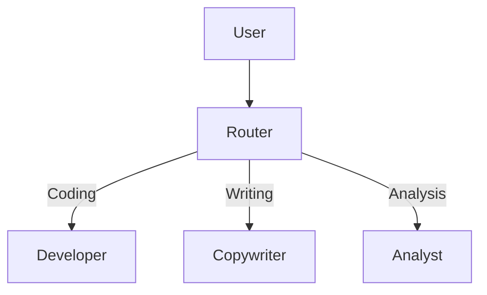

Complex tasks often require multiple specialized agents working together. A coding agent, a testing agent, and a review agent can collaborate on software development. A researcher, analyst, and writer can produce a report. Rather than building one monolithic agent that tries to do everything, multi-agent orchestration divides work among specialists -- each with a focused system prompt, dedicated tools, and potentially a different model optimized for their role. This tutorial covers two orchestration patterns: **routing** (handoffs) dispatches requests to the right specialist, and **supervision** (management) decomposes goals into steps and delegates to sub-agents.

## What You Will Build

Two orchestration patterns -- a router that dispatches queries to the right specialist, and a supervisor that decomposes goals into steps and delegates to sub-agents.

## Prerequisites

- Understanding of [Building a Research Agent](/tutorials/agents/research-agent)
- A configured LLM provider

## Pattern 1: Router (Handoff)

The router pattern uses a classifier agent to determine which specialist should handle the request. This is the simplest form of multi-agent orchestration. In Beluga AI's agent package, handoffs are implemented as tools -- agent transfers auto-generate `transfer_to_{name}` tools that the model can invoke. Here we implement a manual version to show the underlying mechanics.

The classifier uses `temperature: 0` to ensure deterministic routing. Since the classifier's only job is to output a category name, it does not need creative or varied responses -- consistency is what matters for reliable routing.



### Implement the Router

```go
package main

import (
    "context"
    "fmt"
    "strings"

    "github.com/lookatitude/beluga-ai/llm"
    "github.com/lookatitude/beluga-ai/schema"
)

// classify determines which agent should handle the input
func classify(ctx context.Context, model llm.ChatModel, input string) (string, error) {
    msgs := []schema.Message{
        schema.NewSystemMessage(`Classify the user input into exactly one category:
CODING - requests for code, debugging, or technical implementation
WRITING - requests for content creation, editing, or copywriting
ANALYSIS - requests for data analysis, research, or calculations
Respond with only the category name.`),
        schema.NewHumanMessage(input),
    }

    resp, err := model.Generate(ctx, msgs, llm.WithTemperature(0))
    if err != nil {
        return "", err
    }

    return strings.TrimSpace(resp.Text()), nil
}

// routeRequest dispatches to the appropriate specialist
func routeRequest(ctx context.Context, classifier llm.ChatModel, specialists map[string]llm.ChatModel, input string) (string, error) {
    category, err := classify(ctx, classifier, input)
    if err != nil {
        return "", fmt.Errorf("classify: %w", err)
    }

    fmt.Printf("Routed to: %s\n", category)

    specialist, ok := specialists[category]
    if !ok {
        return "", fmt.Errorf("unknown category: %s", category)
    }

    msgs := []schema.Message{
        schema.NewHumanMessage(input),
    }

    resp, err := specialist.Generate(ctx, msgs)
    if err != nil {
        return "", fmt.Errorf("specialist %s: %w", category, err)
    }

    return resp.Text(), nil
}
```

### Create Specialists

Each specialist has a dedicated system prompt and potentially a different model. In production, you would typically use a more capable (and expensive) model for complex tasks like coding, and a faster model for simpler tasks like classification. The map structure allows you to reuse models across categories when the same model is appropriate for multiple roles -- the key differentiator becomes the system prompt rather than the model itself.

```go
func createSpecialists(ctx context.Context) (map[string]llm.ChatModel, error) {
    coder, err := llm.New("openai", config.ProviderConfig{
        "api_key": os.Getenv("OPENAI_API_KEY"),
        "model":   "gpt-4o",
    })
    if err != nil {
        return nil, err
    }

    writer, err := llm.New("openai", config.ProviderConfig{
        "api_key": os.Getenv("OPENAI_API_KEY"),
        "model":   "gpt-4o",
    })
    if err != nil {
        return nil, err
    }

    // Apply persona via middleware or prepend system message
    return map[string]llm.ChatModel{
        "CODING":   coder,
        "WRITING":  writer,
        "ANALYSIS": writer, // can reuse models with different prompts
    }, nil
}
```

## Pattern 2: Supervisor (Manager)

The supervisor pattern goes beyond simple routing. A manager agent creates a structured plan (as JSON), then executes each step by delegating to the appropriate sub-agent. Each step receives the accumulated context from previous steps, enabling later agents to build on earlier work. This pattern is more powerful than routing because it handles multi-step tasks where the output of one agent feeds into the next.

The manager uses `json_object` response format to ensure the plan is machine-parseable. The accumulated context string grows with each step, giving each subsequent agent full visibility into what has already been accomplished. Finally, the manager synthesizes all step results into a coherent output -- this is important because individual step results may be fragmented or use inconsistent terminology.

```go
type Step struct {
    Agent   string
    Task    string
}

func planAndExecute(ctx context.Context, manager llm.ChatModel, agents map[string]llm.ChatModel, goal string) (string, error) {
    // Step 1: Manager creates a plan
    planMsgs := []schema.Message{
        schema.NewSystemMessage(`You are a project manager. Break down the goal into steps.
For each step, specify which agent should handle it (researcher, coder, writer).
Respond in JSON format: [{"agent": "researcher", "task": "..."}]`),
        schema.NewHumanMessage(goal),
    }

    planResp, err := manager.Generate(ctx, planMsgs,
        llm.WithResponseFormat(llm.ResponseFormat{Type: "json_object"}),
    )
    if err != nil {
        return "", fmt.Errorf("plan: %w", err)
    }

    var steps []Step
    if err := json.Unmarshal([]byte(planResp.Text()), &steps); err != nil {
        return "", fmt.Errorf("parse plan: %w", err)
    }

    // Step 2: Execute each step
    var results []string
    var accumulatedContext string

    for i, step := range steps {
        fmt.Printf("Step %d: [%s] %s\n", i+1, step.Agent, step.Task)

        agent, ok := agents[step.Agent]
        if !ok {
            return "", fmt.Errorf("unknown agent: %s", step.Agent)
        }

        msgs := []schema.Message{
            schema.NewSystemMessage("Complete the following task. Use the context provided from previous steps."),
            schema.NewHumanMessage(fmt.Sprintf("Task: %s\n\nContext from previous steps:\n%s", step.Task, accumulatedContext)),
        }

        resp, err := agent.Generate(ctx, msgs)
        if err != nil {
            return "", fmt.Errorf("step %d (%s): %w", i+1, step.Agent, err)
        }

        result := resp.Text()
        results = append(results, result)
        accumulatedContext += fmt.Sprintf("\n--- Step %d result ---\n%s\n", i+1, result)
    }

    // Step 3: Manager synthesizes final output
    synthMsgs := []schema.Message{
        schema.NewSystemMessage("Synthesize the following step results into a coherent final output."),
        schema.NewHumanMessage(accumulatedContext),
    }

    final, err := manager.Generate(ctx, synthMsgs)
    if err != nil {
        return "", fmt.Errorf("synthesize: %w", err)
    }

    return final.Text(), nil
}
```

## Shared State Between Agents

When agents need to share structured data beyond the conversation context (such as intermediate computation results, configuration values, or cross-cutting metadata), a thread-safe shared state store provides a clean solution. The `sync.RWMutex` allows concurrent reads from multiple agents while serializing writes, which is important when agents run in parallel goroutines. Beluga AI's `state` package provides a more full-featured version of this pattern with `Watch` support for reactive updates.

```go
// Shared state via a simple map
type SharedState struct {
    mu   sync.RWMutex
    data map[string]any
}

func (s *SharedState) Set(key string, value any) {
    s.mu.Lock()
    defer s.mu.Unlock()
    s.data[key] = value
}

func (s *SharedState) Get(key string) (any, bool) {
    s.mu.RLock()
    defer s.mu.RUnlock()
    v, ok := s.data[key]
    return v, ok
}
```

## Verification

Create a "Software House" simulation:
1. Product Manager defines specs from a user request.
2. Developer writes code based on the specs.
3. QA reviews the code and provides feedback.

Input: "Build a URL shortener in Go." Verify the agents interact and produce a coherent result.

## Next Steps

- [Tools Registry](/tutorials/agents/tools-registry) -- Build a reusable tool library for agents
- [Model Switching](/tutorials/agents/model-switching) -- Implement fallback chains
