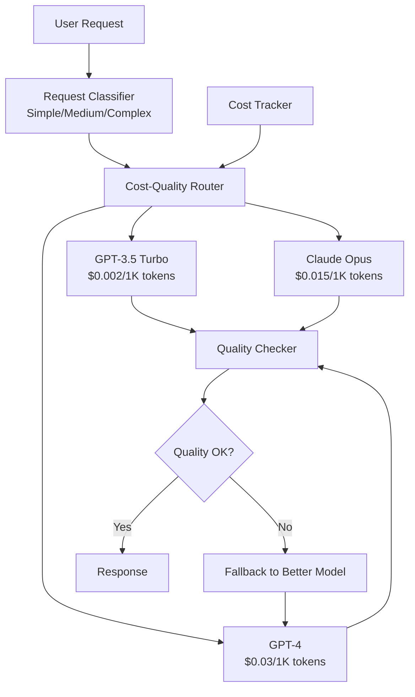

LLM pricing varies by 10-15x between model tiers — GPT-3.5 Turbo costs $0.002 per 1K tokens while GPT-4 costs $0.03. When every request routes to the most expensive model, simple factual lookups consume the same budget as complex multi-step reasoning. For high-volume applications processing thousands of requests daily, this uniform routing inflates costs by 40-50% with no quality benefit for the majority of requests.

The insight is that request complexity follows a power law distribution: 60-70% of requests are simple (FAQ lookups, status checks, basic formatting), 20-25% are medium complexity, and only 10-15% require the reasoning capabilities of frontier models. Matching model capability to request complexity captures most of the quality benefit at a fraction of the cost.

A cost-optimized router classifies incoming requests by complexity, routes each to the cheapest model that meets quality requirements, validates response quality, and automatically falls back to more capable models when the initial response is insufficient.

## Solution Architecture

Beluga AI's unified `llm.ChatModel` interface means all providers share the same Generate/Stream API, so the router can swap between models transparently. The classifier examines request patterns (keyword matching, message length, conversation history) to determine complexity, the router selects from a cost-quality matrix, and a quality checker validates the response before returning it — triggering fallback escalation if quality falls below the complexity-specific threshold.



## Cost-Optimized Router

Implement intelligent routing based on request complexity:

```go
package main

import (
    "context"
    "fmt"
    "log"
    "strings"

    "github.com/lookatitude/beluga-ai/llm"
    "github.com/lookatitude/beluga-ai/schema"

    _ "github.com/lookatitude/beluga-ai/llm/providers/openai"
    _ "github.com/lookatitude/beluga-ai/llm/providers/anthropic"
)

type RequestComplexity string

const (
    ComplexitySimple  RequestComplexity = "simple"
    ComplexityMedium  RequestComplexity = "medium"
    ComplexityComplex RequestComplexity = "complex"
)

type CostOptimizedRouter struct {
    models        map[string]llm.ChatModel
    costMatrix    map[string]float64 // Cost per 1K tokens
    qualityMatrix map[string]float64 // Quality score 0-1
    classifier    *RequestClassifier
}

func NewCostOptimizedRouter(ctx context.Context) (*CostOptimizedRouter, error) {
    models := make(map[string]llm.ChatModel)

    // Simple model (low cost, good for straightforward queries)
    simpleModel, err := llm.New("openai", llm.ProviderConfig{
        APIKey: os.Getenv("OPENAI_API_KEY"),
        Model:  "gpt-3.5-turbo",
    })
    if err != nil {
        return nil, fmt.Errorf("create simple model: %w", err)
    }
    models["simple"] = simpleModel

    // Medium model (balanced cost/quality)
    mediumModel, err := llm.New("openai", llm.ProviderConfig{
        APIKey: os.Getenv("OPENAI_API_KEY"),
        Model:  "gpt-4o-mini",
    })
    if err != nil {
        return nil, fmt.Errorf("create medium model: %w", err)
    }
    models["medium"] = mediumModel

    // Complex model (high quality for complex reasoning)
    complexModel, err := llm.New("anthropic", llm.ProviderConfig{
        APIKey: os.Getenv("ANTHROPIC_API_KEY"),
        Model:  "claude-3-5-sonnet-20241022",
    })
    if err != nil {
        return nil, fmt.Errorf("create complex model: %w", err)
    }
    models["complex"] = complexModel

    return &CostOptimizedRouter{
        models: models,
        costMatrix: map[string]float64{
            "simple":  0.002,  // $0.002 per 1K tokens
            "medium":  0.010,  // $0.010 per 1K tokens
            "complex": 0.015,  // $0.015 per 1K tokens
        },
        qualityMatrix: map[string]float64{
            "simple":  0.7,
            "medium":  0.85,
            "complex": 0.95,
        },
        classifier: NewRequestClassifier(),
    }, nil
}

func (r *CostOptimizedRouter) Route(ctx context.Context, msgs []schema.Message) (*schema.AIMessage, error) {
    // Classify request complexity
    complexity := r.classifier.Classify(ctx, msgs)

    log.Printf("Request classified as: %s", complexity)

    // Select model based on complexity
    modelName := r.selectModel(complexity)
    model := r.models[modelName]

    // Generate response
    resp, err := model.Generate(ctx, msgs)
    if err != nil {
        // Fallback to more capable model
        return r.fallbackRoute(ctx, msgs, modelName)
    }

    // Validate quality
    quality := r.checkQuality(ctx, resp, complexity)
    qualityThreshold := r.getQualityThreshold(complexity)

    if quality < qualityThreshold {
        log.Printf("Quality %.2f below threshold %.2f, falling back", quality, qualityThreshold)
        return r.fallbackRoute(ctx, msgs, modelName)
    }

    // Track cost
    cost := r.estimateCost(modelName, resp)
    log.Printf("Request cost: $%.4f using %s", cost, modelName)

    return resp, nil
}

func (r *CostOptimizedRouter) selectModel(complexity RequestComplexity) string {
    switch complexity {
    case ComplexitySimple:
        return "simple"
    case ComplexityMedium:
        return "medium"
    case ComplexityComplex:
        return "complex"
    default:
        return "medium"
    }
}

func (r *CostOptimizedRouter) fallbackRoute(ctx context.Context, msgs []schema.Message, failedModel string) (*schema.AIMessage, error) {
    // Route to next better model
    fallbackChain := map[string]string{
        "simple":  "medium",
        "medium":  "complex",
        "complex": "", // No fallback
    }

    nextModel := fallbackChain[failedModel]
    if nextModel == "" {
        return nil, fmt.Errorf("no fallback available for %s", failedModel)
    }

    log.Printf("Falling back from %s to %s", failedModel, nextModel)
    return r.models[nextModel].Generate(ctx, msgs)
}

func (r *CostOptimizedRouter) estimateCost(modelName string, resp *schema.AIMessage) float64 {
    costPer1K := r.costMatrix[modelName]
    totalTokens := float64(resp.Usage.TotalTokens)
    return (totalTokens / 1000.0) * costPer1K
}
```

## Request Classification

Classify request complexity to enable appropriate routing:

```go
type RequestClassifier struct {
    simplePatterns  []string
    complexPatterns []string
}

func NewRequestClassifier() *RequestClassifier {
    return &RequestClassifier{
        simplePatterns: []string{
            "what are your hours",
            "how do i contact",
            "what is your address",
            "simple question",
            "yes or no",
        },
        complexPatterns: []string{
            "analyze",
            "compare",
            "explain in detail",
            "write code",
            "multi-step",
            "reasoning",
        },
    }
}

func (c *RequestClassifier) Classify(ctx context.Context, msgs []schema.Message) RequestComplexity {
    // Get the last user message
    var userMessage string
    for i := len(msgs) - 1; i >= 0; i-- {
        if msg, ok := msgs[i].(*schema.HumanMessage); ok {
            for _, part := range msg.Parts {
                if textPart, ok := part.(schema.TextPart); ok {
                    userMessage = strings.ToLower(textPart.Text)
                    break
                }
            }
            break
        }
    }

    // Check for simple patterns
    for _, pattern := range c.simplePatterns {
        if strings.Contains(userMessage, pattern) {
            return ComplexitySimple
        }
    }

    // Check for complex patterns
    for _, pattern := range c.complexPatterns {
        if strings.Contains(userMessage, pattern) {
            return ComplexityComplex
        }
    }

    // Check message length (longer messages often indicate complexity)
    if len(userMessage) > 500 {
        return ComplexityComplex
    }

    if len(userMessage) < 100 {
        return ComplexitySimple
    }

    return ComplexityMedium
}
```

## Quality Validation

Validate response quality to ensure routing decisions maintain standards:

```go
func (r *CostOptimizedRouter) checkQuality(ctx context.Context, resp *schema.AIMessage, complexity RequestComplexity) float64 {
    // Extract response text
    var responseText string
    for _, part := range resp.Parts {
        if textPart, ok := part.(schema.TextPart); ok {
            responseText = textPart.Text
            break
        }
    }

    score := 1.0

    // Check response length (too short might indicate low quality)
    if len(responseText) < 50 {
        score -= 0.2
    }

    // Check for placeholder responses
    placeholders := []string{"i don't know", "i'm not sure", "i cannot", "unclear"}
    for _, placeholder := range placeholders {
        if strings.Contains(strings.ToLower(responseText), placeholder) {
            score -= 0.3
            break
        }
    }

    // For complex requests, expect more detailed responses
    if complexity == ComplexityComplex && len(responseText) < 200 {
        score -= 0.2
    }

    return max(score, 0.0)
}

func (r *CostOptimizedRouter) getQualityThreshold(complexity RequestComplexity) float64 {
    thresholds := map[RequestComplexity]float64{
        ComplexitySimple:  0.6,
        ComplexityMedium:  0.75,
        ComplexityComplex: 0.85,
    }
    return thresholds[complexity]
}
```

## Cost Tracking

Track costs per request and model for optimization insights:

```go
import (
    "go.opentelemetry.io/otel"
    "go.opentelemetry.io/otel/attribute"
    "go.opentelemetry.io/otel/metric"
)

type CostTracker struct {
    meter           metric.Meter
    costCounter     metric.Float64Counter
    requestCounter  metric.Int64Counter
    savingsGauge    metric.Float64ObservableGauge
}

func NewCostTracker() (*CostTracker, error) {
    meter := otel.Meter("cost-router")

    costCounter, err := meter.Float64Counter("llm.cost.total",
        metric.WithDescription("Total LLM cost in USD"),
    )
    if err != nil {
        return nil, err
    }

    requestCounter, err := meter.Int64Counter("llm.requests.total",
        metric.WithDescription("Total LLM requests"),
    )
    if err != nil {
        return nil, err
    }

    return &CostTracker{
        meter:          meter,
        costCounter:    costCounter,
        requestCounter: requestCounter,
    }, nil
}

func (t *CostTracker) TrackRequest(ctx context.Context, modelName string, cost float64, complexity RequestComplexity) {
    t.costCounter.Add(ctx, cost, metric.WithAttributes(
        attribute.String("model", modelName),
        attribute.String("complexity", string(complexity)),
    ))

    t.requestCounter.Add(ctx, 1, metric.WithAttributes(
        attribute.String("model", modelName),
        attribute.String("complexity", string(complexity)),
    ))
}
```

## Production Considerations

### Observability

Track routing decisions and cost savings:

```go
func (r *CostOptimizedRouter) RouteWithMetrics(ctx context.Context, msgs []schema.Message) (*schema.AIMessage, error) {
    tracer := otel.Tracer("cost-router")
    ctx, span := tracer.Start(ctx, "router.route")
    defer span.End()

    complexity := r.classifier.Classify(ctx, msgs)
    span.SetAttributes(attribute.String("complexity", string(complexity)))

    start := time.Now()
    resp, err := r.Route(ctx, msgs)
    duration := time.Since(start)

    if err != nil {
        span.RecordError(err)
        return nil, err
    }

    modelUsed := r.selectModel(complexity)
    cost := r.estimateCost(modelUsed, resp)

    span.SetAttributes(
        attribute.String("model_used", modelUsed),
        attribute.Float64("cost_usd", cost),
        attribute.Float64("duration_ms", float64(duration.Milliseconds())),
    )

    return resp, nil
}
```

### A/B Testing

Compare routing strategies to validate cost savings:

```go
type RoutingStrategy interface {
    SelectModel(complexity RequestComplexity) string
}

func (r *CostOptimizedRouter) TestStrategy(ctx context.Context, newStrategy RoutingStrategy, sampleSize int) (*ABTestResult, error) {
    // Run A/B test comparing current vs new strategy
    controlCosts := []float64{}
    treatmentCosts := []float64{}

    for i := 0; i < sampleSize; i++ {
        msgs := getTestRequest(i)
        complexity := r.classifier.Classify(ctx, msgs)

        // Control: current strategy
        controlModel := r.selectModel(complexity)
        controlResp, _ := r.models[controlModel].Generate(ctx, msgs)
        controlCosts = append(controlCosts, r.estimateCost(controlModel, controlResp))

        // Treatment: new strategy
        treatmentModel := newStrategy.SelectModel(complexity)
        treatmentResp, _ := r.models[treatmentModel].Generate(ctx, msgs)
        treatmentCosts = append(treatmentCosts, r.estimateCost(treatmentModel, treatmentResp))
    }

    return analyzeABTest(controlCosts, treatmentCosts), nil
}
```

### Configuration

```yaml
router:
  models:
    simple:
      provider: "openai"
      model: "gpt-3.5-turbo"
      cost_per_1k_tokens: 0.002
      quality_score: 0.7
    medium:
      provider: "openai"
      model: "gpt-4o-mini"
      cost_per_1k_tokens: 0.010
      quality_score: 0.85
    complex:
      provider: "anthropic"
      model: "claude-3-5-sonnet-20241022"
      cost_per_1k_tokens: 0.015
      quality_score: 0.95

  quality_thresholds:
    simple: 0.6
    medium: 0.75
    complex: 0.85

  classification:
    simple_patterns:
      - "what are your hours"
      - "how do i contact"
    complex_patterns:
      - "analyze"
      - "write code"
```

## Results

Organizations using cost-optimized routing with Beluga AI achieve:

| Metric | Before | After | Improvement |
|--------|--------|-------|-------------|
| Cost per Request | $0.025 | $0.015 | 40% reduction |
| Quality Score | 8.5/10 | 8.6/10 | Maintained |
| Simple Request Cost | $0.025 | $0.004 | 84% reduction |

## Related Resources

- [Model A/B Testing](/docs/use-cases/model-ab-testing/) for comparing routing strategies
- [LLM Gateway](/docs/use-cases/llm-gateway/) for multi-provider routing
- [LLM Integration Guide](/docs/guides/llm-integration/) for model configuration
