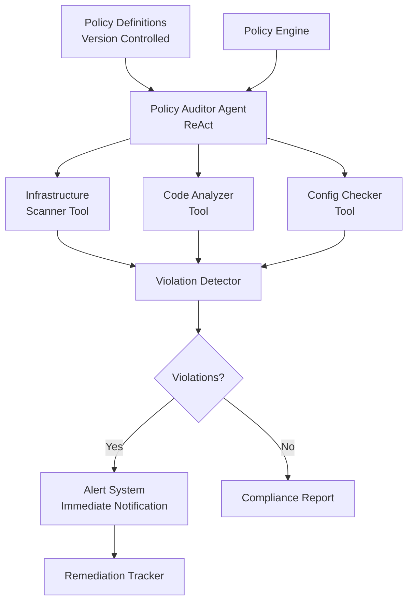

Infrastructure changes in a modern cloud environment happen faster than manual audits can keep up. A team deploying 50+ times per day through CI/CD pipelines can introduce misconfigurations — an S3 bucket without encryption, a security group with port 22 open to 0.0.0.0/0, a Kubernetes pod running as root — that traditional quarterly audits only discover weeks later. By then, the misconfiguration has been live in production, potentially exposing sensitive data or creating attack vectors. Manual audits also suffer from inconsistency: different auditors interpret policies differently, leading to 20-30% of violations being missed depending on who performs the review.

For regulated industries (financial services under SOC 2, healthcare under HIPAA, payments under PCI DSS), continuous compliance is not optional — gaps between audits represent periods of unknown risk that regulators increasingly view as insufficient controls.

## Solution Architecture

Beluga AI's ReAct agents bring reasoning capabilities to policy auditing. Unlike static scanning tools that apply fixed rules, a ReAct agent can prioritize which resources to scan first (critical production infrastructure before staging), correlate findings across domains (a code secret combined with an open network port is more severe than either alone), and adapt scanning depth based on findings. The agent orchestrates specialized tools — infrastructure scanners, static code analyzers, and configuration checkers — through `tool.NewFuncTool`, reasoning about which tools to invoke and in what order based on the audit scope. Policies are version-controlled in Git, so compliance rules evolve alongside the infrastructure they govern.



## Policy Auditor Agent

Create a ReAct agent with specialized scanning tools:

```go
package main

import (
    "context"
    "fmt"
    "log"
    "time"

    "github.com/lookatitude/beluga-ai/agent"
    "github.com/lookatitude/beluga-ai/llm"
    "github.com/lookatitude/beluga-ai/schema"
    "github.com/lookatitude/beluga-ai/tool"

    _ "github.com/lookatitude/beluga-ai/agent/providers/react"
    _ "github.com/lookatitude/beluga-ai/llm/providers/openai"
)

type PolicyAuditorAgent struct {
    agent        agent.Agent
    policyEngine *PolicyEngine
}

func NewPolicyAuditorAgent(ctx context.Context) (*PolicyAuditorAgent, error) {
    model, err := llm.New("openai", llm.ProviderConfig{
        APIKey: os.Getenv("OPENAI_API_KEY"),
        Model:  "gpt-4o",
    })
    if err != nil {
        return nil, fmt.Errorf("create model: %w", err)
    }

    tools := []tool.Tool{
        createInfrastructureScannerTool(),
        createCodeAnalyzerTool(),
        createConfigCheckerTool(),
    }

    ag, err := agent.New("react", agent.Config{
        Name:        "policy-auditor",
        Description: "DevSecOps policy auditor that scans infrastructure, code, and configurations for policy violations",
        Model:       model,
        Tools:       tools,
        MaxIterations: 15,
    })
    if err != nil {
        return nil, fmt.Errorf("create agent: %w", err)
    }

    return &PolicyAuditorAgent{
        agent:        ag,
        policyEngine: NewPolicyEngine(),
    }, nil
}

// Infrastructure scanning tool
func createInfrastructureScannerTool() tool.Tool {
    return tool.NewFuncTool(
        "scan_infrastructure",
        "Scan infrastructure for security and compliance violations (IAM, network, encryption, etc.)",
        func(ctx context.Context, scope string) (string, error) {
            violations := scanInfrastructure(scope)
            if len(violations) == 0 {
                return "No infrastructure violations found", nil
            }
            return formatViolations("infrastructure", violations), nil
        },
    )
}

// Code analysis tool using static analysis
func createCodeAnalyzerTool() tool.Tool {
    return tool.NewFuncTool(
        "analyze_code",
        "Analyze code for security vulnerabilities, secrets, and policy violations",
        func(ctx context.Context, repository string, branch string) (string, error) {
            violations := analyzeCode(repository, branch)
            if len(violations) == 0 {
                return "No code violations found", nil
            }
            return formatViolations("code", violations), nil
        },
    )
}

// Configuration checker tool
func createConfigCheckerTool() tool.Tool {
    return tool.NewFuncTool(
        "check_config",
        "Check deployment configurations for compliance violations",
        func(ctx context.Context, configType string, path string) (string, error) {
            violations := checkConfiguration(configType, path)
            if len(violations) == 0 {
                return "No configuration violations found", nil
            }
            return formatViolations("config", violations), nil
        },
    )
}
```

## Policy Engine

Implement a policy engine that loads and evaluates version-controlled policies:

```go
type Policy struct {
    ID          string
    Category    string // "security", "compliance", "best-practice"
    Severity    string // "critical", "high", "medium", "low"
    Description string
    Check       func(context.Context, any) (bool, string)
}

type PolicyEngine struct {
    policies map[string]Policy
}

func NewPolicyEngine() *PolicyEngine {
    return &PolicyEngine{
        policies: loadPoliciesFromGit(),
    }
}

func (e *PolicyEngine) LoadPolicies(ctx context.Context, scope AuditScope) ([]Policy, error) {
    var relevant []Policy
    for _, policy := range e.policies {
        if scope.MatchesPolicy(policy) {
            relevant = append(relevant, policy)
        }
    }
    return relevant, nil
}

// Example policies
func loadPoliciesFromGit() map[string]Policy {
    return map[string]Policy{
        "sec-001": {
            ID:          "sec-001",
            Category:    "security",
            Severity:    "critical",
            Description: "All S3 buckets must have encryption enabled",
            Check: func(ctx context.Context, resource any) (bool, string) {
                bucket := resource.(S3Bucket)
                if !bucket.EncryptionEnabled {
                    return false, fmt.Sprintf("Bucket %s has no encryption", bucket.Name)
                }
                return true, ""
            },
        },
        "sec-002": {
            ID:          "sec-002",
            Category:    "security",
            Severity:    "high",
            Description: "No hardcoded secrets in code",
            Check: func(ctx context.Context, resource any) (bool, string) {
                file := resource.(CodeFile)
                if hasSecrets(file.Content) {
                    return false, fmt.Sprintf("Secrets found in %s", file.Path)
                }
                return true, ""
            },
        },
        "comp-001": {
            ID:          "comp-001",
            Category:    "compliance",
            Severity:    "critical",
            Description: "All data stores must have backup enabled",
            Check: func(ctx context.Context, resource any) (bool, string) {
                store := resource.(DataStore)
                if !store.BackupEnabled {
                    return false, fmt.Sprintf("Datastore %s has no backup", store.Name)
                }
                return true, ""
            },
        },
    }
}
```

## Audit Execution

The agent receives an audit scope and policy set, then autonomously decides which tools to invoke and in what order. This is more powerful than running all scanners in parallel because the agent can adapt — if the infrastructure scan reveals an unencrypted S3 bucket, the agent can prioritize code analysis for that bucket's access patterns, correlating findings that static tools would report independently:

```go
type AuditScope struct {
    Infrastructure bool
    Code           bool
    Config         bool
    Repositories   []string
    Environments   []string
}

type AuditReport struct {
    Scope       AuditScope
    Violations  []Violation
    Compliance  float64
    Timestamp   time.Time
    Duration    time.Duration
}

type Violation struct {
    PolicyID    string
    Severity    string
    Category    string
    Resource    string
    Description string
}

func (p *PolicyAuditorAgent) RunAudit(ctx context.Context, scope AuditScope) (*AuditReport, error) {
    start := time.Now()

    // Load policies for scope
    policies, err := p.policyEngine.LoadPolicies(ctx, scope)
    if err != nil {
        return nil, fmt.Errorf("load policies: %w", err)
    }

    // Build audit prompt
    prompt := fmt.Sprintf(`Perform a comprehensive policy audit for the following scope:

Infrastructure: %v
Code Repositories: %v
Config Environments: %v

Policies to check (%d total):
%s

Use available tools to:
1. Scan infrastructure for security and compliance issues
2. Analyze code for vulnerabilities and secrets
3. Check deployment configurations

Report all violations found with policy ID, severity, and details.`,
        scope.Infrastructure,
        scope.Repositories,
        scope.Environments,
        len(policies),
        formatPolicies(policies),
    )

    // Execute agent
    result, err := p.agent.Execute(ctx, prompt)
    if err != nil {
        return nil, fmt.Errorf("agent execution: %w", err)
    }

    // Parse violations from agent result
    violations := parseViolations(result)

    // Calculate compliance score
    compliance := calculateCompliance(violations, policies)

    report := &AuditReport{
        Scope:      scope,
        Violations: violations,
        Compliance: compliance,
        Timestamp:  time.Now(),
        Duration:   time.Since(start),
    }

    // Alert on critical violations
    if err := p.alertViolations(ctx, violations); err != nil {
        log.Printf("Failed to send alerts: %v", err)
    }

    return report, nil
}

func calculateCompliance(violations []Violation, policies []Policy) float64 {
    if len(policies) == 0 {
        return 100.0
    }

    // Weight violations by severity
    weights := map[string]float64{
        "critical": 3.0,
        "high":     2.0,
        "medium":   1.0,
        "low":      0.5,
    }

    totalWeight := 0.0
    violationWeight := 0.0

    for _, policy := range policies {
        w := weights[policy.Severity]
        totalWeight += w

        for _, v := range violations {
            if v.PolicyID == policy.ID {
                violationWeight += w
                break
            }
        }
    }

    if totalWeight == 0 {
        return 100.0
    }

    return ((totalWeight - violationWeight) / totalWeight) * 100.0
}
```

## Violation Alerting

Send immediate alerts for critical violations:

```go
import (
    "github.com/lookatitude/beluga-ai/o11y"
    "go.opentelemetry.io/otel"
)

func (p *PolicyAuditorAgent) alertViolations(ctx context.Context, violations []Violation) error {
    critical := []Violation{}
    high := []Violation{}

    for _, v := range violations {
        switch v.Severity {
        case "critical":
            critical = append(critical, v)
        case "high":
            high = append(high, v)
        }
    }

    if len(critical) > 0 {
        if err := sendAlert("critical", critical); err != nil {
            return err
        }
    }

    if len(high) > 0 {
        if err := sendAlert("high", high); err != nil {
            return err
        }
    }

    return nil
}

func sendAlert(severity string, violations []Violation) error {
    message := fmt.Sprintf("%d %s severity violations found:\n", len(violations), severity)
    for _, v := range violations {
        message += fmt.Sprintf("- [%s] %s: %s\n", v.PolicyID, v.Resource, v.Description)
    }

    // Send to Slack, PagerDuty, etc.
    return notifyTeam(severity, message)
}
```

## Continuous Monitoring

Schedule periodic audits for continuous compliance:

```go
import "time"

func (p *PolicyAuditorAgent) StartContinuousMonitoring(ctx context.Context, scope AuditScope, interval time.Duration) {
    ticker := time.NewTicker(interval)
    defer ticker.Stop()

    for {
        select {
        case <-ctx.Done():
            return
        case <-ticker.C:
            report, err := p.RunAudit(ctx, scope)
            if err != nil {
                log.Printf("Audit failed: %v", err)
                continue
            }

            log.Printf("Audit completed: %d violations, %.1f%% compliance",
                len(report.Violations), report.Compliance)

            // Store report
            if err := storeReport(report); err != nil {
                log.Printf("Failed to store report: %v", err)
            }
        }
    }
}
```

## Production Considerations

### Observability

Track audit metrics and violation trends:

```go
import (
    "go.opentelemetry.io/otel"
    "go.opentelemetry.io/otel/attribute"
    "go.opentelemetry.io/otel/metric"
)

func (p *PolicyAuditorAgent) RunAuditWithMetrics(ctx context.Context, scope AuditScope) (*AuditReport, error) {
    tracer := otel.Tracer("policy-auditor")
    ctx, span := tracer.Start(ctx, "audit.run")
    defer span.End()

    meter := otel.Meter("policy-auditor")

    start := time.Now()
    report, err := p.RunAudit(ctx, scope)
    duration := time.Since(start)

    if err != nil {
        span.RecordError(err)
        return nil, err
    }

    span.SetAttributes(
        attribute.Int("violations.count", len(report.Violations)),
        attribute.Float64("compliance.score", report.Compliance),
        attribute.Float64("audit.duration_seconds", duration.Seconds()),
    )

    // Record metrics
    violationCounter, _ := meter.Int64Counter("audit.violations.total")
    violationCounter.Add(ctx, int64(len(report.Violations)))

    complianceGauge, _ := meter.Float64ObservableGauge("audit.compliance.score")
    complianceGauge.Observe(ctx, report.Compliance)

    return report, nil
}
```

### Tool Reliability

Implement robust tool execution with retries:

```go
import "github.com/lookatitude/beluga-ai/resilience"

func createRobustInfrastructureScannerTool() tool.Tool {
    return tool.NewFuncTool(
        "scan_infrastructure",
        "Scan infrastructure for security and compliance violations",
        func(ctx context.Context, scope string) (string, error) {
            policy := resilience.RetryPolicy{
                MaxAttempts:    3,
                InitialBackoff: 1 * time.Second,
                MaxBackoff:     10 * time.Second,
                BackoffFactor:  2.0,
            }

            return resilience.Retry(ctx, policy, func(ctx context.Context) (string, error) {
                return scanInfrastructure(scope), nil
            })
        },
    )
}
```

### Configuration

```yaml
auditor:
  agent:
    model: "gpt-4o"
    max_iterations: 15
    timeout: 300s

  policies:
    repository: "git@github.com:company/security-policies.git"
    branch: "main"
    refresh_interval: 1h

  monitoring:
    interval: 1h
    continuous: true

  alerts:
    critical:
      channels: ["pagerduty", "slack"]
      immediate: true
    high:
      channels: ["slack", "email"]
      immediate: false

  tools:
    infrastructure_scanner:
      providers: ["aws", "gcp", "azure"]
      timeout: 60s
    code_analyzer:
      static_analysis_tools: ["semgrep", "gosec"]
      secret_scanning: true
    config_checker:
      kubernetes: true
      terraform: true
```

## Results

Organizations using automated policy auditing with Beluga AI achieve:

| Metric | Before | After | Improvement |
|--------|--------|-------|-------------|
| Audit Cycle Time | 2-3 weeks | 0.3 weeks | 90%+ reduction |
| Violation Detection | 70-80% | 96% | 20-37% improvement |
| Time to Detect | Weeks | 30 minutes | 99% reduction |
| Compliance Score | 75% | 96% | 28% improvement |

## Related Resources

- [Agent Types Guide](/docs/guides/agent-types/) for ReAct agent patterns
- [Tool Integration](/docs/guides/tool-integration/) for custom tool development
- [Security Best Practices](/docs/guides/security/) for production security
