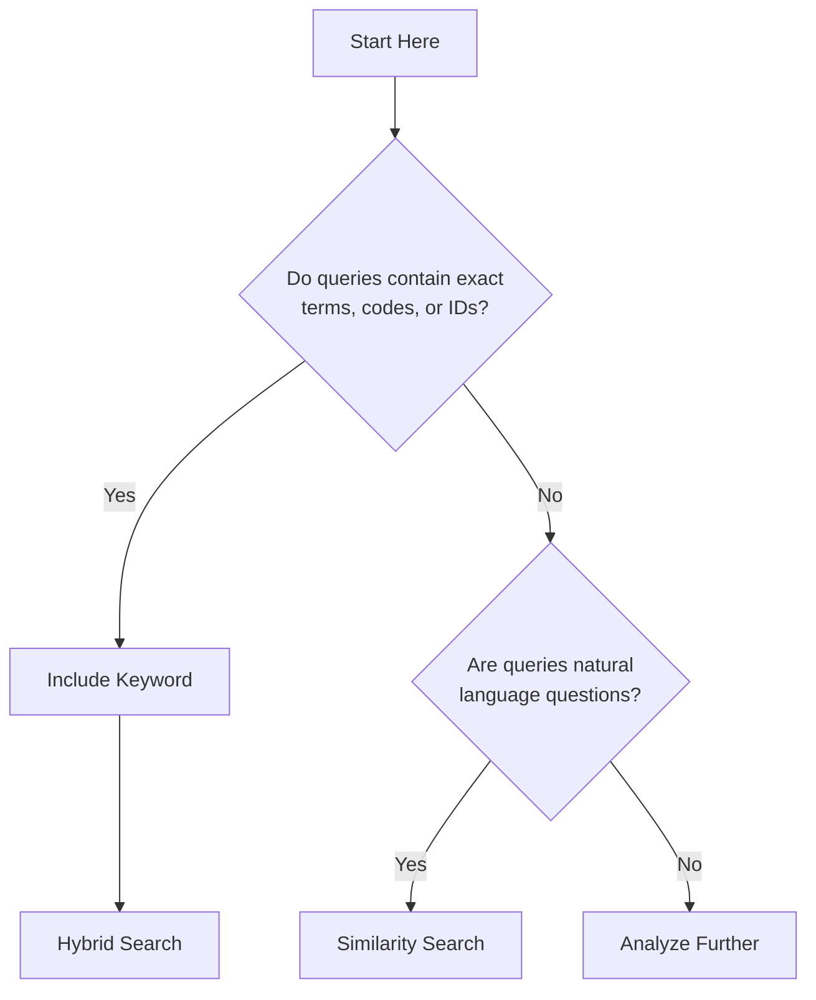
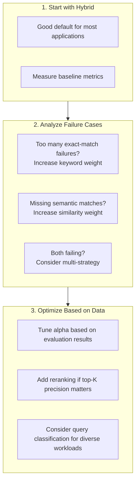

Choosing the right retrieval strategy is one of the most impactful decisions in a RAG (Retrieval-Augmented Generation) system. The retrieval step determines what context the LLM sees — if retrieval returns irrelevant documents, the LLM generates answers grounded in wrong information, which is worse than no answer at all. The wrong strategy leads to irrelevant documents, wrong answers, and frustrated users.

This guide compares different RAG strategies available in Beluga AI, explains when each excels, and provides implementation examples to help you make informed decisions. Beluga AI defaults to hybrid search (Vector + BM25 + RRF fusion) because it provides the best general-purpose accuracy, but specific use cases benefit from more specialized strategies like CRAG (self-correcting retrieval) or HyDE (hypothetical document generation).

## Why Strategy Matters

The choice of retrieval strategy significantly impacts system effectiveness:

| Metric | Impact of Strategy |
|--------|-------------------|
| **Accuracy** | Wrong strategy leads to wrong documents and wrong answers |
| **Latency** | Complex strategies add processing time |
| **Cost** | Embedding calls cost money; choose wisely |
| **User satisfaction** | Users trust systems that consistently find relevant content |

### Common Pain Points

1. **"It doesn't find the right documents"** — Usually a strategy mismatch
2. **"It's too slow"** — Overly complex strategy for the use case
3. **"It works sometimes but not always"** — Lack of fallback strategies
4. **"Technical queries fail"** — Over-reliance on semantic search

## Strategy Comparison

| Strategy | Best For | Latency | Complexity | When to Use |
|----------|----------|---------|------------|-------------|
| **Similarity** | Semantic understanding, Q&A | Medium | Low | Natural language queries |
| **Keyword** | Technical content, exact terms | Low | Low | Code, IDs, acronyms |
| **Hybrid** | General purpose | Medium-High | Medium | Most applications |
| **Multi-strategy** | Complex domains | High | High | Enterprise search |
| **With Reranking** | Precision-critical | High | High | Top-N accuracy matters |

### Decision Framework



## Strategy 1: Similarity-Only RAG

Best suited for natural language questions where semantic understanding matters more than exact matches. Handles synonyms, varied vocabulary, and cross-lingual queries well.

### When to Use

- Natural language questions ("What is X?", "How do I Y?")
- Documents use varied vocabulary for the same concepts
- Multi-lingual or cross-lingual search

### Implementation

```go
package main

import (
    "context"
    "fmt"

    "github.com/lookatitude/beluga-ai/rag/embedding"
    "github.com/lookatitude/beluga-ai/rag/retriever"
    "github.com/lookatitude/beluga-ai/rag/vectorstore"

    _ "github.com/lookatitude/beluga-ai/rag/embedding/providers/openai"
    _ "github.com/lookatitude/beluga-ai/rag/vectorstore/providers/pgvector"
)

func similarityRAG(ctx context.Context, query string) ([]retriever.Result, error) {
    ret, err := retriever.New("similarity", nil)
    if err != nil {
        return nil, fmt.Errorf("create retriever: %w", err)
    }

    docs, err := ret.Retrieve(ctx, query,
        retriever.WithTopK(10),
        retriever.WithThreshold(0.7),
    )
    if err != nil {
        return nil, fmt.Errorf("retrieve: %w", err)
    }

    return docs, nil
}
```

| Pros | Cons |
|------|------|
| Semantic understanding | Misses exact term matches |
| Handles synonyms | Requires embedding computation |
| Works across languages | Cannot handle acronyms/codes |
| Good for Q&A | Less interpretable |

## Strategy 2: Keyword-Only RAG

Best suited for technical documentation with specific terminology, code search, error messages, product IDs, and other identifiers where exact matching is critical.

### When to Use

- Technical documentation with specific terminology
- Code search and error messages
- Product IDs, order numbers, or other identifiers

### Implementation

```go
func keywordRAG(ctx context.Context, query string) ([]retriever.Result, error) {
    ret, err := retriever.New("keyword", nil)
    if err != nil {
        return nil, fmt.Errorf("create retriever: %w", err)
    }

    docs, err := ret.Retrieve(ctx, query,
        retriever.WithTopK(10),
        retriever.WithThreshold(0.5),
    )
    if err != nil {
        return nil, fmt.Errorf("retrieve: %w", err)
    }

    return docs, nil
}
```

| Pros | Cons |
|------|------|
| Fast (no embedding needed) | No semantic understanding |
| Exact term matching | Misses synonyms |
| Good for codes/IDs | Language-dependent |
| Interpretable results | Vocabulary mismatch issues |

## Strategy 3: Hybrid RAG

Beluga AI's default retrieval strategy combines vector similarity search with BM25 keyword matching, using Reciprocal Rank Fusion (RRF) to merge results. This hybrid approach outperforms either method alone and is the recommended starting point for most applications.

### When to Use

- General-purpose applications
- Mixed query types (natural language + technical)
- When you cannot predict user behavior
- As a sensible default

### Implementation

```go
package main

import (
    "context"
    "fmt"

    "github.com/lookatitude/beluga-ai/llm"
    "github.com/lookatitude/beluga-ai/rag/retriever"
    "github.com/lookatitude/beluga-ai/schema"

    _ "github.com/lookatitude/beluga-ai/llm/providers/openai"
)

func hybridRAG(ctx context.Context, question string) (string, error) {
    // Hybrid retriever: vector + BM25 + RRF fusion
    ret, err := retriever.New("hybrid", nil)
    if err != nil {
        return "", fmt.Errorf("create retriever: %w", err)
    }

    docs, err := ret.Retrieve(ctx, question,
        retriever.WithTopK(5),
        retriever.WithThreshold(0.7),
    )
    if err != nil {
        return "", fmt.Errorf("retrieve: %w", err)
    }

    // Build context from retrieved documents
    var docContext string
    for _, doc := range docs {
        docContext += doc.Content + "\n\n"
    }

    // Generate answer grounded in retrieved context
    model, err := llm.New("openai", nil)
    if err != nil {
        return "", fmt.Errorf("create model: %w", err)
    }

    msgs := []schema.Message{
        &schema.SystemMessage{Parts: []schema.ContentPart{
            schema.TextPart{Text: "Answer the question using only the provided context. " +
                "If the context doesn't contain the answer, say so."},
        }},
        &schema.HumanMessage{Parts: []schema.ContentPart{
            schema.TextPart{Text: fmt.Sprintf("Context:\n%s\n\nQuestion: %s", docContext, question)},
        }},
    }

    resp, err := model.Generate(ctx, msgs)
    if err != nil {
        return "", fmt.Errorf("generate: %w", err)
    }

    return resp.Parts[0].(schema.TextPart).Text, nil
}
```

### Tuning Alpha (Similarity Weight)

The hybrid retriever supports an alpha parameter that controls the balance between semantic similarity and keyword matching:

- **Alpha = 0.5**: Balanced (default)
- **Alpha = 0.7**: More weight on semantic similarity
- **Alpha = 0.3**: More weight on keyword matching

| Pros | Cons |
|------|------|
| Best of both worlds | Higher latency |
| Robust to query types | More complex |
| Good default choice | Harder to debug |
| Handles edge cases | Requires tuning alpha |

## Strategy 4: Multi-Strategy RAG

For complex enterprise applications where query types are diverse and predictable, a multi-strategy approach classifies queries first and routes them to the most appropriate retrieval strategy.

```go
func multiStrategyRAG(ctx context.Context, query string) ([]retriever.Result, error) {
    // Classify query type
    queryType := classifyQuery(query)

    var strategyName string
    switch queryType {
    case "definition":
        strategyName = "similarity"
    case "code":
        strategyName = "keyword"
    case "troubleshooting":
        strategyName = "hybrid"
    default:
        strategyName = "hybrid"
    }

    ret, err := retriever.New(strategyName, nil)
    if err != nil {
        // Fallback to hybrid on error
        ret, err = retriever.New("hybrid", nil)
        if err != nil {
            return nil, fmt.Errorf("create fallback retriever: %w", err)
        }
    }

    return ret.Retrieve(ctx, query, retriever.WithTopK(10))
}
```

## Strategy 5: RAG with Reranking

When precision at the top positions is critical, a two-stage retrieval pipeline retrieves more candidates than needed, then reranks them with a cross-encoder model for higher accuracy.

```go
func rerankingRAG(ctx context.Context, query string) ([]retriever.Result, error) {
    // Stage 1: Retrieve more candidates than needed
    ret, err := retriever.New("hybrid", nil)
    if err != nil {
        return nil, fmt.Errorf("create retriever: %w", err)
    }

    candidates, err := ret.Retrieve(ctx, query,
        retriever.WithTopK(30), // Retrieve 3x more for reranking
    )
    if err != nil {
        return nil, fmt.Errorf("retrieve: %w", err)
    }

    // Stage 2: Rerank with cross-encoder
    reranked, err := rerank(ctx, query, candidates)
    if err != nil {
        // Fall back to original ranking
        reranked = candidates
    }

    // Take top K after reranking
    topK := 10
    if len(reranked) < topK {
        topK = len(reranked)
    }

    return reranked[:topK], nil
}
```

| Pros | Cons |
|------|------|
| Higher precision at top K | Significantly higher latency |
| Can rescue poor initial ranking | Expensive (model inference) |
| State-of-the-art accuracy | Complexity |
| Works with any base strategy | Additional model to maintain |

## Implementation Recommendations

### Choosing Your Strategy



### Expected Performance by Strategy

| Strategy | MRR | P@5 | Latency (p95) | Use Case Fit |
|----------|-----|-----|---------------|--------------|
| Similarity | 0.65-0.80 | 0.60-0.75 | 100-300ms | Q&A, semantic |
| Keyword | 0.55-0.70 | 0.50-0.65 | 20-100ms | Technical, exact |
| Hybrid | 0.70-0.85 | 0.65-0.80 | 150-400ms | General purpose |
| Multi-strategy | 0.75-0.88 | 0.70-0.85 | 200-500ms | Complex domains |
| With Reranking | 0.80-0.92 | 0.75-0.90 | 400-1000ms | Precision-critical |

## Lessons Learned

### What Works

1. **Start simple, measure, then optimize**: Hybrid is a reliable default
2. **Query classification helps**: Different queries need different strategies
3. **Fallbacks are essential**: Systems must handle edge cases gracefully
4. **Monitoring matters**: You cannot improve what you do not measure

### Common Mistakes

1. **Over-engineering early**: Do not add reranking until you need it
2. **Ignoring exact matches**: Technical users need keyword search
3. **Not tuning alpha**: Default 0.5 may not be optimal for your domain
4. **Skipping evaluation**: Build eval datasets early

### Performance Tips

1. **Cache embeddings**: Same queries get repeated
2. **Batch embedding calls**: Reduce API round-trips
3. **Set reasonable timeouts**: Fail fast on slow retrievals
4. **Use async where possible**: Do not block on parallel searches

## Related Resources

- [Enterprise RAG Knowledge Base](/use-cases/enterprise-rag/) for full RAG pipeline setup
- [RAG Pipeline Guide](/guides/rag-pipeline/) for step-by-step configuration
- [RAG Recipes](/cookbook/rag-recipes/) for advanced retrieval patterns
