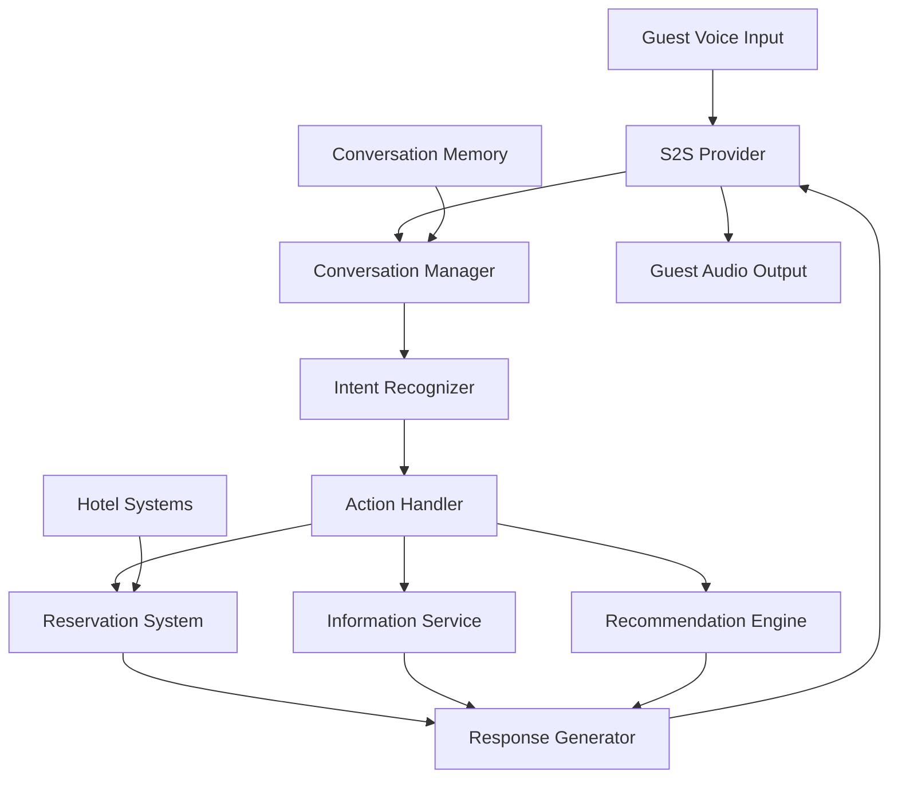

Luxury hotel chains spend $50K+ per month per hotel on human concierge services with limited availability (business hours only) and long wait times during peak demand. Guest satisfaction drops sharply when concierge wait times exceed 3 minutes, but staffing for peak demand means significant idle time during off-peak hours. The core business problem is that concierge labor costs scale linearly with availability, while guest demand is highly variable.

An AI concierge using speech-to-speech (S2S) provides 24/7 natural voice interactions, handles reservations and guest inquiries, and scales to unlimited concurrent guests with sub-2-second response times. S2S is chosen over separate STT+TTS because hospitality interactions demand natural, conversational pacing — guests expect the same responsiveness from a voice AI as from a human at the front desk.

## Solution Architecture



The concierge uses Beluga AI's S2S provider for real-time speech-to-speech. Tool functions connect to hotel systems for reservations, information lookup, and recommendations. Conversation memory maintains context across multi-turn interactions.

The tool-based integration approach is deliberate: rather than training a custom model on hotel-specific knowledge, the system gives the S2S model access to hotel systems through well-defined tool functions. This means hotel information stays in the source systems (PMS, reservation database, knowledge base) and is always current — no retraining needed when hours change or new amenities are added.

## Implementation

### Concierge Setup

The concierge is built by creating an S2S session with tool definitions for hotel operations. Beluga AI's `tool.NewFuncTool` creates type-safe tools from Go functions with automatic JSON schema generation from the struct tags. The event loop processes three event types: audio output (stream to guest), tool calls (execute against hotel systems), and transcripts (log for quality assurance).

```go
package main

import (
    "context"
    "fmt"

    "github.com/lookatitude/beluga-ai/schema"
    "github.com/lookatitude/beluga-ai/tool"
    "github.com/lookatitude/beluga-ai/voice/s2s"

    _ "github.com/lookatitude/beluga-ai/voice/s2s/providers/openai"
)

func startConcierge(ctx context.Context, guestID string) error {
    bookingTool := tool.NewFuncTool[BookingInput](
        "make_reservation",
        "Make a restaurant, spa, or activity reservation for the guest",
        func(ctx context.Context, input BookingInput) (*tool.Result, error) {
            confirmation, err := bookingSystem.Reserve(ctx, input)
            if err != nil {
                return tool.ErrorResult(err), nil
            }
            return tool.TextResult(fmt.Sprintf("Reservation confirmed: %s", confirmation)), nil
        },
    )

    infoTool := tool.NewFuncTool[InfoInput](
        "hotel_info",
        "Look up hotel information (hours, amenities, directions)",
        func(ctx context.Context, input InfoInput) (*tool.Result, error) {
            info, err := hotelDB.Lookup(ctx, input.Topic)
            if err != nil {
                return tool.ErrorResult(err), nil
            }
            return tool.TextResult(info), nil
        },
    )

    engine, err := s2s.New("openai", nil)
    if err != nil {
        return fmt.Errorf("create s2s engine: %w", err)
    }

    session, err := engine.Start(ctx,
        s2s.WithVoice("nova"),
        s2s.WithInstructions("You are a luxury hotel concierge. Be warm, professional, "+
            "and helpful. Use the guest's name when known. You can make reservations "+
            "and look up hotel information."),
        s2s.WithTools([]schema.ToolDefinition{
            tool.ToDefinition(bookingTool),
            tool.ToDefinition(infoTool),
        }),
    )
    if err != nil {
        return fmt.Errorf("start session: %w", err)
    }
    defer session.Close()

    for event := range session.Recv() {
        switch event.Type {
        case s2s.EventAudioOutput:
            transport.SendAudio(event.Audio)
        case s2s.EventToolCall:
            result := executeTool(ctx, event.ToolCall, bookingTool, infoTool)
            session.SendToolResult(ctx, result)
        case s2s.EventTranscript:
            logTranscript(ctx, guestID, event.Text)
        }
    }

    return nil
}

type BookingInput struct {
    Type   string `json:"type" jsonschema:"enum=restaurant,spa,activity"`
    Date   string `json:"date" jsonschema:"description=Reservation date (YYYY-MM-DD)"`
    Time   string `json:"time" jsonschema:"description=Reservation time (HH:MM)"`
    Guests int    `json:"guests"`
    Name   string `json:"name" jsonschema:"description=Guest name"`
}

type InfoInput struct {
    Topic string `json:"topic" jsonschema:"description=Topic to look up (pool hours, restaurant menu, etc.)"`
}
```

## Deployment Considerations

- **Low latency**: S2S providers deliver sub-2-second response times for natural conversations
- **System integration**: Connect tool functions to hotel PMS, reservation systems, and knowledge bases
- **Conversation memory**: Use persistent state to maintain context across guest interactions
- **Multi-language**: Configure S2S instructions for each supported language
- **Failover**: Use Beluga AI's circuit breaker for provider failover; fall back to text-based chat if voice fails
- **Observability**: Track conversation quality, tool usage, and guest satisfaction with OpenTelemetry

## Results

| Metric | Before | After | Improvement |
|--------|--------|-------|-------------|
| Monthly cost per hotel | $50K+ | $9.5K | 81% reduction |
| Availability | 14 hrs/day | 24 hrs/day | 24/7 |
| Average response time | 120-300s | 1.5s | 99%+ reduction |
| Guest satisfaction | 7/10 | 9.2/10 | 31% improvement |

### Lessons Learned

- **S2S for real-time interaction**: Speech-to-speech provides the most responsive and natural guest experience
- **Persistent conversation state**: Implement state management early; in-memory state causes issues on reconnection
- **Domain-specific tools**: Hotel-specific tool functions improve accuracy over generic intent models

## Related Resources

- [Bilingual Conversation Tutor](/docs/use-cases/bilingual-tutor/) for S2S language learning patterns
- [Conversational AI Assistant](/docs/use-cases/conversational-ai/) for adding memory to voice agents
- [Voice AI Applications](/docs/use-cases/voice-applications/) for voice pipeline architecture
