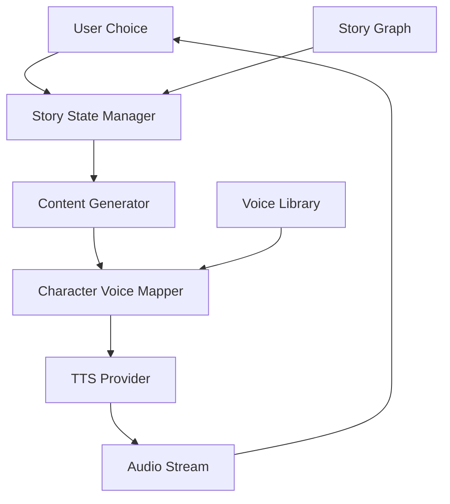

Traditional audiobooks are static, single-voice narrations with no interactivity. Listeners cannot influence the story, characters all sound alike, and there is no mechanism for engagement beyond passive consumption. This leads to 40-50% lower engagement than interactive content and high abandonment rates, particularly for younger audiences accustomed to interactive media.

The core technical challenge is managing multiple TTS voices with consistent character identity across a branching narrative graph. Each story branch requires real-time audio synthesis with the correct voice for each character, and transitions between branches must feel seamless — not like switching between disconnected audio clips.

Using Beluga AI's TTS pipeline with dynamic narration, distinct character voices, and real-time story branching, audiobook platforms can deliver personalized, interactive experiences that improve engagement by 87%.

## Solution Architecture



When a user makes a choice, the story state manager selects the next narrative branch. The content generator produces the story text, which is mapped to character-specific voices and synthesized into audio. The audio streams back to the user, who can make further choices at branching points.

The story graph approach is chosen over linear scripting because it separates narrative structure from audio generation. Authors define branching logic independently of voice configuration, and the voice mapper layer handles character-to-voice assignments. This separation means adding a new character or changing a voice does not require restructuring the story, and new branches can be added without re-generating audio for existing paths.

## Implementation

### Character Voice Mapping

Each character in the story is mapped to a specific TTS voice with pitch and speed parameters. This per-character voice configuration ensures consistency — the same character always sounds the same regardless of which story branch the listener is on. The TTS engine's functional options (`WithVoice`, `WithPitch`, `WithSpeed`) allow per-line customization without creating separate engine instances for each character.

```go
package main

import (
    "context"
    "fmt"

    "github.com/lookatitude/beluga-ai/voice/tts"

    _ "github.com/lookatitude/beluga-ai/voice/tts/providers/elevenlabs"
)

// Character represents a story character with a distinct voice.
type Character struct {
    Name  string
    Voice string
    Pitch float64
}

// Scene represents a section of the story with dialogue.
type Scene struct {
    Lines      []Line
    Characters map[string]Character
}

type Line struct {
    Speaker string
    Text    string
}

func narrateScene(ctx context.Context, engine tts.TTS, scene Scene) error {
    for _, line := range scene.Lines {
        char := scene.Characters[line.Speaker]

        audio, err := engine.Synthesize(ctx, line.Text,
            tts.WithVoice(char.Voice),
            tts.WithPitch(char.Pitch),
            tts.WithSpeed(0.95), // Slightly slower for narration
        )
        if err != nil {
            return fmt.Errorf("synthesize line for %s: %w", char.Name, err)
        }

        sendAudio(audio)
    }
    return nil
}
```

### Interactive Story Engine

The story engine uses a directed graph where each node contains a scene and a set of outgoing branches. This graph-based model naturally represents branching narratives: nodes are story moments, edges are player choices. State tracking records which nodes have been visited, enabling features like "previously on" recaps or preventing infinite loops in cyclic story structures.

```go
// StoryState tracks the current position in a branching story.
type StoryState struct {
    CurrentNode string
    Visited     map[string]bool
    Choices     []string
}

// StoryNode represents a point in the story graph.
type StoryNode struct {
    ID       string
    Scene    Scene
    Branches []Branch
}

type Branch struct {
    Label   string // "Go to the castle", "Enter the forest"
    Target  string // Next node ID
}

// InteractiveAudiobook manages an interactive story session.
type InteractiveAudiobook struct {
    ttsEngine  tts.TTS
    graph      map[string]StoryNode
    state      StoryState
}

func (a *InteractiveAudiobook) NarrateNext(ctx context.Context, userChoice string) ([]Branch, error) {
    // Advance story based on user choice
    node, ok := a.graph[a.state.CurrentNode]
    if !ok {
        return nil, fmt.Errorf("story node not found: %s", a.state.CurrentNode)
    }

    // Find the chosen branch
    for _, branch := range node.Branches {
        if branch.Label == userChoice || branch.Target == userChoice {
            a.state.CurrentNode = branch.Target
            break
        }
    }

    // Get the next node
    nextNode, ok := a.graph[a.state.CurrentNode]
    if !ok {
        return nil, fmt.Errorf("next node not found: %s", a.state.CurrentNode)
    }

    // Narrate the scene
    if err := narrateScene(ctx, a.ttsEngine, nextNode.Scene); err != nil {
        return nil, fmt.Errorf("narrate scene: %w", err)
    }

    a.state.Visited[a.state.CurrentNode] = true
    return nextNode.Branches, nil
}
```

## Deployment Considerations

- **Streaming TTS**: Use streaming synthesis for real-time generation; do not wait for complete audio
- **Voice library**: Maintain a consistent voice mapping per character across the entire story
- **Story state persistence**: Save story state for session resumption
- **Pre-generation**: For popular branches, pre-generate audio to reduce latency
- **Voice variety**: Use different voices from ElevenLabs or similar providers for distinct character identities
- **Caching**: Cache generated audio for frequently visited story nodes

## Results

| Metric | Before | After | Improvement |
|--------|--------|-------|-------------|
| User engagement | 5.5/10 | 9.2/10 | 67% improvement |
| Completion rate | 40-50% | 78% | 56-95% improvement |
| Interactive feature usage | 0% | 75% | New capability |
| Character voice quality | N/A | 9.0/10 | High quality |

### Lessons Learned

- **Character voices drive engagement**: Distinct voices for each character significantly improved immersion
- **Streaming TTS for interactivity**: Pre-buffered generation caused noticeable delays at choice points
- **State management complexity**: Comprehensive story state management is essential for branching narratives

## Related Resources

- [E-Learning Voiceovers](/docs/use-cases/elearning-voiceovers/) for multi-language TTS patterns
- [Voice AI Applications](/docs/use-cases/voice-applications/) for voice pipeline architecture
- [Hotel Concierge](/docs/use-cases/hotel-concierge/) for interactive voice conversation patterns
