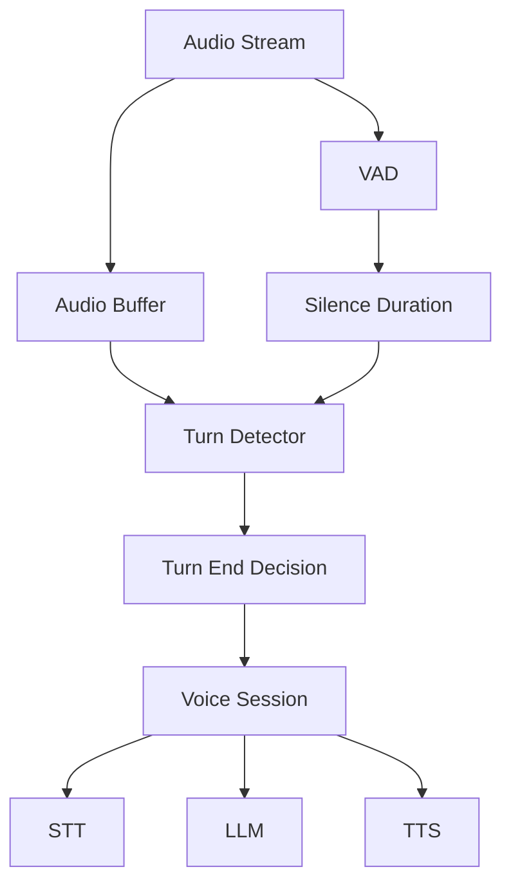

Voice AI vendors face a critical challenge: the delay between when a user stops speaking and when the system decides to respond. This "endpointing" decision directly impacts perceived responsiveness — every 100ms of unnecessary waiting adds to the user's sense of lag. Fixed silence windows (800ms) feel sluggish, while shorter windows cause premature interruptions that cut off users mid-thought. The fundamental tension is between responsiveness (respond quickly) and accuracy (wait long enough to be sure the user is done).

Low-latency turn prediction uses Beluga AI's turn detection with tuned heuristic and ONNX providers to achieve sub-100ms turn decisions with less than 5% false turn-end rate. The system offers two detection strategies — heuristic for rapid deployment and ONNX model-based for production accuracy — both accessed through the same `FrameProcessor` interface.

## Solution Architecture



The voice pipeline provides audio chunks and ongoing silence duration (from VAD). The turn detector uses this combined signal to decide when the user has finished speaking. On turn-end, the session triggers the STT, LLM, and TTS pipeline.

The turn detector consumes VAD output rather than raw audio because silence duration is the primary signal for turn-end detection. By placing the turn detector after VAD in the frame pipeline, it receives pre-computed speech/silence boundaries without duplicating that work. This layered approach also means the turn detector can be swapped (heuristic to ONNX) without changing the upstream VAD configuration.

## Implementation

### Heuristic Turn Detector

Start with heuristic detection for rapid iteration without model dependencies. The heuristic approach combines silence duration, word count, and punctuation signals — all available without a dedicated ML model. This makes it deployable immediately and tunable through configuration rather than retraining.

```go
package main

import (
    "context"
    "time"

    "github.com/lookatitude/beluga-ai/voice"
)

func setupHeuristicTurnDetector(ctx context.Context) voice.FrameProcessor {
    return voice.NewTurnDetector(voice.TurnDetectorConfig{
        MinSilenceDuration: 280 * time.Millisecond, // Starting point; tune per corpus
        MinTurnLength:      8,                       // Minimum words before turn-end
        MaxTurnLength:      4000,                    // Guard against very long turns
        SentenceEndMarkers: ".!?",                   // Punctuation-based heuristic
    })
}
```

### ONNX Turn Detector for Production

Upgrade to ONNX model-based detection for better accuracy in varied environments. The ONNX provider runs a trained turn-prediction model that captures patterns the heuristic cannot (prosody, speech rate changes, semantic cues). Both providers implement the same `FrameProcessor` interface, so switching from heuristic to ONNX is a configuration change, not a code change.

```go
func setupONNXTurnDetector(ctx context.Context, modelPath string) voice.FrameProcessor {
    return voice.NewTurnDetector(voice.TurnDetectorConfig{
        Provider:           "onnx",
        ModelPath:          modelPath,
        Threshold:          0.45,
        MinSilenceDuration: 250 * time.Millisecond,
    })
}
```

### Integration with Voice Pipeline

```go
func buildPipelineWithTurnDetection(ctx context.Context) (voice.FrameProcessor, error) {
    vad := voice.NewSileroVAD(voice.VADConfig{
        Threshold: 0.5,
    })

    turnDetector := setupHeuristicTurnDetector(ctx)

    // Turn detector receives both audio frames and silence duration from VAD
    // On turn-end decision, downstream processors (STT, LLM, TTS) are triggered
    pipeline := voice.Chain(vad, turnDetector, sttProc, agentProc, ttsProc)
    return pipeline, nil
}
```

## Tuning Guide

| Parameter | Default | Effect | Guidance |
|-----------|---------|--------|----------|
| MinSilenceDuration | 280ms | How long silence before turn-end | Lower = faster but more false positives |
| Threshold (ONNX) | 0.45 | Model confidence for turn-end | Higher = fewer false positives, more latency |
| MinTurnLength | 8 | Minimum words before turn-end possible | Prevents very short spurious turns |
| MaxTurnLength | 4000 | Maximum turn length | Guards against never-ending turns |
| SentenceEndMarkers | ".!?" | Punctuation signals turn-end | Language-specific; add per-language defaults |

## Deployment Considerations

- **Start with heuristic**: Deploy heuristic first; add ONNX once you have logs and latency targets
- **A/B testing**: Run heuristic vs ONNX in shadow mode to validate models before switching
- **Per-language tuning**: Add language-specific defaults for sentence-end markers and thresholds
- **Environment-specific**: Treat MinSilenceDuration and Threshold as per-environment configuration (quiet vs noisy)
- **Observability**: Instrument turn-detection latency and false positive/negative rates from day one

## Results

| Metric | Before | After | Improvement |
|--------|--------|-------|-------------|
| Turn decision latency (p50) | 350ms | 85ms | 76% reduction |
| False turn-end rate | 12% | 4% | 67% reduction |
| Agent think time (p95) | 480ms | 180ms | 63% reduction |

### Lessons Learned

- **DetectTurnWithSilence**: Using VAD-derived silence avoided extra buffering and sped up decisions
- **Config-driven tuning**: MinSilenceDuration, Threshold, and turn-length limits allowed quick per-environment iteration
- **ONNX validation**: Run shadow-mode comparisons before committing to model-based detection

## Related Resources

- [Barge-In Detection](/docs/use-cases/barge-in-detection/) for interruption handling
- [Voice Sessions Overview](/docs/use-cases/voice-sessions-overview/) for session and pipeline design
- [Voice AI Applications](/docs/use-cases/voice-applications/) for voice pipeline architecture
