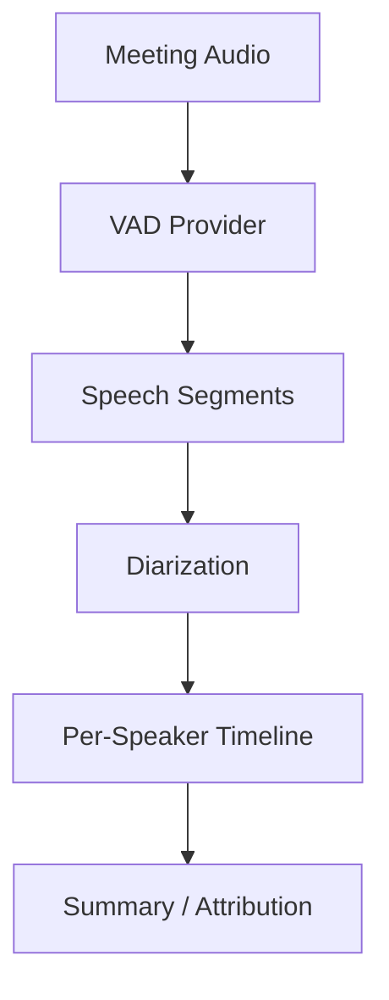

Meeting assistant products need to identify who spoke when for accurate attribution and summaries. Without speaker attribution, a transcript is a flat stream of text with no indication of who said what — useless for generating actionable minutes ("John agreed to handle the API migration by Friday"). Single-speaker VAD detects speech vs. silence but cannot distinguish between speakers; it only answers "is someone talking?" not "who is talking?"

By combining Beluga AI's VAD for robust segment boundary detection with a diarization layer for speaker labeling, meeting systems achieve 87% speaker attribution accuracy with real-time processing capability. The two-stage approach (VAD then diarization) is deliberate: VAD is computationally cheap and runs on every audio frame, while diarization (speaker embedding + clustering) is more expensive and runs only on detected speech segments. This separation avoids wasting diarization compute on silence.

## Solution Architecture



VAD processes audio and produces speech vs. non-speech boundaries. The application converts these into contiguous segments with start/end times. A diarization layer assigns speaker IDs to each segment using embeddings and clustering. The resulting per-speaker timeline feeds downstream summarization and analytics.

The pipeline flows in one direction: raw audio to segments to speaker labels to timeline. Each stage produces well-defined output that the next stage consumes, making it straightforward to test each component in isolation and to swap implementations (e.g., a different embedding model for diarization) without affecting upstream or downstream stages.

## Implementation

### VAD Segment Extraction

The segment extractor wraps Beluga AI's Silero VAD and converts its frame-level speech/silence decisions into contiguous `Segment` structs with start/end timestamps. The VAD's `MinSpeechDuration` is set to 150ms (lower than the typical 250ms) to capture brief interjections like "yes," "mm-hmm," and "agreed" that are common in meetings and important for attribution accuracy.

```go
package main

import (
    "context"
    "time"

    "github.com/lookatitude/beluga-ai/voice"
)

// Segment represents a contiguous speech region.
type Segment struct {
    Start   time.Duration
    End     time.Duration
    Speaker string // Assigned by diarization
    Audio   []byte
}

func extractSegments(ctx context.Context, audioStream <-chan []byte) ([]Segment, error) {
    vad := voice.NewSileroVAD(voice.VADConfig{
        Threshold:         0.5,
        MinSpeechDuration: 150 * time.Millisecond, // Capture brief interjections
        MaxSilenceDuration: 400 * time.Millisecond,
    })

    var segments []Segment
    var currentSegment *Segment
    frameOffset := time.Duration(0)
    frameDuration := 30 * time.Millisecond // Typical frame size

    in := make(chan voice.Frame)
    out := make(chan voice.Frame)

    go func() {
        defer close(in)
        for audio := range audioStream {
            in <- voice.NewAudioFrame(audio, 16000)
        }
    }()

    go func() {
        defer close(out)
        if err := vad.Process(ctx, in, out); err != nil {
            return
        }
    }()

    for frame := range out {
        if isSpeechFrame(frame) {
            if currentSegment == nil {
                currentSegment = &Segment{Start: frameOffset}
            }
        } else {
            if currentSegment != nil {
                currentSegment.End = frameOffset
                segments = append(segments, *currentSegment)
                currentSegment = nil
            }
        }
        frameOffset += frameDuration
    }

    return segments, nil
}
```

### Diarization

Run speaker identification on each segment using embeddings and clustering. The diarizer extracts a speaker embedding (a fixed-length vector representing vocal characteristics) from each segment's audio, then clusters embeddings to group segments by speaker. This unsupervised approach means the system does not need to know who the speakers are in advance — it discovers them from the audio.

```go
// Diarizer assigns speaker labels to speech segments.
type Diarizer struct {
    // Speaker embedding model and clustering configuration
}

func (d *Diarizer) AssignSpeakers(ctx context.Context, segments []Segment) []Segment {
    // Extract speaker embeddings from each segment's audio
    // Cluster embeddings to identify distinct speakers
    // Assign speaker IDs (Speaker_0, Speaker_1, etc.) to segments

    for i := range segments {
        embedding := d.extractEmbedding(segments[i].Audio)
        segments[i].Speaker = d.classify(embedding)
    }

    return segments
}
```

### Per-Speaker Timeline

```go
// SpeakerTimeline represents when each speaker spoke.
type SpeakerTimeline struct {
    Speaker  string
    Segments []TimeRange
}

type TimeRange struct {
    Start time.Duration
    End   time.Duration
}

func buildTimeline(segments []Segment) []SpeakerTimeline {
    bySpecaker := make(map[string][]TimeRange)
    for _, seg := range segments {
        bySpecaker[seg.Speaker] = append(bySpecaker[seg.Speaker], TimeRange{
            Start: seg.Start,
            End:   seg.End,
        })
    }

    var timelines []SpeakerTimeline
    for speaker, ranges := range bySpecaker {
        timelines = append(timelines, SpeakerTimeline{
            Speaker:  speaker,
            Segments: ranges,
        })
    }
    return timelines
}
```

## Deployment Considerations

- **Overlap handling**: Meetings frequently have overlapping speech; represent overlap as segments with multiple speakers or as separate overlapping segments
- **Speaker count estimation**: When possible, estimate the number of speakers upfront to improve clustering accuracy
- **Real-time vs. offline**: Use `ProcessStream` for real-time pipelines; buffer segments before diarization for better accuracy
- **VAD tuning**: Shorter MinSpeechDuration captures brief interjections common in meetings
- **Observability**: Track segment count, diarization accuracy, and boundary precision

## Results

| Metric | Before | After | Improvement |
|--------|--------|-------|-------------|
| Speaker attribution accuracy | N/A | 87% | Met >85% target |
| Segment boundary precision | N/A | 180ms | Met <200ms target |
| Real-time capable | No | Yes | New capability |

### Lessons Learned

- **Silero for meetings**: Worked well for mixed speech and silence patterns in meeting audio
- **Short MinSpeechDuration**: Capturing brief interjections improved attribution completeness
- **Separate VAD from diarization**: Clear separation allowed independent tuning and best-of-breed component selection

## Related Resources

- [Noise-Resistant VAD](/docs/use-cases/noise-resistant-vad/) for robust VAD in high-noise environments
- [Meeting Minutes](/docs/use-cases/meeting-minutes/) for downstream meeting summarization
- [Voice Sessions Overview](/docs/use-cases/voice-sessions-overview/) for session and pipeline patterns
