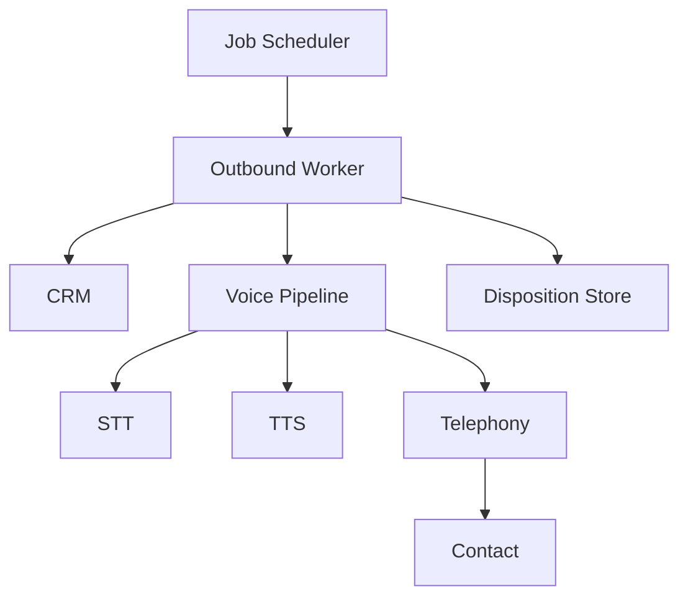

Sales and operations teams often need to make thousands of outbound calls daily for appointment reminders, consent verification, and simple surveys. Manual calling is expensive ($15-25 per agent-hour), inconsistent (agents deviate from scripts and forget follow-ups), and lacks a reliable audit trail for compliance-sensitive outcomes like consent confirmations. The economics break down at scale: a team of 10 agents can handle roughly 200 calls per day, but demand often exceeds 2,000.

This use case demonstrates automating outbound calls using Beluga AI's voice pipeline with STT/TTS for scripted interactions. STT and TTS are used as separate components (rather than S2S) because the call flow is scripted with explicit branching logic — the system needs to inspect the transcribed text to decide which script branch to follow next.

## Solution Architecture



A job scheduler triggers outbound sessions per contact. Each worker creates a voice pipeline that handles the call through STT/TTS, executing the appropriate script (reminder, consent, or survey). On call completion or timeout, the worker records the disposition.

The worker-based architecture separates scheduling from call execution, allowing independent scaling. Workers are stateless except for the active call, which means they can be horizontally scaled to match call volume without coordination overhead.

## Implementation

### Outbound Call Session

The caller wraps STT and TTS engines and exposes per-script methods (e.g., `ExecuteReminder`). Each method follows a synthesize-listen-branch pattern: play the prompt via TTS, listen for a response via streaming STT, and branch based on the transcribed text. The `iter.Seq2[[]byte, error]` audio input allows the caller to work with any audio source — WebSocket, telephony adapter, or test fixture.

```go
package main

import (
    "context"
    "fmt"
    "iter"

    "github.com/lookatitude/beluga-ai/voice/stt"
    "github.com/lookatitude/beluga-ai/voice/tts"

    _ "github.com/lookatitude/beluga-ai/voice/stt/providers/deepgram"
    _ "github.com/lookatitude/beluga-ai/voice/tts/providers/openai"
)

// OutboundCaller manages automated outbound calls.
type OutboundCaller struct {
    sttEngine stt.STT
    ttsEngine tts.TTS
}

func NewOutboundCaller(ctx context.Context) (*OutboundCaller, error) {
    sttEngine, err := stt.New("deepgram", nil)
    if err != nil {
        return nil, fmt.Errorf("create stt engine: %w", err)
    }

    ttsEngine, err := tts.New("openai", nil)
    if err != nil {
        return nil, fmt.Errorf("create tts engine: %w", err)
    }

    return &OutboundCaller{
        sttEngine: sttEngine,
        ttsEngine: ttsEngine,
    }, nil
}

func (c *OutboundCaller) ExecuteReminder(ctx context.Context, contact Contact, audioIn iter.Seq2[[]byte, error]) (Disposition, error) {
    // Play reminder prompt
    audio, err := c.ttsEngine.Synthesize(ctx,
        fmt.Sprintf("Hello %s, this is a reminder about your appointment on %s at %s. "+
            "Please say confirm or reschedule.", contact.Name, contact.Date, contact.Time),
        tts.WithVoice("nova"),
    )
    if err != nil {
        return DispositionFailed, fmt.Errorf("synthesize: %w", err)
    }
    sendAudio(audio)

    // Listen for response
    transcripts := c.sttEngine.TranscribeStream(ctx, audioIn,
        stt.WithLanguage("en"),
        stt.WithPunctuation(true),
    )

    for event, err := range transcripts {
        if err != nil {
            return DispositionFailed, fmt.Errorf("transcribe: %w", err)
        }

        if !event.IsFinal {
            continue
        }

        if containsAny(event.Text, "confirm", "yes") {
            confirmAudio, err := c.ttsEngine.Synthesize(ctx,
                "Your appointment is confirmed. Goodbye.",
                tts.WithVoice("nova"),
            )
            if err != nil {
                return DispositionFailed, fmt.Errorf("synthesize: %w", err)
            }
            sendAudio(confirmAudio)
            return DispositionConfirmed, nil
        }

        if containsAny(event.Text, "reschedule", "cancel") {
            return DispositionReschedule, nil
        }
    }

    return DispositionNoResponse, nil
}
```

### Disposition and Retries

```go
type Disposition string

const (
    DispositionConfirmed  Disposition = "confirmed"
    DispositionReschedule Disposition = "reschedule"
    DispositionNoResponse Disposition = "no_response"
    DispositionBusy       Disposition = "busy"
    DispositionFailed     Disposition = "failed"
)

type Contact struct {
    ID   string
    Name string
    Date string
    Time string
}
```

Write disposition immediately on call end. Use a retry policy for no-answer and busy dispositions (for example, retry twice with exponential backoff).

## Deployment Considerations

- **Concurrent sessions**: Limit concurrent outbound sessions to match telephony provider capacity
- **Worker scaling**: Scale outbound workers independently based on call volume
- **Compliance**: Log consent outcomes and optionally record calls for compliance
- **Do Not Call**: Integrate DNC list checks before initiating calls
- **Observability**: Instrument call outcomes, STT/TTS latency, and telephony events with OpenTelemetry

## Results

| Metric | Before | After | Improvement |
|--------|--------|-------|-------------|
| Outbound calls/day | 200 | 2,100 | 950% increase |
| Connection rate | 65% | 76% | +17% |
| Completion rate (reminders) | 58% | 82% | +41% |

### Lessons Learned

- **Short, scripted flows**: Reminders and consent work better with narrow prompts and clear yes/no responses
- **Disposition immediately**: Write outcome as soon as the call ends to simplify retries and reporting
- **Start with one flow**: Begin with reminders; add consent and surveys once the pipeline is stable

## Related Resources

- [Voice-Enabled IVR](/docs/use-cases/voice-ivr/) for inbound voice routing
- [Voice Sessions Overview](/docs/use-cases/voice-sessions-overview/) for session management patterns
- [Voice AI Applications](/docs/use-cases/voice-applications/) for full voice pipeline architecture
