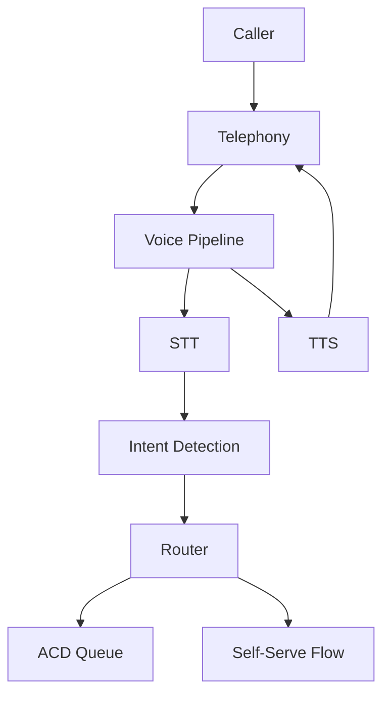

Contact centers with touch-tone IVR systems face high abandonment rates from deep menu trees and frequent mis-presses. Callers navigate through "press 1 for billing, press 2 for support" hierarchies that assume the caller knows which department handles their issue — they often do not, leading to misroutes, transfers, and repeat navigation. Each additional menu level compounds the abandonment problem.

A voice-enabled IVR lets callers speak their intent directly ("I need to dispute a charge"), collapsing multi-level menu trees into a single interaction. This use case demonstrates building a voice-enabled IVR using Beluga AI's frame-based voice pipeline with STT for intent detection and TTS for prompts. The frame pipeline approach is chosen because each stage (audio input, transcription, intent classification, response synthesis) can be tested and deployed independently, and the telephony transport layer can be swapped without changing the intent logic.

## Solution Architecture



The system processes caller audio through a frame-based pipeline: STT transcribes the caller's speech, intent detection maps the transcript to a routing decision, and TTS plays confirmation prompts back through the telephony transport.

The intent processor sits between STT and TTS as a custom frame processor, demonstrating the composability of Beluga AI's frame pipeline. This architecture means you can upgrade the intent detection logic (from keyword matching to LLM-based) without modifying the STT or TTS stages.

## Implementation

### Voice Pipeline Setup

The pipeline chains three frame processors: STT for transcription, a custom intent processor for routing logic, and TTS for spoken confirmations. Using `voice.Chain()` connects them so that text frames from STT flow into the intent processor, and text frames from the intent processor flow into TTS for synthesis.

```go
package main

import (
    "context"
    "fmt"

    "github.com/lookatitude/beluga-ai/voice"
    "github.com/lookatitude/beluga-ai/voice/stt"
    "github.com/lookatitude/beluga-ai/voice/tts"

    _ "github.com/lookatitude/beluga-ai/voice/stt/providers/deepgram"
    _ "github.com/lookatitude/beluga-ai/voice/tts/providers/openai"
)

func buildIVRPipeline(ctx context.Context) (voice.FrameProcessor, error) {
    sttEngine, err := stt.New("deepgram", nil)
    if err != nil {
        return nil, fmt.Errorf("create stt engine: %w", err)
    }

    ttsEngine, err := tts.New("openai", nil)
    if err != nil {
        return nil, fmt.Errorf("create tts engine: %w", err)
    }

    sttProc := stt.AsFrameProcessor(sttEngine,
        stt.WithLanguage("en"),
        stt.WithPunctuation(true),
    )

    ttsProc := tts.AsFrameProcessor(ttsEngine, 16000,
        tts.WithVoice("nova"),
    )

    pipeline := voice.Chain(sttProc, intentProcessor(), ttsProc)
    return pipeline, nil
}
```

### Intent Detection and Routing

The intent processor implements `FrameProcessorFunc`, Beluga AI's adapter for turning a plain function into a frame processor. It passes through non-text frames unchanged and only processes text frames — this pattern ensures audio and control frames propagate correctly through the pipeline. The intent detection uses keyword matching for simplicity and determinism, though it can be replaced with an LLM-based classifier for more nuanced intent recognition.

```go
func intentProcessor() voice.FrameProcessor {
    return voice.FrameProcessorFunc(func(ctx context.Context, in <-chan voice.Frame, out chan<- voice.Frame) error {
        for frame := range in {
            textFrame, ok := frame.(voice.TextFrame)
            if !ok {
                out <- frame
                continue
            }

            intent := detectIntent(textFrame.Text())
            response := routeIntent(ctx, intent)
            out <- voice.NewTextFrame(response)
        }
        return nil
    })
}

func detectIntent(transcript string) string {
    // Map transcript to intent using keyword matching or LLM
    switch {
    case containsAny(transcript, "billing", "bill", "payment", "charge"):
        return "billing"
    case containsAny(transcript, "support", "help", "problem", "issue"):
        return "support"
    case containsAny(transcript, "spanish", "espanol"):
        return "spanish"
    default:
        return "unknown"
    }
}

func routeIntent(ctx context.Context, intent string) string {
    switch intent {
    case "billing":
        return "Transferring you to billing."
    case "support":
        return "Transferring you to technical support."
    case "spanish":
        return "Transfiriendo a un agente en espanol."
    default:
        return "Sorry, I didn't catch that. Say billing, support, or language."
    }
}
```

## Deployment Considerations

- **Telephony integration**: Use WebSocket or WebRTC transport to connect with SIP/telephony providers
- **Concurrent sessions**: Configure maximum concurrent sessions and reject or queue callers at capacity
- **Multi-language**: Design intent sets and prompts for each language upfront
- **Fallback**: Keep DTMF as fallback for noisy or non-English callers
- **Observability**: Instrument STT, routing decisions, and telephony events with OpenTelemetry

## Results

| Metric | Before | After | Improvement |
|--------|--------|-------|-------------|
| IVR completion rate | 72% | 89% | +24% |
| Average time to route | 45s | 18s | 60% faster |
| Misroute rate | 8% | 2.5% | 69% reduction |

### Lessons Learned

- **Structured intents**: A limited set of intents (billing, support, language) improved accuracy and latency
- **Confirmation prompts**: Short TTS confirmations reduced misroutes
- **Start small**: Begin with a small intent set and expand based on caller data

## Related Resources

- [Voice AI Applications](/docs/use-cases/voice-applications/) for full voice pipeline patterns
- [Voice Sessions Overview](/docs/use-cases/voice-sessions-overview/) for session management
- [Outbound Calling](/docs/use-cases/outbound-calling/) for outbound voice patterns
