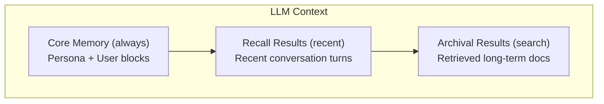

The `memory` package implements a **MemGPT-inspired 3-tier memory system** that gives agents persistent, searchable, and structured memory across conversations.

## Three-Tier Architecture

| Tier | Purpose | Analogy | Size |
|------|---------|---------|------|
| **Core** | Always in context — agent persona and user info | Working memory | Small (< 2KB) |
| **Recall** | Searchable conversation history | Short-term memory | Medium |
| **Archival** | Vector-based long-term storage | Long-term memory | Unlimited |
| **Graph** | Entity-relationship knowledge | Semantic memory | Unlimited |



## The Memory Interface

```go
type Memory interface {
	Save(ctx context.Context, input, output schema.Message) error
	Load(ctx context.Context, query string) ([]schema.Message, error)
	Search(ctx context.Context, query string, k int) ([]schema.Document, error)
	Clear(ctx context.Context) error
}
```

| Method | Purpose |
|--------|---------|
| `Save` | Persist an input/output message pair |
| `Load` | Retrieve relevant messages for a query |
| `Search` | Find documents in long-term storage |
| `Clear` | Reset all stored data |

## Core Memory

Core memory holds small, high-value blocks that are always included in the LLM context:

```go
import "github.com/lookatitude/beluga-ai/memory"

core := memory.NewCore(memory.CoreConfig{
	PersonaLimit: 2000,  // Max chars for persona block
	HumanLimit:   2000,  // Max chars for human block
	SelfEditable: true,  // Agent can modify its own memory
})

// Set the persona block
err := core.SetPersona("I am a financial advisor specializing in retirement planning.")
if err != nil {
	log.Fatal(err)
}

// Set the human block (information about the user)
err = core.SetHuman("Name: Alice. Age: 35. Risk tolerance: moderate. Goal: retire at 60.")
if err != nil {
	log.Fatal(err)
}

// Core memory converts to system messages for the LLM
msgs := core.ToMessages()
// Returns:
//   [Persona] I am a financial advisor...
//   [Human] Name: Alice. Age: 35...
```

When `SelfEditable` is true, the agent can modify its persona and user blocks through tool calls, allowing it to update its own knowledge as conversations progress.

## Recall Memory

Recall memory stores conversation history and supports search over past messages:

```go
recall := memory.NewRecall(memory.RecallConfig{
	Store:    store,     // A RecallStore backend
	MaxItems: 1000,      // Maximum messages to retain
})

// Save a conversation turn
err := recall.Save(ctx,
	schema.NewHumanMessage("What's my portfolio value?"),
	schema.NewAIMessage("Your portfolio is currently valued at $125,000."),
)

// Load recent messages relevant to a query
msgs, err := recall.Load(ctx, "portfolio")
```

## Archival Memory

Archival memory provides vector-based long-term storage with semantic search:

```go
archival := memory.NewArchival(memory.ArchivalConfig{
	Store:    archivalStore,  // An ArchivalStore backend
	Embedder: embedder,       // Embedding model for vector search
})

// Save information for long-term storage
err := archival.Save(ctx,
	schema.NewHumanMessage("Remember that my daughter Sarah starts college in 2028."),
	schema.NewAIMessage("I'll remember that."),
)

// Search long-term memory
docs, err := archival.Search(ctx, "when does Sarah start college", 5)
for _, doc := range docs {
	fmt.Println(doc.Content)
}
```

## Graph Memory

Graph memory stores entity-relationship knowledge in a graph database:

```go
graphMem := memory.NewGraph(memory.GraphConfig{
	Store: graphStore, // Neo4j or Memgraph backend
})

// Entities and relationships are extracted from conversations
// and stored as nodes and edges in the graph
err := graphMem.Save(ctx,
	schema.NewHumanMessage("My colleague Bob manages the AI team at TechCorp."),
	schema.NewAIMessage("Got it. Bob manages the AI team at TechCorp."),
)
```

## Composite Memory

Combine all tiers into a unified memory:

```go
composite := memory.NewComposite(memory.CompositeConfig{
	Core:     core,
	Recall:   recall,
	Archival: archival,
	Graph:    graphMem,
})

// Save dispatches to all tiers
err := composite.Save(ctx, input, output)

// Load aggregates from all tiers
msgs, err := composite.Load(ctx, "portfolio performance")

// Search focuses on archival tier
docs, err := composite.Search(ctx, "Sarah college", 5)
```

## Memory Store Providers

The memory system supports multiple storage backends:

| Provider | Import Path | Tiers | Best For |
|----------|-------------|-------|----------|
| In-Memory | `memory/stores/inmemory` | Recall, Archival | Development, testing |
| Redis | `memory/stores/redis` | Recall, Archival | Fast, distributed |
| PostgreSQL | `memory/stores/postgres` | Recall, Archival | Relational, durable |
| SQLite | `memory/stores/sqlite` | Recall, Archival | Embedded, single-node |
| MongoDB | `memory/stores/mongodb` | Recall, Archival | Document-oriented |
| Neo4j | `memory/stores/neo4j` | Graph | Enterprise graph DB |
| Memgraph | `memory/stores/memgraph` | Graph | Lightweight graph DB |
| Dragonfly | `memory/stores/dragonfly` | Recall, Archival | Redis-compatible |

## Using Memory with Agents

Wire memory into an agent using `WithMemory`:

```go
import (
	"github.com/lookatitude/beluga-ai/agent"
	"github.com/lookatitude/beluga-ai/memory"
	_ "github.com/lookatitude/beluga-ai/memory/stores/redis"
)

// Create Redis-backed memory
mem, err := memory.New("redis", memory.ProviderConfig{
	Options: map[string]any{
		"addr": "localhost:6379",
	},
})
if err != nil {
	log.Fatal(err)
}

// Create agent with persistent memory
a := agent.New("assistant",
	agent.WithLLM(model),
	agent.WithMemory(mem),
	agent.WithPersona(agent.Persona{
		Role: "personal assistant",
		Goal: "remember user preferences and provide personalized help",
	}),
)

// Conversations are automatically persisted
result, err := a.Invoke(ctx, "My name is Alice and I prefer dark mode.")
// Next conversation...
result, err = a.Invoke(ctx, "What are my preferences?")
// Agent recalls: "You prefer dark mode."
```

## Production Configuration

### Redis with TTL

```go
mem, err := memory.New("redis", memory.ProviderConfig{
	Options: map[string]any{
		"addr":     "redis-cluster:6379",
		"password": os.Getenv("REDIS_PASSWORD"),
		"db":       0,
		"ttl":      "720h", // 30 days
	},
})
```

### PostgreSQL with Connection Pool

```go
mem, err := memory.New("postgres", memory.ProviderConfig{
	Options: map[string]any{
		"connection_string": os.Getenv("DATABASE_URL"),
		"max_connections":   20,
		"table_prefix":      "agent_memory_",
	},
})
```

## Memory Middleware

Add cross-cutting behavior with middleware:

```go
// Wrap memory with logging
mem = memory.ApplyMiddleware(mem,
	memory.WithLoggingMiddleware(logger),
)
```

## Memory Hooks

Monitor memory operations:

```go
hooks := memory.Hooks{
	BeforeSave: func(ctx context.Context, input, output schema.Message) error {
		log.Println("Saving conversation turn")
		return nil
	},
	AfterLoad: func(ctx context.Context, msgs []schema.Message, err error) {
		log.Printf("Loaded %d messages from memory", len(msgs))
	},
}
```

## Next Steps

- [Building Your First Agent](/guides/first-agent/) — Wire memory into an agent
- [RAG Pipeline](/guides/rag-pipeline/) — Vector search for document retrieval
- [Safety & Guards](/guides/safety-and-guards/) — Guard memory content
- [Deploying to Production](/guides/deployment/) — Production memory backends
