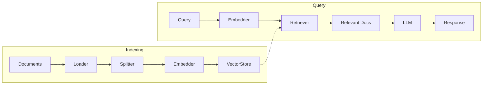

The `rag/` package provides a complete pipeline for retrieval-augmented generation. Load documents, split them into chunks, embed them as vectors, store them in a vector database, and retrieve relevant context at query time.

## Pipeline Architecture



Each stage is a separate package with its own interface, registry, and providers:

| Package | Interface | Purpose |
|---------|-----------|---------|
| `rag/loader` | `DocumentLoader` | Load content from files, URLs, APIs |
| `rag/splitter` | `TextSplitter` | Chunk documents for embedding |
| `rag/embedding` | `Embedder` | Convert text to vectors |
| `rag/vectorstore` | `VectorStore` | Store and search embeddings |
| `rag/retriever` | `Retriever` | Find relevant documents |

## Document Loading

Load documents from various sources:

```go
import (
	"github.com/lookatitude/beluga-ai/config"
	"github.com/lookatitude/beluga-ai/rag/loader"
)

// Load a text file
textLoader, err := loader.New("text", config.ProviderConfig{})
if err != nil {
	log.Fatal(err)
}

docs, err := textLoader.Load(ctx, "/path/to/document.txt")
if err != nil {
	log.Fatal(err)
}
```

### Built-in Loaders

| Loader | Format | Description |
|--------|--------|-------------|
| `text` | Plain text | Simple file loading |
| `json` | JSON | Configurable path extraction |
| `csv` | CSV | One document per row |
| `markdown` | Markdown | Structure-aware loading |

### Document Transformers

Enrich documents after loading:

```go
// Add metadata to every document
addSource := loader.TransformerFunc(func(ctx context.Context, doc schema.Document) (schema.Document, error) {
	if doc.Metadata == nil {
		doc.Metadata = make(map[string]any)
	}
	doc.Metadata["source"] = "internal-docs"
	doc.Metadata["loaded_at"] = time.Now().Format(time.RFC3339)
	return doc, nil
})
```

## Text Splitting

Split documents into chunks optimized for embedding:

```go
import (
	"github.com/lookatitude/beluga-ai/config"
	"github.com/lookatitude/beluga-ai/rag/splitter"
)

s, err := splitter.New("recursive", config.ProviderConfig{
	Options: map[string]any{
		"chunk_size":    1000,
		"chunk_overlap": 200,
	},
})
if err != nil {
	log.Fatal(err)
}

// Split raw text
chunks, err := s.Split(ctx, longText)

// Or split documents (preserves metadata)
chunkedDocs, err := s.SplitDocuments(ctx, docs)
```

`SplitDocuments` preserves the original metadata and adds `chunk_index`, `chunk_total`, and `parent_id` to each chunk.

### Built-in Splitters

| Splitter | Strategy | Best For |
|----------|----------|----------|
| `recursive` | Recursive character boundaries | General-purpose text |
| `markdown` | Heading hierarchy | Markdown documents |
| `token` | Token-based boundaries | Precise token-budget chunks |

## Embeddings

Convert text to vector representations:

```go
import (
	"github.com/lookatitude/beluga-ai/rag/embedding"
	_ "github.com/lookatitude/beluga-ai/rag/embedding/providers/openai"
)

embedder, err := embedding.New("openai", embedding.ProviderConfig{
	APIKey: os.Getenv("OPENAI_API_KEY"),
	Model:  "text-embedding-3-small",
})
if err != nil {
	log.Fatal(err)
}

// Embed a batch of texts
vectors, err := embedder.Embed(ctx, []string{"hello world", "goodbye world"})

// Embed a single text
vec, err := embedder.EmbedSingle(ctx, "search query")

// Check dimensions
fmt.Println("Dimensions:", embedder.Dimensions())
```

### Embedding Providers

| Provider | Import Path | Models |
|----------|-------------|--------|
| OpenAI | `rag/embedding/providers/openai` | `text-embedding-3-small`, `text-embedding-3-large` |
| Google | `rag/embedding/providers/google` | `text-embedding-004` |
| Cohere | `rag/embedding/providers/cohere` | `embed-english-v3.0` |
| Voyage | `rag/embedding/providers/voyage` | `voyage-3` |
| Mistral | `rag/embedding/providers/mistral` | `mistral-embed` |
| Jina | `rag/embedding/providers/jina` | `jina-embeddings-v3` |
| Ollama | `rag/embedding/providers/ollama` | Local models |
| Sentence Transformers | `rag/embedding/providers/sentence_transformers` | Local models |
| In-Memory | `rag/embedding/providers/inmemory` | Test/dev (random vectors) |

## Vector Store

Store and search embeddings:

```go
import (
	"github.com/lookatitude/beluga-ai/rag/vectorstore"
	_ "github.com/lookatitude/beluga-ai/rag/vectorstore/providers/pgvector"
)

store, err := vectorstore.New("pgvector", vectorstore.ProviderConfig{
	ConnectionString: os.Getenv("DATABASE_URL"),
})
if err != nil {
	log.Fatal(err)
}

// Add documents with embeddings
err = store.Add(ctx, chunkedDocs, vectors)

// Search for similar documents
queryVec, err := embedder.EmbedSingle(ctx, "What is Go?")
results, err := store.Search(ctx, queryVec, 10,
	vectorstore.WithThreshold(0.7),
	vectorstore.WithFilter(map[string]any{"source": "internal-docs"}),
)
```

### Search Options

| Option | Description |
|--------|-------------|
| `WithThreshold(t)` | Minimum similarity score (0.0–1.0) |
| `WithFilter(meta)` | Match metadata key-value pairs |
| `WithStrategy(s)` | Distance metric: `Cosine`, `DotProduct`, `Euclidean` |

### Vector Store Providers

| Provider | Import Path | Type |
|----------|-------------|------|
| In-Memory | `rag/vectorstore/providers/inmemory` | Development/testing |
| pgvector | `rag/vectorstore/providers/pgvector` | PostgreSQL extension |
| Pinecone | `rag/vectorstore/providers/pinecone` | Managed cloud |
| Qdrant | `rag/vectorstore/providers/qdrant` | Open-source |
| Weaviate | `rag/vectorstore/providers/weaviate` | Open-source |
| Milvus | `rag/vectorstore/providers/milvus` | Open-source |
| Chroma | `rag/vectorstore/providers/chroma` | Open-source |
| Redis | `rag/vectorstore/providers/redis` | Redis Stack |
| Elasticsearch | `rag/vectorstore/providers/elasticsearch` | Elastic |
| MongoDB | `rag/vectorstore/providers/mongodb` | Atlas Vector Search |
| SQLite-vec | `rag/vectorstore/providers/sqlitevec` | Embedded |
| Vespa | `rag/vectorstore/providers/vespa` | Enterprise search |
| Turbopuffer | `rag/vectorstore/providers/turbopuffer` | Serverless |

## Retriever

The `Retriever` interface abstracts search over one or more backends:

```go
import "github.com/lookatitude/beluga-ai/rag/retriever"

docs, err := r.Retrieve(ctx, "What is quantum computing?",
	retriever.WithTopK(5),
	retriever.WithThreshold(0.7),
	retriever.WithMetadata(map[string]any{"topic": "physics"}),
)
```

### Retrieval Strategies

| Strategy | Description | When to Use |
|----------|-------------|-------------|
| `vector` | Pure vector similarity search | Simple use cases |
| `hybrid` | Vector + BM25 with RRF fusion | **Recommended default** |
| `crag` | Corrective RAG with quality grading | Quality-critical applications |
| `hyde` | Hypothetical Document Embeddings | Sparse-data domains |
| `adaptive` | Adjusts strategy based on query | Variable query patterns |
| `ensemble` | Combines multiple retriever outputs | Maximum recall |

### Hybrid Search (Recommended)

Hybrid search combines dense vector similarity with BM25 keyword matching using Reciprocal Rank Fusion (RRF):

```go
hybridRetriever, err := retriever.New("hybrid", retriever.ProviderConfig{
	Options: map[string]any{
		"vector_store": store,
		"embedder":     embedder,
		"bm25_weight":  0.3,
		"vector_weight": 0.7,
	},
})

docs, err := hybridRetriever.Retrieve(ctx, "Go concurrency patterns",
	retriever.WithTopK(10),
)
```

### CRAG (Corrective RAG)

CRAG grades retrieved documents for relevance and triggers web search when local results are insufficient:

```go
cragRetriever, err := retriever.New("crag", retriever.ProviderConfig{
	Options: map[string]any{
		"base_retriever": baseRetriever,
		"grader_llm":     model,
		"threshold":      0.6,
	},
})
```

### HyDE (Hypothetical Document Embeddings)

HyDE generates a hypothetical answer before searching, improving retrieval for questions where direct embedding similarity is weak:

```go
hydeRetriever, err := retriever.New("hyde", retriever.ProviderConfig{
	Options: map[string]any{
		"base_retriever": baseRetriever,
		"llm":            model,
		"embedder":       embedder,
	},
})
```

## Complete Pipeline Example

```go
package main

import (
	"context"
	"fmt"
	"log"
	"os"

	"github.com/lookatitude/beluga-ai/llm"
	"github.com/lookatitude/beluga-ai/rag/embedding"
	"github.com/lookatitude/beluga-ai/rag/loader"
	"github.com/lookatitude/beluga-ai/rag/retriever"
	"github.com/lookatitude/beluga-ai/rag/splitter"
	"github.com/lookatitude/beluga-ai/rag/vectorstore"
	"github.com/lookatitude/beluga-ai/schema"
	"github.com/lookatitude/beluga-ai/config"

	_ "github.com/lookatitude/beluga-ai/llm/providers/openai"
	_ "github.com/lookatitude/beluga-ai/rag/embedding/providers/openai"
	_ "github.com/lookatitude/beluga-ai/rag/vectorstore/providers/inmemory"
)

func main() {
	ctx := context.Background()

	// 1. Load documents
	l, err := loader.New("text", config.ProviderConfig{})
	if err != nil {
		log.Fatal(err)
	}
	docs, err := l.Load(ctx, "knowledge-base.txt")
	if err != nil {
		log.Fatal(err)
	}

	// 2. Split into chunks
	s, err := splitter.New("recursive", config.ProviderConfig{
		Options: map[string]any{"chunk_size": 500, "chunk_overlap": 50},
	})
	if err != nil {
		log.Fatal(err)
	}
	chunks, err := s.SplitDocuments(ctx, docs)
	if err != nil {
		log.Fatal(err)
	}

	// 3. Embed chunks
	emb, err := embedding.New("openai", embedding.ProviderConfig{
		APIKey: os.Getenv("OPENAI_API_KEY"),
		Model:  "text-embedding-3-small",
	})
	if err != nil {
		log.Fatal(err)
	}
	texts := make([]string, len(chunks))
	for i, c := range chunks {
		texts[i] = c.Content
	}
	vectors, err := emb.Embed(ctx, texts)
	if err != nil {
		log.Fatal(err)
	}

	// 4. Store in vector database
	store, err := vectorstore.New("inmemory", vectorstore.ProviderConfig{})
	if err != nil {
		log.Fatal(err)
	}
	err = store.Add(ctx, chunks, vectors)
	if err != nil {
		log.Fatal(err)
	}

	// 5. Retrieve relevant context
	query := "How does error handling work?"
	queryVec, err := emb.EmbedSingle(ctx, query)
	if err != nil {
		log.Fatal(err)
	}
	relevant, err := store.Search(ctx, queryVec, 5)
	if err != nil {
		log.Fatal(err)
	}

	// 6. Generate answer with context
	model, err := llm.New("openai", llm.ProviderConfig{
		APIKey: os.Getenv("OPENAI_API_KEY"),
		Model:  "gpt-4o",
	})
	if err != nil {
		log.Fatal(err)
	}

	contextStr := ""
	for _, doc := range relevant {
		contextStr += doc.Content + "\n\n"
	}

	msgs := []schema.Message{
		schema.NewSystemMessage("Answer the question using the provided context. If unsure, say so."),
		schema.NewHumanMessage(fmt.Sprintf("Context:\n%s\nQuestion: %s", contextStr, query)),
	}

	resp, err := model.Generate(ctx, msgs)
	if err != nil {
		log.Fatal(err)
	}
	fmt.Println(resp.Text())
}
```

## Retriever Hooks

Monitor and audit retrieval operations:

```go
hooks := retriever.Hooks{
	BeforeRetrieve: func(ctx context.Context, query string) error {
		log.Printf("Retrieving for: %q", query)
		return nil
	},
	AfterRetrieve: func(ctx context.Context, docs []schema.Document, err error) {
		log.Printf("Found %d documents", len(docs))
	},
	OnRerank: func(ctx context.Context, query string, before, after []schema.Document) {
		log.Printf("Reranked: %d → %d documents", len(before), len(after))
	},
}
```

## Next Steps

- [Working with LLMs](/guides/working-with-llms/) — The ChatModel that generates answers
- [Memory System](/guides/memory-system/) — Persistent memory with vector search
- [Tools & MCP](/guides/tools-and-mcp/) — Give agents retrieval as a tool
- [Monitoring & Observability](/guides/observability/) — Trace RAG pipeline performance
