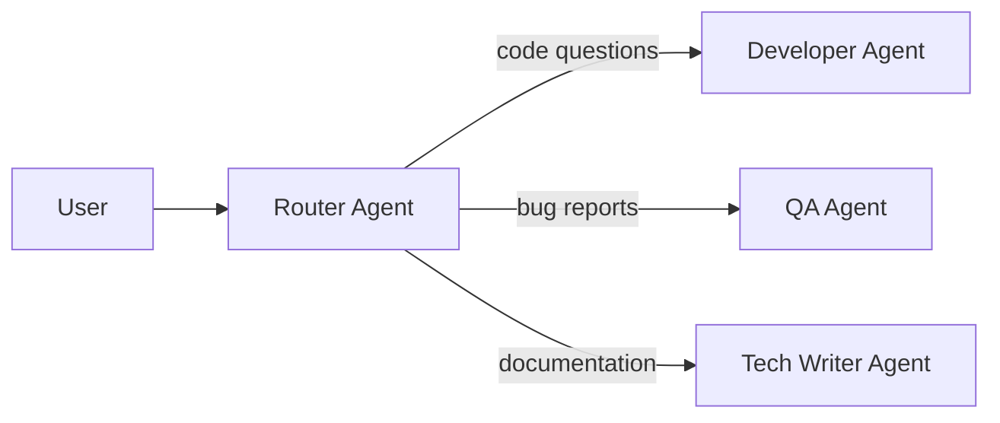
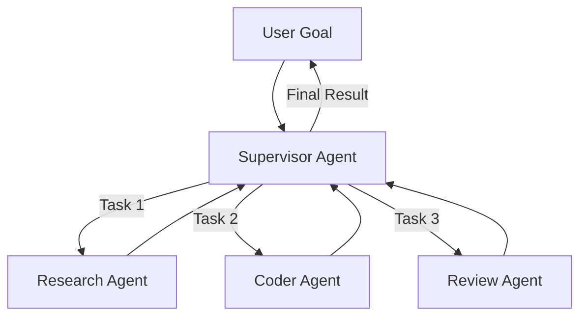
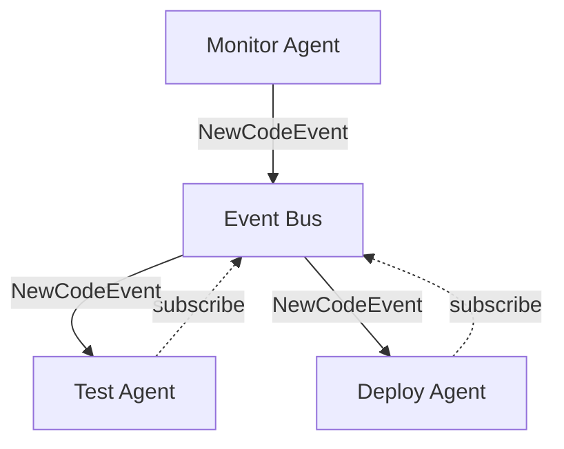

Single agents solve focused problems, but complex tasks require teams of specialized agents working together. Beluga AI provides patterns for building multi-agent systems that coordinate seamlessly.

## What You'll Learn

This guide covers:
- Understanding agent coordination patterns (Handoffs, Supervisor, Event Bus)
- Implementing agent-to-agent handoffs
- Building supervisor agents that delegate tasks
- Sharing state and memory between agents
- Handling errors and conflicts in multi-agent systems
- Monitoring and debugging agent interactions

## When to Use Multi-Agent Systems

Multi-agent architectures excel at:
- **Complex workflows** requiring different specialized skills (research + writing + review)
- **Parallel execution** where agents can work simultaneously
- **Domain separation** where each agent has distinct expertise
- **Scalability** when workload can be distributed
- **Human-like teams** that mirror organizational structures (PM, Dev, QA)

## Prerequisites

Before starting this guide:
- Complete [Building Your First Agent](/guides/first-agent)
- Understand agent state and memory
- Familiarity with Go concurrency patterns

## Agent Coordination Patterns

Beluga AI supports three primary multi-agent patterns:

### Pattern 1: Handoffs (Router)

A routing agent classifies requests and transfers control to specialist agents.



**Use when:** You have distinct request types that map to specific agents.

### Pattern 2: Supervisor (Manager)

A supervisor agent breaks down goals into tasks and delegates to worker agents.



**Use when:** Complex goals require decomposition and sequential/parallel execution.

### Pattern 3: Event Bus (Autonomous)

Agents listen for events and react autonomously without central coordination.



**Use when:** Agents need loose coupling and asynchronous communication.

## Implementing Agent Handoffs

Handoffs transfer control from one agent to another. The receiving agent gets context from the sender.

```go
package main

import (
    "context"
    "fmt"
    "log"

    "github.com/lookatitude/beluga-ai/pkg/agents"
    "github.com/lookatitude/beluga-ai/pkg/llms"
    "github.com/lookatitude/beluga-ai/pkg/schema"
)

// Create specialized agents
func CreateAgents(ctx context.Context, llm llms.LLM) map[string]*agents.Agent {
    // Developer Agent
    devAgent := agents.NewAgent(
        "developer",
        agents.WithLLM(llm),
        agents.WithSystemPrompt("You are an expert Go developer. Write clean, idiomatic code with proper error handling."),
        agents.WithTools([]schema.Tool{
            createCodeSearchTool(),
            createRunTestsTool(),
        }),
    )

    // QA Agent
    qaAgent := agents.NewAgent(
        "qa",
        agents.WithLLM(llm),
        agents.WithSystemPrompt("You are a QA engineer. Review code for bugs, security issues, and best practices."),
        agents.WithTools([]schema.Tool{
            createStaticAnalysisTool(),
            createSecurityScanTool(),
        }),
    )

    // Tech Writer Agent
    writerAgent := agents.NewAgent(
        "tech_writer",
        agents.WithLLM(llm),
        agents.WithSystemPrompt("You are a technical writer. Create clear, concise documentation."),
    )

    return map[string]*agents.Agent{
        "dev":    devAgent,
        "qa":     qaAgent,
        "writer": writerAgent,
    }
}

// Router Agent classifies and hands off
type RouterAgent struct {
    classifier llms.LLM
    agents     map[string]*agents.Agent
}

func NewRouterAgent(llm llms.LLM, agents map[string]*agents.Agent) *RouterAgent {
    return &RouterAgent{
        classifier: llm,
        agents:     agents,
    }
}

func (r *RouterAgent) Route(ctx context.Context, request string) (string, error) {
    // Classify the request
    category, err := r.classifyRequest(ctx, request)
    if err != nil {
        return "", fmt.Errorf("classification failed: %w", err)
    }

    // Hand off to appropriate agent
    agent, ok := r.agents[category]
    if !ok {
        return "", fmt.Errorf("no agent for category: %s", category)
    }

    response, err := agent.Run(ctx, request)
    if err != nil {
        return "", fmt.Errorf("agent execution failed: %w", err)
    }

    return response, nil
}

func (r *RouterAgent) classifyRequest(ctx context.Context, request string) (string, error) {
    messages := []schema.Message{
        schema.NewSystemMessage(`Classify user requests into categories:
- "dev": Code questions, implementation requests, debugging
- "qa": Bug reports, test requests, code review
- "writer": Documentation requests, explanations

Respond with only the category name.`),
        schema.NewHumanMessage(request),
    }

    response, err := r.classifier.Generate(ctx, messages,
        llms.WithTemperature(0.0),
        llms.WithMaxTokens(10),
    )
    if err != nil {
        return "", err
    }

    return strings.TrimSpace(response.Content), nil
}

func main() {
    ctx := context.Background()

    // Setup LLM
    config := llms.NewConfig(
        llms.WithProvider("openai"),
        llms.WithModelName("gpt-4o"),
        llms.WithAPIKey(os.Getenv("OPENAI_API_KEY")),
    )
    factory := llms.NewFactory()
    llm, err := factory.CreateLLM("openai", config)
    if err != nil {
        log.Fatal(err)
    }

    // Create specialist agents
    specialists := CreateAgents(ctx, llm)

    // Create router
    router := NewRouterAgent(llm, specialists)

    // Route requests
    requests := []string{
        "Write a function to parse JSON",
        "Review this code for security issues",
        "Explain how HTTP middleware works",
    }

    for _, req := range requests {
        fmt.Printf("\nRequest: %s\n", req)
        response, err := router.Route(ctx, req)
        if err != nil {
            log.Printf("Error: %v", err)
            continue
        }
        fmt.Printf("Response: %s\n", response)
    }
}
```

## Building a Supervisor Agent

A supervisor decomposes complex goals into subtasks and delegates to workers.

```go
type SupervisorAgent struct {
    planner llms.LLM
    workers map[string]*agents.Agent
    memory  *memory.ConversationMemory
}

type Task struct {
    ID          string
    Type        string // "research", "code", "review"
    Description string
    Dependencies []string // Task IDs that must complete first
    Status      string   // "pending", "running", "complete", "failed"
    Result      string
}

func NewSupervisorAgent(llm llms.LLM, workers map[string]*agents.Agent) *SupervisorAgent {
    return &SupervisorAgent{
        planner: llm,
        workers: workers,
        memory:  memory.NewConversationMemory(),
    }
}

func (s *SupervisorAgent) Execute(ctx context.Context, goal string) (string, error) {
    // Step 1: Create plan
    tasks, err := s.createPlan(ctx, goal)
    if err != nil {
        return "", fmt.Errorf("planning failed: %w", err)
    }

    fmt.Printf("Created plan with %d tasks\n", len(tasks))

    // Step 2: Execute tasks respecting dependencies
    results, err := s.executeTasks(ctx, tasks)
    if err != nil {
        return "", fmt.Errorf("execution failed: %w", err)
    }

    // Step 3: Synthesize final result
    finalResult, err := s.synthesizeResults(ctx, goal, results)
    if err != nil {
        return "", fmt.Errorf("synthesis failed: %w", err)
    }

    return finalResult, nil
}

func (s *SupervisorAgent) createPlan(ctx context.Context, goal string) ([]Task, error) {
    messages := []schema.Message{
        schema.NewSystemMessage(`You are a planning expert. Break down goals into concrete tasks.
Available agents: research, coder, reviewer
Output format: JSON array of tasks with id, type, description, dependencies`),
        schema.NewHumanMessage(fmt.Sprintf("Goal: %s\n\nCreate a task plan:", goal)),
    }

    response, err := s.planner.Generate(ctx, messages,
        llms.WithTemperature(0.3),
    )
    if err != nil {
        return nil, err
    }

    // Parse task plan from JSON
    var tasks []Task
    if err := json.Unmarshal([]byte(response.Content), &tasks); err != nil {
        return nil, fmt.Errorf("parse plan: %w", err)
    }

    // Initialize task status
    for i := range tasks {
        tasks[i].Status = "pending"
    }

    return tasks, nil
}

func (s *SupervisorAgent) executeTasks(ctx context.Context, tasks []Task) (map[string]string, error) {
    results := make(map[string]string)
    completed := make(map[string]bool)

    // Execute tasks in dependency order
    for len(completed) < len(tasks) {
        progress := false

        for i := range tasks {
            task := &tasks[i]

            // Skip if already completed
            if completed[task.ID] {
                continue
            }

            // Check if dependencies are met
            if !s.dependenciesMet(task, completed) {
                continue
            }

            // Execute task
            fmt.Printf("Executing task: %s (%s)\n", task.ID, task.Type)
            task.Status = "running"

            worker, ok := s.workers[task.Type]
            if !ok {
                task.Status = "failed"
                return nil, fmt.Errorf("no worker for task type: %s", task.Type)
            }

            // Build context from previous results
            context := s.buildTaskContext(task, results)

            result, err := worker.Run(ctx, context)
            if err != nil {
                task.Status = "failed"
                return nil, fmt.Errorf("task %s failed: %w", task.ID, err)
            }

            task.Result = result
            task.Status = "complete"
            results[task.ID] = result
            completed[task.ID] = true
            progress = true

            fmt.Printf("Task %s completed\n", task.ID)
        }

        // Detect deadlock
        if !progress {
            return nil, fmt.Errorf("execution deadlock: unresolved dependencies")
        }
    }

    return results, nil
}

func (s *SupervisorAgent) dependenciesMet(task *Task, completed map[string]bool) bool {
    for _, depID := range task.Dependencies {
        if !completed[depID] {
            return false
        }
    }
    return true
}

func (s *SupervisorAgent) buildTaskContext(task *Task, results map[string]string) string {
    var context strings.Builder
    context.WriteString(task.Description)
    context.WriteString("\n\nContext from previous tasks:\n")

    for _, depID := range task.Dependencies {
        if result, ok := results[depID]; ok {
            context.WriteString(fmt.Sprintf("\n[%s]: %s\n", depID, result))
        }
    }

    return context.String()
}

func (s *SupervisorAgent) synthesizeResults(ctx context.Context, goal string, results map[string]string) (string, error) {
    var allResults strings.Builder
    for taskID, result := range results {
        allResults.WriteString(fmt.Sprintf("\n[%s]:\n%s\n", taskID, result))
    }

    messages := []schema.Message{
        schema.NewSystemMessage("Synthesize task results into a coherent final response."),
        schema.NewHumanMessage(fmt.Sprintf(
            "Original goal: %s\n\nTask results:%s\n\nFinal synthesis:",
            goal,
            allResults.String(),
        )),
    }

    response, err := s.planner.Generate(ctx, messages)
    if err != nil {
        return "", err
    }

    return response.Content, nil
}
```

## Shared State and Memory

Agents can share state through common memory systems.

```go
import (
    "github.com/lookatitude/beluga-ai/pkg/memory"
    "github.com/lookatitude/beluga-ai/pkg/memory/stores"
)

// Create shared memory store
func CreateSharedMemory() (*memory.CoreMemory, error) {
    store := stores.NewRedisStore(&stores.RedisConfig{
        Addr: "localhost:6379",
    })

    return memory.NewCoreMemory(
        memory.WithStore(store),
        memory.WithMaxContextTokens(4000),
    ), nil
}

// Agents share the same memory instance
func SetupAgentsWithSharedMemory(ctx context.Context, llm llms.LLM) {
    sharedMem, _ := CreateSharedMemory()

    devAgent := agents.NewAgent("dev",
        agents.WithLLM(llm),
        agents.WithMemory(sharedMem),
    )

    qaAgent := agents.NewAgent("qa",
        agents.WithLLM(llm),
        agents.WithMemory(sharedMem), // Same memory instance
    )

    // Both agents can see each other's conversation history
}
```

## Event-Driven Communication

Use an event bus for loose coupling between agents.

```go
type EventBus struct {
    subscribers map[string][]chan Event
    mu          sync.RWMutex
}

type Event struct {
    Type      string
    AgentID   string
    Payload   interface{}
    Timestamp time.Time
}

func NewEventBus() *EventBus {
    return &EventBus{
        subscribers: make(map[string][]chan Event),
    }
}

func (eb *EventBus) Subscribe(eventType string) <-chan Event {
    eb.mu.Lock()
    defer eb.mu.Unlock()

    ch := make(chan Event, 10)
    eb.subscribers[eventType] = append(eb.subscribers[eventType], ch)
    return ch
}

func (eb *EventBus) Publish(event Event) {
    eb.mu.RLock()
    defer eb.mu.RUnlock()

    for _, ch := range eb.subscribers[event.Type] {
        select {
        case ch <- event:
        default:
            // Skip if subscriber is slow
        }
    }
}

// Agent that publishes events
type EventPublishingAgent struct {
    *agents.Agent
    bus *EventBus
}

func (a *EventPublishingAgent) Run(ctx context.Context, input string) (string, error) {
    // Do work
    result, err := a.Agent.Run(ctx, input)
    if err != nil {
        return "", err
    }

    // Publish completion event
    a.bus.Publish(Event{
        Type:      "task.completed",
        AgentID:   a.ID(),
        Payload:   result,
        Timestamp: time.Now(),
    })

    return result, nil
}

// Agent that reacts to events
func StartReactiveAgent(ctx context.Context, agent *agents.Agent, bus *EventBus) {
    events := bus.Subscribe("task.completed")

    go func() {
        for {
            select {
            case <-ctx.Done():
                return
            case event := <-events:
                // React to event
                fmt.Printf("Agent %s reacting to event from %s\n",
                    agent.ID(), event.AgentID)

                result, _ := agent.Run(ctx, fmt.Sprintf("Process: %v", event.Payload))
                fmt.Printf("Reaction result: %s\n", result)
            }
        }
    }()
}
```

## Error Handling and Conflict Resolution

Multi-agent systems need robust error handling.

```go
type AgentError struct {
    AgentID string
    Err     error
    Retry   bool
}

func (s *SupervisorAgent) ExecuteWithErrorHandling(ctx context.Context, goal string) (string, error) {
    maxRetries := 3

    for attempt := 1; attempt <= maxRetries; attempt++ {
        result, err := s.Execute(ctx, goal)

        if err == nil {
            return result, nil
        }

        // Check if error is retryable
        var agentErr *AgentError
        if errors.As(err, &agentErr) {
            if !agentErr.Retry {
                return "", fmt.Errorf("non-retryable error: %w", err)
            }

            fmt.Printf("Attempt %d failed, retrying...\n", attempt)

            // Exponential backoff
            time.Sleep(time.Duration(math.Pow(2, float64(attempt-1))) * time.Second)
            continue
        }

        return "", err
    }

    return "", fmt.Errorf("execution failed after %d attempts", maxRetries)
}

// Conflict resolution when agents disagree
func ResolveConflict(ctx context.Context, arbiter llms.LLM, responses []string) (string, error) {
    var responseList strings.Builder
    for i, resp := range responses {
        responseList.WriteString(fmt.Sprintf("\nAgent %d: %s\n", i+1, resp))
    }

    messages := []schema.Message{
        schema.NewSystemMessage("You are an arbiter. Multiple agents provided different answers. Choose the best one or synthesize a better answer."),
        schema.NewHumanMessage(fmt.Sprintf("Responses:%s\n\nBest answer:", responseList.String())),
    }

    resolution, err := arbiter.Generate(ctx, messages)
    if err != nil {
        return "", err
    }

    return resolution.Content, nil
}
```

## Monitoring and Debugging

Observability is critical in multi-agent systems.

```go
import (
    "github.com/lookatitude/beluga-ai/pkg/o11y"
    "go.opentelemetry.io/otel/trace"
)

func (s *SupervisorAgent) ExecuteWithTracing(ctx context.Context, goal string) (string, error) {
    tracer := otel.Tracer("beluga.agents.supervisor")

    ctx, span := tracer.Start(ctx, "supervisor.execute",
        trace.WithAttributes(
            attribute.String("goal", goal),
        ),
    )
    defer span.End()

    // Create plan
    ctx, planSpan := tracer.Start(ctx, "supervisor.plan")
    tasks, err := s.createPlan(ctx, goal)
    planSpan.SetAttributes(attribute.Int("task_count", len(tasks)))
    planSpan.End()

    if err != nil {
        span.RecordError(err)
        return "", err
    }

    // Execute each task in a traced span
    for i, task := range tasks {
        ctx, taskSpan := tracer.Start(ctx, "supervisor.execute_task",
            trace.WithAttributes(
                attribute.String("task.id", task.ID),
                attribute.String("task.type", task.Type),
                attribute.Int("task.index", i),
            ),
        )

        // Execute...

        taskSpan.SetAttributes(attribute.String("task.status", task.Status))
        taskSpan.End()
    }

    // Synthesize
    result, err := s.synthesizeResults(ctx, goal, results)
    if err != nil {
        span.RecordError(err)
        return "", err
    }

    span.SetAttributes(attribute.Int("result_length", len(result)))
    return result, nil
}
```

## Production Best Practices

When deploying multi-agent systems:

1. **Define clear responsibilities** for each agent to avoid overlap
2. **Implement timeouts** to prevent hung agents from blocking the system
3. **Use circuit breakers** to isolate failing agents
4. **Monitor agent performance** and adjust delegation strategies
5. **Version agent prompts** to track behavior changes
6. **Test handoff scenarios** thoroughly
7. **Implement graceful degradation** when agents fail
8. **Log all agent interactions** for debugging

## Next Steps

Now that you understand multi-agent systems:
- Learn about [Orchestration & Workflows](/guides/orchestration) for complex coordination
- Explore [Memory System](/guides/memory-system) for advanced shared state
- Read [Observability](/guides/observability) for monitoring agent teams
- Check out [Agent Recipes](/cookbook/agent-recipes) for real-world patterns
