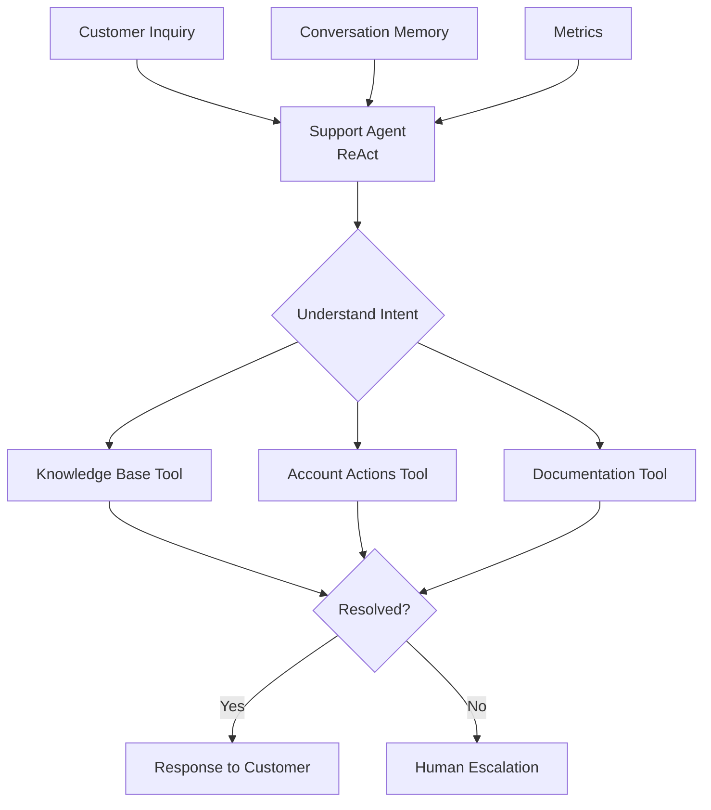

Customer support teams handle thousands of repetitive inquiries that could be automated. The economics are stark: human agents spend 80% of their time on simple, repeatable issues (password resets, billing questions, status checks), while complex issues that genuinely need human judgment wait in queue. This creates a lose-lose: high costs for simple work and slow response times for complex work.

An autonomous support system handles common inquiries without human intervention, reducing costs by 60% while improving response times from hours to seconds. The key design decision is using a ReAct (Reasoning + Action) agent rather than a simple intent-classification chatbot. ReAct agents can chain multiple tool calls with reasoning steps — "the customer needs a refund, let me first check their order status, then verify the refund policy, then process the refund" — handling multi-step resolution paths that rule-based systems cannot express.

## Solution Architecture

Beluga AI's ReAct agents combine reasoning and action to autonomously resolve customer inquiries. The ReAct pattern is chosen over simpler approaches (intent classification, decision trees) because support inquiries are open-ended — the agent needs to decide which tools to use, in what order, based on the specific situation. A decision tree cannot anticipate every combination of customer state, request type, and system condition.

Agents access tools for knowledge base search and account operations, maintain conversation context through memory, and escalate complex issues to humans when confidence is low. The escalation mechanism ensures the system fails safely rather than giving incorrect answers.



## Support Agent Implementation

Create a ReAct agent with tools for autonomous resolution. The agent is configured with three tools (knowledge base search, account actions, documentation lookup) and a buffer memory for conversation context. The `MaxIterations` limit of 10 prevents the agent from entering infinite reasoning loops on queries it cannot resolve, forcing escalation instead.

```go
package main

import (
    "context"
    "fmt"
    "log"
    "time"

    "github.com/lookatitude/beluga-ai/agent"
    "github.com/lookatitude/beluga-ai/llm"
    "github.com/lookatitude/beluga-ai/memory"
    "github.com/lookatitude/beluga-ai/schema"
    "github.com/lookatitude/beluga-ai/tool"

    _ "github.com/lookatitude/beluga-ai/agent/providers/react"
    _ "github.com/lookatitude/beluga-ai/llm/providers/openai"
)

type AutonomousSupportAgent struct {
    agent             agent.Agent
    memory            memory.Memory
    escalationHandler *EscalationHandler
}

func NewAutonomousSupportAgent(ctx context.Context) (*AutonomousSupportAgent, error) {
    // Create LLM
    model, err := llm.New("openai", llm.ProviderConfig{
        APIKey: os.Getenv("OPENAI_API_KEY"),
        Model:  "gpt-4o",
    })
    if err != nil {
        return nil, fmt.Errorf("create model: %w", err)
    }

    // Setup tools
    tools := []tool.Tool{
        createKnowledgeBaseTool(),
        createAccountActionTool(),
        createDocumentationTool(),
    }

    // Setup memory for conversation context
    mem := memory.NewBufferMemory(
        memory.WithMaxTokens(2000),
    )

    // Create ReAct agent
    ag, err := agent.New("react", agent.Config{
        Name:        "autonomous-support",
        Description: "Autonomous customer support agent that resolves inquiries without human intervention",
        Model:       model,
        Tools:       tools,
        Memory:      mem,
        MaxIterations: 10,
    })
    if err != nil {
        return nil, fmt.Errorf("create agent: %w", err)
    }

    return &AutonomousSupportAgent{
        agent:             ag,
        memory:            mem,
        escalationHandler: NewEscalationHandler(),
    }, nil
}

// Knowledge base search tool
func createKnowledgeBaseTool() tool.Tool {
    return tool.NewFuncTool(
        "search_knowledge_base",
        "Search the knowledge base for answers to customer questions",
        func(ctx context.Context, query string) (string, error) {
            // In production, integrate with your knowledge base API
            results := searchKnowledgeBase(query)
            if len(results) == 0 {
                return "No relevant articles found", nil
            }
            return fmt.Sprintf("Found %d articles:\n%s", len(results), formatResults(results)), nil
        },
    )
}

// Account action tool
func createAccountActionTool() tool.Tool {
    return tool.NewFuncTool(
        "perform_account_action",
        "Perform account operations like password reset, email update, subscription changes",
        func(ctx context.Context, action string, customerID string) (string, error) {
            // Validate action is allowed
            if !isAllowedAction(action) {
                return "", fmt.Errorf("action not allowed: %s", action)
            }

            // Perform action
            result, err := performAccountAction(action, customerID)
            if err != nil {
                return "", err
            }

            return fmt.Sprintf("Action completed: %s", result), nil
        },
    )
}

// Documentation lookup tool
func createDocumentationTool() tool.Tool {
    return tool.NewFuncTool(
        "search_documentation",
        "Search product documentation for technical help",
        func(ctx context.Context, query string) (string, error) {
            docs := searchDocumentation(query)
            return formatDocumentation(docs), nil
        },
    )
}
```

## Inquiry Handling

Handle customer inquiries with autonomous resolution or escalation:

```go
type SupportResponse struct {
    Response  string
    Resolved  bool
    Escalated bool
    TicketID  string
}

func (a *AutonomousSupportAgent) HandleInquiry(ctx context.Context, customerID string, inquiry string) (*SupportResponse, error) {
    // Load conversation history
    history, err := a.memory.Load(ctx, map[string]any{"customer_id": customerID})
    if err != nil {
        log.Printf("Failed to load history: %v", err)
    }

    // Build prompt with context
    prompt := fmt.Sprintf(`Customer Inquiry: %s

Previous conversation:
%s

Resolve this inquiry using available tools:
- search_knowledge_base: Find answers in the knowledge base
- perform_account_action: Perform account operations (password reset, etc.)
- search_documentation: Look up technical documentation

If you cannot resolve the inquiry with available tools, respond with "ESCALATE:" followed by a summary.`,
        inquiry,
        formatHistory(history),
    )

    // Execute agent
    result, err := a.agent.Execute(ctx, prompt)
    if err != nil {
        return nil, fmt.Errorf("agent execution: %w", err)
    }

    // Check if escalation needed
    if needsEscalation(result) {
        ticketID, err := a.escalationHandler.Escalate(ctx, customerID, inquiry)
        if err != nil {
            return nil, fmt.Errorf("escalation: %w", err)
        }

        return &SupportResponse{
            Response:  fmt.Sprintf("I've created a support ticket (#%s) for you. Our team will respond shortly.", ticketID),
            Resolved:  false,
            Escalated: true,
            TicketID:  ticketID,
        }, nil
    }

    // Save to memory
    if err := a.memory.Save(ctx, map[string]any{
        "customer_id": customerID,
        "inquiry":     inquiry,
        "response":    result,
    }); err != nil {
        log.Printf("Failed to save memory: %v", err)
    }

    return &SupportResponse{
        Response:  result,
        Resolved:  true,
        Escalated: false,
    }, nil
}

func needsEscalation(response string) bool {
    return strings.HasPrefix(response, "ESCALATE:")
}
```

## Confidence-Based Escalation

Implement intelligent escalation based on confidence scoring. The confidence model is intentionally simple: it measures what fraction of tool calls succeeded and gives a bonus for knowledge base hits. This heuristic avoids the overhead of training a dedicated confidence model while providing a useful signal for escalation decisions. The threshold (0.7) can be tuned per deployment based on the cost of false escalations versus incorrect answers.

```go
type EscalationHandler struct {
    confidenceThreshold float64
}

func NewEscalationHandler() *EscalationHandler {
    return &EscalationHandler{
        confidenceThreshold: 0.7, // Escalate if confidence < 70%
    }
}

func (h *EscalationHandler) ShouldEscalate(ctx context.Context, response string, toolUsage []tool.ToolCall) bool {
    // Check explicit escalation keywords
    if needsEscalation(response) {
        return true
    }

    // Calculate confidence based on tool usage
    confidence := h.calculateConfidence(toolUsage)
    return confidence < h.confidenceThreshold
}

func (h *EscalationHandler) calculateConfidence(toolUsage []tool.ToolCall) float64 {
    if len(toolUsage) == 0 {
        return 0.3 // Low confidence if no tools used
    }

    // Higher confidence if multiple relevant tools used successfully
    successfulCalls := 0
    for _, call := range toolUsage {
        if call.Error == nil && call.Result != "" {
            successfulCalls++
        }
    }

    baseConfidence := float64(successfulCalls) / float64(len(toolUsage))

    // Boost confidence if knowledge base was consulted
    for _, call := range toolUsage {
        if call.ToolName == "search_knowledge_base" && call.Error == nil {
            baseConfidence += 0.2
            break
        }
    }

    return min(baseConfidence, 1.0)
}

func (h *EscalationHandler) Escalate(ctx context.Context, customerID string, inquiry string) (string, error) {
    // Create support ticket in your ticketing system
    ticket := createSupportTicket(customerID, inquiry, "agent-escalation")

    // Notify human agents
    notifyAgents(ticket)

    return ticket.ID, nil
}
```

## Streaming Responses

Stream agent reasoning and responses for better UX. Beluga AI's `iter.Seq2` streaming pattern allows the UI to show the agent's thought process (tool calls, reasoning steps) in real time rather than waiting for the full response. This transparency builds user trust — customers can see the agent is actively working on their issue rather than staring at a spinner.

```go
func (a *AutonomousSupportAgent) HandleInquiryStream(ctx context.Context, customerID string, inquiry string) iter.Seq2[string, error] {
    return func(yield func(string, error) bool) {
        prompt := buildPrompt(customerID, inquiry)

        for event, err := range a.agent.Stream(ctx, prompt) {
            if err != nil {
                yield("", err)
                return
            }

            switch e := event.(type) {
            case *agent.ThoughtEvent:
                // Stream agent reasoning
                if !yield(fmt.Sprintf("[Thinking] %s\n", e.Thought), nil) {
                    return
                }
            case *agent.ToolCallEvent:
                // Stream tool execution
                if !yield(fmt.Sprintf("[Using tool: %s]\n", e.ToolName), nil) {
                    return
                }
            case *agent.ResponseEvent:
                // Stream final response
                if !yield(e.Content, nil) {
                    return
                }
            }
        }
    }
}
```

## Production Considerations

### Observability

Track resolution rates, response times, and escalation reasons:

```go
import (
    "github.com/lookatitude/beluga-ai/o11y"
    "go.opentelemetry.io/otel"
    "go.opentelemetry.io/otel/attribute"
)

func (a *AutonomousSupportAgent) HandleInquiryWithMetrics(ctx context.Context, customerID string, inquiry string) (*SupportResponse, error) {
    tracer := otel.Tracer("support-agent")
    ctx, span := tracer.Start(ctx, "support.handle_inquiry")
    defer span.End()

    span.SetAttributes(
        attribute.String("customer_id", customerID),
    )

    start := time.Now()
    response, err := a.HandleInquiry(ctx, customerID, inquiry)
    duration := time.Since(start)

    if err != nil {
        span.RecordError(err)
        return nil, err
    }

    span.SetAttributes(
        attribute.Bool("resolved", response.Resolved),
        attribute.Bool("escalated", response.Escalated),
        attribute.Float64("duration_ms", float64(duration.Milliseconds())),
    )

    return response, nil
}
```

### Tool Reliability

Implement retries and health checks for tools:

```go
import "github.com/lookatitude/beluga-ai/resilience"

func createRobustKnowledgeBaseTool() tool.Tool {
    baseTool := createKnowledgeBaseTool()

    return tool.NewFuncTool(
        baseTool.Name(),
        baseTool.Description(),
        func(ctx context.Context, args ...any) (string, error) {
            policy := resilience.RetryPolicy{
                MaxAttempts:    3,
                InitialBackoff: 500 * time.Millisecond,
                MaxBackoff:     5 * time.Second,
                BackoffFactor:  2.0,
            }

            return resilience.Retry(ctx, policy, func(ctx context.Context) (string, error) {
                return baseTool.Execute(ctx, args...)
            })
        },
    )
}
```

### Security

Validate and sanitize tool inputs to prevent unauthorized actions:

```go
func isAllowedAction(action string) bool {
    allowed := map[string]bool{
        "password_reset":    true,
        "email_update":      true,
        "subscription_info": true,
    }
    return allowed[action]
}

func performAccountAction(action string, customerID string) (string, error) {
    // Verify customer exists
    if !customerExists(customerID) {
        return "", fmt.Errorf("customer not found")
    }

    // Log action for audit
    logAction(action, customerID)

    // Perform action with proper authorization
    return executeAction(action, customerID)
}
```

### Configuration

```yaml
support:
  agent:
    model: "gpt-4o"
    max_iterations: 10
    timeout: 60s

  memory:
    max_tokens: 2000
    retention_days: 30

  escalation:
    confidence_threshold: 0.7
    notify_on_escalation: true

  tools:
    knowledge_base:
      endpoint: "https://kb.example.com/api"
      timeout: 10s
    account_actions:
      allowed_actions:
        - password_reset
        - email_update
        - subscription_info
```

## Results

Organizations using autonomous support with Beluga AI achieve:

| Metric | Before | After | Improvement |
|--------|--------|-------|-------------|
| Automation Rate | 20% | 72% | 260% increase |
| Avg Response Time | 2-4 hours | 5 seconds | 98% reduction |
| Resolution Rate | 60% | 87% | 45% improvement |
| Cost per Ticket | $15 | $4.50 | 70% reduction |

## Related Resources

- [Agent Types Guide](/guides/agent-types/) for ReAct agent patterns
- [Tool Integration](/guides/tool-integration/) for tool development
- [Memory Systems](/guides/memory/) for conversation context management
