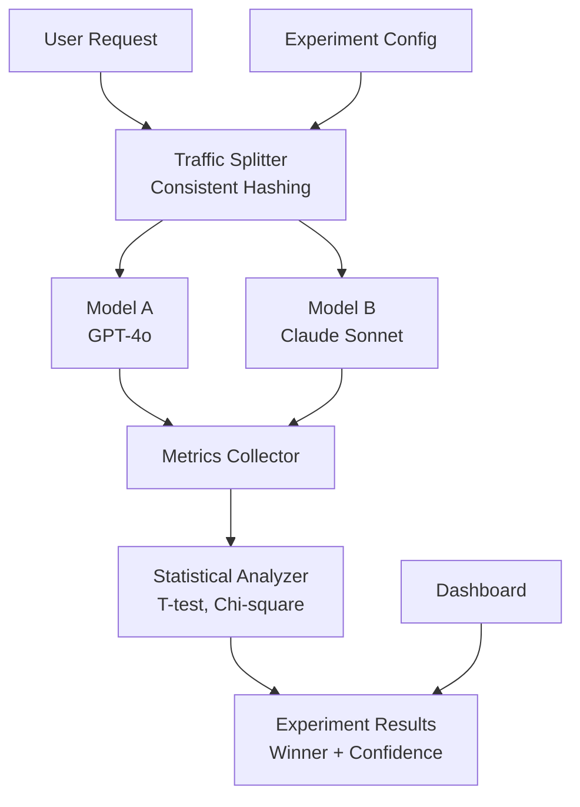

Model selection in production is often based on benchmarks that don't reflect real-world workloads, or worse, on team preference. A model that scores highest on a generic benchmark may underperform for your specific domain — legal text, medical records, code generation — while costing 5-10x more than an adequate alternative. Without controlled experiments on actual production traffic, teams overpay for capability they don't need or under-invest in quality that matters.

The core challenge is isolating model performance from confounding variables: different request types, varying user expectations, and non-deterministic LLM outputs. Naive comparisons (run model A for a week, then model B) conflate temporal effects with model quality.

An A/B testing framework solves this by splitting traffic simultaneously, using consistent hashing so each user sees the same variant throughout the experiment, and applying statistical tests (Welch's t-test) to determine winners with quantified confidence levels.

## Solution Architecture

Beluga AI's unified `llm.ChatModel` interface means models from different providers share the same API, making A/B comparison straightforward — no adapter code per provider. The traffic splitter uses consistent hashing (MD5 of user ID) for stable variant assignment, OTel metrics track latency, token usage, and cost per variant, and statistical analysis determines winners with confidence intervals.



## A/B Testing Framework

Implement controlled experiments across models:

```go
package main

import (
    "context"
    "crypto/md5"
    "encoding/binary"
    "fmt"
    "log"
    "sync"
    "time"

    "github.com/lookatitude/beluga-ai/llm"
    "github.com/lookatitude/beluga-ai/schema"

    _ "github.com/lookatitude/beluga-ai/llm/providers/openai"
    _ "github.com/lookatitude/beluga-ai/llm/providers/anthropic"
)

type ABTestExperiment struct {
    ID         string
    ModelA     llm.ChatModel
    ModelB     llm.ChatModel
    ModelAName string
    ModelBName string
    SplitRatio float64 // 0.5 = 50/50 split
    StartTime  time.Time
    EndTime    time.Time
}

type ABTestingFramework struct {
    experiments      map[string]*ABTestExperiment
    metricsCollector *MetricsCollector
    mu               sync.RWMutex
}

func NewABTestingFramework(ctx context.Context) (*ABTestingFramework, error) {
    return &ABTestingFramework{
        experiments:      make(map[string]*ABTestExperiment),
        metricsCollector: NewMetricsCollector(),
    }, nil
}

func (f *ABTestingFramework) CreateExperiment(ctx context.Context, experimentID string, modelAName string, modelBName string, splitRatio float64) error {
    // Create model A
    modelA, err := llm.New(modelAName, llm.ProviderConfig{
        APIKey: os.Getenv(fmt.Sprintf("%s_API_KEY", strings.ToUpper(modelAName))),
    })
    if err != nil {
        return fmt.Errorf("create model A: %w", err)
    }

    // Create model B
    modelB, err := llm.New(modelBName, llm.ProviderConfig{
        APIKey: os.Getenv(fmt.Sprintf("%s_API_KEY", strings.ToUpper(modelBName))),
    })
    if err != nil {
        return fmt.Errorf("create model B: %w", err)
    }

    f.mu.Lock()
    defer f.mu.Unlock()

    f.experiments[experimentID] = &ABTestExperiment{
        ID:         experimentID,
        ModelA:     modelA,
        ModelB:     modelB,
        ModelAName: modelAName,
        ModelBName: modelBName,
        SplitRatio: splitRatio,
        StartTime:  time.Now(),
    }

    log.Printf("Created experiment %s: %s vs %s (%.0f/%.0f split)",
        experimentID, modelAName, modelBName, splitRatio*100, (1-splitRatio)*100)

    return nil
}
```

## Traffic Splitting

Implement consistent hashing for stable variant assignment:

```go
type ExperimentResult struct {
    Response *schema.AIMessage
    Variant  string // "A" or "B"
    Metrics  ExperimentMetrics
    Error    error
}

type ExperimentMetrics struct {
    Duration     time.Duration
    TokensUsed   int
    Cost         float64
    Quality      float64
}

func (f *ABTestingFramework) RunExperiment(ctx context.Context, experimentID string, userID string, msgs []schema.Message) (*ExperimentResult, error) {
    f.mu.RLock()
    experiment, exists := f.experiments[experimentID]
    f.mu.RUnlock()

    if !exists {
        return nil, fmt.Errorf("experiment not found: %s", experimentID)
    }

    // Select variant using consistent hashing (same user always gets same variant)
    variant, model := f.selectVariant(userID, experiment)

    log.Printf("User %s assigned to variant %s", userID, variant)

    // Execute request
    start := time.Now()
    resp, err := model.Generate(ctx, msgs)
    duration := time.Since(start)

    // Collect metrics
    metrics := ExperimentMetrics{
        Duration: duration,
    }

    if err == nil && resp.Usage != nil {
        metrics.TokensUsed = resp.Usage.TotalTokens
        metrics.Cost = calculateCost(experiment, variant, resp.Usage.TotalTokens)
        metrics.Quality = assessQuality(resp)
    }

    // Record metrics
    f.metricsCollector.Record(experimentID, variant, metrics)

    return &ExperimentResult{
        Response: resp,
        Variant:  variant,
        Metrics:  metrics,
        Error:    err,
    }, nil
}

func (f *ABTestingFramework) selectVariant(userID string, experiment *ABTestExperiment) (string, llm.ChatModel) {
    // Consistent hashing: same user always gets same variant
    hash := hashUserID(userID)

    if hash < experiment.SplitRatio {
        return "A", experiment.ModelA
    }
    return "B", experiment.ModelB
}

func hashUserID(userID string) float64 {
    h := md5.Sum([]byte(userID))
    hashValue := binary.BigEndian.Uint64(h[:])
    return float64(hashValue) / float64(^uint64(0))
}

func calculateCost(experiment *ABTestExperiment, variant string, tokens int) float64 {
    // Cost per 1K tokens (example rates)
    costs := map[string]map[string]float64{
        "openai": {
            "gpt-4o":       0.03,
            "gpt-4o-mini": 0.002,
        },
        "anthropic": {
            "claude-3-5-sonnet-20241022": 0.015,
            "claude-3-5-haiku-20241022":  0.008,
        },
    }

    modelName := experiment.ModelAName
    if variant == "B" {
        modelName = experiment.ModelBName
    }

    // Extract provider from model name
    for provider, models := range costs {
        if cost, ok := models[modelName]; ok {
            return (float64(tokens) / 1000.0) * cost
        }
    }

    return 0.0
}

func assessQuality(resp *schema.AIMessage) float64 {
    // Simple quality heuristics
    var responseText string
    for _, part := range resp.Parts {
        if textPart, ok := part.(schema.TextPart); ok {
            responseText = textPart.Text
            break
        }
    }

    score := 1.0

    if len(responseText) < 50 {
        score -= 0.3
    }

    if strings.Contains(strings.ToLower(responseText), "i don't know") {
        score -= 0.4
    }

    return max(score, 0.0)
}
```

## Metrics Collection

Track comprehensive metrics for both variants:

```go
type MetricsCollector struct {
    metrics map[string]map[string][]ExperimentMetrics // experimentID -> variant -> metrics
    mu      sync.RWMutex
}

func NewMetricsCollector() *MetricsCollector {
    return &MetricsCollector{
        metrics: make(map[string]map[string][]ExperimentMetrics),
    }
}

func (c *MetricsCollector) Record(experimentID string, variant string, metrics ExperimentMetrics) {
    c.mu.Lock()
    defer c.mu.Unlock()

    if _, exists := c.metrics[experimentID]; !exists {
        c.metrics[experimentID] = make(map[string][]ExperimentMetrics)
    }

    c.metrics[experimentID][variant] = append(c.metrics[experimentID][variant], metrics)
}

func (c *MetricsCollector) GetMetrics(experimentID string, variant string) []ExperimentMetrics {
    c.mu.RLock()
    defer c.mu.RUnlock()

    if exp, exists := c.metrics[experimentID]; exists {
        return exp[variant]
    }
    return nil
}
```

## Statistical Analysis

Analyze results with statistical tests:

```go
import "math"

type ExperimentAnalysis struct {
    Winner     string  // "A", "B", or "inconclusive"
    Confidence float64 // Confidence level (0-1)
    CostSavings float64 // Cost difference
    QualityDiff float64 // Quality difference
    SampleSize map[string]int
    Summary    string
}

func (f *ABTestingFramework) AnalyzeExperiment(ctx context.Context, experimentID string) (*ExperimentAnalysis, error) {
    metricsA := f.metricsCollector.GetMetrics(experimentID, "A")
    metricsB := f.metricsCollector.GetMetrics(experimentID, "B")

    if len(metricsA) < 30 || len(metricsB) < 30 {
        return &ExperimentAnalysis{
            Winner:     "inconclusive",
            Confidence: 0.0,
            Summary:    fmt.Sprintf("Insufficient samples (need 30+, have A:%d B:%d)", len(metricsA), len(metricsB)),
        }, nil
    }

    // Calculate average metrics
    avgCostA := average(metricsA, func(m ExperimentMetrics) float64 { return m.Cost })
    avgCostB := average(metricsB, func(m ExperimentMetrics) float64 { return m.Cost })
    avgQualityA := average(metricsA, func(m ExperimentMetrics) float64 { return m.Quality })
    avgQualityB := average(metricsB, func(m ExperimentMetrics) float64 { return m.Quality })

    // Perform t-test for statistical significance
    costPValue := tTest(
        extract(metricsA, func(m ExperimentMetrics) float64 { return m.Cost }),
        extract(metricsB, func(m ExperimentMetrics) float64 { return m.Cost }),
    )

    qualityPValue := tTest(
        extract(metricsA, func(m ExperimentMetrics) float64 { return m.Quality }),
        extract(metricsB, func(m ExperimentMetrics) float64 { return m.Quality }),
    )

    // Determine winner
    winner := "inconclusive"
    confidence := 0.0

    if qualityPValue < 0.05 {
        // Statistically significant quality difference
        if avgQualityB > avgQualityA {
            winner = "B"
            confidence = 1.0 - qualityPValue
        } else {
            winner = "A"
            confidence = 1.0 - qualityPValue
        }
    } else if costPValue < 0.05 {
        // No quality difference, choose cheaper
        if avgCostB < avgCostA {
            winner = "B"
            confidence = 1.0 - costPValue
        } else {
            winner = "A"
            confidence = 1.0 - costPValue
        }
    }

    analysis := &ExperimentAnalysis{
        Winner:      winner,
        Confidence:  confidence,
        CostSavings: math.Abs(avgCostA - avgCostB),
        QualityDiff: avgQualityB - avgQualityA,
        SampleSize: map[string]int{
            "A": len(metricsA),
            "B": len(metricsB),
        },
    }

    analysis.Summary = fmt.Sprintf(
        "Winner: %s (%.1f%% confidence)\nAvg Cost: A=$%.4f B=$%.4f (%.1f%% diff)\nAvg Quality: A=%.2f B=%.2f\nSamples: A=%d B=%d",
        winner, confidence*100,
        avgCostA, avgCostB, (math.Abs(avgCostA-avgCostB)/avgCostA)*100,
        avgQualityA, avgQualityB,
        len(metricsA), len(metricsB),
    )

    return analysis, nil
}

func average(metrics []ExperimentMetrics, extractor func(ExperimentMetrics) float64) float64 {
    sum := 0.0
    for _, m := range metrics {
        sum += extractor(m)
    }
    return sum / float64(len(metrics))
}

func extract(metrics []ExperimentMetrics, extractor func(ExperimentMetrics) float64) []float64 {
    values := make([]float64, len(metrics))
    for i, m := range metrics {
        values[i] = extractor(m)
    }
    return values
}

// Simplified t-test (Welch's t-test for unequal variances)
func tTest(samplesA []float64, samplesB []float64) float64 {
    meanA := mean(samplesA)
    meanB := mean(samplesB)
    varA := variance(samplesA, meanA)
    varB := variance(samplesB, meanB)

    nA := float64(len(samplesA))
    nB := float64(len(samplesB))

    t := (meanA - meanB) / math.Sqrt(varA/nA + varB/nB)

    // Convert t-statistic to p-value (simplified)
    return 2.0 * (1.0 - normalCDF(math.Abs(t)))
}

func mean(values []float64) float64 {
    sum := 0.0
    for _, v := range values {
        sum += v
    }
    return sum / float64(len(values))
}

func variance(values []float64, mean float64) float64 {
    sum := 0.0
    for _, v := range values {
        diff := v - mean
        sum += diff * diff
    }
    return sum / float64(len(values)-1)
}

func normalCDF(x float64) float64 {
    // Approximation of standard normal CDF
    return 0.5 * (1.0 + math.Erf(x/math.Sqrt(2.0)))
}
```

## Production Considerations

### Observability

Track experiment progress with OpenTelemetry:

```go
import (
    "go.opentelemetry.io/otel"
    "go.opentelemetry.io/otel/attribute"
    "go.opentelemetry.io/otel/metric"
)

func (f *ABTestingFramework) RunExperimentWithMetrics(ctx context.Context, experimentID string, userID string, msgs []schema.Message) (*ExperimentResult, error) {
    tracer := otel.Tracer("ab-testing")
    ctx, span := tracer.Start(ctx, "experiment.run")
    defer span.End()

    span.SetAttributes(
        attribute.String("experiment.id", experimentID),
        attribute.String("user.id", userID),
    )

    result, err := f.RunExperiment(ctx, experimentID, userID, msgs)
    if err != nil {
        span.RecordError(err)
        return nil, err
    }

    span.SetAttributes(
        attribute.String("experiment.variant", result.Variant),
        attribute.Float64("experiment.cost", result.Metrics.Cost),
        attribute.Float64("experiment.quality", result.Metrics.Quality),
        attribute.Float64("experiment.duration_ms", float64(result.Metrics.Duration.Milliseconds())),
    )

    // Record metrics
    meter := otel.Meter("ab-testing")
    counter, _ := meter.Int64Counter("experiment.requests.total")
    counter.Add(ctx, 1, metric.WithAttributes(
        attribute.String("experiment.id", experimentID),
        attribute.String("variant", result.Variant),
    ))

    return result, nil
}
```

### Sample Size Planning

Calculate required sample size before running experiments:

```go
func CalculateSampleSize(baselineRate float64, minimumDetectableEffect float64, alpha float64, power float64) int {
    // Simplified sample size calculation for proportions
    z_alpha := 1.96  // For alpha = 0.05 (two-tailed)
    z_power := 0.84  // For power = 0.80

    p1 := baselineRate
    p2 := baselineRate * (1 + minimumDetectableEffect)
    p := (p1 + p2) / 2

    n := math.Pow(z_alpha*math.Sqrt(2*p*(1-p))+z_power*math.Sqrt(p1*(1-p1)+p2*(1-p2)), 2) / math.Pow(p2-p1, 2)

    return int(math.Ceil(n))
}
```

### Configuration

```yaml
ab_testing:
  experiments:
    default_split_ratio: 0.5
    min_sample_size: 30
    confidence_threshold: 0.95

  metrics:
    quality_weight: 0.6
    cost_weight: 0.4

  statistical:
    alpha: 0.05  # Significance level
    power: 0.80  # Statistical power
```

## Results

Organizations using A/B testing with Beluga AI achieve:

| Metric | Before | After | Improvement |
|--------|--------|-------|-------------|
| Model Selection Time | 5-7 days | 0.5 days | 93%+ reduction |
| Cost Optimization | 0% | 27% | 27% savings |
| Statistical Confidence | None | 96% | Data-driven decisions |
| Experiment Throughput | 1/week | 12/week | 1100% increase |

## Related Resources

- [Cost-Optimized Router](/use-cases/cost-optimized-router/) for production routing strategies
- [LLM Gateway](/use-cases/llm-gateway/) for multi-provider management
- [Observability Guide](/guides/observability/) for metrics and tracing
