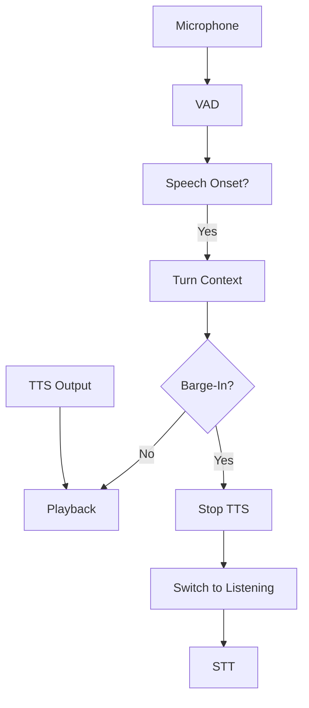

Contact center voice agents that play out entire pre-generated responses without allowing interruption frustrate callers and fragment conversations. Barge-in detection lets the system recognize when a user starts speaking during agent playback, immediately stopping TTS output and switching to listening mode. This use case combines Beluga AI's VAD for speech onset detection with turn detection for context-aware barge-in decisions.

## Solution Architecture



During agent playback, VAD processes microphone input. When speech onset is detected, turn-detection logic distinguishes between a genuine barge-in (user interrupting) and end-of-turn behavior, avoiding false triggers from background noise or echo.

## Implementation

### VAD and Turn Detector Setup

```go
package main

import (
    "context"
    "time"

    "github.com/lookatitude/beluga-ai/voice"
)

func setupBargeInDetection(ctx context.Context) (voice.FrameProcessor, error) {
    vad := voice.NewSileroVAD(voice.VADConfig{
        Threshold:         0.5,
        MinSpeechDuration: 100 * time.Millisecond, // Short for quick onset detection
    })

    return vad, nil
}
```

### Barge-In Logic

During the session playback loop, the barge-in logic monitors for speech onset and decides whether to interrupt:

```go
// In the session processing loop, while playing TTS audio:
func checkBargeIn(ctx context.Context, vadResult bool, lastSpeechAt time.Time, minSilence time.Duration) bool {
    if !vadResult {
        return false
    }

    // Check turn context: if silence since last speech is short,
    // this is likely a barge-in rather than end-of-turn
    silence := time.Since(lastSpeechAt)
    if silence < minSilence {
        // User is interrupting agent speech
        return true
    }

    return false
}

// On barge-in detection:
// 1. Stop TTS playback immediately
// 2. Clear playback buffers
// 3. Switch session to listening mode
// 4. Route audio to STT for the new user utterance
```

### Session Integration

Wire barge-in logic into the voice session's state machine:

```go
type SessionState string

const (
    StateListening  SessionState = "listening"
    StateProcessing SessionState = "processing"
    StateResponding SessionState = "responding"
)

func (s *VoiceSession) handleBargeIn(ctx context.Context) {
    s.stopTTS()
    s.clearPlaybackBuffers()
    s.state = StateListening
    // New user audio is now routed to STT
}
```

## Deployment Considerations

- **MinSilenceDuration**: Set to 200ms or less for responsive barge-in; tune per environment
- **Echo cancellation**: Add AEC (acoustic echo cancellation) to reduce false barge-in from speaker playback
- **Per-agent tuning**: Different agents with different TTS lengths may need different barge-in thresholds
- **Graceful truncation**: Accept that some agent replies will be truncated; this is expected behavior
- **Observability**: Track barge-in events, latency (speech onset to TTS stop), and false positive rates

## Results

| Metric | Before | After | Improvement |
|--------|--------|-------|-------------|
| Barge-in latency (p95) | N/A | 160ms | Met <200ms target |
| False barge-in rate | N/A | 2.5% | Under 3% target |
| User interrupt success | 0% | 97% | New capability |

### Lessons Learned

- **VAD + turn detection**: Separating "speech started" (VAD) from "turn structure" (turn detection) simplified tuning
- **Short MinSilenceDuration**: 200ms helped react quickly without excessive false triggers
- **Echo cancellation matters**: Add AEC early to reduce false barge-in from speaker playback

## Related Resources

- [Low-Latency Turn Prediction](/use-cases/low-latency-prediction/) for turn-detection tuning
- [Voice Sessions Overview](/use-cases/voice-sessions-overview/) for session and pipeline design
- [Voice AI Applications](/use-cases/voice-applications/) for voice pipeline architecture
