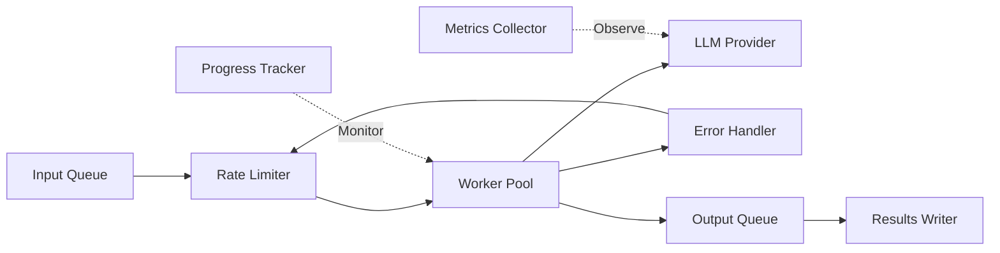

Processing large volumes of data with AI requires more than just calling an LLM in a loop. This use case demonstrates how to build a production-grade batch processing system that handles rate limits, tracks progress, and ensures reliability.

## Business Problem

A customer support team needs to process 1,000+ support tickets daily, generating AI-powered responses for each. Manual processing takes 5-10 minutes per ticket, requiring 20+ agents and resulting in 4-8 hour response times.

### Challenges

- **Rate limits** from LLM providers (e.g., 10,000 RPM for GPT-3.5, 500 RPM for GPT-4)
- **Inconsistent processing times** due to varying ticket complexity
- **Error handling** for transient failures and invalid inputs
- **Progress visibility** for operators monitoring the system
- **Cost optimization** while maintaining throughput

### Success Metrics

| Metric | Before | After Implementation |
|--------|--------|---------------------|
| Processing time/ticket | 7 minutes | 45 seconds |
| Tickets/hour | 8 | 80 |
| First response time | 4 hours | 25 minutes |
| Agent time saved | 0% | 70% |
| Error rate | N/A | < 1% |

## Architecture



### Components

- **Input Queue** - Buffered channel for streaming input with backpressure
- **Rate Limiter** - Token bucket controlling API request rate
- **Worker Pool** - Concurrent goroutines processing items in parallel
- **Error Handler** - Retry logic with exponential backoff
- **Output Queue** - Batch result collection to reduce I/O overhead
- **Progress Tracker** - Real-time metrics via OpenTelemetry

## Implementation

### Batch Processor Core

```go
package main

import (
    "context"
    "fmt"
    "sync"
    "sync/atomic"
    "time"

    "golang.org/x/time/rate"
    "go.opentelemetry.io/otel"
    "go.opentelemetry.io/otel/metric"

    "github.com/lookatitude/beluga-ai/pkg/llms"
    "github.com/lookatitude/beluga-ai/pkg/schema"
)

type BatchConfig struct {
    WorkerCount  int
    RateLimit    float64 // Requests per second
    MaxRetries   int
    RetryBackoff time.Duration
    InputBuffer  int
    OutputBuffer int
}

var DefaultBatchConfig = BatchConfig{
    WorkerCount:  10,
    RateLimit:    100.0, // 6000 RPM
    MaxRetries:   3,
    RetryBackoff: time.Second,
    InputBuffer:  100,
    OutputBuffer: 100,
}

type WorkItem struct {
    ID      string
    Input   string
    Context map[string]interface{}
}

type WorkResult struct {
    ID       string
    Input    string
    Output   string
    Error    error
    Duration time.Duration
    Retries  int
}

type BatchProcessor struct {
    config  BatchConfig
    llm     llms.LLM
    limiter *rate.Limiter

    // Metrics
    processed atomic.Int64
    succeeded atomic.Int64
    failed    atomic.Int64

    // Metrics instruments
    processedCounter metric.Int64Counter
    durationHist     metric.Float64Histogram
}

func NewBatchProcessor(llm llms.LLM, config BatchConfig) (*BatchProcessor, error) {
    meter := otel.Meter("beluga.batch")

    processedCounter, err := meter.Int64Counter("batch.items.processed")
    if err != nil {
        return nil, err
    }

    durationHist, err := meter.Float64Histogram("batch.item.duration")
    if err != nil {
        return nil, err
    }

    return &BatchProcessor{
        config:           config,
        llm:              llm,
        limiter:          rate.NewLimiter(rate.Limit(config.RateLimit), 1),
        processedCounter: processedCounter,
        durationHist:     durationHist,
    }, nil
}

func (bp *BatchProcessor) Process(ctx context.Context, items []WorkItem) ([]WorkResult, error) {
    inputChan := make(chan WorkItem, bp.config.InputBuffer)
    outputChan := make(chan WorkResult, bp.config.OutputBuffer)

    // Start workers
    var wg sync.WaitGroup
    for i := 0; i < bp.config.WorkerCount; i++ {
        wg.Add(1)
        go bp.worker(ctx, inputChan, outputChan, &wg)
    }

    // Feed work items
    go func() {
        for _, item := range items {
            select {
            case <-ctx.Done():
                return
            case inputChan <- item:
            }
        }
        close(inputChan)
    }()

    // Collect results
    go func() {
        wg.Wait()
        close(outputChan)
    }()

    var results []WorkResult
    for result := range outputChan {
        results = append(results, result)
    }

    return results, nil
}

func (bp *BatchProcessor) worker(
    ctx context.Context,
    input <-chan WorkItem,
    output chan<- WorkResult,
    wg *sync.WaitGroup,
) {
    defer wg.Done()

    for {
        select {
        case <-ctx.Done():
            return
        case item, ok := <-input:
            if !ok {
                return
            }

            result := bp.processItem(ctx, item)
            select {
            case <-ctx.Done():
                return
            case output <- result:
            }
        }
    }
}

func (bp *BatchProcessor) processItem(ctx context.Context, item WorkItem) WorkResult {
    start := time.Now()
    var lastErr error

    for attempt := 0; attempt <= bp.config.MaxRetries; attempt++ {
        // Wait for rate limiter
        if err := bp.limiter.Wait(ctx); err != nil {
            return WorkResult{
                ID:    item.ID,
                Input: item.Input,
                Error: fmt.Errorf("rate limit wait: %w", err),
            }
        }

        // Process item
        output, err := bp.callLLM(ctx, item)
        if err == nil {
            // Success
            duration := time.Since(start)
            bp.processed.Add(1)
            bp.succeeded.Add(1)

            // Record metrics
            bp.processedCounter.Add(ctx, 1)
            bp.durationHist.Record(ctx, duration.Seconds())

            return WorkResult{
                ID:       item.ID,
                Input:    item.Input,
                Output:   output,
                Duration: duration,
                Retries:  attempt,
            }
        }

        lastErr = err

        // Check if retryable
        if !isRetryable(err) {
            break
        }

        // Exponential backoff
        if attempt < bp.config.MaxRetries {
            backoff := bp.config.RetryBackoff * time.Duration(1<<attempt)
            select {
            case <-ctx.Done():
                return WorkResult{ID: item.ID, Input: item.Input, Error: ctx.Err()}
            case <-time.After(backoff):
            }
        }
    }

    // Failed after retries
    duration := time.Since(start)
    bp.processed.Add(1)
    bp.failed.Add(1)

    return WorkResult{
        ID:       item.ID,
        Input:    item.Input,
        Error:    fmt.Errorf("failed after %d retries: %w", bp.config.MaxRetries, lastErr),
        Duration: duration,
        Retries:  bp.config.MaxRetries,
    }
}

func (bp *BatchProcessor) callLLM(ctx context.Context, item WorkItem) (string, error) {
    messages := []schema.Message{
        schema.NewSystemMessage("You are a helpful customer support assistant."),
        schema.NewHumanMessage(item.Input),
    }

    response, err := bp.llm.Generate(ctx, messages)
    if err != nil {
        return "", err
    }

    return response.Content, nil
}

func isRetryable(err error) bool {
    // Check for transient errors
    errStr := err.Error()
    return contains(errStr, "timeout") ||
        contains(errStr, "rate limit") ||
        contains(errStr, "connection") ||
        contains(errStr, "503") ||
        contains(errStr, "502")
}

func contains(s, substr string) bool {
    return len(s) > 0 && len(substr) > 0 &&
        len(s) >= len(substr) &&
        strings.Contains(strings.ToLower(s), strings.ToLower(substr))
}

func (bp *BatchProcessor) Stats() map[string]int64 {
    return map[string]int64{
        "processed": bp.processed.Load(),
        "succeeded": bp.succeeded.Load(),
        "failed":    bp.failed.Load(),
    }
}
```

### Progress Tracking

```go
type ProgressTracker struct {
    total     int64
    processed atomic.Int64
    startTime time.Time
    ticker    *time.Ticker
}

func NewProgressTracker(total int64) *ProgressTracker {
    return &ProgressTracker{
        total:     total,
        startTime: time.Now(),
        ticker:    time.NewTicker(5 * time.Second),
    }
}

func (pt *ProgressTracker) Start(ctx context.Context) {
    go func() {
        for {
            select {
            case <-ctx.Done():
                pt.ticker.Stop()
                return
            case <-pt.ticker.C:
                pt.report()
            }
        }
    }()
}

func (pt *ProgressTracker) Increment() {
    pt.processed.Add(1)
}

func (pt *ProgressTracker) report() {
    processed := pt.processed.Load()
    elapsed := time.Since(pt.startTime)
    rate := float64(processed) / elapsed.Seconds()
    remaining := pt.total - processed
    eta := time.Duration(float64(remaining)/rate) * time.Second

    pct := float64(processed) / float64(pt.total) * 100

    fmt.Printf("\rProgress: %d/%d (%.1f%%) | Rate: %.1f/s | ETA: %s",
        processed, pt.total, pct, rate, eta.Round(time.Second))
}
```

### Usage Example

```go
func main() {
    ctx := context.Background()

    // Setup LLM
    config := llms.NewConfig(
        llms.WithProvider("openai"),
        llms.WithModelName("gpt-3.5-turbo"),
        llms.WithAPIKey(os.Getenv("OPENAI_API_KEY")),
    )

    factory := llms.NewFactory()
    llm, err := factory.CreateLLM("openai", config)
    if err != nil {
        log.Fatal(err)
    }

    // Create batch processor
    batchConfig := DefaultBatchConfig
    batchConfig.WorkerCount = 20
    batchConfig.RateLimit = 150.0 // 9000 RPM

    processor, err := NewBatchProcessor(llm, batchConfig)
    if err != nil {
        log.Fatal(err)
    }

    // Load work items
    items := loadTickets("tickets.json")
    fmt.Printf("Processing %d items\n", len(items))

    // Start progress tracking
    tracker := NewProgressTracker(int64(len(items)))
    tracker.Start(ctx)

    // Process batch
    results, err := processor.Process(ctx, items)
    if err != nil {
        log.Fatal(err)
    }

    // Analyze results
    stats := processor.Stats()
    fmt.Printf("\n\nBatch complete:\n")
    fmt.Printf("  Processed: %d\n", stats["processed"])
    fmt.Printf("  Succeeded: %d\n", stats["succeeded"])
    fmt.Printf("  Failed: %d\n", stats["failed"])
    fmt.Printf("  Success rate: %.1f%%\n",
        float64(stats["succeeded"])/float64(stats["processed"])*100)

    // Save results
    saveResults("results.json", results)
}
```

## Advanced Features

### Checkpointing

Resume processing after failures.

```go
type Checkpoint struct {
    ProcessedIDs map[string]bool
    mu           sync.RWMutex
}

func (c *Checkpoint) Save(filename string) error {
    c.mu.RLock()
    defer c.mu.RUnlock()

    data, err := json.Marshal(c.ProcessedIDs)
    if err != nil {
        return err
    }

    return os.WriteFile(filename, data, 0644)
}

func (c *Checkpoint) Load(filename string) error {
    data, err := os.ReadFile(filename)
    if err != nil {
        if os.IsNotExist(err) {
            return nil
        }
        return err
    }

    c.mu.Lock()
    defer c.mu.Unlock()

    return json.Unmarshal(data, &c.ProcessedIDs)
}

func (c *Checkpoint) IsProcessed(id string) bool {
    c.mu.RLock()
    defer c.mu.RUnlock()
    return c.ProcessedIDs[id]
}

func (c *Checkpoint) MarkProcessed(id string) {
    c.mu.Lock()
    defer c.mu.Unlock()
    c.ProcessedIDs[id] = true
}
```

### Dead Letter Queue

Store failed items for manual review.

```go
type DeadLetterQueue struct {
    items []WorkItem
    mu    sync.Mutex
    file  *os.File
}

func NewDeadLetterQueue(filename string) (*DeadLetterQueue, error) {
    file, err := os.OpenFile(filename, os.O_CREATE|os.O_APPEND|os.O_WRONLY, 0644)
    if err != nil {
        return nil, err
    }

    return &DeadLetterQueue{
        items: make([]WorkItem, 0),
        file:  file,
    }, nil
}

func (dlq *DeadLetterQueue) Add(item WorkItem, err error) {
    dlq.mu.Lock()
    defer dlq.mu.Unlock()

    dlq.items = append(dlq.items, item)

    // Write to file
    entry := map[string]interface{}{
        "item":  item,
        "error": err.Error(),
        "time":  time.Now().Format(time.RFC3339),
    }

    data, _ := json.Marshal(entry)
    dlq.file.Write(append(data, '\n'))
}

func (dlq *DeadLetterQueue) Close() error {
    return dlq.file.Close()
}
```

## Best Practices

1. **Tune worker count** based on API limits and latency
2. **Use appropriate rate limits** to avoid throttling
3. **Implement comprehensive logging** for debugging
4. **Monitor metrics** (throughput, error rate, latency)
5. **Save checkpoints** regularly to enable resumption
6. **Handle backpressure** with buffered channels
7. **Implement graceful shutdown** to finish in-flight work
8. **Test with small batches** before scaling up
9. **Use dead letter queues** for failed items
10. **Cost tracking** per batch for budget management

## Next Steps

- Learn about [Workflow Orchestration](/use-cases/workflow-orchestration) for complex multi-step processing
- Explore [Production Agent Platform](/use-cases/production-platform) for deployment patterns
- Read [Infrastructure Recipes](/cookbook/infrastructure-recipes) for resilience patterns
