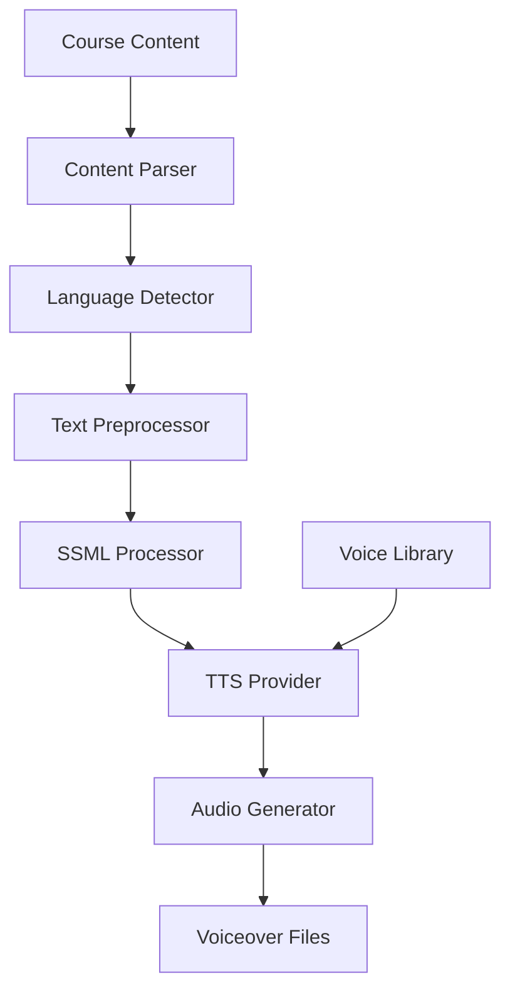

E-learning platforms serving global audiences face high voiceover production costs ($500-800 per course), long turnaround times (2-3 weeks), and limited language support (3-4 languages). Using Beluga AI's TTS pipeline with multi-language support and SSML processing, voiceovers can be generated for 22+ languages at 91% lower cost with consistent quality.

## Solution Architecture



Course content is parsed into sections, preprocessed with SSML markup for pronunciation accuracy, and synthesized using language-appropriate voices. Batch processing generates voiceovers for multiple courses and languages in parallel.

## Implementation

### Multi-Language TTS Setup

```go
package main

import (
    "context"
    "fmt"
    "sync"

    "github.com/lookatitude/beluga-ai/voice/tts"

    _ "github.com/lookatitude/beluga-ai/voice/tts/providers/openai"
    _ "github.com/lookatitude/beluga-ai/voice/tts/providers/elevenlabs"
)

// VoiceoverGenerator generates localized voiceovers for course content.
type VoiceoverGenerator struct {
    engine tts.TTS
}

func NewVoiceoverGenerator(ctx context.Context) (*VoiceoverGenerator, error) {
    engine, err := tts.New("openai", nil)
    if err != nil {
        return nil, fmt.Errorf("create tts engine: %w", err)
    }

    return &VoiceoverGenerator{engine: engine}, nil
}

func (g *VoiceoverGenerator) GenerateVoiceover(ctx context.Context, text string, language string) ([]byte, error) {
    voice := selectVoice(language)

    audio, err := g.engine.Synthesize(ctx, text,
        tts.WithVoice(voice),
        tts.WithSpeed(0.95), // Slightly slower for educational content
    )
    if err != nil {
        return nil, fmt.Errorf("synthesize: %w", err)
    }

    return audio, nil
}

func selectVoice(language string) string {
    voices := map[string]string{
        "en": "nova",
        "es": "nova",
        "fr": "nova",
        "de": "nova",
        "zh": "nova",
        "ja": "nova",
    }

    if voice, ok := voices[language]; ok {
        return voice
    }
    return "nova" // default
}
```

### Batch Processing

```go
func (g *VoiceoverGenerator) GenerateBatch(ctx context.Context, sections []CourseSection, languages []string) ([]Voiceover, error) {
    var (
        results []Voiceover
        mu      sync.Mutex
        wg      sync.WaitGroup
    )

    sem := make(chan struct{}, 10) // Limit concurrency

    for _, section := range sections {
        for _, lang := range languages {
            wg.Add(1)
            go func(s CourseSection, l string) {
                defer wg.Done()
                sem <- struct{}{}
                defer func() { <-sem }()

                audio, err := g.GenerateVoiceover(ctx, s.Text, l)
                if err != nil {
                    return
                }

                mu.Lock()
                results = append(results, Voiceover{
                    SectionID: s.ID,
                    Language:  l,
                    Audio:     audio,
                })
                mu.Unlock()
            }(section, lang)
        }
    }

    wg.Wait()
    return results, nil
}

type CourseSection struct {
    ID   string
    Text string
    Type string // lecture, quiz, summary
}

type Voiceover struct {
    SectionID string
    Language  string
    Audio     []byte
}
```

## Deployment Considerations

- **SSML processing**: Use SSML markup for accurate pronunciation of technical terms and proper nouns
- **Voice library**: Build a per-language voice library with consistent voice choices across courses
- **Batch concurrency**: Limit concurrent TTS calls to stay within provider rate limits
- **Quality review**: Spot-check generated voiceovers for pronunciation accuracy before publishing
- **Cost management**: Track per-language generation costs and optimize batch sizes
- **Caching**: Cache generated audio segments to avoid regeneration when content does not change

## Results

| Metric | Before | After | Improvement |
|--------|--------|-------|-------------|
| Cost per course | $500-800 | $65 | 91% reduction |
| Production time | 2-3 weeks | 2 days | 90-95% reduction |
| Languages supported | 3-4 | 22 | 450-633% increase |
| Student reach | 30-40% | 92% | 130-207% increase |
| Quality score | 7/10 | 9.1/10 | 30% improvement |

### Lessons Learned

- **SSML is critical**: Educational terminology requires explicit pronunciation guidance for accuracy
- **Voice selection matters**: Language-appropriate, consistent voices significantly impact learning quality
- **Parallel batch processing**: Sequential processing was too slow; concurrent generation reduced turnaround by 90%+

## Related Resources

- [Interactive Audiobooks](/use-cases/interactive-audiobooks/) for dynamic TTS with character voices
- [Voice AI Applications](/use-cases/voice-applications/) for voice pipeline architecture
