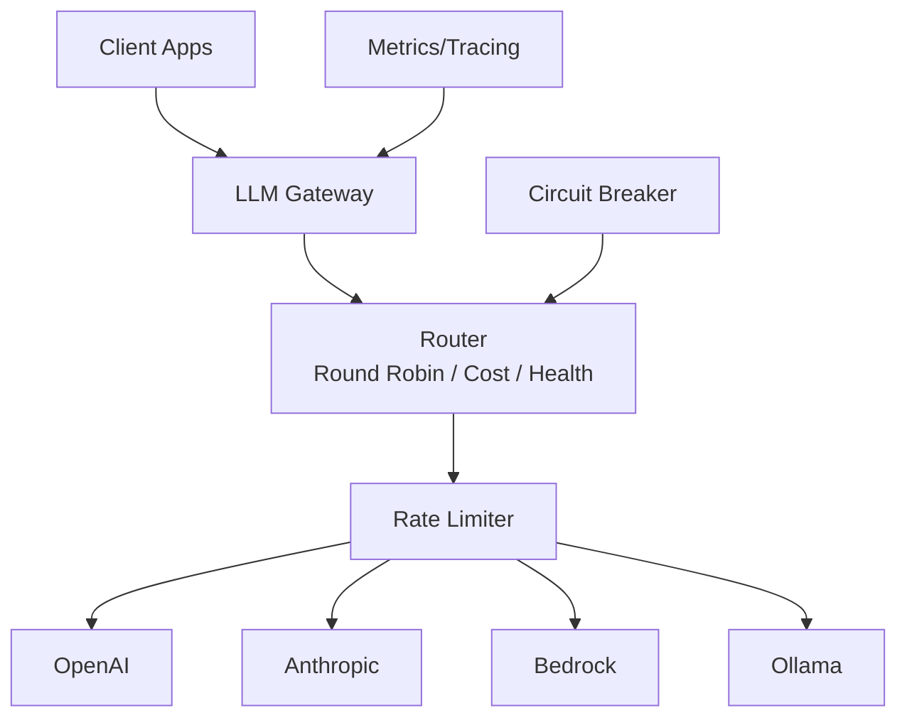

Applications using multiple LLM providers face complexity managing different APIs, handling rate limits, implementing failover, and monitoring usage across providers. A unified gateway abstracts provider differences, implements intelligent routing, and provides comprehensive observability. Beluga AI's LLM package provides a consistent interface across all providers with built-in routing, resilience, and cost tracking.

## Solution Architecture

Beluga AI's LLM gateway provides a single interface for multiple providers. The router selects providers based on availability, cost, or custom logic. Rate limiting prevents quota exhaustion. OpenTelemetry integration provides full observability with metrics and distributed tracing.



## Gateway Service

Create a gateway that manages multiple LLM providers:

```go
package main

import (
    "context"
    "fmt"
    "log"
    "sync"
    "time"

    "github.com/lookatitude/beluga-ai/llm"
    "github.com/lookatitude/beluga-ai/schema"

    _ "github.com/lookatitude/beluga-ai/llm/providers/openai"
    _ "github.com/lookatitude/beluga-ai/llm/providers/anthropic"
    _ "github.com/lookatitude/beluga-ai/llm/providers/bedrock"
)

type LLMGateway struct {
    providers   map[string]llm.ChatModel
    router      ProviderRouter
    rateLimiter *RateLimiter
    mu          sync.RWMutex
}

func NewLLMGateway(ctx context.Context) (*LLMGateway, error) {
    gateway := &LLMGateway{
        providers:   make(map[string]llm.ChatModel),
        router:      NewRoundRobinRouter(),
        rateLimiter: NewRateLimiter(),
    }

    // Initialize OpenAI
    openaiModel, err := llm.New("openai", llm.ProviderConfig{
        APIKey: os.Getenv("OPENAI_API_KEY"),
        Model:  "gpt-4o",
    })
    if err != nil {
        log.Printf("Failed to create OpenAI provider: %v", err)
    } else {
        gateway.providers["openai"] = openaiModel
    }

    // Initialize Anthropic
    anthropicModel, err := llm.New("anthropic", llm.ProviderConfig{
        APIKey: os.Getenv("ANTHROPIC_API_KEY"),
        Model:  "claude-3-5-sonnet-20241022",
    })
    if err != nil {
        log.Printf("Failed to create Anthropic provider: %v", err)
    } else {
        gateway.providers["anthropic"] = anthropicModel
    }

    // Initialize Bedrock
    bedrockModel, err := llm.New("bedrock", llm.ProviderConfig{
        Region: "us-east-1",
        Model:  "anthropic.claude-v2",
    })
    if err != nil {
        log.Printf("Failed to create Bedrock provider: %v", err)
    } else {
        gateway.providers["bedrock"] = bedrockModel
    }

    if len(gateway.providers) == 0 {
        return nil, fmt.Errorf("no providers available")
    }

    return gateway, nil
}

func (g *LLMGateway) Generate(ctx context.Context, msgs []schema.Message) (*schema.AIMessage, error) {
    // Select provider
    providerName, err := g.router.SelectProvider(ctx, g.getAvailableProviders())
    if err != nil {
        return nil, err
    }

    // Check rate limit
    if !g.rateLimiter.Allow(providerName) {
        return nil, fmt.Errorf("rate limit exceeded for provider %s", providerName)
    }

    // Get provider
    g.mu.RLock()
    provider, ok := g.providers[providerName]
    g.mu.RUnlock()
    if !ok {
        return nil, fmt.Errorf("provider not found: %s", providerName)
    }

    // Generate response
    start := time.Now()
    resp, err := provider.Generate(ctx, msgs)
    duration := time.Since(start)

    log.Printf("Provider %s took %v", providerName, duration)

    if err != nil {
        // Retry with fallback provider
        return g.retryWithFallback(ctx, msgs, providerName)
    }

    return resp, nil
}

func (g *LLMGateway) getAvailableProviders() []string {
    g.mu.RLock()
    defer g.mu.RUnlock()

    names := make([]string, 0, len(g.providers))
    for name := range g.providers {
        names = append(names, name)
    }
    return names
}

func (g *LLMGateway) retryWithFallback(ctx context.Context, msgs []schema.Message, failedProvider string) (*schema.AIMessage, error) {
    alternatives := g.getAlternativeProviders(failedProvider)

    for _, providerName := range alternatives {
        g.mu.RLock()
        provider, ok := g.providers[providerName]
        g.mu.RUnlock()

        if !ok || !g.rateLimiter.Allow(providerName) {
            continue
        }

        log.Printf("Falling back to provider %s", providerName)
        resp, err := provider.Generate(ctx, msgs)
        if err == nil {
            return resp, nil
        }
    }

    return nil, fmt.Errorf("all providers failed")
}

func (g *LLMGateway) getAlternativeProviders(exclude string) []string {
    all := g.getAvailableProviders()
    alternatives := []string{}
    for _, name := range all {
        if name != exclude {
            alternatives = append(alternatives, name)
        }
    }
    return alternatives
}
```

## Provider Routing Strategies

Implement different routing strategies based on your needs:

```go
type ProviderRouter interface {
    SelectProvider(ctx context.Context, providers []string) (string, error)
}

// Round-robin routing
type RoundRobinRouter struct {
    current int
    mu      sync.Mutex
}

func NewRoundRobinRouter() *RoundRobinRouter {
    return &RoundRobinRouter{}
}

func (r *RoundRobinRouter) SelectProvider(ctx context.Context, providers []string) (string, error) {
    if len(providers) == 0 {
        return "", fmt.Errorf("no providers available")
    }

    r.mu.Lock()
    defer r.mu.Unlock()

    provider := providers[r.current]
    r.current = (r.current + 1) % len(providers)
    return provider, nil
}

// Cost-based routing
type CostBasedRouter struct {
    costs map[string]float64
}

func NewCostBasedRouter() *CostBasedRouter {
    return &CostBasedRouter{
        costs: map[string]float64{
            "openai":    0.03,  // $0.03 per 1K tokens
            "anthropic": 0.015, // $0.015 per 1K tokens
            "bedrock":   0.008, // $0.008 per 1K tokens
        },
    }
}

func (r *CostBasedRouter) SelectProvider(ctx context.Context, providers []string) (string, error) {
    if len(providers) == 0 {
        return "", fmt.Errorf("no providers available")
    }

    cheapest := providers[0]
    minCost := r.costs[cheapest]

    for _, p := range providers[1:] {
        if cost, ok := r.costs[p]; ok && cost < minCost {
            cheapest = p
            minCost = cost
        }
    }

    return cheapest, nil
}

// Health-based routing with failover
type HealthBasedRouter struct {
    healthChecker *HealthChecker
}

func NewHealthBasedRouter(checker *HealthChecker) *HealthBasedRouter {
    return &HealthBasedRouter{healthChecker: checker}
}

func (r *HealthBasedRouter) SelectProvider(ctx context.Context, providers []string) (string, error) {
    healthy := []string{}
    for _, p := range providers {
        if r.healthChecker.IsHealthy(p) {
            healthy = append(healthy, p)
        }
    }

    if len(healthy) == 0 {
        return "", fmt.Errorf("no healthy providers")
    }

    return healthy[0], nil
}
```

## Rate Limiting

Implement per-provider rate limiting to prevent quota exhaustion:

```go
import "golang.org/x/time/rate"

type RateLimiter struct {
    limiters map[string]*rate.Limiter
    mu       sync.RWMutex
}

func NewRateLimiter() *RateLimiter {
    return &RateLimiter{
        limiters: map[string]*rate.Limiter{
            "openai":    rate.NewLimiter(rate.Every(time.Minute), 60),   // 60 req/min
            "anthropic": rate.NewLimiter(rate.Every(time.Minute), 50),   // 50 req/min
            "bedrock":   rate.NewLimiter(rate.Every(time.Minute), 100),  // 100 req/min
        },
    }
}

func (r *RateLimiter) Allow(provider string) bool {
    r.mu.RLock()
    limiter, ok := r.limiters[provider]
    r.mu.RUnlock()

    if !ok {
        return true // No limit configured
    }

    return limiter.Allow()
}
```

## Observability with OpenTelemetry

Instrument the gateway for comprehensive observability:

```go
import (
    "github.com/lookatitude/beluga-ai/o11y"
    "go.opentelemetry.io/otel"
    "go.opentelemetry.io/otel/attribute"
    "go.opentelemetry.io/otel/metric"
)

type ObservableGateway struct {
    *LLMGateway
    meter  metric.Meter
    tracer trace.Tracer
}

func NewObservableGateway(ctx context.Context) (*ObservableGateway, error) {
    gateway, err := NewLLMGateway(ctx)
    if err != nil {
        return nil, err
    }

    return &ObservableGateway{
        LLMGateway: gateway,
        meter:      otel.Meter("llm-gateway"),
        tracer:     otel.Tracer("llm-gateway"),
    }, nil
}

func (g *ObservableGateway) Generate(ctx context.Context, msgs []schema.Message) (*schema.AIMessage, error) {
    ctx, span := g.tracer.Start(ctx, "gateway.generate")
    defer span.End()

    providerName, err := g.router.SelectProvider(ctx, g.getAvailableProviders())
    if err != nil {
        span.RecordError(err)
        return nil, err
    }

    span.SetAttributes(
        attribute.String("gen_ai.system", providerName),
        attribute.Int("gen_ai.message_count", len(msgs)),
    )

    start := time.Now()
    resp, err := g.LLMGateway.Generate(ctx, msgs)
    duration := time.Since(start)

    // Record metrics
    counter, _ := g.meter.Int64Counter("llm.requests.total")
    counter.Add(ctx, 1, metric.WithAttributes(
        attribute.String("provider", providerName),
        attribute.String("status", status(err)),
    ))

    histogram, _ := g.meter.Float64Histogram("llm.request.duration")
    histogram.Record(ctx, duration.Seconds(), metric.WithAttributes(
        attribute.String("provider", providerName),
    ))

    if err != nil {
        span.RecordError(err)
        errorCounter, _ := g.meter.Int64Counter("llm.errors.total")
        errorCounter.Add(ctx, 1, metric.WithAttributes(
            attribute.String("provider", providerName),
        ))
        return nil, err
    }

    // Record token usage
    if resp.Usage != nil {
        tokenCounter, _ := g.meter.Int64Counter("llm.tokens.total")
        tokenCounter.Add(ctx, int64(resp.Usage.TotalTokens), metric.WithAttributes(
            attribute.String("provider", providerName),
        ))
    }

    span.SetAttributes(
        attribute.Int("gen_ai.usage.prompt_tokens", resp.Usage.PromptTokens),
        attribute.Int("gen_ai.usage.completion_tokens", resp.Usage.CompletionTokens),
    )

    return resp, nil
}

func status(err error) string {
    if err == nil {
        return "success"
    }
    return "error"
}
```

## Production Considerations

### Circuit Breaker

Implement circuit breaker pattern for failing providers:

```go
import "github.com/lookatitude/beluga-ai/resilience"

func (g *LLMGateway) GenerateWithCircuitBreaker(ctx context.Context, msgs []schema.Message) (*schema.AIMessage, error) {
    cb := resilience.NewCircuitBreaker(resilience.CircuitBreakerConfig{
        FailureThreshold: 5,
        SuccessThreshold: 2,
        Timeout:          60 * time.Second,
    })

    return resilience.ExecuteWithCircuitBreaker(ctx, cb, func(ctx context.Context) (*schema.AIMessage, error) {
        return g.Generate(ctx, msgs)
    })
}
```

### Configuration

```yaml
gateway:
  routing_strategy: "health_based"  # round_robin, cost_based, health_based
  enable_failover: true
  max_retries: 3
  timeout: 60s

providers:
  openai:
    enabled: true
    api_key: "${OPENAI_API_KEY}"
    model: "gpt-4o"
    rate_limit:
      requests_per_minute: 60
      tokens_per_minute: 90000

  anthropic:
    enabled: true
    api_key: "${ANTHROPIC_API_KEY}"
    model: "claude-3-5-sonnet-20241022"
    rate_limit:
      requests_per_minute: 50

  bedrock:
    enabled: true
    region: "us-east-1"
    model: "anthropic.claude-v2"
    rate_limit:
      requests_per_minute: 100

observability:
  otel:
    endpoint: "localhost:4317"
  metrics:
    enabled: true
  tracing:
    enabled: true
    sample_rate: 1.0
```

### Scaling

- **Horizontal scaling**: Deploy multiple gateway instances behind a load balancer. Each instance is stateless.
- **Provider management**: Use health checks to automatically remove failing providers from rotation.
- **Caching**: Implement prompt caching for frequently asked questions to reduce API calls.
- **Cost tracking**: Monitor token usage per provider to optimize routing decisions.

## Related Resources

- [LLM Package Guide](/guides/llm-integration/) for LLM integration patterns
- [Cost-Optimized Router](/use-cases/cost-optimized-router/) for cost optimization strategies
- [Observability Guide](/guides/observability/) for OpenTelemetry setup
