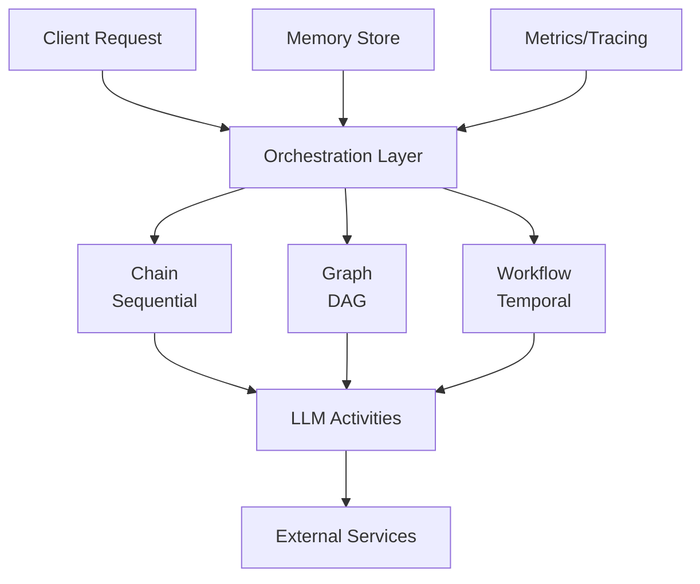

Enterprise applications require complex, long-running workflows that span multiple services, handle failures gracefully, and integrate intelligent decision-making. A typical order processing system, for example, must validate inventory, check credit, process payment, and fulfill the order — some steps in sequence, others in parallel, all with retry logic and state persistence across potential failures.

Traditional orchestration solutions (cron jobs, message queues, custom state machines) lack AI capabilities. Adding LLM-based decisions to these systems requires bolting on API calls with ad-hoc error handling, losing the benefits of structured workflow management. The result is fragile glue code that's hard to test, monitor, and recover from failures.

Beluga AI provides a complete orchestration layer with three patterns at different complexity levels, each with native LLM integration so AI-powered decisions are first-class workflow activities rather than external API calls.

## Solution Architecture

Beluga AI's orchestration layer supports three patterns, each suited to different complexity levels: **sequential chains** for linear flows where each step feeds the next, **DAG-based graphs** for parallel execution with explicit dependency edges, and **Temporal workflows** for distributed, fault-tolerant execution that survives process restarts. The choice depends on requirements: chains for simplicity, graphs for throughput, Temporal for durability.



## Chain Orchestration

Chains execute steps sequentially, passing output from one step to the next. Use chains when the workflow is inherently linear — each step depends on the previous step's output and there's no opportunity for parallelism. Chains are the simplest orchestration pattern and the right default when you don't need parallel execution or complex dependency graphs.

```go
package main

import (
    "context"
    "fmt"
    "log"
    "time"

    "github.com/lookatitude/beluga-ai/llm"
    "github.com/lookatitude/beluga-ai/orchestration"
    "github.com/lookatitude/beluga-ai/schema"

    _ "github.com/lookatitude/beluga-ai/llm/providers/openai"
)

func createOrderChain(ctx context.Context) (orchestration.Chain, error) {
    model, err := llm.New("openai", llm.ProviderConfig{
        APIKey: os.Getenv("OPENAI_API_KEY"),
        Model:  "gpt-4o",
    })
    if err != nil {
        return nil, fmt.Errorf("create model: %w", err)
    }

    chain := orchestration.NewChain(
        orchestration.WithTimeout(300 * time.Second),
        orchestration.WithMaxRetries(3),
    )

    // Step 1: Validate order
    chain.AddStep("validate", func(ctx context.Context, input map[string]any) (map[string]any, error) {
        orderID := input["order_id"].(string)
        if orderID == "" {
            return nil, fmt.Errorf("invalid order ID")
        }
        return map[string]any{"order_id": orderID, "valid": true}, nil
    })

    // Step 2: LLM-based decision for special handling
    chain.AddStep("decide", func(ctx context.Context, input map[string]any) (map[string]any, error) {
        orderValue := input["order_value"].(float64)
        customerTier := input["customer_tier"].(string)

        prompt := fmt.Sprintf("Order value: $%.2f, Customer tier: %s. Should this order receive expedited processing? Answer yes or no with brief reasoning.", orderValue, customerTier)

        resp, err := model.Generate(ctx, []schema.Message{
            &schema.HumanMessage{Parts: []schema.ContentPart{
                schema.TextPart{Text: prompt},
            }},
        })
        if err != nil {
            return nil, fmt.Errorf("llm decision: %w", err)
        }

        decision := resp.Parts[0].(schema.TextPart).Text
        input["expedited"] = decision
        return input, nil
    })

    // Step 3: Process payment
    chain.AddStep("payment", func(ctx context.Context, input map[string]any) (map[string]any, error) {
        orderID := input["order_id"].(string)
        paymentID := processPayment(orderID)
        input["payment_id"] = paymentID
        return input, nil
    })

    return chain, nil
}

func runChain(ctx context.Context) error {
    chain, err := createOrderChain(ctx)
    if err != nil {
        return err
    }

    result, err := chain.Execute(ctx, map[string]any{
        "order_id":       "order-123",
        "order_value":    250.00,
        "customer_tier":  "gold",
    })
    if err != nil {
        return fmt.Errorf("chain execution: %w", err)
    }

    log.Printf("Order processed: %v", result)
    return nil
}
```

## Graph Orchestration

Graphs define DAG-based workflows with parallel execution and explicit dependencies. Use graphs when independent steps can run concurrently — for example, checking inventory and verifying credit can happen in parallel since neither depends on the other, but payment processing must wait for both to complete. The graph engine automatically schedules steps based on dependency edges, maximizing throughput without manual goroutine management.

```go
func createOrderGraph(ctx context.Context) (orchestration.Graph, error) {
    graph := orchestration.NewGraph(
        orchestration.WithGraphName("order-processing"),
        orchestration.WithMaxWorkers(5),
        orchestration.WithParallelExecution(true),
    )

    // Define nodes
    graph.AddNode("validate", &ValidateOrderNode{})
    graph.AddNode("check_inventory", &CheckInventoryNode{})
    graph.AddNode("check_credit", &CheckCreditNode{})
    graph.AddNode("process_payment", &ProcessPaymentNode{})
    graph.AddNode("fulfill", &FulfillOrderNode{})
    graph.AddNode("notify", &NotifyCustomerNode{})

    // Define dependencies
    graph.AddEdge("validate", "check_inventory")
    graph.AddEdge("validate", "check_credit")  // Runs in parallel with inventory check
    graph.AddEdge("check_inventory", "process_payment")
    graph.AddEdge("check_credit", "process_payment")
    graph.AddEdge("process_payment", "fulfill")
    graph.AddEdge("fulfill", "notify")

    // Set entry and exit points
    graph.SetEntryPoint([]string{"validate"})
    graph.SetFinishPoint([]string{"notify"})

    return graph, nil
}

// Example node implementation
type CheckInventoryNode struct{}

func (n *CheckInventoryNode) Execute(ctx context.Context, input map[string]any) (map[string]any, error) {
    productID := input["product_id"].(string)
    available := checkInventory(productID)

    if !available {
        return nil, fmt.Errorf("product %s out of stock", productID)
    }

    input["inventory_checked"] = true
    return input, nil
}
```

## Temporal Workflow Integration

Chains and graphs run in-process — if the process crashes, in-flight workflow state is lost. For workflows that must survive process restarts, deployments, and infrastructure failures, Temporal provides durable execution with automatic state persistence, replay-based recovery, and exactly-once activity execution. Beluga AI provides helpers for wrapping LLM calls as Temporal activities, so AI-powered decisions get the same durability guarantees as any other workflow step.

```go
package main

import (
    "context"
    "fmt"

    "github.com/lookatitude/beluga-ai/llm"
    "github.com/lookatitude/beluga-ai/schema"
    "github.com/lookatitude/beluga-ai/orchestration/workflow"

    _ "github.com/lookatitude/beluga-ai/llm/providers/openai"

    "go.temporal.io/sdk/temporal"
    temporalWorkflow "go.temporal.io/sdk/workflow"
)

type Order struct {
    ID           string
    ProductID    string
    Value        float64
    CustomerTier string
}

type OrderResult struct {
    Status        string
    PaymentID     string
    FulfillmentID string
}

func OrderProcessingWorkflow(ctx temporalWorkflow.Context, order Order) (OrderResult, error) {
    ao := temporalWorkflow.ActivityOptions{
        StartToCloseTimeout: 60 * time.Second,
        RetryPolicy: &temporal.RetryPolicy{
            MaximumAttempts: 3,
        },
    }
    ctx = temporalWorkflow.WithActivityOptions(ctx, ao)

    // Step 1: Check inventory
    var inventoryAvailable bool
    err := temporalWorkflow.ExecuteActivity(ctx, CheckInventoryActivity, order.ProductID).Get(ctx, &inventoryAvailable)
    if err != nil {
        return OrderResult{}, err
    }

    if !inventoryAvailable {
        return OrderResult{Status: "out_of_stock"}, nil
    }

    // Step 2: LLM-based decision for special handling
    var decision string
    err = temporalWorkflow.ExecuteActivity(ctx, LLMDecisionActivity, order).Get(ctx, &decision)
    if err != nil {
        return OrderResult{}, err
    }

    // Step 3: Process payment
    var paymentID string
    err = temporalWorkflow.ExecuteActivity(ctx, ProcessPaymentActivity, order.ID).Get(ctx, &paymentID)
    if err != nil {
        return OrderResult{}, err
    }

    // Step 4: Fulfill order
    var fulfillmentID string
    err = temporalWorkflow.ExecuteActivity(ctx, FulfillOrderActivity, order.ID).Get(ctx, &fulfillmentID)
    if err != nil {
        return OrderResult{}, err
    }

    return OrderResult{
        Status:        "completed",
        PaymentID:     paymentID,
        FulfillmentID: fulfillmentID,
    }, nil
}

// LLM activity for intelligent decision-making
func LLMDecisionActivity(ctx context.Context, order Order) (string, error) {
    model, err := llm.New("openai", llm.ProviderConfig{
        APIKey: os.Getenv("OPENAI_API_KEY"),
        Model:  "gpt-4o",
    })
    if err != nil {
        return "", err
    }

    prompt := fmt.Sprintf("Order value: $%.2f, Customer tier: %s. Determine if this order needs special handling.", order.Value, order.CustomerTier)

    resp, err := model.Generate(ctx, []schema.Message{
        &schema.HumanMessage{Parts: []schema.ContentPart{
            schema.TextPart{Text: prompt},
        }},
    })
    if err != nil {
        return "", err
    }

    return resp.Parts[0].(schema.TextPart).Text, nil
}
```

## Production Considerations

### Observability

Instrument workflows with OpenTelemetry for distributed tracing:

```go
import (
    "github.com/lookatitude/beluga-ai/o11y"
    "go.opentelemetry.io/otel"
    "go.opentelemetry.io/otel/attribute"
)

func ExecuteWithTracing(ctx context.Context, chain orchestration.Chain, input map[string]any) (map[string]any, error) {
    tracer := otel.Tracer("workflow")
    ctx, span := tracer.Start(ctx, "workflow.execute")
    defer span.End()

    span.SetAttributes(
        attribute.String("workflow.type", "chain"),
        attribute.Int("workflow.steps", chain.StepCount()),
    )

    result, err := chain.Execute(ctx, input)
    if err != nil {
        span.RecordError(err)
        return nil, err
    }

    span.SetAttributes(attribute.String("workflow.status", "completed"))
    return result, nil
}
```

### Error Handling

Implement retries and circuit breakers for external service calls:

```go
import "github.com/lookatitude/beluga-ai/resilience"

func robustProcessPayment(ctx context.Context, orderID string) (string, error) {
    policy := resilience.RetryPolicy{
        MaxAttempts:    3,
        InitialBackoff: 500 * time.Millisecond,
        MaxBackoff:     5 * time.Second,
        BackoffFactor:  2.0,
    }

    return resilience.Retry(ctx, policy, func(ctx context.Context) (string, error) {
        return processPayment(orderID)
    })
}
```

### Workflow State Management

Use Beluga AI's state package for shared workflow state with Watch support:

```go
import "github.com/lookatitude/beluga-ai/state"

func workflowWithState(ctx context.Context) error {
    store := state.NewInMemoryStore()

    // Set initial state
    if err := store.Set(ctx, "workflow:status", "running"); err != nil {
        return err
    }

    // Watch for state changes
    changes := store.Watch(ctx, "workflow:status")
    go func() {
        for change := range changes {
            log.Printf("Workflow status changed to: %v", change.Value)
        }
    }()

    // Execute workflow steps...

    return store.Set(ctx, "workflow:status", "completed")
}
```

### Configuration

```yaml
orchestration:
  chain:
    timeout: 300s
    max_retries: 3
  graph:
    max_workers: 10
    parallel_execution: true
    timeout: 600s
  workflow:
    temporal:
      address: "localhost:7233"
      namespace: "default"
      task_queue: "beluga-workflows"
    timeout: 3600s
    max_retries: 5

llm:
  provider: "openai"
  model: "gpt-4o"
  timeout: 30s
```

## Related Resources

- [Orchestration Package Guide](/guides/orchestration/) for orchestration patterns
- [Agent Workflows](/guides/agent-workflows/) for agent-based orchestration
- [Temporal Integration](/integrations/temporal/) for distributed workflow setup
