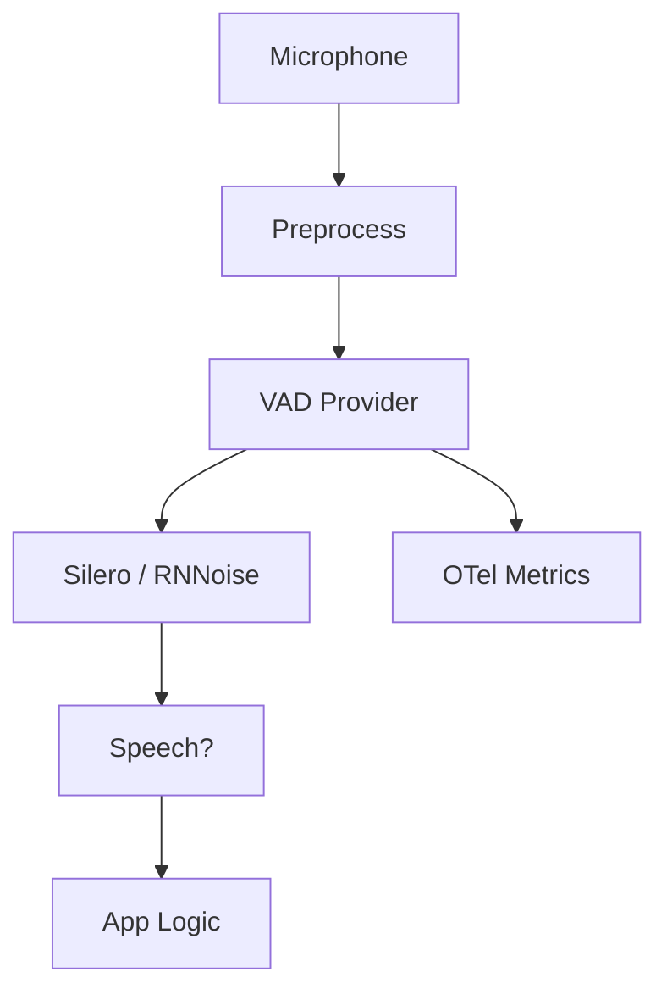

Field-service applications, factory floors, and vehicle environments require voice activity detection (VAD) that stays accurate despite high background noise. Standard energy-based VAD produces 22% false positive rates in these conditions. Using Beluga AI's VAD with Silero and RNNoise model-based providers, false triggers drop to 6% while maintaining sub-60ms latency.

## Solution Architecture



Audio is optionally preprocessed (normalization), then passed to the VAD provider. Silero or RNNoise runs on each audio frame, and threshold/duration parameters filter spurious activations. Results feed application logic (wake word, push-to-talk, command trigger). OpenTelemetry records decisions and errors for tuning dashboards.

## Implementation

### Silero VAD Setup

```go
package main

import (
    "context"
    "time"

    "github.com/lookatitude/beluga-ai/voice"
)

func setupNoiseResistantVAD(ctx context.Context) (voice.FrameProcessor, error) {
    vad := voice.NewSileroVAD(voice.VADConfig{
        Threshold:          0.55,                     // Tuned for noise environments
        MinSpeechDuration:  200 * time.Millisecond,
        MaxSilenceDuration: 600 * time.Millisecond,
        SampleRate:         16000,
        EnablePreprocessing: true,                    // Normalize input for models
    })

    return vad, nil
}
```

### Real-Time Processing

```go
func processAudioStream(ctx context.Context, vad voice.FrameProcessor, audioStream <-chan []byte) error {
    in := make(chan voice.Frame)
    out := make(chan voice.Frame)

    go func() {
        defer close(in)
        for audio := range audioStream {
            in <- voice.NewAudioFrame(audio, 16000)
        }
    }()

    go func() {
        defer close(out)
        if err := vad.Process(ctx, in, out); err != nil {
            return
        }
    }()

    for frame := range out {
        if isSpeechFrame(frame) {
            // Trigger application logic: command recognition, recording start, etc.
            handleSpeechDetected(ctx, frame)
        }
    }

    return nil
}
```

### Provider Selection

Choose the VAD provider based on your deployment constraints:

| Provider | Accuracy in Noise | Resource Usage | Dependency |
|----------|------------------|----------------|------------|
| **Silero** | High | Medium (ONNX runtime) | ONNX model file |
| **RNNoise** | Good | Low | No external model |
| **WebRTC** | Moderate | Very Low | None |

- **Silero**: Best accuracy in high-noise environments; requires ONNX model distribution
- **RNNoise**: Good balance of accuracy and resource usage; no external model needed
- **WebRTC**: Lightweight fallback for low-noise environments

## Tuning Guide

| Parameter | Range | Effect |
|-----------|-------|--------|
| Threshold | 0.4-0.7 | Higher = fewer false positives, more missed speech |
| MinSpeechDuration | 100-300ms | Higher = filters more noise bursts |
| MaxSilenceDuration | 300-800ms | Higher = merges closely spaced utterances |
| EnablePreprocessing | true/false | Normalizes audio input for better model performance |

Recommended starting point for industrial environments: Threshold=0.55, MinSpeechDuration=200ms, EnablePreprocessing=true.

## Deployment Considerations

- **Per-site profiles**: Capture threshold and duration settings per deployment (factory vs. vehicle vs. outdoor)
- **Calibration phase**: Run a short calibration on first deployment to adapt to ambient noise levels
- **Model distribution**: Ensure reliable distribution of ONNX model files to edge and server targets
- **A/B testing**: Compare Silero vs. RNNoise performance in your specific environments using metrics
- **Observability**: Track false trigger rate, missed speech rate, and decision latency with OpenTelemetry

## Results

| Metric | Before | After | Improvement |
|--------|--------|-------|-------------|
| False trigger rate | 22% | 6% | 73% reduction |
| Missed speech rate | 15% | 4% | 73% reduction |
| P95 latency | 80ms | 55ms | 31% reduction |

### Lessons Learned

- **Model-based VAD in noise**: Silero provided clear improvement over energy-only detection in high-noise environments
- **Threshold range**: 0.5-0.6 worked well across most environments; document per-site profiles
- **Metrics-driven tuning**: Observability data made it straightforward to validate tuning and spot regressions

## Related Resources

- [Multi-Speaker Segmentation](/use-cases/multi-speaker-segmentation/) for multi-speaker scenarios
- [Barge-In Detection](/use-cases/barge-in-detection/) for VAD in barge-in detection
- [Industrial Control](/use-cases/industrial-control/) for voice commands in noisy environments
