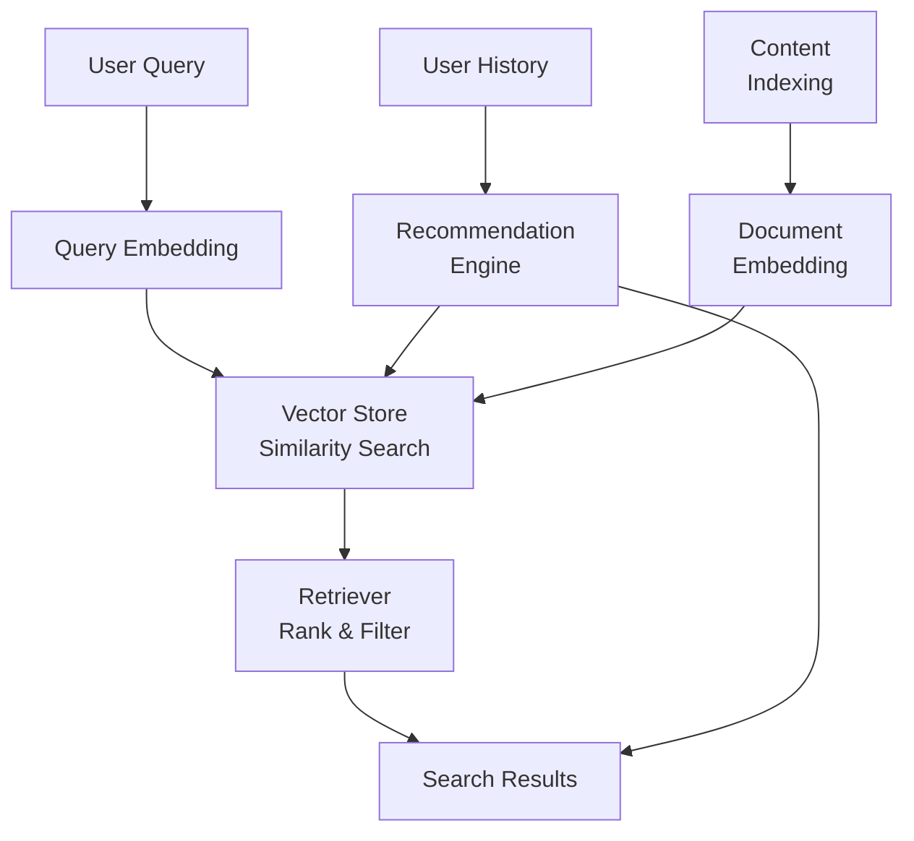

Traditional keyword-based search fails to understand user intent and semantic relationships. A user searching for "affordable running shoes" will miss products described as "budget-friendly jogging footwear" because the terms do not overlap, even though the intent is identical. Similarly, recommendation systems based solely on purchase history and metadata (category, price range) miss deeper content relationships — they cannot understand that a customer who bought a hiking backpack might want trail-running shoes.

Beluga AI provides a complete semantic search and recommendation pipeline using vector embeddings for meaning-based retrieval at scale. Vector embeddings map both queries and content into a shared semantic space where similarity is measured by meaning rather than term overlap. This approach handles synonyms, paraphrases, and conceptual relationships without explicit synonym dictionaries or ontology engineering.

## Solution Architecture

Beluga AI's RAG pipeline provides everything needed for semantic search: embedders convert text to vectors, vector stores index embeddings for fast similarity search, and retrievers implement advanced strategies. The same infrastructure powers both search and personalized recommendations — the difference is only in what gets embedded (content for search, user profiles for recommendations) and how queries are constructed.



## Content Indexing Pipeline

Index content by generating embeddings and storing them in a vector database:

```go
package main

import (
    "context"
    "fmt"
    "log"

    "github.com/lookatitude/beluga-ai/rag/embedding"
    "github.com/lookatitude/beluga-ai/rag/vectorstore"
    "github.com/lookatitude/beluga-ai/schema"

    _ "github.com/lookatitude/beluga-ai/rag/embedding/providers/openai"
    _ "github.com/lookatitude/beluga-ai/rag/vectorstore/providers/pgvector"
)

type ContentItem struct {
    ID       string
    Text     string
    Type     string
    Category string
}

type SearchService struct {
    embedder    embedding.Embedder
    vectorStore vectorstore.VectorStore
}

func NewSearchService(ctx context.Context) (*SearchService, error) {
    embedder, err := embedding.New("openai", embedding.ProviderConfig{
        APIKey: os.Getenv("OPENAI_API_KEY"),
        Model:  "text-embedding-3-small",
    })
    if err != nil {
        return nil, fmt.Errorf("create embedder: %w", err)
    }

    store, err := vectorstore.New("pgvector", vectorstore.Config{
        ConnectionString: os.Getenv("POSTGRES_CONNECTION_STRING"),
        TableName:        "content_embeddings",
        Dimensions:       1536,
    })
    if err != nil {
        return nil, fmt.Errorf("create vector store: %w", err)
    }

    return &SearchService{
        embedder:    embedder,
        vectorStore: store,
    }, nil
}

func (s *SearchService) IndexContent(ctx context.Context, items []ContentItem) error {
    texts := make([]string, len(items))
    for i, item := range items {
        texts[i] = item.Text
    }

    // Generate embeddings in batch
    embeddings, err := s.embedder.EmbedBatch(ctx, texts)
    if err != nil {
        return fmt.Errorf("embed documents: %w", err)
    }

    // Create documents with metadata
    docs := make([]schema.Document, len(items))
    for i, item := range items {
        docs[i] = schema.Document{
            Content: item.Text,
            Metadata: map[string]any{
                "id":       item.ID,
                "type":     item.Type,
                "category": item.Category,
            },
        }
    }

    // Store in vector database
    if err := s.vectorStore.Add(ctx, docs, embeddings); err != nil {
        return fmt.Errorf("store documents: %w", err)
    }

    log.Printf("Indexed %d items", len(items))
    return nil
}
```

## Semantic Search

Perform meaning-based search by embedding the query and finding similar documents:

```go
type SearchResult struct {
    ID      string
    Content string
    Score   float64
    Type    string
}

func (s *SearchService) Search(ctx context.Context, query string, k int) ([]SearchResult, error) {
    // Generate query embedding
    queryEmbedding, err := s.embedder.Embed(ctx, query)
    if err != nil {
        return nil, fmt.Errorf("embed query: %w", err)
    }

    // Retrieve similar documents
    docs, scores, err := s.vectorStore.SimilaritySearch(ctx, queryEmbedding, k,
        vectorstore.WithScoreThreshold(0.7),
    )
    if err != nil {
        return nil, fmt.Errorf("similarity search: %w", err)
    }

    // Convert to search results
    results := make([]SearchResult, len(docs))
    for i, doc := range docs {
        results[i] = SearchResult{
            ID:      doc.Metadata["id"].(string),
            Content: doc.Content,
            Score:   scores[i],
            Type:    doc.Metadata["type"].(string),
        }
    }

    return results, nil
}
```

## Hybrid Search with Retriever

Use Beluga AI's hybrid retriever to combine vector similarity with BM25 keyword matching:

```go
import (
    "github.com/lookatitude/beluga-ai/rag/retriever"
    _ "github.com/lookatitude/beluga-ai/rag/retriever/providers/hybrid"
)

func (s *SearchService) HybridSearch(ctx context.Context, query string, k int) ([]schema.Document, error) {
    ret, err := retriever.New("hybrid", retriever.Config{
        VectorStore: s.vectorStore,
        Embedder:    s.embedder,
    })
    if err != nil {
        return nil, fmt.Errorf("create retriever: %w", err)
    }

    docs, err := ret.Retrieve(ctx, query,
        retriever.WithTopK(k),
        retriever.WithThreshold(0.7),
        retriever.WithHybridAlpha(0.5), // 0.5 = equal weight to vector and BM25
    )
    if err != nil {
        return nil, fmt.Errorf("retrieve: %w", err)
    }

    return docs, nil
}
```

## Personalized Recommendations

Build a recommendation engine using user interaction history and item similarity:

```go
type Recommendation struct {
    ItemID      string
    Score       float64
    Reason      string
}

func (s *SearchService) GetRecommendations(ctx context.Context, userID string, count int) ([]Recommendation, error) {
    // Get user's interaction history
    history, err := getUserHistory(userID)
    if err != nil {
        return nil, err
    }

    // Build user preference vector by averaging embeddings of liked items
    var preferenceVector []float64
    for _, itemID := range history.LikedItems {
        doc, err := s.vectorStore.GetByID(ctx, itemID)
        if err != nil {
            continue
        }

        if preferenceVector == nil {
            preferenceVector = doc.Embedding
        } else {
            for i := range preferenceVector {
                preferenceVector[i] += doc.Embedding[i]
            }
        }
    }

    // Normalize the preference vector
    for i := range preferenceVector {
        preferenceVector[i] /= float64(len(history.LikedItems))
    }

    // Find similar items
    docs, scores, err := s.vectorStore.SimilaritySearch(ctx, preferenceVector, count*2,
        vectorstore.WithScoreThreshold(0.6),
    )
    if err != nil {
        return nil, fmt.Errorf("similarity search: %w", err)
    }

    // Filter out items the user has already seen
    recommendations := []Recommendation{}
    for i, doc := range docs {
        itemID := doc.Metadata["id"].(string)
        if contains(history.SeenItems, itemID) {
            continue
        }

        recommendations = append(recommendations, Recommendation{
            ItemID: itemID,
            Score:  scores[i],
            Reason: "Similar to items you liked",
        })

        if len(recommendations) >= count {
            break
        }
    }

    return recommendations, nil
}
```

## Multi-Modal Search

Extend search to handle both text and images using multi-modal embeddings:

```go
import (
    _ "github.com/lookatitude/beluga-ai/rag/embedding/providers/openai" // Supports CLIP
)

func (s *SearchService) ImageSearch(ctx context.Context, imageURL string, k int) ([]SearchResult, error) {
    // OpenAI's CLIP model can embed both text and images
    embedder, err := embedding.New("openai", embedding.ProviderConfig{
        APIKey: os.Getenv("OPENAI_API_KEY"),
        Model:  "clip-vit-large-patch14", // Multi-modal model
    })
    if err != nil {
        return nil, err
    }

    // Embed image
    imageEmbedding, err := embedder.EmbedImage(ctx, imageURL)
    if err != nil {
        return nil, fmt.Errorf("embed image: %w", err)
    }

    // Find similar content (text or images)
    docs, scores, err := s.vectorStore.SimilaritySearch(ctx, imageEmbedding, k)
    if err != nil {
        return nil, err
    }

    results := make([]SearchResult, len(docs))
    for i, doc := range docs {
        results[i] = SearchResult{
            ID:      doc.Metadata["id"].(string),
            Content: doc.Content,
            Score:   scores[i],
        }
    }

    return results, nil
}
```

## Production Considerations

### Batch Indexing

Process large document collections efficiently:

```go
func (s *SearchService) IndexBatch(ctx context.Context, items []ContentItem) error {
    batchSize := 100
    for i := 0; i < len(items); i += batchSize {
        end := min(i+batchSize, len(items))
        batch := items[i:end]

        if err := s.IndexContent(ctx, batch); err != nil {
            return fmt.Errorf("index batch %d: %w", i/batchSize, err)
        }

        log.Printf("Indexed batch %d/%d", (i/batchSize)+1, (len(items)+batchSize-1)/batchSize)
    }
    return nil
}
```

### Observability

Track search performance and quality:

```go
import (
    "github.com/lookatitude/beluga-ai/o11y"
    "go.opentelemetry.io/otel"
    "go.opentelemetry.io/otel/attribute"
)

func (s *SearchService) SearchWithTracing(ctx context.Context, query string, k int) ([]SearchResult, error) {
    tracer := otel.Tracer("search-service")
    ctx, span := tracer.Start(ctx, "search.query")
    defer span.End()

    span.SetAttributes(
        attribute.String("search.query", query),
        attribute.Int("search.top_k", k),
    )

    start := time.Now()
    results, err := s.Search(ctx, query, k)
    duration := time.Since(start)

    if err != nil {
        span.RecordError(err)
        return nil, err
    }

    span.SetAttributes(
        attribute.Int("search.results_count", len(results)),
        attribute.Float64("search.duration_ms", float64(duration.Milliseconds())),
    )

    return results, nil
}
```

### Scaling

- **Horizontal scaling**: Deploy multiple search service instances. Each instance can handle independent queries.
- **Vector store scaling**: Use pgvector with read replicas or managed services like Pinecone for automatic scaling.
- **Embedding caching**: Cache embeddings for frequently queried terms to reduce API calls.
- **Index optimization**: Tune HNSW parameters for your document count and query patterns.

### Configuration

```yaml
search:
  embeddings:
    provider: "openai"
    model: "text-embedding-3-small"
    batch_size: 100

  vectorstore:
    provider: "pgvector"
    connection_string: "${POSTGRES_CONNECTION_STRING}"
    table_name: "content_embeddings"
    dimensions: 1536

  retrieval:
    default_k: 10
    score_threshold: 0.7
    timeout: 30s

  recommendations:
    max_recommendations: 10
    similarity_threshold: 0.6
```

## Related Resources

- [RAG Pipeline Guide](/guides/rag-pipeline/) for complete RAG setup
- [Enterprise RAG](/use-cases/enterprise-rag/) for production RAG patterns
- [Vector Store Integration](/integrations/vector-stores/) for provider-specific configuration
