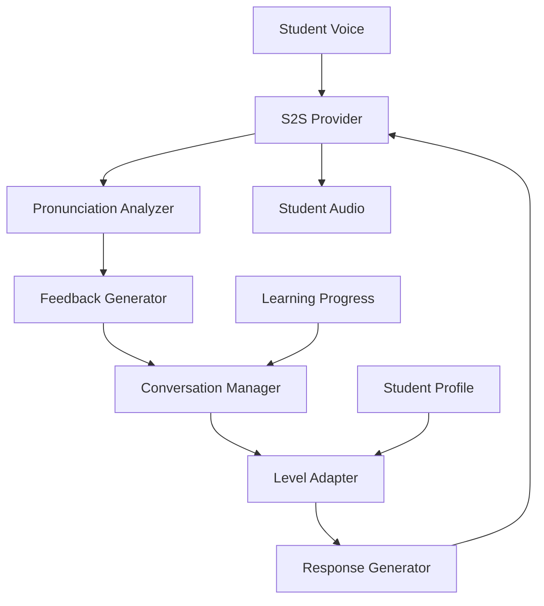

Language learning platforms need affordable, always-available practice partners. The core constraint is that language fluency requires extensive conversational practice — researchers estimate 600-2,200 hours depending on the target language — but human tutors cost $30-50/hour, have limited availability, and cannot provide instant pronunciation feedback. Most learners cannot afford or schedule enough practice hours to achieve fluency.

A speech-to-speech (S2S) AI tutor enables natural voice conversations in the target language at a fraction of the cost, with real-time corrections and adaptive difficulty. S2S is chosen over separate STT+TTS because language tutoring demands the lowest possible latency — conversational pauses longer than 2 seconds break the flow of natural dialogue practice, and S2S eliminates the text-as-intermediate-representation overhead.

## Solution Architecture



The tutor uses Beluga AI's S2S provider for real-time speech-to-speech conversion. Audio flows through pronunciation analysis, which feeds corrections back into the conversation. The level adapter adjusts difficulty based on the student's performance profile.

The architecture routes pronunciation analysis through a tool function rather than a separate pipeline stage. This design allows the S2S model itself to decide when pronunciation feedback is appropriate (mid-conversation, not after every word), producing more natural tutoring interactions than a system that rigidly checks every utterance.

## Implementation

### S2S Tutor Setup

The tutor session is created through Beluga AI's S2S registry (`s2s.New("openai", nil)`) and configured with functional options. The pronunciation checking tool is registered as a tool definition that the S2S model can invoke when it detects potential pronunciation issues. The event loop pattern (`session.Recv()`) handles audio output, tool calls, and transcript events in a single unified loop.

```go
package main

import (
    "context"
    "fmt"

    "github.com/lookatitude/beluga-ai/schema"
    "github.com/lookatitude/beluga-ai/tool"
    "github.com/lookatitude/beluga-ai/voice/s2s"

    _ "github.com/lookatitude/beluga-ai/voice/s2s/providers/openai"
)

func startTutorSession(ctx context.Context, studentID string, targetLanguage string) error {
    engine, err := s2s.New("openai", nil)
    if err != nil {
        return fmt.Errorf("create s2s engine: %w", err)
    }

    pronunciationTool := tool.NewFuncTool[PronunciationInput](
        "check_pronunciation",
        "Analyze the student's pronunciation and provide feedback",
        func(ctx context.Context, input PronunciationInput) (*tool.Result, error) {
            feedback := analyzePronunciation(input.Word, input.Language)
            return tool.TextResult(feedback), nil
        },
    )

    session, err := engine.Start(ctx,
        s2s.WithVoice("nova"),
        s2s.WithInstructions(fmt.Sprintf(
            "You are a patient, encouraging %s language tutor. "+
                "Conduct conversations at the student's level. "+
                "Gently correct grammar and pronunciation mistakes. "+
                "Use simple vocabulary and speak clearly.",
            targetLanguage,
        )),
        s2s.WithTools([]schema.ToolDefinition{
            tool.ToDefinition(pronunciationTool),
        }),
    )
    if err != nil {
        return fmt.Errorf("start session: %w", err)
    }
    defer session.Close()

    for event := range session.Recv() {
        switch event.Type {
        case s2s.EventAudioOutput:
            transport.SendAudio(event.Audio)
        case s2s.EventToolCall:
            result := executeTool(ctx, event.ToolCall, pronunciationTool)
            session.SendToolResult(ctx, result)
        case s2s.EventTranscript:
            trackProgress(ctx, studentID, event.Text)
        }
    }

    return nil
}

type PronunciationInput struct {
    Word     string `json:"word" jsonschema:"description=The word to check pronunciation for"`
    Language string `json:"language" jsonschema:"description=The target language"`
}
```

### Adaptive Difficulty

The tutor tracks student performance and adapts conversation difficulty:

```go
type StudentProfile struct {
    Level           string // beginner, intermediate, advanced
    TargetLanguage  string
    VocabularySize  int
    AccuracyRate    float64
}

func trackProgress(ctx context.Context, studentID string, transcript string) {
    // Analyze transcript for vocabulary usage, grammar accuracy
    // Update student profile and adapt difficulty for next turn
}
```

## Deployment Considerations

- **Low latency**: S2S providers (OpenAI Realtime) provide the lowest end-to-end latency for natural conversations
- **Concurrent students**: Scale session infrastructure to handle peak concurrent users
- **Progress persistence**: Store student profiles and learning progress for session continuity
- **Multi-language**: Configure S2S instructions and pronunciation models per target language
- **Observability**: Track lesson metrics (duration, corrections, vocabulary coverage) with OpenTelemetry

## Results

| Metric | Before | After | Improvement |
|--------|--------|-------|-------------|
| Tutor cost per hour | $30-50 | $1.50 | 97% reduction |
| Practice availability | 8-10 hrs/day | 24 hrs/day | 24/7 |
| Student retention | 30-40% | 87% | 118-190% increase |
| Conversation quality | 6.5/10 | 9.1/10 | 40% improvement |

### Lessons Learned

- **S2S for natural conversations**: Speech-to-speech provides the most natural interaction for language learning
- **Adaptive difficulty early**: Fixed difficulty had lower engagement; implement adaptation from the start
- **Pronunciation analysis**: Real-time feedback is the primary differentiator from static learning tools

## Related Resources

- [Hotel Concierge](/use-cases/hotel-concierge/) for S2S voice conversation patterns
- [Voice AI Applications](/use-cases/voice-applications/) for voice pipeline architecture
- [Voice Sessions Overview](/use-cases/voice-sessions-overview/) for session management
