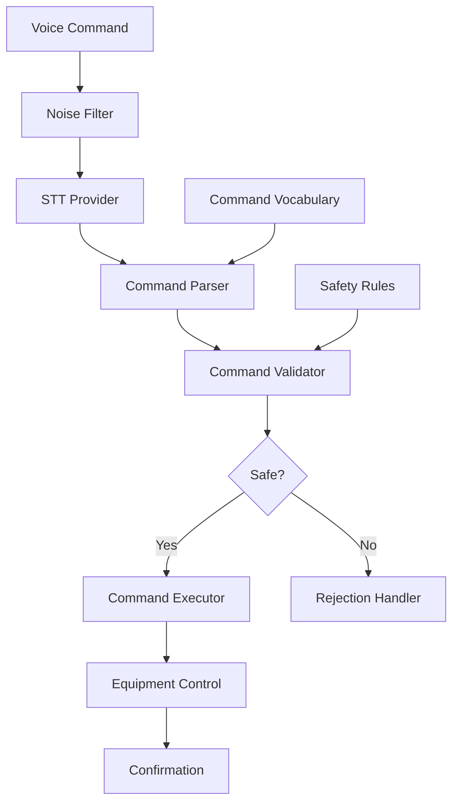

Manufacturing environments require hands-free equipment control for worker safety — operators handling materials, wearing gloves, or positioned near moving equipment cannot safely interact with touchscreens or physical controls. Standard voice recognition achieves only 60-70% accuracy at industrial noise levels (85-100+ dB), making it unreliable for safety-critical operations where a misrecognized "start" versus "stop" command could cause equipment damage or injury.

The challenge is not just transcription accuracy but the entire command pipeline: recognizing speech in noise, mapping natural language to a constrained set of valid commands, and validating that each command is safe to execute in the current equipment state. A single layer of defense is insufficient — the system must fail safe at every stage.

Using Beluga AI's STT pipeline with noise-resistant models and multi-layer command validation, this system achieves 96% command accuracy with zero safety incidents.

## Solution Architecture



Voice commands flow through noise filtering, STT transcription, command parsing against a known vocabulary, safety validation, and finally execution with audible confirmation. Emergency stop commands bypass normal validation and execute immediately.

The multi-stage pipeline is deliberate: each stage acts as a filter that reduces ambiguity before the next stage processes it. Noise filtering improves STT accuracy, command parsing constrains free-text to known actions, and safety validation ensures no command violates operational constraints. This defense-in-depth approach means that even if STT produces an incorrect transcription, the command parser and safety validator provide additional layers of protection before any equipment state changes.

## Implementation

### Noise-Resistant STT Setup

The controller wraps three components: an STT engine for transcription, a command validator for safety rules, and a command executor for equipment control. The `ProcessCommand` method chains these in sequence, with early returns at each validation stage. Deepgram is chosen for its strong performance in noisy environments, though the STT registry pattern allows swapping providers without changing the command pipeline.

```go
package main

import (
    "context"
    "fmt"

    "github.com/lookatitude/beluga-ai/voice/stt"

    _ "github.com/lookatitude/beluga-ai/voice/stt/providers/deepgram"
)

// IndustrialController processes voice commands for equipment control.
type IndustrialController struct {
    sttEngine stt.STT
    validator *CommandValidator
    executor  *CommandExecutor
}

func NewIndustrialController(ctx context.Context) (*IndustrialController, error) {
    sttEngine, err := stt.New("deepgram", nil)
    if err != nil {
        return nil, fmt.Errorf("create stt engine: %w", err)
    }

    return &IndustrialController{
        sttEngine: sttEngine,
        validator: NewCommandValidator(),
        executor:  NewCommandExecutor(),
    }, nil
}

func (c *IndustrialController) ProcessCommand(ctx context.Context, audio []byte) (*CommandResult, error) {
    // Transcribe with noise-resistant model
    transcript, err := c.sttEngine.Transcribe(ctx, audio,
        stt.WithLanguage("en"),
    )
    if err != nil {
        return nil, fmt.Errorf("transcription failed: %w", err)
    }

    // Parse command against known vocabulary
    command, err := parseCommand(transcript)
    if err != nil {
        return &CommandResult{
            Executed: false,
            Reason:   "Command not recognized",
        }, nil
    }

    // Validate command for safety
    if !c.validator.Validate(ctx, command) {
        return &CommandResult{
            Executed: false,
            Reason:   "Command failed safety validation",
        }, nil
    }

    // Execute command
    result, err := c.executor.Execute(ctx, command)
    if err != nil {
        return nil, fmt.Errorf("command execution failed: %w", err)
    }

    return &CommandResult{
        Executed:     true,
        Command:      command,
        Confirmation: fmt.Sprintf("Command %s executed successfully", command.Action),
    }, nil
}

type CommandResult struct {
    Executed     bool
    Command      Command
    Confirmation string
    Reason       string
}

type Command struct {
    Action    string // start, stop, speed_up, slow_down, emergency_stop
    Target    string // conveyor_1, press_a, mixer_3
    Parameter string // optional parameter
}
```

### Safety Validation

The validator applies a chain of safety rules, where every rule must pass for a command to execute. The one exception is `emergency_stop`, which bypasses all rules — when a worker says "emergency stop," latency from validation checks is unacceptable. This rule-based approach over ML-based safety classification is intentional: safety rules must be auditable, deterministic, and explainable for regulatory compliance.

```go
type CommandValidator struct {
    safetyRules []SafetyRule
}

type SafetyRule struct {
    Name    string
    Check   func(ctx context.Context, cmd Command) bool
}

func (v *CommandValidator) Validate(ctx context.Context, cmd Command) bool {
    // Emergency stop always passes
    if cmd.Action == "emergency_stop" {
        return true
    }

    for _, rule := range v.safetyRules {
        if !rule.Check(ctx, cmd) {
            return false
        }
    }
    return true
}
```

## Deployment Considerations

- **Noise-resistant models**: Use models optimized for high-noise environments (Deepgram Nova-2 or similar)
- **Audio preprocessing**: Apply noise filtering before STT to improve accuracy
- **Command vocabulary**: Use a constrained vocabulary matching your equipment actions
- **Confirmation feedback**: Always provide audible confirmation of executed commands
- **Emergency stop**: Priority handling for emergency commands; bypass normal validation
- **Observability**: Track command accuracy, rejection rates, and safety metrics with OpenTelemetry

## Results

| Metric | Before | After | Improvement |
|--------|--------|-------|-------------|
| Command accuracy | 60-70% | 96% | 37-60% improvement |
| Safety incidents | 3-5/month | 0 | 100% reduction |
| Operation efficiency | 75% | 92% | 23% improvement |
| Hands-free operation rate | 0% | 87% | New capability |

### Lessons Learned

- **Domain-specific vocabulary**: A constrained command set dramatically improves accuracy in noise
- **Audio preprocessing first**: Invest in noise filtering before relying solely on model robustness
- **Safety validation is non-negotiable**: Multi-layer validation prevented all unsafe operations

## Related Resources

- [Meeting Minutes](/use-cases/meeting-minutes/) for real-time transcription patterns
- [Noise-Resistant VAD](/use-cases/noise-resistant-vad/) for voice activity detection in noisy environments
- [Voice AI Applications](/use-cases/voice-applications/) for voice pipeline architecture
