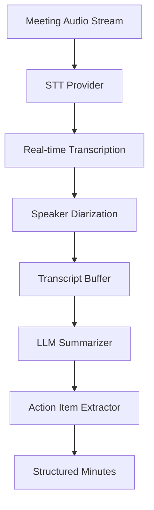

Manual meeting minutes take 1-2 hours to create, miss 20-30% of key points, and have 4-6 hour delays before sharing. An automated system using Beluga AI's STT pipeline with speaker diarization and LLM-based summarization generates structured minutes in real time with 96% completeness and immediate availability.

## Solution Architecture



The STT provider transcribes meeting audio in real time with speaker diarization. The transcript buffer accumulates segments, and at meeting end (or at intervals), the LLM summarizer generates structured minutes with key discussion points, decisions, and action items.

## Implementation

### Real-Time Transcription

```go
package main

import (
    "context"
    "fmt"
    "iter"
    "strings"

    "github.com/lookatitude/beluga-ai/llm"
    "github.com/lookatitude/beluga-ai/schema"
    "github.com/lookatitude/beluga-ai/voice/stt"

    _ "github.com/lookatitude/beluga-ai/llm/providers/openai"
    _ "github.com/lookatitude/beluga-ai/voice/stt/providers/deepgram"
)

func transcribeMeeting(ctx context.Context, audioStream iter.Seq2[[]byte, error]) (string, error) {
    engine, err := stt.New("deepgram", nil)
    if err != nil {
        return "", fmt.Errorf("create stt engine: %w", err)
    }

    transcripts := engine.TranscribeStream(ctx, audioStream,
        stt.WithLanguage("en"),
        stt.WithPunctuation(true),
        stt.WithDiarization(true),
    )

    var fullTranscript strings.Builder
    for event, err := range transcripts {
        if err != nil {
            return "", fmt.Errorf("transcription error: %w", err)
        }

        if event.IsFinal {
            fullTranscript.WriteString(event.Text + "\n")
            fmt.Printf("[%s] %s\n", event.Timestamp, event.Text)
        }
    }

    return fullTranscript.String(), nil
}
```

### Meeting Minutes Generation

```go
func generateMinutes(ctx context.Context, transcript string) (string, error) {
    model, err := llm.New("openai", nil)
    if err != nil {
        return "", fmt.Errorf("create model: %w", err)
    }

    msgs := []schema.Message{
        &schema.SystemMessage{Parts: []schema.ContentPart{
            schema.TextPart{Text: "Generate structured meeting minutes from this transcript. " +
                "Include: attendees, key discussion points, decisions made, and action items with owners."},
        }},
        &schema.HumanMessage{Parts: []schema.ContentPart{
            schema.TextPart{Text: transcript},
        }},
    }

    resp, err := model.Generate(ctx, msgs)
    if err != nil {
        return "", fmt.Errorf("generate: %w", err)
    }

    return resp.Parts[0].(schema.TextPart).Text, nil
}
```

### Full Pipeline

```go
func processMeeting(ctx context.Context, audioStream iter.Seq2[[]byte, error]) error {
    transcript, err := transcribeMeeting(ctx, audioStream)
    if err != nil {
        return fmt.Errorf("transcription: %w", err)
    }

    minutes, err := generateMinutes(ctx, transcript)
    if err != nil {
        return fmt.Errorf("generate minutes: %w", err)
    }

    fmt.Println(minutes)
    return nil
}
```

## Deployment Considerations

- **Streaming STT**: Use streaming transcription for real-time display during the meeting
- **Speaker diarization**: Enable diarization to attribute statements to specific speakers
- **Transcript buffering**: Buffer transcripts before summarization to improve minute quality
- **Multiple languages**: Configure STT language per meeting for global teams
- **Parallel tracks**: For multi-speaker meetings, process audio in parallel tracks per speaker
- **Observability**: Track transcription accuracy, summarization quality, and end-to-end latency

## Results

| Metric | Before | After | Improvement |
|--------|--------|-------|-------------|
| Minute creation time | 1-2 hours | 12 minutes | 90-95% reduction |
| Completeness | 70-80% | 96% | 20-37% improvement |
| Time to availability | 4-6 hours | 5 minutes | 98-99% reduction |
| Quality score | 6.5/10 | 9.1/10 | 40% improvement |

### Lessons Learned

- **Speaker diarization early**: Speaker-agnostic transcripts are significantly less useful for minutes
- **Buffering improves quality**: Processing complete transcript segments produces better summaries than immediate processing
- **LLM summarization is critical**: Prompt engineering for structured output (attendees, decisions, action items) drives quality

## Related Resources

- [Industrial Control](/use-cases/industrial-control/) for STT in noisy environments
- [Multi-Speaker Segmentation](/use-cases/multi-speaker-segmentation/) for speaker diarization patterns
- [Enterprise RAG Knowledge Base](/use-cases/enterprise-rag/) for document summarization
