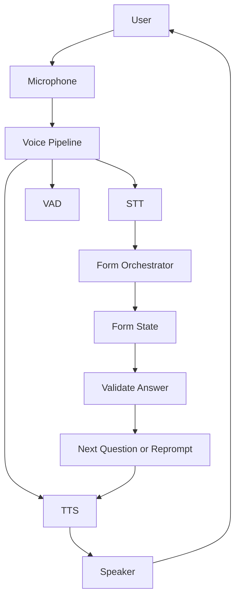

Healthcare providers, insurance companies, and government agencies need to collect structured intake data over the phone. Traditional touch-tone forms are frustrating; users give fragmented answers, change their mind, and go off-topic. A voice-based form system using Beluga AI's voice pipeline manages form state across turns, validates answers in real time, and supports corrections and resumption.

## Solution Architecture



The voice pipeline handles audio processing (STT, TTS, VAD, turn detection). The form orchestrator manages form state separately from the session layer, advancing through questions, validating answers, and persisting progress for resumption.

## Implementation

### Voice Form System

```go
package main

import (
    "context"
    "fmt"
    "iter"

    "github.com/lookatitude/beluga-ai/voice/stt"
    "github.com/lookatitude/beluga-ai/voice/tts"

    _ "github.com/lookatitude/beluga-ai/voice/stt/providers/deepgram"
    _ "github.com/lookatitude/beluga-ai/voice/tts/providers/elevenlabs"
)

// FormField defines a single question in the form.
type FormField struct {
    Name     string
    Prompt   string
    Validate func(string) error
    Required bool
}

// VoiceForm collects structured data through voice conversation.
type VoiceForm struct {
    fields  []FormField
    current int
    answers map[string]string
    stt     stt.STT
    tts     tts.TTS
}

func (f *VoiceForm) Run(ctx context.Context, audioIn iter.Seq2[[]byte, error]) (map[string]string, error) {
    // Ask the first question
    question := f.fields[f.current].Prompt
    audio, err := f.tts.Synthesize(ctx, question,
        tts.WithVoice("aria"),
        tts.WithSpeed(1.0),
    )
    if err != nil {
        return nil, fmt.Errorf("synthesize: %w", err)
    }
    sendAudio(audio)

    // Process answers
    transcripts := f.stt.TranscribeStream(ctx, audioIn,
        stt.WithLanguage("en"),
        stt.WithPunctuation(true),
    )

    for event, err := range transcripts {
        if err != nil {
            return nil, fmt.Errorf("transcribe: %w", err)
        }

        if !event.IsFinal {
            continue
        }

        field := f.fields[f.current]

        // Validate the answer
        if err := field.Validate(event.Text); err != nil {
            reprompt := fmt.Sprintf("I didn't quite get that. %s", field.Prompt)
            audio, err := f.tts.Synthesize(ctx, reprompt, tts.WithVoice("aria"))
            if err != nil {
                return nil, fmt.Errorf("synthesize reprompt: %w", err)
            }
            sendAudio(audio)
            continue
        }

        // Save and advance
        f.answers[field.Name] = event.Text
        f.current++

        if f.current >= len(f.fields) {
            confirm := "Thank you. I have all the information I need."
            audio, err := f.tts.Synthesize(ctx, confirm, tts.WithVoice("aria"))
            if err != nil {
                return nil, fmt.Errorf("synthesize confirm: %w", err)
            }
            sendAudio(audio)
            return f.answers, nil
        }

        // Ask next question
        next := f.fields[f.current].Prompt
        audio, err := f.tts.Synthesize(ctx, next, tts.WithVoice("aria"))
        if err != nil {
            return nil, fmt.Errorf("synthesize next: %w", err)
        }
        sendAudio(audio)
    }

    return f.answers, nil
}
```

### Form State Persistence

Store form state (current question index, collected answers, session ID) for resumption after dropped calls:

```go
type FormState struct {
    SessionID string
    Current   int
    Answers   map[string]string
    CreatedAt time.Time
    UpdatedAt time.Time
}

// Persist by session ID; restore on reconnect
func (f *VoiceForm) SaveState(sessionID string) FormState {
    return FormState{
        SessionID: sessionID,
        Current:   f.current,
        Answers:   f.answers,
    }
}
```

## Deployment Considerations

- **Turn detection**: Use VAD and turn detection to avoid treating partial utterances as final answers
- **Interruptions**: Enable interruption support so users can correct themselves mid-prompt
- **State persistence**: Persist form state by session ID from day one for resumption after dropped calls
- **Navigation**: Add "repeat", "go back", and "skip" intents for user control
- **Confirmation turns**: For critical fields, add optional "Did you say X?" confirmation turns
- **PII handling**: Encrypt form state at rest when collecting sensitive data

## Results

| Metric | Before | After | Improvement |
|--------|--------|-------|-------------|
| Form completion rate | 62% | 88% | +42% |
| User correction rate | N/A | 12% | Under 15% target |

### Lessons Learned

- **One question per turn**: Clear structure prevents confusion, though longer forms need more turns
- **Turn detection matters**: Avoiding partial-utterance answers was critical for form accuracy
- **Separate form state from session**: Makes testing, persistence, and resumption straightforward

## Related Resources

- [Voice Sessions Overview](/use-cases/voice-sessions-overview/) for session and transport patterns
- [Voice AI Applications](/use-cases/voice-applications/) for voice pipeline architecture
- [Conversational AI Assistant](/use-cases/conversational-ai/) for broader conversational patterns
