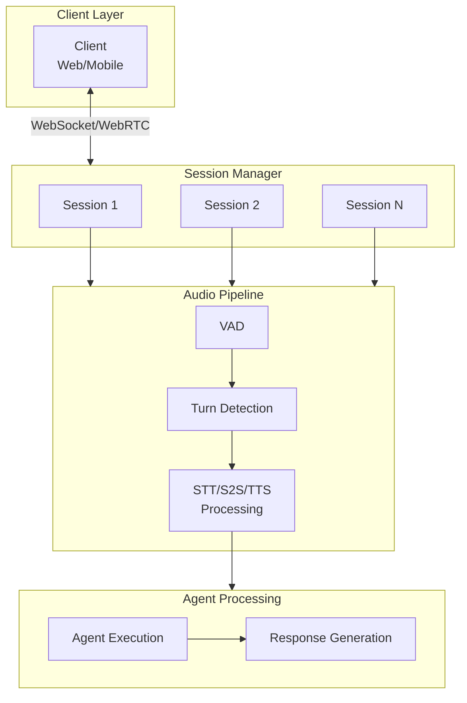

Voice agents have unique challenges compared to text-based AI: users notice delays above 200ms, connections drop on mobile networks, and each session consumes significant resources. A well-implemented voice session system delivers responsive conversations, automatic recovery from failures, efficient resource usage, and clear debugging visibility. This guide covers the architecture and implementation patterns for production voice sessions in Beluga AI.

## Solution Architecture



### How It Works

1. **Client connects** via WebSocket or WebRTC with a session token
2. **Session Manager** creates or resumes a session, allocating resources
3. **Audio Pipeline** processes incoming audio through frame processors (VAD, turn detection)
4. **Voice Provider** transcribes audio (STT) or processes end-to-end (S2S)
5. **Agent** processes the transcript and generates a response
6. **Response** is converted to audio (TTS) and streamed back to client

## Implementation

### Session Manager

```go
package main

import (
    "context"
    "fmt"
    "sync"
    "time"

    "github.com/lookatitude/beluga-ai/voice"
    "github.com/lookatitude/beluga-ai/voice/stt"
    "github.com/lookatitude/beluga-ai/voice/tts"

    _ "github.com/lookatitude/beluga-ai/voice/stt/providers/deepgram"
    _ "github.com/lookatitude/beluga-ai/voice/tts/providers/openai"
)

// SessionManager manages all active voice sessions.
type SessionManager struct {
    sessions map[string]*VoiceSession
    mu       sync.RWMutex
    maxConc  int
}

func NewSessionManager(maxConcurrent int) *SessionManager {
    return &SessionManager{
        sessions: make(map[string]*VoiceSession),
        maxConc:  maxConcurrent,
    }
}

func (m *SessionManager) CreateSession(ctx context.Context, sessionID string, userID string) (*VoiceSession, error) {
    m.mu.Lock()
    defer m.mu.Unlock()

    if len(m.sessions) >= m.maxConc {
        return nil, fmt.Errorf("max concurrent sessions reached: %d", m.maxConc)
    }

    if _, exists := m.sessions[sessionID]; exists {
        return nil, fmt.Errorf("session already exists: %s", sessionID)
    }

    session := &VoiceSession{
        ID:         sessionID,
        UserID:     userID,
        State:      "connected",
        StartTime:  time.Now(),
        LastActive: time.Now(),
    }

    m.sessions[sessionID] = session
    return session, nil
}

func (m *SessionManager) CleanupIdle(ctx context.Context, idleTimeout time.Duration) int {
    m.mu.Lock()
    defer m.mu.Unlock()

    now := time.Now()
    closed := 0

    for id, session := range m.sessions {
        if now.Sub(session.LastActive) > idleTimeout {
            delete(m.sessions, id)
            session.Close()
            closed++
        }
    }

    return closed
}
```

### Voice Session Processing

```go
// VoiceSession represents an active voice conversation.
type VoiceSession struct {
    ID         string
    UserID     string
    State      string
    StartTime  time.Time
    LastActive time.Time
    History    []ConversationTurn
}

type ConversationTurn struct {
    UserText   string
    AgentText  string
    StartTime  time.Time
    Latency    time.Duration
}

func (s *VoiceSession) ProcessAudio(ctx context.Context, sttEngine stt.STT, audioData []byte) (string, error) {
    s.LastActive = time.Now()
    s.State = "processing"

    transcript, err := sttEngine.Transcribe(ctx, audioData,
        stt.WithLanguage("en"),
        stt.WithPunctuation(true),
    )
    if err != nil {
        return "", fmt.Errorf("transcription failed: %w", err)
    }

    s.State = "listening"
    return transcript, nil
}

func (s *VoiceSession) GenerateResponse(ctx context.Context, ttsEngine tts.TTS, text string) ([]byte, error) {
    s.State = "responding"

    audio, err := ttsEngine.Synthesize(ctx, text,
        tts.WithVoice("nova"),
    )
    if err != nil {
        return nil, fmt.Errorf("tts failed: %w", err)
    }

    s.State = "listening"
    return audio, nil
}

func (s *VoiceSession) Close() {
    s.State = "disconnected"
}
```

### Building a Full Pipeline

```go
func buildVoicePipeline(ctx context.Context) (voice.FrameProcessor, error) {
    vad := voice.NewSileroVAD(voice.VADConfig{
        Threshold:         0.5,
        MinSpeechDuration: 250 * time.Millisecond,
    })

    sttEngine, err := stt.New("deepgram", nil)
    if err != nil {
        return nil, fmt.Errorf("create stt: %w", err)
    }

    ttsEngine, err := tts.New("openai", nil)
    if err != nil {
        return nil, fmt.Errorf("create tts: %w", err)
    }

    sttProc := stt.AsFrameProcessor(sttEngine, stt.WithLanguage("en"))
    ttsProc := tts.AsFrameProcessor(ttsEngine, 16000, tts.WithVoice("nova"))

    pipeline := voice.Chain(vad, sttProc, agentProcessor, ttsProc)
    return pipeline, nil
}
```

## Reconnection Handling

Voice sessions must survive network interruptions. Implement reconnection with exponential backoff and state preservation:

```go
func (s *VoiceSession) HandleReconnect(ctx context.Context, maxAttempts int, baseDelay time.Duration) error {
    s.State = "reconnecting"

    var lastErr error
    for attempt := 1; attempt <= maxAttempts; attempt++ {
        delay := baseDelay * time.Duration(1<<uint(attempt-1))
        if delay > 10*time.Second {
            delay = 10 * time.Second
        }

        select {
        case <-ctx.Done():
            return ctx.Err()
        case <-time.After(delay):
        }

        if err := s.transport.Reconnect(ctx); err != nil {
            lastErr = err
            continue
        }

        s.State = "connected"
        s.LastActive = time.Now()
        return nil
    }

    s.State = "error"
    return fmt.Errorf("reconnection failed after %d attempts: %w", maxAttempts, lastErr)
}
```

## Observability

Track voice-specific metrics at every stage:

```go
import (
    "go.opentelemetry.io/otel"
    "go.opentelemetry.io/otel/attribute"
)

func recordTurnMetrics(ctx context.Context, sttLatency, agentLatency, ttsLatency, totalLatency time.Duration) {
    tracer := otel.Tracer("beluga.voice.session")
    _, span := tracer.Start(ctx, "voice.turn")
    defer span.End()

    span.SetAttributes(
        attribute.Float64("voice.stt_latency_ms", float64(sttLatency.Milliseconds())),
        attribute.Float64("voice.agent_latency_ms", float64(agentLatency.Milliseconds())),
        attribute.Float64("voice.tts_latency_ms", float64(ttsLatency.Milliseconds())),
        attribute.Float64("voice.e2e_latency_ms", float64(totalLatency.Milliseconds())),
    )
}
```

## Expected Performance

| Metric | Target | Typical Result |
|--------|--------|----------------|
| End-to-end turn latency | < 2s | 1.2-1.8s |
| STT latency | < 500ms | 200-400ms |
| Agent latency | < 1s | 300-800ms |
| TTS latency | < 500ms | 150-300ms |
| Reconnection success rate | > 95% | 97-99% |
| Memory per session | < 50MB | 20-35MB |

## Deployment Considerations

- **Transport choice**: Use WebSocket for broad compatibility; WebRTC for lowest latency
- **Session affinity**: Voice sessions are stateful; use sticky sessions at the load balancer
- **Resource limits**: Set hard limits on audio buffers and max session duration
- **S2S mode**: If your use case allows, S2S is simpler and lower latency than STT+TTS
- **Streaming TTS**: Send audio chunks as they are generated; do not wait for complete audio
- **Circuit breakers**: Aggressive reconnection can worsen overload; use circuit breakers

## Related Resources

- [Voice AI Applications](/use-cases/voice-applications/) for complete voice pipeline patterns
- [Voice Forms](/use-cases/voice-forms/) for multi-turn voice form collection
- [Production Agent Platform](/use-cases/production-platform/) for deployment patterns
